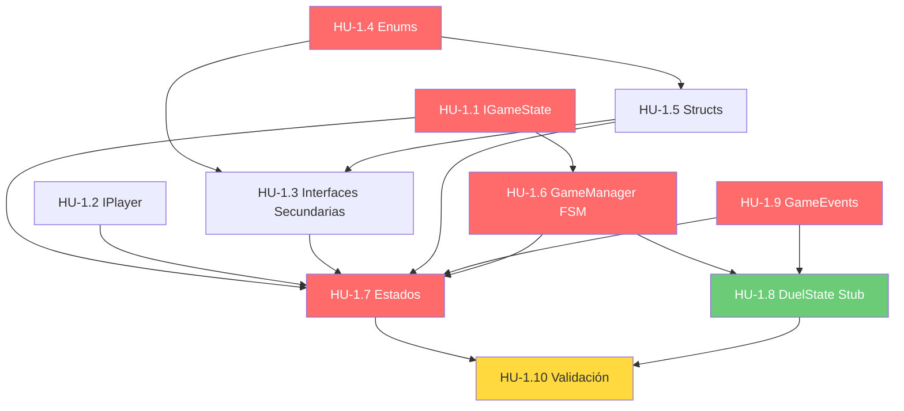

# Historias de Usuario — Épica 1: Arquitectura Core y FSM

> **Épica:** [epic1.md](epics/epic1.md)  
> **Prioridad:** 🔴 Crítica  
> **Sprint estimado:** 1–2  
> **Total HUs:** 10  
> **Dependencias externas:** Ninguna (épica fundacional)

---

## Índice de Historias

| ID | Título | Tipo | Prioridad | Estimación |
|---|---|---|---|---|
| HU-1.1 | Interfaz IGameState | Técnica | 🔴 Crítica | 1 SP |
| HU-1.2 | Interfaz IPlayer | Técnica | 🔴 Crítica | 2 SP |
| HU-1.3 | Interfaces de sistemas secundarios | Técnica | 🔴 Crítica | 2 SP |
| HU-1.4 | Enums del dominio | Técnica | 🔴 Crítica | 1 SP |
| HU-1.5 | Structs y modelos de datos base | Técnica | 🔴 Crítica | 2 SP |
| HU-1.6 | GameManager y motor FSM | Técnica | 🔴 Crítica | 5 SP |
| HU-1.7 | Estados del Game Loop (Setup → GameOver) | Técnica | 🔴 Crítica | 8 SP |
| HU-1.8 | DuelState (stub para interrupciones) | Técnica | 🟡 Alta | 3 SP |
| HU-1.9 | Sistema de Eventos Central (GameEvents) | Técnica | 🔴 Crítica | 3 SP |
| HU-1.10 | Validación e integración de la FSM | QA | 🔴 Crítica | 3 SP |

**Total estimado:** ~30 Story Points

---

## Definición de Done (Global para Épica 1)

Todas las HU de esta épica deben cumplir:

- [ ] Código compila sin errores ni warnings en Unity (`Unity_ReadConsole`)
- [ ] Se respetan las convenciones de código del [Architect.md](../.agents/Architect.md):
  - Interfaces con prefijo `I`
  - Campos privados con `_camelCase`
  - Métodos en PascalCase
- [ ] No existe ningún `GameObject.Find()`, `FindObjectOfType()`, ni Singleton no justificado
- [ ] Todas las dependencias se inyectan via `[SerializeField]` o por constructor
- [ ] Cada archivo tiene documentación XML (`<summary>`) en sus miembros públicos
- [ ] Los archivos están ubicados en la carpeta correcta según la estructura de directorios del Architect.md

---

## HU-1.1 — Interfaz IGameState

### Descripción

**Como** desarrollador del Core,  
**quiero** definir el contrato `IGameState` con los métodos del ciclo de vida de un estado,  
**para que** todos los estados del game loop tengan una API uniforme y predecible.

### Criterios de Aceptación

- [ ] Archivo: `Assets/Scripts/Interfaces/IGameState.cs`
- [ ] La interfaz declara exactamente 3 métodos:
  ```csharp
  void Enter();  // Se invoca al activar el estado
  void Tick();   // Se invoca en cada frame mientras el estado está activo
  void Exit();   // Se invoca al desactivar el estado
  ```
- [ ] La interfaz **no** tiene propiedades, campos ni dependencias externas
- [ ] Documentación XML `<summary>` en la interfaz y en cada método describiendo cuándo se invoca
- [ ] Namespace: `ChronosAndCards.Core`

### Notas de Implementación

- Este contrato es la pieza más estable de la arquitectura. Modificarlo requiere refactorizar **todos** los estados.
- Se alinea con el Architect.md §5: _"implementen una interfaz común como `IGameState` (con métodos `Enter()`, `Tick()`, `Exit()`)"_

### Dependencias

- Ninguna (primera pieza)

---

## HU-1.2 — Interfaz IPlayer

### Descripción

**Como** desarrollador de Gameplay,  
**quiero** definir el contrato `IPlayer` que represente a un jugador con su estado e inventario,  
**para que** los sistemas de turno, tablero, pistas e ítems interactúen con un contrato estable sin depender de una implementación concreta.

### Criterios de Aceptación

- [ ] Archivo: `Assets/Scripts/Interfaces/IPlayer.cs`
- [ ] Propiedades de solo lectura:
  ```csharp
  string PlayerName { get; }
  int PlayerIndex { get; }          // Índice del jugador (0-based, para orden de turnos)
  int Position { get; }             // Posición actual en el tablero
  int HintCount { get; }            // Pistas disponibles
  IReadOnlyList<IItem> Inventory { get; }  // Inventario de objetos (solo lectura para consumidores externos)
  bool IsSkipNextTurn { get; }      // Flag para penalización de "perder turno"
  ```
- [ ] Métodos:
  ```csharp
  void MoveForward(int tiles);      // Avanza N casillas
  void MoveToPosition(int pos);     // Mueve a posición absoluta (para Duelos)
  void AddHint(int amount);         // Modifica pistas (+/-)
  void AddItem(IItem item);         // Añade objeto al inventario
  void RemoveItem(IItem item);      // Remueve objeto del inventario
  void SetSkipNextTurn(bool skip);  // Marca/desmarca penalización
  ```
- [ ] `IReadOnlyList` para `Inventory` previene que consumidores externos modifiquen la lista directamente
- [ ] Documentación XML en cada miembro
- [ ] Namespace: `ChronosAndCards.Core`

### Notas de Implementación

- La implementación concreta (`Player.cs`) pertenece a una HU futura (Épica 3 o posterior), pero el contrato se define aquí.
- `MoveToPosition` es necesario para el intercambio de posiciones en Duelos (Épica 5).
- `IsSkipNextTurn` cubre la penalización cuando el atacante pierde un duelo sin recursos (GDD §6, Duelo de Posiciones).

### Dependencias

- HU-1.3 (necesita `IItem` para la definición de `Inventory`)

---

## HU-1.3 — Interfaces de Sistemas Secundarios

### Descripción

**Como** desarrollador,  
**quiero** tener definidos los contratos de los subsistemas de dado, casillas, objetos y parser,  
**para que** las épicas 2–5 tengan una API clara contra la cual implementar.

### Criterios de Aceptación

#### `ITile` — `Assets/Scripts/Interfaces/ITile.cs`
- [ ] Propiedad: `TileType Type { get; }`
- [ ] Método: `void OnPlayerLanded(IPlayer player);`
- [ ] Documentación XML

#### `IDiceRoller` — `Assets/Scripts/Interfaces/IDiceRoller.cs`
- [ ] Evento: `event Action<int> OnDiceResult;`
- [ ] Método: `void Roll();`
- [ ] Documentación XML

#### `IDiceValidator` — `Assets/Scripts/Interfaces/IDiceValidator.cs`
- [ ] Método: `bool IsValidResult(int result);`
- [ ] Documentación XML

#### `IItemEffect` — `Assets/Scripts/Interfaces/IItemEffect.cs`
- [ ] Propiedad: `ItemActivationPhase ActivationPhase { get; }`
- [ ] Método: `bool CanActivate(IPlayer owner, GameContext context);`
- [ ] Método: `void Execute(IPlayer owner, GameContext context);`
- [ ] Documentación XML

#### `IContentParser` — `Assets/Scripts/Interfaces/IContentParser.cs`
- [ ] Método: `List<CardData> Parse(string markdownContent);`
- [ ] Documentación XML

#### `IBoardGenerator` — `Assets/Scripts/Interfaces/IBoardGenerator.cs`
- [ ] Método: `List<ITile> GenerateBoard(BoardConfig config);`
- [ ] Documentación XML

- [ ] Todas las interfaces en el namespace `ChronosAndCards.Interfaces`
- [ ] Todas ubicadas en `Assets/Scripts/Interfaces/`

### Notas de Implementación

- `IBoardGenerator` no estaba explícito en la épica original pero es necesario para la Épica 2. Se añade aquí para completitud del contrato.
- `IItemEffect` depende de `GameContext` (HU-1.5) y `ItemActivationPhase` (HU-1.4).

### Dependencias

- HU-1.4 (enums `TileType`, `ItemActivationPhase`)
- HU-1.5 (structs `CardData`, `GameContext`, `BoardConfig`)

---

## HU-1.4 — Enums del Dominio

### Descripción

**Como** desarrollador,  
**quiero** tener un vocabulario de enums compartido y centralizado,  
**para que** todos los sistemas hablen el mismo lenguaje tipado sin ambigüedades.

### Criterios de Aceptación

- [ ] Archivo: `Assets/Scripts/Data/Enums.cs`
- [ ] Enums definidos:

```csharp
namespace ChronosAndCards.Data
{
    /// <summary>Tipos de casilla del tablero.</summary>
    public enum TileType
    {
        Neutral,    // Flujo normal
        HintBoost,  // +1 Pista
        HintTrap,   // -1 Pista
        Event,      // Altera reglas temporalmente
        Item        // El jugador roba un objeto
    }

    /// <summary>Fase en la que un objeto consumible puede activarse.</summary>
    public enum ItemActivationPhase
    {
        BeforeAnswer,  // Antes de responder (ej. Overdrive)
        AfterFail,     // Tras un fallo (ej. Eco del Tiempo)
        RivalTurn,     // Durante el turno del rival (ej. Sabotaje, Robo)
        Reaction,      // Como reacción a un efecto entrante (ej. Parry)
        ReplaceTurn    // Sustituye el turno normal (ej. Duelo de Posiciones)
    }

    /// <summary>Multiplicador de desempeño para la fórmula de avance.</summary>
    public enum PerformanceMultiplier
    {
        Perfect = 100,   // x1.0 — Sin ayuda
        WithHelp = 50,   // x0.5 — Usó pista o reveló opciones
        Fail = 0         // x0.0 — Respuesta incorrecta
    }

    /// <summary>Modos de juego / tipos de tablero.</summary>
    public enum BoardMode
    {
        Linear,       // Ruta directa inicio-fin (Tipo Oca)
        Exploration   // Red de nodos tipo laberinto (Multipath)
    }
    
    /// <summary>Acción sobre el inventario para eventos.</summary>
    public enum InventoryAction
    {
        Added,
        Removed,
        Used
    }
}
```

- [ ] Cada valor tiene un comentario inline que lo describe
- [ ] Los valores numéricos de `PerformanceMultiplier` permiten calcular la fórmula como: `(diceValue * (int)multiplier) / 100`
- [ ] Documentación XML en cada enum

### Notas de Implementación

- `InventoryAction` se añade para el payload del evento `OnInventoryChanged` (HU-1.9).
- Se usa un único archivo `Enums.cs` para mantener la cohesión. Si crece demasiado, se puede dividir por dominio.

### Dependencias

- Ninguna

---

## HU-1.5 — Structs y Modelos de Datos Base

### Descripción

**Como** desarrollador,  
**quiero** definir las estructuras de datos compartidas del proyecto (CardData, GameContext),  
**para que** existan modelos inmutables y bien tipados que los sistemas consuman.

### Criterios de Aceptación

#### `CardData` — `Assets/Scripts/Data/CardData.cs`

- [ ] Struct serializable:
  ```csharp
  [System.Serializable]
  public struct CardData
  {
      public int DifficultyLevel;          // 1–6
      public string QuestionText;          // Texto de la pregunta
      public string Hint;                  // Pista (null si no tiene)
      public List<string> Options;         // Opciones múltiples (null si es pregunta abierta)
      public string CorrectAnswer;         // Respuesta correcta o criterio de evaluación
      public bool IsGmChallenge;           // true si pertenece al pool de retos del GM
  }
  ```
- [ ] Campo `IsGmChallenge` añadido para diferenciar cartas normales de retos del GM (soporte anticipado para Épica 6)
- [ ] Validación: `DifficultyLevel` debe estar entre 1 y 6

#### `GameContext` — `Assets/Scripts/Data/GameContext.cs`

- [ ] Clase que encapsula el estado global para decisiones de los ítems:
  ```csharp
  public class GameContext
  {
      public IPlayer CurrentPlayer { get; set; }
      public IPlayer TargetPlayer { get; set; }     // null si no hay objetivo
      public int CurrentDiceValue { get; set; }
      public CardData? CurrentCard { get; set; }
      public PerformanceMultiplier LastResult { get; set; }
      public bool IsPlayerTurn { get; set; }         // true si es el turno del CurrentPlayer
      public ItemActivationPhase CurrentPhase { get; set; }
  }
  ```
- [ ] `GameContext` es una clase (no struct) porque se pasa por referencia y se muta durante el turno
- [ ] Documentación XML en cada campo

### Notas de Implementación

- `GameContext` es el "snapshot" del estado del turno. Se instancia al inicio de cada turno y se actualiza a medida que la FSM avanza. Los `IItemEffect.CanActivate()` lo leen para decidir si pueden activarse.
- `BoardConfig` (ScriptableObject) se define completamente en la Épica 2, pero se referencia aquí por las interfaces.

### Dependencias

- HU-1.4 (enums `PerformanceMultiplier`, `ItemActivationPhase`)

---

## HU-1.6 — GameManager y Motor FSM

### Descripción

**Como** sistema,  
**necesito** un `GameManager` (MonoBehaviour) que orqueste la máquina de estados finitos,  
**para que** el flujo del juego sea determinista, debuggeable, e interrumpible por eventos globales asíncronos.

### Criterios de Aceptación

- [ ] Archivo: `Assets/Scripts/Core/GameManager.cs`
- [ ] Namespace: `ChronosAndCards.Core`
- [ ] Es un `MonoBehaviour` que se monta en un GameObject persistente de la escena
- [ ] Referencia al estado actual: `private IGameState _currentState;`
- [ ] **Transiciones estándar:**
  ```csharp
  public void TransitionTo(IGameState newState)
  {
      _currentState?.Exit();
      _currentState = newState;
      _currentState.Enter();
      GameEvents.OnStateChanged?.Invoke(_currentState);
  }
  ```
- [ ] **Stack de interrupciones** (para Duelos y Desafío del GM):
  ```csharp
  private Stack<IGameState> _stateStack = new();

  public void PushState(IGameState interruptState)
  {
      _stateStack.Push(_currentState);
      _currentState = interruptState;
      _currentState.Enter();
  }

  public void PopState()
  {
      _currentState.Exit();
      _currentState = _stateStack.Pop();
      // No se llama Enter() de nuevo — el estado retoma donde se quedó
  }
  ```
- [ ] En `Update()`: `_currentState?.Tick();`
- [ ] Todas las dependencias (referencias a managers) inyectadas via `[SerializeField]`:
  ```csharp
  [SerializeField] private BoardManager _boardManager;
  [SerializeField] private ContentManager _contentManager;
  // etc.
  ```
- [ ] **Prohibido:** `GameObject.Find()`, `FindObjectOfType()`, Singletons, referencias estáticas
- [ ] `GameManager` no contiene lógica de juego — solo orquesta transiciones y mantiene el ciclo de vida de la FSM
- [ ] Log de debug en cada transición: `Debug.Log($"FSM: {previousState} → {newState}");`

### Notas de Implementación

- El patrón **push/pop** es crucial para el GDD §9: _"FSM capaz de ser interrumpida de forma limpia por eventos globales asíncronos"_. Sin esto, el Duelo de Posiciones y el Desafío del GM no pueden funcionar.
- Los estados stub (`GmChallengeState`, `DuelState`) se implementan como placeholders aquí y se completan en las Épicas 5 y 6.

### Dependencias

- HU-1.1 (`IGameState`)
- HU-1.9 (`GameEvents.OnStateChanged`)

---

## HU-1.7 — Estados del Game Loop (Setup → GameOver)

### Descripción

**Como** sistema,  
**necesito** implementaciones concretas de cada estado del game loop,  
**para que** la FSM tenga un flujo completo navegable de inicio a fin.

### Criterios de Aceptación

Todos los estados:
- [ ] Son **clases puras** (no MonoBehaviours) para facilitar testing
- [ ] Implementan `IGameState`
- [ ] Reciben dependencias por constructor (inyección en el momento de creación)
- [ ] Emiten eventos via `GameEvents` para notificar transiciones y cambios de estado
- [ ] Contienen log de debug en `Enter()` y `Exit()`

#### `SetupState` — `Assets/Scripts/Core/States/SetupState.cs`
- [ ] `Enter()`: Inicializa jugadores, genera el tablero (invoca `BoardManager`), carga contenido (invoca `ContentManager`)
- [ ] `Tick()`: Espera confirmación de que la configuración está completa
- [ ] `Exit()`: Emite `GameEvents.OnGameStarted`
- [ ] Transiciona a → `PlayerTurnState`

#### `PlayerTurnState` — `Assets/Scripts/Core/States/PlayerTurnState.cs`
- [ ] `Enter()`: Determina el jugador activo (round-robin por `PlayerIndex`)
- [ ] Verifica `IsSkipNextTurn` — si `true`, salta al siguiente jugador (resetea el flag)
- [ ] Emite `GameEvents.OnTurnStarted(IPlayer activePlayer)`
- [ ] Ofrece ventana para usar objetos de fase `ReplaceTurn` (ej. Duelo)
- [ ] Transiciona a → `DiceRollState` (turno normal) o → `DuelState` (si se activa un Duelo)

#### `DiceRollState` — `Assets/Scripts/Core/States/DiceRollState.cs`
- [ ] `Enter()`: Invoca `IDiceRoller.Roll()`
- [ ] `Tick()`: Espera el evento `OnDiceAnimationComplete` (de la capa visual)
- [ ] Almacena resultado en `GameContext.CurrentDiceValue`
- [ ] Emite `GameEvents.OnDiceRolled(int value)`
- [ ] Ofrece ventana para objetos de fase `RivalTurn` (ej. Sabotaje) al resto de jugadores
- [ ] Transiciona a → `CardDrawState`

#### `CardDrawState` — `Assets/Scripts/Core/States/CardDrawState.cs`
- [ ] `Enter()`: Consulta `DifficultyMapper` con el valor del dado → obtiene nivel de dificultad
- [ ] Solicita carta a `ContentManager.DrawCard(level)`
- [ ] Almacena carta en `GameContext.CurrentCard`
- [ ] Emite `GameEvents.OnCardDrawn(CardData card)`
- [ ] Transiciona a → `ResolutionState`

#### `ResolutionState` — `Assets/Scripts/Core/States/ResolutionState.cs`
- [ ] `Enter()`: Presenta la pregunta (vía evento a UI), habilita ventana para objetos `BeforeAnswer` (Overdrive)
- [ ] `Tick()`: Espera la respuesta del jugador (input)
- [ ] Evalúa la respuesta:
  - Correcta sin ayuda → `PerformanceMultiplier.Perfect`
  - Correcta con pista/opciones reveladas → `PerformanceMultiplier.WithHelp`
  - Incorrecta → `PerformanceMultiplier.Fail`
- [ ] Si fallo: ofrece ventana para objetos `AfterFail` (Eco del Tiempo) y `RivalTurn` (Robo de Pregunta)
- [ ] Almacena resultado en `GameContext.LastResult`
- [ ] Emite `GameEvents.OnQuestionResolved(IPlayer, PerformanceMultiplier)`
- [ ] Transiciona a → `MovementState`

#### `MovementState` — `Assets/Scripts/Core/States/MovementState.cs`
- [ ] `Enter()`: Calcula avance via `AdvanceCalculator` (dado × multiplicador)
- [ ] Invoca `BoardManager.MovePlayer(player, tilesToMove)`
- [ ] Si modo Exploración y hay bifurcación → espera `OnPathChoiceSelected` de la UI
- [ ] Emite `GameEvents.OnPlayerMoved(IPlayer, int fromPosition, int toPosition)`
- [ ] Transiciona a → `TileEffectState`

#### `TileEffectState` — `Assets/Scripts/Core/States/TileEffectState.cs`
- [ ] `Enter()`: Obtiene la casilla de destino del jugador actual
- [ ] Invoca `ITile.OnPlayerLanded(player)` de la casilla
- [ ] Emite `GameEvents.OnTileEffectApplied(IPlayer, TileType)`
- [ ] Transiciona a → `NextPlayerState`

#### `NextPlayerState` — `Assets/Scripts/Core/States/NextPlayerState.cs`
- [ ] `Enter()`: Emite `GameEvents.OnTurnEnded(IPlayer)`
- [ ] Evalúa condición de victoria:
  - Si un jugador alcanzó la meta → transiciona a `GameOverState`
- [ ] Evalúa fin de ronda:
  - Si todos los jugadores han tenido su turno → transiciona a `GmChallengeState`
  - Si quedan jugadores → transiciona a `PlayerTurnState` con el siguiente jugador
- [ ] Incrementa el índice del jugador activo

#### `GmChallengeState` — `Assets/Scripts/Core/States/GmChallengeState.cs` (STUB)
- [ ] `Enter()`: Log `"GmChallengeState: Stub — implementación completa en Épica 6"`
- [ ] `Tick()`: No-op
- [ ] `Exit()`: Transiciona a `PlayerTurnState` (nueva ronda)
- [ ] TODO bien documentado para la Épica 6

#### `GameOverState` — `Assets/Scripts/Core/States/GameOverState.cs`
- [ ] `Enter()`: Emite `GameEvents.OnGameOver(IPlayer winner)`
- [ ] `Tick()`: Espera input del usuario para volver al menú o reiniciar
- [ ] `Exit()`: Limpieza de estado

### Notas de Implementación

- Los estados reciben las referencias necesarias (managers) por constructor, no por `Find()`.
- Las "ventanas" para uso de ítems son puntos donde el estado pausa brevemente para permitir que los jugadores activen objetos de la fase correspondiente. Si nadie activa, el estado avanza automáticamente (timeout configurable o confirmación explícita).

### Dependencias

- HU-1.1 (`IGameState`)
- HU-1.2 (`IPlayer`)
- HU-1.3 (interfaces secundarias)
- HU-1.4 y HU-1.5 (enums y structs)
- HU-1.6 (`GameManager` para `TransitionTo`)
- HU-1.9 (`GameEvents`)

---

## HU-1.8 — DuelState (Stub para Interrupciones)

### Descripción

**Como** sistema,  
**necesito** un `DuelState` stub que demuestre la capacidad de interrupción (push/pop) de la FSM,  
**para que** la Épica 5 pueda implementar el Duelo de Posiciones sin refactorizar la máquina de estados.

### Criterios de Aceptación

- [ ] Archivo: `Assets/Scripts/Core/States/DuelState.cs`
- [ ] Implementa `IGameState`
- [ ] `Enter()`: Log de inicio de duelo + emite `GameEvents.OnDuelStarted`
- [ ] `Tick()`: Stub — simulación de resolución instantánea
- [ ] `Exit()`: Log de fin de duelo + emite `GameEvents.OnDuelEnded`
- [ ] Se invoca mediante `GameManager.PushState(duelState)` desde `PlayerTurnState`
- [ ] Al finalizar, `GameManager.PopState()` restaura el estado previo
- [ ] Verificar que el flujo normal se retoma correctamente tras el pop

### Notas de Implementación

- Este stub valida que el mecanismo push/pop de la FSM funciona antes de implementar la lógica completa del duelo en la Épica 5.
- El `DuelState` real requerirá: selección de rival, pregunta simultánea, evaluación, intercambio de posiciones. Todo eso se implementará en HU-5.5.3.

### Dependencias

- HU-1.6 (`GameManager.PushState/PopState`)
- HU-1.1 (`IGameState`)
- HU-1.9 (`GameEvents`)

---

## HU-1.9 — Sistema de Eventos Central (GameEvents)

### Descripción

**Como** desarrollador,  
**quiero** un sistema de eventos centralizado basado en `System.Action<T>`,  
**para que** la comunicación entre capas (Core → UI, Core → Gameplay) sea desacoplada y observable.

### Criterios de Aceptación

- [ ] Archivo: `Assets/Scripts/Core/GameEvents.cs`
- [ ] Namespace: `ChronosAndCards.Core`
- [ ] Clase estática con eventos públicos:

```csharp
public static class GameEvents
{
    // === FSM ===
    /// <summary>Se dispara al cambiar de estado en la FSM.</summary>
    public static Action<IGameState> OnStateChanged;

    // === Turno ===
    /// <summary>Se dispara al iniciar el turno de un jugador.</summary>
    public static Action<IPlayer> OnTurnStarted;

    /// <summary>Se dispara al finalizar el turno de un jugador.</summary>
    public static Action<IPlayer> OnTurnEnded;

    // === Dado ===
    /// <summary>Se dispara al obtener el resultado del dado.</summary>
    public static Action<int> OnDiceRolled;

    // === Cartas ===
    /// <summary>Se dispara al extraer una carta del mazo.</summary>
    public static Action<CardData> OnCardDrawn;

    /// <summary>Se dispara al resolver la respuesta del jugador.</summary>
    public static Action<IPlayer, PerformanceMultiplier> OnQuestionResolved;

    // === Movimiento ===
    /// <summary>Se dispara al mover un jugador en el tablero.</summary>
    public static Action<IPlayer, int, int> OnPlayerMoved; // player, from, to

    /// <summary>Se dispara al aplicar el efecto de una casilla.</summary>
    public static Action<IPlayer, TileType> OnTileEffectApplied;

    // === Pistas ===
    /// <summary>Se dispara al usar o recibir una pista.</summary>
    public static Action<IPlayer, int> OnHintChanged; // player, newCount

    /// <summary>Se dispara al revelar el texto de una pista.</summary>
    public static Action<string> OnHintRevealed;

    // === Inventario ===
    /// <summary>Se dispara al modificar el inventario de un jugador.</summary>
    public static Action<IPlayer, IItem, InventoryAction> OnInventoryChanged;

    /// <summary>Se dispara al activar un objeto consumible.</summary>
    public static Action<IPlayer, IItemEffect> OnItemActivated;

    /// <summary>Se dispara cuando un objeto es bloqueado (Parry, Inmunidad).</summary>
    public static Action<IPlayer, IItemEffect> OnItemBlocked;

    // === Desafío del GM ===
    /// <summary>Se dispara al iniciar el desafío del GM.</summary>
    public static Action<CardData> OnGmChallengeStarted;

    /// <summary>Se dispara al finalizar el desafío del GM.</summary>
    public static Action<IPlayer> OnGmChallengeEnded; // winner (null si no hubo)

    // === Duelo ===
    /// <summary>Se dispara al iniciar un duelo entre jugadores.</summary>
    public static Action<IPlayer, IPlayer> OnDuelStarted; // attacker, defender

    /// <summary>Se dispara al finalizar un duelo.</summary>
    public static Action<IPlayer> OnDuelEnded; // winner

    // === Partida ===
    /// <summary>Se dispara cuando la partida ha sido configurada y está lista.</summary>
    public static Action OnGameStarted;

    /// <summary>Se dispara al terminar la partida.</summary>
    public static Action<IPlayer> OnGameOver; // winner

    /// <summary>Limpia todos los suscriptores. Llamar al destruir la sesión.</summary>
    public static void ClearAll()
    {
        OnStateChanged = null;
        OnTurnStarted = null;
        OnTurnEnded = null;
        OnDiceRolled = null;
        OnCardDrawn = null;
        OnQuestionResolved = null;
        OnPlayerMoved = null;
        OnTileEffectApplied = null;
        OnHintChanged = null;
        OnHintRevealed = null;
        OnInventoryChanged = null;
        OnItemActivated = null;
        OnItemBlocked = null;
        OnGmChallengeStarted = null;
        OnGmChallengeEnded = null;
        OnDuelStarted = null;
        OnDuelEnded = null;
        OnGameStarted = null;
        OnGameOver = null;
    }
}
```

- [ ] Método `ClearAll()` para prevenir memory leaks al destruir la sesión de juego
- [ ] Los payloads son tipos específicos (no `object`, no `string`)
- [ ] Documentación XML `<summary>` en **cada** evento describiendo exactamente cuándo se dispara
- [ ] Nombres de eventos siguen la convención `On` + PascalCase

### Notas de Implementación

- Se usa una clase estática para simplicidad. Si en el futuro se necesita inyección de dependencias del bus de eventos, se puede refactorizar a una interfaz `IEventBus` con una implementación por defecto.
- El Architect.md §3 especifica: _"Utilizar `System.Action` para eventos internos rápidos"_ — esta clase cumple exactamente con esa directriz.
- `ClearAll()` es crítico para evitar que suscriptores de una sesión anterior reciban eventos de una sesión nueva.

### Dependencias

- HU-1.1 (`IGameState` como payload)
- HU-1.2 (`IPlayer` como payload)
- HU-1.3 (`IItem`, `IItemEffect` como payloads)
- HU-1.4 y HU-1.5 (enums y structs como payloads)

---

## HU-1.10 — Validación e Integración de la FSM

### Descripción

**Como** QA / desarrollador,  
**quiero** verificar que la FSM completa navega correctamente por todos los estados y que los eventos se disparan en el orden esperado,  
**para que** la base del proyecto sea confiable antes de construir las épicas posteriores.

### Criterios de Aceptación

#### Tests Unitarios
- [ ] Archivo: `Assets/Tests/EditMode/FSM/GameManagerTests.cs`
- [ ] Test: `TransitionTo_CallsExitOnCurrentAndEnterOnNew`
- [ ] Test: `PushState_StacksCurrentAndEntersInterrupt`
- [ ] Test: `PopState_ExitsInterruptAndRestoresPrevious`
- [ ] Test: `Tick_DelegatesToCurrentState`
- [ ] Test: `TransitionTo_EmitsOnStateChanged`

#### Tests de Integración (Edit Mode)
- [ ] Archivo: `Assets/Tests/EditMode/FSM/GameLoopFlowTests.cs`
- [ ] Test: `FullTurnFlow_SetupToNextPlayer_TransitionsInOrder`
  - Verifica la secuencia: Setup → PlayerTurn → DiceRoll → CardDraw → Resolution → Movement → TileEffect → NextPlayer
  - Usa mocks/stubs para las dependencias (BoardManager, ContentManager, etc.)
- [ ] Test: `NextPlayer_AllPlayersComplete_TransitionsToGmChallenge`
- [ ] Test: `NextPlayer_PlayerReachesMeta_TransitionsToGameOver`
- [ ] Test: `DuelState_PushPop_RestoresNormalFlow`

#### Verificación de Arquitectura
- [ ] Grep en todo `Assets/Scripts/`: ningún resultado para `GameObject.Find`, `FindObjectOfType`
- [ ] Grep: ningún patrón Singleton (`static Instance`)
- [ ] Grep: todas las interfaces tienen prefijo `I`
- [ ] Todas las clases de estado son clases puras (no heredan de `MonoBehaviour`)

#### Compilación
- [ ] Proyecto compila sin errores en Unity (`Unity_ReadConsole`)
- [ ] Sin warnings de compilación (excepto los marcados como intencionales)

### Notas de Implementación

- Usar NUnit con el Unity Test Framework para edit mode tests.
- Los mocks de las interfaces pueden ser simples implementaciones inline o usar una librería como NSubstitute si está disponible.
- Esta HU es la "puerta de calidad" que debe pasar antes de iniciar las Épicas 2–7.

### Dependencias

- Todas las HU previas (HU-1.1 a HU-1.9)

---

## Diagrama de Dependencias entre HUs



---

## Orden de Implementación Recomendado

```
1. HU-1.4  (Enums)           ← Sin dependencias
2. HU-1.1  (IGameState)      ← Sin dependencias
3. HU-1.5  (Structs)         ← Necesita HU-1.4
4. HU-1.2  (IPlayer)         ← Necesita IItem de HU-1.3 (definir IItem primero)
5. HU-1.3  (Interfaces sec.) ← Necesita HU-1.4, HU-1.5
6. HU-1.9  (GameEvents)      ← Necesita HU-1.1 a HU-1.5
7. HU-1.6  (GameManager)     ← Necesita HU-1.1, HU-1.9
8. HU-1.7  (Estados)         ← Necesita todo lo anterior
9. HU-1.8  (DuelState stub)  ← Necesita HU-1.6
10. HU-1.10 (Validación)     ← Necesita todo
```
