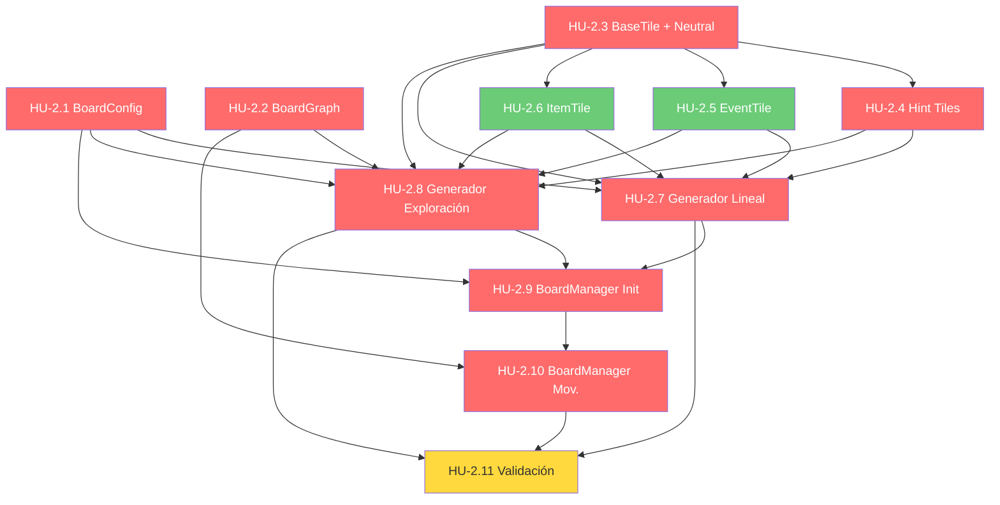

# Historias de Usuario — Épica 2: Sistema de Tablero

> **Épica:** [epic2.md](../epics/epic2.md)  
> **Prioridad:** 🔴 Crítica  
> **Sprint estimado:** 2–3  
> **Total HUs:** 11  
> **Dependencias externas:** Épica 1 (Interfaces `ITile`, `IBoardGenerator`, enums `TileType`, `BoardMode`, `IPlayer`, `GameEvents`)

---

## Índice de Historias

| ID | Título | Tipo | Prioridad | Estimación |
|---|---|---|---|---|
| HU-2.1 | BoardConfig (ScriptableObject) | Técnica | 🔴 Crítica | 3 SP |
| HU-2.2 | BoardGraph (estructura de datos para modo Exploración) | Técnica | 🔴 Crítica | 2 SP |
| HU-2.3 | BaseTile y NeutralTile | Técnica | 🔴 Crítica | 2 SP |
| HU-2.4 | HintBoostTile y HintTrapTile | Funcional | 🔴 Crítica | 2 SP |
| HU-2.5 | EventTile y TileEventConfig | Funcional | 🟡 Alta | 3 SP |
| HU-2.6 | ItemTile | Funcional | 🟡 Alta | 2 SP |
| HU-2.7 | Generador de Tablero Lineal | Técnica | 🔴 Crítica | 5 SP |
| HU-2.8 | Generador de Tablero Exploración (Multipath) | Técnica | 🔴 Crítica | 8 SP |
| HU-2.9 | BoardManager — Inicialización y consulta | Técnica | 🔴 Crítica | 5 SP |
| HU-2.10 | BoardManager — Movimiento y navegación | Funcional | 🔴 Crítica | 5 SP |
| HU-2.11 | Validación e integración del sistema de tablero | QA | 🔴 Crítica | 5 SP |

**Total estimado:** ~42 Story Points

---

## Definición de Done (Global para Épica 2)

Todas las HU de esta épica deben cumplir:

- [ ] Código compila sin errores ni warnings en Unity (`Unity_ReadConsole`)
- [ ] Se respetan las convenciones del [Architect.md](../../.agents/Architect.md):
  - Campos privados con `_camelCase` y `[SerializeField]`
  - Métodos en PascalCase con verbos de acción
  - ScriptableObjects con sufijo `Config` o `SO`
- [ ] No existe ningún `GameObject.Find()`, `FindObjectOfType()`, ni Singleton
- [ ] Dependencias inyectadas via `[SerializeField]` (MonoBehaviours) o constructor (clases puras)
- [ ] Comunicación hacia otras capas exclusivamente via `GameEvents` (Observer pattern)
- [ ] Documentación XML (`<summary>`) en todos los miembros públicos
- [ ] Archivos ubicados en `Assets/Scripts/Gameplay/Board/` y `Assets/Scripts/Data/` según corresponda
- [ ] Esta épica se enfoca exclusivamente en **lógica y datos** — ningún componente visual pertenece aquí (ver Épica 7)

---

## HU-2.1 — BoardConfig (ScriptableObject)

### Descripción

**Como** GM,  
**quiero** poder configurar los parámetros del tablero (modo, longitud, distribución de casillas, pistas iniciales) en un asset reutilizable,  
**para que** cada sesión de juego sea personalizable sin modificar código, y pueda tener presets listos para distintos tipos de partida.

### Criterios de Aceptación

- [ ] Archivo: `Assets/Scripts/Data/BoardConfig.cs`
- [ ] Namespace: `ChronosAndCards.Data`
- [ ] Hereda de `ScriptableObject` con `[CreateAssetMenu(menuName = "Chronos/Board Config")]`
- [ ] Campos serializados:

```csharp
[Header("Modo de Juego")]
[Tooltip("Linear = ruta directa tipo Oca. Exploration = red de nodos multipath.")]
public BoardMode Mode;

[Header("Dimensiones del Tablero")]
[Tooltip("Número estimado de preguntas para que un jugador termine la partida.")]
[Range(8, 50)]
public int TargetQuestionCount = 16;

[Header("Economía")]
[Tooltip("Pistas disponibles al inicio para cada jugador.")]
[Range(0, 10)]
public int InitialHints = 3;

[Header("Distribución de Casillas")]
[Tooltip("Pesos normalizados [Neutral, HintBoost, HintTrap, Event, Item]. Deben sumar 1.0.")]
public float[] TileTypeWeights = { 0.40f, 0.15f, 0.15f, 0.15f, 0.15f };

[Header("Exploración (solo aplica si Mode = Exploration)")]
[Range(1, 3)]
public int MinBranches = 1;
[Range(1, 3)]
public int MaxBranches = 3;

[Header("Avanzado")]
[Tooltip("Seed para generación procedural. 0 = aleatorio.")]
public int RandomSeed = 0;
```

- [ ] Validación en el Inspector (`OnValidate()`):
  - `TileTypeWeights` tiene exactamente 5 elementos (uno por `TileType`)
  - Los pesos suman 1.0 (±0.01 de tolerancia). Si no, loguea `Debug.LogWarning` y normaliza
  - `MinBranches <= MaxBranches`
  - `TargetQuestionCount >= 8`
- [ ] Propiedad calculada de solo lectura:
  ```csharp
  /// <summary>Longitud estimada del tablero en casillas.</summary>
  public int EstimatedTotalTiles => Mathf.RoundToInt(TargetQuestionCount * 3.5f * 0.75f);
  ```
- [ ] Documentación XML en todos los campos públicos

### Presets de Ejemplo

- [ ] Archivo: `Assets/ScriptableObjects/BoardPresets/QuickGame.asset`
  - Mode: Linear, TargetQuestionCount: 10, InitialHints: 3
  - Pesos: [0.40, 0.15, 0.15, 0.15, 0.15]
- [ ] Archivo: `Assets/ScriptableObjects/BoardPresets/ExtendedGame.asset`
  - Mode: Exploration, TargetQuestionCount: 24, InitialHints: 5
  - Pesos: [0.30, 0.15, 0.15, 0.20, 0.20], MinBranches: 1, MaxBranches: 3

### Notas de Implementación

- La fórmula `EstimatedTotalTiles` usa `avgDiceRoll(3.5) * avgMultiplier(0.75)` como aproximación. Es un **estimado** para guiar la generación; no es un límite rígido.
- El `RandomSeed` permite reproducibilidad en tests y depuración. Si es 0, se usa `UnityEngine.Random.Range` sin seed fijo.
- Los presets `.asset` se crean manualmente en Unity Editor o vía script de setup.

### Dependencias

- HU-1.4 (enum `BoardMode`, `TileType`)

---

## HU-2.2 — BoardGraph (Estructura de Datos para Exploración)

### Descripción

**Como** desarrollador del sistema de tablero,  
**quiero** una estructura de datos de grafo dirigido acíclico (DAG) reutilizable,  
**para que** el modo Exploración pueda representar la red de nodos con bifurcaciones sin acoplar la estructura al generador.

### Criterios de Aceptación

- [ ] Archivo: `Assets/Scripts/Data/BoardGraph.cs`
- [ ] Namespace: `ChronosAndCards.Data`
- [ ] Clase pura (no MonoBehaviour) que encapsula:
  ```csharp
  public class BoardGraph
  {
      private readonly Dictionary<ITile, List<ITile>> _adjacencyList;

      public ITile StartNode { get; }
      public ITile EndNode { get; }

      public BoardGraph(ITile startNode, ITile endNode)
      {
          StartNode = startNode;
          EndNode = endNode;
          _adjacencyList = new Dictionary<ITile, List<ITile>>();
      }

      /// <summary>Añade una conexión dirigida de origen a destino.</summary>
      public void AddEdge(ITile from, ITile to);

      /// <summary>Retorna los nodos accesibles desde el nodo dado.</summary>
      public IReadOnlyList<ITile> GetNeighbors(ITile node);

      /// <summary>Retorna todos los nodos del grafo.</summary>
      public IReadOnlyCollection<ITile> GetAllNodes();

      /// <summary>Verifica si existe al menos una ruta de inicio a fin.</summary>
      public bool HasPathToEnd();

      /// <summary>Retorna el número de conexiones de salida de un nodo.</summary>
      public int GetOutDegree(ITile node);
  }
  ```
- [ ] `GetNeighbors` retorna lista vacía (no null) si el nodo no tiene conexiones
- [ ] `HasPathToEnd()` implementa BFS o DFS para validar conectividad
- [ ] `IReadOnlyList` y `IReadOnlyCollection` para prevenir modificación externa
- [ ] Documentación XML en todos los métodos

### Notas de Implementación

- Esta clase se usa exclusivamente en modo Exploración. El modo Lineal usa una simple `List<ITile>`.
- El DAG garantiza que no hay ciclos, lo que previene loops infinitos de movimiento. El generador (HU-2.8) debe asegurar esta propiedad.
- `HasPathToEnd()` se invoca durante la generación para validar que el tablero es jugable.

### Dependencias

- HU-1.3 (interfaz `ITile`)

---

## HU-2.3 — BaseTile y NeutralTile

### Descripción

**Como** desarrollador de gameplay,  
**quiero** una clase base abstracta para todas las casillas y una implementación para la casilla neutral,  
**para que** todas las casillas compartan una API común y la casilla más básica esté disponible para la generación de tableros.

### Criterios de Aceptación

#### `BaseTile` — `Assets/Scripts/Gameplay/Board/Tiles/BaseTile.cs`

- [ ] Namespace: `ChronosAndCards.Gameplay.Board`
- [ ] Clase abstracta que implementa `ITile`:
  ```csharp
  public abstract class BaseTile : ITile
  {
      public abstract TileType Type { get; }

      /// <summary>Índice de la casilla en el tablero (para modo Lineal).</summary>
      public int Index { get; }

      /// <summary>Flag que indica si la casilla ha sido descubierta (para modo Exploración).</summary>
      public bool IsDiscovered { get; set; }

      public BaseTile(int index)
      {
          Index = index;
          IsDiscovered = false;
      }

      /// <summary>Ejecuta el efecto de la casilla al caer un jugador. Las subclases implementan la lógica específica.</summary>
      public abstract void OnPlayerLanded(IPlayer player);

      /// <summary>Emite el evento correspondiente al tipo de casilla.</summary>
      protected void EmitTileEffect(IPlayer player)
      {
          GameEvents.OnTileEffectApplied?.Invoke(player, Type);
      }
  }
  ```
- [ ] `Index` es inmutable (set en constructor)
- [ ] `IsDiscovered` inicia en `false` y se actualiza cuando un jugador adyacente lo revela
- [ ] Método protegido `EmitTileEffect` para evitar duplicación en subclases

#### `NeutralTile` — `Assets/Scripts/Gameplay/Board/Tiles/NeutralTile.cs`

- [ ] Hereda de `BaseTile`
- [ ] `Type` retorna `TileType.Neutral`
- [ ] `OnPlayerLanded(IPlayer)`:
  - No aplica efecto adicional
  - Llama a `EmitTileEffect(player)` para notificar a la UI
  - Log de debug: `$"NeutralTile[{Index}]: {player.PlayerName} aterrizó. Sin efecto."`
- [ ] Documentación XML

### Notas de Implementación

- `BaseTile` es una **clase pura** (no MonoBehaviour). La representación visual de las casillas pertenece a la Épica 7 (`TileVisual`).
- La propiedad `IsDiscovered` es relevante solo en modo Exploración. En modo Lineal, todas las casillas se marcan como `IsDiscovered = true` al generar el tablero.
- El `Index` permite a la UI y al `BoardManager` identificar la posición de cada casilla.

### Dependencias

- HU-1.3 (`ITile`)
- HU-1.2 (`IPlayer`)
- HU-1.4 (`TileType`)
- HU-1.9 (`GameEvents.OnTileEffectApplied`)

---

## HU-2.4 — HintBoostTile y HintTrapTile

### Descripción

**Como** jugador,  
**quiero** que al caer en una casilla Pista+ obtenga una pista adicional, y al caer en una casilla Pista- pierda una,  
**para que** el recorrido del tablero tenga impacto directo en mi economía de recursos.

### Criterios de Aceptación

#### `HintBoostTile` — `Assets/Scripts/Gameplay/Board/Tiles/HintBoostTile.cs`

- [ ] Hereda de `BaseTile`
- [ ] `Type` retorna `TileType.HintBoost`
- [ ] `OnPlayerLanded(IPlayer player)`:
  - Invoca `player.AddHint(1)`
  - Emite `GameEvents.OnHintChanged?.Invoke(player, player.HintCount)`
  - Llama a `EmitTileEffect(player)`
  - Log: `$"HintBoostTile[{Index}]: {player.PlayerName} ganó +1 pista. Total: {player.HintCount}"`

#### `HintTrapTile` — `Assets/Scripts/Gameplay/Board/Tiles/HintTrapTile.cs`

- [ ] Hereda de `BaseTile`
- [ ] `Type` retorna `TileType.HintTrap`
- [ ] `OnPlayerLanded(IPlayer player)`:
  - Invoca `player.AddHint(-1)`
  - **Protección de mínimo 0:** Si `player.HintCount` ya era 0, el efecto se aplica pero no reduce por debajo de 0 (la protección reside en la implementación de `IPlayer.AddHint`)
  - Emite `GameEvents.OnHintChanged?.Invoke(player, player.HintCount)`
  - Llama a `EmitTileEffect(player)`
  - Log: `$"HintTrapTile[{Index}]: {player.PlayerName} perdió -1 pista. Total: {player.HintCount}"`
- [ ] **Nota GDD §5:** _"Casilla Pista- (Trampa): Resta -1 Pista del inventario."_ — El mínimo de 0 pistas es una regla implícita de la economía base.

### Tests requeridos

- [ ] `HintBoostTile_OnPlayerLanded_IncreasesHintCount`
- [ ] `HintTrapTile_OnPlayerLanded_DecreasesHintCount`
- [ ] `HintTrapTile_OnPlayerLanded_HintCountDoesNotGoBelowZero`
- [ ] Ambos emiten `OnHintChanged` con el valor correcto
- [ ] Ambos emiten `OnTileEffectApplied` con su tipo respectivo

### Dependencias

- HU-2.3 (`BaseTile`)
- HU-1.2 (`IPlayer.AddHint`)
- HU-1.9 (`GameEvents.OnHintChanged`, `OnTileEffectApplied`)

---

## HU-2.5 — EventTile y TileEventConfig

### Descripción

**Como** jugador,  
**quiero** que las casillas de Evento alteren temporalmente las reglas del juego,  
**para que** el tablero tenga momentos sorpresivos que rompan la rutina.

### Criterios de Aceptación

#### `TileEventConfig` — `Assets/Scripts/Data/TileEventConfig.cs`

- [ ] Namespace: `ChronosAndCards.Data`
- [ ] `ScriptableObject` con `[CreateAssetMenu(menuName = "Chronos/Tile Event Config")]`
- [ ] Campos:
  ```csharp
  [Tooltip("Nombre del evento para mostrar en la UI.")]
  public string EventName;

  [TextArea(2, 4)]
  [Tooltip("Descripción del efecto para el jugador.")]
  public string Description;

  [Tooltip("Tipo de modificador que aplica el evento.")]
  public TileEventType EventType;

  [Tooltip("Duración del efecto en turnos. 0 = instantáneo.")]
  [Range(0, 5)]
  public int DurationInTurns;

  [Tooltip("Valor numérico del modificador (si aplica). Ej: +2 para 'avanza 2 extra'.")]
  public int ModifierValue;
  ```
- [ ] Enum `TileEventType`:
  ```csharp
  public enum TileEventType
  {
      FreeHint,           // "Siguiente pista gratuita" — no reduce multiplicador
      ExtraMovement,      // "Avanza N casillas extra"
      ReducedMovement,    // "Tu próximo movimiento se reduce a la mitad"
      SwapPositionRandom, // "Intercambia posición con un jugador al azar"
      DoubleReward,       // "Tu próxima respuesta correcta vale el doble"
      SkipQuestion        // "Avanza sin responder pregunta" (avance = dado sin multiplicador... o avance fijo)
  }
  ```
- [ ] Al menos 3 instancias de ejemplo creadas como assets:
  - `FreeHint.asset` — EventType: FreeHint, Duration: 1
  - `ExtraMovement.asset` — EventType: ExtraMovement, ModifierValue: 3
  - `DoubleReward.asset` — EventType: DoubleReward, Duration: 1

#### `EventTile` — `Assets/Scripts/Gameplay/Board/Tiles/EventTile.cs`

- [ ] Hereda de `BaseTile`
- [ ] `Type` retorna `TileType.Event`
- [ ] Recibe un `TileEventConfig` por constructor:
  ```csharp
  public EventTile(int index, TileEventConfig eventConfig) : base(index)
  ```
- [ ] `OnPlayerLanded(IPlayer player)`:
  - Lee la configuración del evento
  - Aplica el modificador temporal al jugador (a través de un sistema de modificadores o `IStatusEffect` si está disponible de HU-1.9)
  - Emite `GameEvents.OnTileEffectApplied(player, TileType.Event)`
  - Log con nombre del evento y descripción
- [ ] Los eventos con `DurationInTurns > 0` requieren un mecanismo de expiración (decrementar al inicio de cada turno del jugador y remover cuando llegue a 0)

### Notas de Implementación

- El GDD §5 define las casillas de Evento con el ejemplo _"Siguiente pista gratuita"_. Los `TileEventType` adicionales son extensiones naturales que enriquecen el juego.
- La mecánica de "modificador temporal" puede implementarse como `IStatusEffect` en el jugador (similar al `ImmunityShield` de la Épica 6). Esto crea una dependencia suave — si `IStatusEffect` no está definido aún, usar una lista simple de modifiers en el jugador como placeholder.
- Los generadores de tablero (HU-2.7 y HU-2.8) asignarán configs aleatorias de un pool de `TileEventConfig` a cada `EventTile`.

### Dependencias

- HU-2.3 (`BaseTile`)
- HU-1.2 (`IPlayer`)
- HU-1.4 (`TileType`)
- HU-1.9 (`GameEvents`)

---

## HU-2.6 — ItemTile

### Descripción

**Como** jugador,  
**quiero** que al caer en una casilla de Objeto obtenga un consumible aleatorio del mazo,  
**para que** pueda adquirir herramientas tácticas durante mi recorrido.

### Criterios de Aceptación

- [ ] Archivo: `Assets/Scripts/Gameplay/Board/Tiles/ItemTile.cs`
- [ ] Hereda de `BaseTile`
- [ ] `Type` retorna `TileType.Item`
- [ ] Recibe una referencia al mazo de ítems por constructor:
  ```csharp
  public ItemTile(int index, IItemDeck itemDeck) : base(index)
  ```
- [ ] Interfaz `IItemDeck` (definida aquí o en `Assets/Scripts/Interfaces/`):
  ```csharp
  public interface IItemDeck
  {
      IItem DrawItem();
      int RemainingItems { get; }
      bool IsEmpty { get; }
  }
  ```
- [ ] `OnPlayerLanded(IPlayer player)`:
  - Si el mazo no está vacío: `IItem item = _itemDeck.DrawItem()`
  - Invoca `player.AddItem(item)`
  - Emite `GameEvents.OnInventoryChanged?.Invoke(player, item, InventoryAction.Added)`
  - Llama a `EmitTileEffect(player)`
  - Log: `$"ItemTile[{Index}]: {player.PlayerName} obtuvo '{item.Name}'"`
  - Si el mazo está vacío:
    - Log warning: `"ItemTile: mazo de objetos agotado. No se otorga objeto."`
    - Solo emite `EmitTileEffect(player)` sin efecto

### Notas de Implementación

- `IItemDeck` se define como interfaz aquí para que la `ItemTile` no dependa de la implementación concreta del mazo (que pertenece a la Épica 5, HU-5.2).
- En esta épica, la implementación de `IItemDeck` puede ser un **stub** que retorna objetos mock. La implementación real vendrá en la Épica 5.
- GDD §5: _"Casilla Objeto: El jugador roba una carta del mazo de consumibles y la añade a su inventario."_

### Dependencias

- HU-2.3 (`BaseTile`)
- HU-1.2 (`IPlayer.AddItem`)
- HU-1.4 (`InventoryAction`)
- HU-1.9 (`GameEvents.OnInventoryChanged`, `OnTileEffectApplied`)

---

## HU-2.7 — Generador de Tablero Lineal

### Descripción

**Como** sistema,  
**necesito** generar un tablero de ruta directa inicio-fin con longitud dinámica basada en la configuración del GM,  
**para que** el modo "Tipo Oca" funcione con un recorrido proporcional a la cantidad de preguntas objetivo.

### Criterios de Aceptación

- [ ] Archivo: `Assets/Scripts/Gameplay/Board/LinearBoardGenerator.cs`
- [ ] Namespace: `ChronosAndCards.Gameplay.Board`
- [ ] Implementa `IBoardGenerator`
- [ ] Método `GenerateBoard(BoardConfig config)`:
  1. Calcula `totalTiles` usando `config.EstimatedTotalTiles` (o la fórmula directa)
  2. Inicializa el RNG con `config.RandomSeed` (si es 0, usa seed aleatorio)
  3. Genera una `List<ITile>` de longitud `totalTiles`
  4. **Casilla 0:** siempre `NeutralTile` (Inicio)
  5. **Casilla N-1:** siempre `NeutralTile` (Meta)
  6. **Casillas 1 a N-2:** asignadas aleatoriamente según `TileTypeWeights`:
     - Usar weighted random selection
     - `TileTypeWeights[0]` = probabilidad de `Neutral`
     - `TileTypeWeights[1]` = probabilidad de `HintBoost`
     - `TileTypeWeights[2]` = probabilidad de `HintTrap`
     - `TileTypeWeights[3]` = probabilidad de `Event`
     - `TileTypeWeights[4]` = probabilidad de `Item`
  7. Marca todas las casillas como `IsDiscovered = true` (tablero visible desde el inicio)
  8. Retorna la lista generada
- [ ] Lógica de selección ponderada en método privado:
  ```csharp
  private TileType SelectTileType(float[] weights)
  ```
- [ ] Para `EventTile`: selecciona un `TileEventConfig` aleatorio del pool disponible (inyectado por constructor o parámetro)
- [ ] Para `ItemTile`: recibe `IItemDeck` para inyectar al tile
- [ ] Log al finalizar: total de casillas generadas, desglose por tipo

### Tests requeridos

- [ ] `Generate_LinearBoard_ReturnsCorrectLength`
- [ ] `Generate_LinearBoard_FirstAndLastAreNeutral`
- [ ] `Generate_LinearBoard_SameSeedProducesSameResult`
- [ ] `Generate_LinearBoard_TileDistributionMatchesWeights` (estadístico, ±5% tolerancia con N grande)
- [ ] `Generate_LinearBoard_MinimumLength` (al menos 3 casillas: inicio, 1 intermedia, meta)

### Notas de Implementación

- GDD §2: _"La longitud es dinámica y configurable por el GM al inicio de la partida (por ejemplo, escalar el tablero para que termine tras un promedio de 16 preguntas resueltas)."_
- La fórmula de escalado es una estimación. En la práctica, el tablero puede ser más corto o largo de lo estimado dependiendo del desempeño de los jugadores.

### Dependencias

- HU-2.1 (`BoardConfig`)
- HU-2.3 (`BaseTile`, `NeutralTile`)
- HU-2.4 (`HintBoostTile`, `HintTrapTile`)
- HU-2.5 (`EventTile`, `TileEventConfig`)
- HU-2.6 (`ItemTile`)
- HU-1.3 (`IBoardGenerator`)

---

## HU-2.8 — Generador de Tablero Exploración (Multipath)

### Descripción

**Como** sistema,  
**necesito** generar un tablero en red de nodos tipo laberinto con bifurcaciones,  
**para que** el modo Exploración permita a los jugadores tomar decisiones tácticas sobre su ruta y descubrir el mapa progresivamente.

### Criterios de Aceptación

- [ ] Archivo: `Assets/Scripts/Gameplay/Board/ExplorationBoardGenerator.cs`
- [ ] Namespace: `ChronosAndCards.Gameplay.Board`
- [ ] Implementa `IBoardGenerator`
- [ ] **Algoritmo de generación por capas (layers):**
  1. **Capa 0:** Nodo de Inicio (`NeutralTile`)
  2. **Capas 1 a N-1:** Nodos intermedios
     - Cada nodo de la capa K genera entre `config.MinBranches` y `config.MaxBranches` conexiones a nodos en la capa K+1
     - Total de nodos por capa: variable, basado en las bifurcaciones acumuladas (con cap máximo para evitar explosión)
     - Tipos de casilla asignados aleatoriamente según `TileTypeWeights`
  3. **Capa N:** Nodo de Meta (`NeutralTile`) — todos los nodos de la capa N-1 conectan aquí (convergen)
  4. Número de capas: derivado de `config.EstimatedTotalTiles / avgNodesPerLayer`
- [ ] Retorna `List<ITile>` (todos los nodos) para compatibilidad con `IBoardGenerator`, pero almacena internamente un `BoardGraph`
- [ ] Propiedad adicional (o método) para exponer el `BoardGraph`:
  ```csharp
  public BoardGraph GeneratedGraph { get; private set; }
  ```
- [ ] **Garantías del grafo:**
  - [ ] Es un DAG (Directed Acyclic Graph) — no hay ciclos
  - [ ] `BoardGraph.HasPathToEnd()` retorna `true` tras la generación
  - [ ] Cada nodo intermedio tiene al menos 1 conexión de entrada y al menos 1 de salida
  - [ ] Cap máximo de nodos por capa (configurable, default: 5) para evitar explosión exponencial
- [ ] Los nodos inician con `IsDiscovered = false` excepto:
  - Nodo de Inicio: `IsDiscovered = true`
  - Nodos directamente conectados al Inicio: `IsDiscovered = true`
- [ ] Seed configurable para reproducibilidad (`config.RandomSeed`)

### Tests requeridos

- [ ] `Generate_ExplorationBoard_HasPathFromStartToEnd`
- [ ] `Generate_ExplorationBoard_IsDAG` (no tiene ciclos — verificar con detección de ciclos DFS)
- [ ] `Generate_ExplorationBoard_SameSeedProducesSameResult`
- [ ] `Generate_ExplorationBoard_BranchesWithinMinMaxRange`
- [ ] `Generate_ExplorationBoard_AllIntermediateNodesHaveInAndOut`
- [ ] `Generate_ExplorationBoard_OnlyStartAndAdjacentAreDiscovered`
- [ ] `Generate_ExplorationBoard_TileDistributionMatchesWeights`

### Notas de Implementación

- GDD §2: _"Modo Exploración (Multipath): Un tablero en red de nodos tipo laberinto que se va descubriendo, forzando a los jugadores a tomar decisiones tácticas sobre su ruta."_
- El algoritmo por capas garantiza progresión horizontal (no se puede "volver atrás") y convergencia al nodo meta.
- Para evitar la explosión de nodos: si la capa K tiene más de `maxNodesPerLayer` nodos, fusionar aleatoriamente algunos nodos de la capa K+1 antes de continuar.
- **Complejidad:** Este es el generador más complejo de la épica. Considerar crear primero un prototipo simple (2-3 capas, 1-2 branches) y luego escalar.

### Dependencias

- HU-2.1 (`BoardConfig`)
- HU-2.2 (`BoardGraph`)
- HU-2.3 a HU-2.6 (todas las implementaciones de tiles)
- HU-1.3 (`IBoardGenerator`)

---

## HU-2.9 — BoardManager: Inicialización y Consulta

### Descripción

**Como** sistema,  
**necesito** un componente central que inicialice el tablero correcto según la configuración del GM y exponga métodos de consulta del estado del tablero,  
**para que** los demás sistemas (FSM, UI) puedan interactuar con el tablero de forma unificada sin conocer los detalles de generación.

### Criterios de Aceptación

- [ ] Archivo: `Assets/Scripts/Gameplay/Board/BoardManager.cs`
- [ ] Namespace: `ChronosAndCards.Gameplay.Board`
- [ ] Es un `MonoBehaviour` (se monta en la escena)
- [ ] Dependencias inyectadas vía `[SerializeField]`:
  ```csharp
  [SerializeField] private BoardConfig _boardConfig;
  ```
- [ ] Dependencias adicionales por constructor o inicialización (para generadores, pools de eventos, mazo de ítems)

#### Inicialización

- [ ] Método `Initialize()`:
  - Determina el generador según `_boardConfig.Mode`:
    - `Linear` → instancia `LinearBoardGenerator`
    - `Exploration` → instancia `ExplorationBoardGenerator`
  - Invoca `generator.GenerateBoard(_boardConfig)`
  - Almacena la lista de tiles y (si aplica) el `BoardGraph`
  - Log: modo, total de nodos, desglose de tipos
  - Emite `GameEvents.OnBoardGenerated?.Invoke()` (evento nuevo si es necesario, o integrar en `OnGameStarted`)

#### Consulta (Modo Lineal)

- [ ] `ITile GetTileAt(int position)`:
  - Retorna la casilla en el índice dado
  - Throw `IndexOutOfRangeException` si la posición está fuera de rango
- [ ] `int TotalTiles` — propiedad de solo lectura con el total de casillas
- [ ] `bool IsLastTile(int position)` — `true` si es la meta

#### Consulta (Modo Exploración)

- [ ] `IReadOnlyList<ITile> GetAdjacentTiles(ITile current)`:
  - Retorna los nodos conectados (vecinos de salida) desde `BoardGraph`
  - Retorna lista vacía si el nodo no tiene salidas (solo debería ser el nodo Meta)
- [ ] `bool HasMultiplePaths(ITile current)`:
  - `true` si el nodo tiene más de 1 conexión de salida (bifurcación)
- [ ] `void DiscoverTile(ITile tile)`:
  - Marca `tile.IsDiscovered = true`
  - Emite evento para que la UI actualice la visualización

#### Consulta (Ambos Modos)

- [ ] `BoardMode CurrentMode` — propiedad de solo lectura
- [ ] `ITile GetPlayerTile(IPlayer player)`:
  - Retorna la casilla actual del jugador basada en su `Position`

### Notas de Implementación

- El `BoardManager` actúa como **fachada** del sistema de tablero. La FSM y la UI solo interactúan con `BoardManager`, nunca directamente con los generadores o el `BoardGraph`.
- GDD §2 y Architect.md §3: sin `Find()`, sin Singletons.
- El `BoardManager` debe exponer suficiente información para que el `BoardView` (Épica 7) renderice sin acceder a internos.

### Dependencias

- HU-2.1 (`BoardConfig`)
- HU-2.7 (`LinearBoardGenerator`)
- HU-2.8 (`ExplorationBoardGenerator`)
- HU-1.2 (`IPlayer`)

---

## HU-2.10 — BoardManager: Movimiento y Navegación

### Descripción

**Como** jugador,  
**quiero** que mi ficha se mueva correctamente por el tablero (lineal o con elección de ruta en exploración),  
**para que** el avance refleje mis decisiones y el resultado del dado+desempeño.

### Criterios de Aceptación

#### Movimiento Lineal

- [ ] Método `MovePlayerLinear(IPlayer player, int steps)`:
  - Calcula `newPosition = player.Position + steps`
  - Si `newPosition >= TotalTiles - 1` → clamp a la meta (última casilla). El jugador ha llegado al fin.
  - Invoca `player.MoveForward(steps)` (o `player.MoveToPosition(newPosition)`)
  - Emite `GameEvents.OnPlayerMoved?.Invoke(player, oldPosition, newPosition)`
  - Retorna la `ITile` de destino para que la FSM invoque `OnPlayerLanded`

#### Movimiento Exploración

- [ ] Método `MovePlayerExploration(IPlayer player, int steps)`:
  - Movimiento paso a paso: por cada step, el jugador avanza un nodo en el grafo
  - Si el nodo actual tiene **1 sola conexión de salida** → avanza automáticamente
  - Si el nodo actual tiene **múltiples conexiones de salida** (bifurcación):
    - Pausa el movimiento
    - Emite `GameEvents.OnPathChoiceRequired?.Invoke(player, availableTiles)` donde `availableTiles` son los nodos adyacentes
    - Espera la selección del jugador (vía evento `OnPathChoiceSelected`)
    - Continúa el movimiento con la casilla seleccionada
  - Al avanzar, marca los nodos adyacentes al nuevo nodo como `IsDiscovered = true`
  - Emite `GameEvents.OnPlayerMoved` al finalizar todo el movimiento
  - Si el jugador llega al nodo Meta antes de agotar todos los steps → se detiene en la Meta

#### Método unificado

- [ ] Método público principal:
  ```csharp
  public void MovePlayer(IPlayer player, int steps)
  {
      if (_boardConfig.Mode == BoardMode.Linear)
          MovePlayerLinear(player, steps);
      else
          MovePlayerExploration(player, steps);
  }
  ```

#### Swap de casillas (soporte para Épica 6)

- [ ] Método `SwapTiles(ITile a, ITile b)`:
  - Intercambia las posiciones/contenido de dos casillas en el tablero
  - Solo permite casillas adyacentes (en Exploración) o con diferencia de índice ≤ 2 (en Lineal)
  - No permite swap de la casilla de Inicio ni de la Meta
  - Emite `GameEvents.OnBoardModified?.Invoke(a, b)` (evento nuevo)
  - Actualiza las posiciones internas de los jugadores si alguno estaba en las casillas intercambiadas

#### Tracking de posiciones

- [ ] `Dictionary<IPlayer, ITile>` interno para tracking de posición actual de cada jugador
- [ ] Método `RegisterPlayer(IPlayer player)`:
  - Coloca al jugador en la casilla de Inicio
  - Añade al tracking

#### Nuevos eventos necesarios

- [ ] `GameEvents.OnPathChoiceRequired` — `Action<IPlayer, IReadOnlyList<ITile>>` (jugador, opciones disponibles)
- [ ] `GameEvents.OnPathChoiceSelected` — `Action<IPlayer, ITile>` (jugador, casilla seleccionada)
- [ ] `GameEvents.OnBoardModified` — `Action<ITile, ITile>` (casillas intercambiadas)
- [ ] `GameEvents.OnTileDiscovered` — `Action<ITile>` (casilla recién descubierta)

### Notas de Implementación

- El movimiento en modo Exploración es **asíncrono** porque puede requerir input del jugador en bifurcaciones. Implementar como coroutine o como un sub-estado en la FSM (`MovementState` espera el evento).
- GDD §4: _"Casillas a Avanzar = Valor del Dado * Multiplicador de Desempeño"_ — el `BoardManager` recibe ya el resultado calculado, no realiza este cálculo.
- `SwapTiles` se usa exclusivamente por la recompensa "Manipulación del Tablero" de la Épica 6. Se incluye aquí para que el `BoardManager` esté preparado.
- Los 4 nuevos eventos deben añadirse a `GameEvents.cs` y registrarse en `ClearAll()`.

### Dependencias

- HU-2.9 (inicialización y consulta del BoardManager)
- HU-2.2 (`BoardGraph` para navegación en exploración)
- HU-1.2 (`IPlayer`)
- HU-1.9 (`GameEvents` — extensión con nuevos eventos)

---

## HU-2.11 — Validación e Integración del Sistema de Tablero

### Descripción

**Como** QA / desarrollador,  
**quiero** verificar que ambos modos de tablero se generan correctamente, los efectos de casilla funcionan, y el movimiento es consistente,  
**para que** la épica esté completa y lista para la integración con la FSM (Épica 1) y el dado (Épica 3).

### Criterios de Aceptación

#### Tests Unitarios — Generadores

- [ ] Archivo: `Assets/Tests/EditMode/Board/LinearBoardGeneratorTests.cs`
- [ ] Test: `Generate_CorrectTotalTiles_ForTargetQuestions`
- [ ] Test: `Generate_FirstTileIsNeutral_LastTileIsNeutral`
- [ ] Test: `Generate_SameSeed_SameResult`
- [ ] Test: `Generate_DifferentSeed_DifferentResult`
- [ ] Test: `Generate_TileDistribution_ApproximatelyMatchesWeights`

- [ ] Archivo: `Assets/Tests/EditMode/Board/ExplorationBoardGeneratorTests.cs`
- [ ] Test: `Generate_HasPathFromStartToEnd`
- [ ] Test: `Generate_NoGraphCycles`
- [ ] Test: `Generate_BranchesWithinConfigRange`
- [ ] Test: `Generate_SameSeed_SameResult`
- [ ] Test: `Generate_OnlyStartAndAdjacentDiscovered`

#### Tests Unitarios — Tiles

- [ ] Archivo: `Assets/Tests/EditMode/Board/TileEffectTests.cs`
- [ ] Test: `NeutralTile_OnPlayerLanded_NoSideEffect`
- [ ] Test: `HintBoostTile_OnPlayerLanded_IncreasesHintByOne`
- [ ] Test: `HintTrapTile_OnPlayerLanded_DecreasesHintByOne`
- [ ] Test: `HintTrapTile_OnPlayerLanded_DoesNotGoBelowZero`
- [ ] Test: `ItemTile_OnPlayerLanded_AddsItemToInventory`
- [ ] Test: `ItemTile_OnPlayerLanded_EmptyDeck_NoItem`
- [ ] Test: `EventTile_OnPlayerLanded_AppliesModifier`

#### Tests de Integración — BoardManager

- [ ] Archivo: `Assets/Tests/EditMode/Board/BoardManagerTests.cs`
- [ ] Test: `Initialize_LinearMode_GeneratesLinearBoard`
- [ ] Test: `Initialize_ExplorationMode_GeneratesGraph`
- [ ] Test: `MovePlayer_Linear_UpdatesPosition`
- [ ] Test: `MovePlayer_Linear_ClampsToMeta`
- [ ] Test: `MovePlayer_Exploration_EmitsPathChoiceOnBifurcation`
- [ ] Test: `SwapTiles_AdjacentTiles_SwapsCorrectly`
- [ ] Test: `SwapTiles_StartOrEndTile_Rejected`
- [ ] Test: `RegisterPlayer_PlacesAtStart`

#### Integración con FSM

- [ ] Verificar que `SetupState` puede invocar `BoardManager.Initialize()` exitosamente
- [ ] Verificar que `MovementState` puede invocar `BoardManager.MovePlayer()` y recibir la casilla destino
- [ ] Verificar que `TileEffectState` invoca `ITile.OnPlayerLanded()` y recibe el evento correcto

#### Verificación de Arquitectura

- [ ] Grep: ningún `GameObject.Find()` ni `FindObjectOfType()` en `Assets/Scripts/Gameplay/Board/`
- [ ] Grep: ningún `using UnityEngine.UI` en scripts del Board (es capa lógica, no visual)
- [ ] Todas las clases de tiles son clases puras (no MonoBehaviours)

#### Compilación

- [ ] Proyecto compila sin errores en Unity (`Unity_ReadConsole`)

### Notas de Implementación

- Usar mocks/stubs para `IPlayer` y `IItemDeck` en los tests.
- Para el test estadístico de distribución, generar 1000+ casillas y verificar que la proporción de cada tipo está dentro de ±5% del peso configurado.
- Esta HU es la "puerta de calidad" de la Épica 2.

### Dependencias

- Todas las HU previas (HU-2.1 a HU-2.10)

---

## Diagrama de Dependencias entre HUs



**Leyenda:** 🔴 Rojo = Crítica | 🟡 Amarillo = QA | 🟢 Verde = Alta

---

## Orden de Implementación Recomendado

```
 1. HU-2.1  (BoardConfig SO)           ← Sin deps internas de esta épica
 2. HU-2.2  (BoardGraph)               ← Sin deps internas de esta épica
 3. HU-2.3  (BaseTile + NeutralTile)   ← Sin deps internas de esta épica
 4. HU-2.4  (HintBoostTile/TrapTile)   ← Necesita HU-2.3
 5. HU-2.5  (EventTile + Config)       ← Necesita HU-2.3
 6. HU-2.6  (ItemTile)                 ← Necesita HU-2.3
 7. HU-2.7  (Generador Lineal)         ← Necesita HU-2.1, HU-2.3–2.6
 8. HU-2.8  (Generador Exploración)    ← Necesita HU-2.1, HU-2.2, HU-2.3–2.6
 9. HU-2.9  (BoardManager Init)        ← Necesita HU-2.7, HU-2.8
10. HU-2.10 (BoardManager Movimiento)  ← Necesita HU-2.9, HU-2.2
11. HU-2.11 (Validación)               ← Necesita todo
```

---

## Eventos Nuevos Requeridos (extensión de GameEvents)

Esta épica requiere añadir los siguientes eventos a `GameEvents.cs` (HU-1.9):

```csharp
// === Tablero ===
public static Action<IPlayer, IReadOnlyList<ITile>> OnPathChoiceRequired;
public static Action<IPlayer, ITile> OnPathChoiceSelected;
public static Action<ITile, ITile> OnBoardModified;
public static Action<ITile> OnTileDiscovered;
```

Estos deben incluirse en `ClearAll()` y documentarse con XML.
