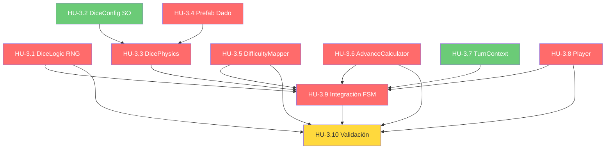

# Historias de Usuario — Épica 3: Sistema de Dado y Turno

> **Épica:** [epic3.md](../epics/epic3.md)  
> **Prioridad:** 🔴 Crítica  
> **Sprint estimado:** 3–4  
> **Total HUs:** 10  
> **Dependencias externas:** Épica 1 (FSM, `IDiceRoller`, `IDiceValidator`, `GameEvents`, `GameContext`), Épica 2 (`BoardManager.MovePlayer`)

---

## Índice de Historias

| ID | Título | Tipo | Prioridad | Estimación |
|---|---|---|---|---|
| HU-3.1 | DiceLogic — Motor RNG del dado | Técnica | 🔴 Crítica | 2 SP |
| HU-3.2 | DiceConfig (ScriptableObject) | Técnica | 🟡 Alta | 1 SP |
| HU-3.3 | DicePhysics — Simulación visual del dado | Funcional | 🔴 Crítica | 5 SP |
| HU-3.4 | Prefab del Dado D6 | Asset | 🔴 Crítica | 3 SP |
| HU-3.5 | DifficultyMapper — Mapeo dado → dificultad | Técnica | 🔴 Crítica | 2 SP |
| HU-3.6 | AdvanceCalculator — Fórmula de avance | Técnica | 🔴 Crítica | 3 SP |
| HU-3.7 | TurnContext — Datos del turno actual | Técnica | 🟡 Alta | 2 SP |
| HU-3.8 | Player — Implementación concreta de IPlayer | Técnica | 🔴 Crítica | 5 SP |
| HU-3.9 | Integración FSM — Estados del turno completo | Integración | 🔴 Crítica | 8 SP |
| HU-3.10 | Validación e integración del sistema de dado y turno | QA | 🔴 Crítica | 5 SP |

**Total estimado:** ~36 Story Points

---

## Definición de Done (Global para Épica 3)

Todas las HU de esta épica deben cumplir:

- [ ] Código compila sin errores ni warnings en Unity (`Unity_ReadConsole`)
- [ ] Se respetan las convenciones del [Architect.md](../../.agents/Architect.md):
  - Campos privados con `_camelCase` y `[SerializeField]`
  - Métodos en PascalCase con verbos de acción
  - Separación estricta: lógica ≠ visual (RNG ≠ Rigidbody)
- [ ] No existe ningún `GameObject.Find()`, `FindObjectOfType()`, ni Singleton
- [ ] Dependencias inyectadas via `[SerializeField]` (MonoBehaviours) o constructor (clases puras)
- [ ] Comunicación hacia UI exclusivamente via `GameEvents` (Observer pattern)
- [ ] Documentación XML (`<summary>`) en todos los miembros públicos
- [ ] Archivos ubicados en `Assets/Scripts/Gameplay/Dice/` y `Assets/Scripts/Gameplay/`
- [ ] El resultado lógico del dado **siempre** se predetermina por RNG; las físicas son puramente cosméticas

---

## HU-3.1 — DiceLogic: Motor RNG del Dado

### Descripción

**Como** sistema,  
**necesito** un motor de generación de resultados de dado confiable, validable y desacoplado de la capa visual,  
**para que** la lógica del juego sea determinista y testeable independientemente de las físicas.

### Criterios de Aceptación

- [ ] Archivo: `Assets/Scripts/Gameplay/Dice/DiceLogic.cs`
- [ ] Namespace: `ChronosAndCards.Gameplay.Dice`
- [ ] Clase pura (no MonoBehaviour) que implementa `IDiceRoller` e `IDiceValidator`
- [ ] Implementación:

```csharp
public class DiceLogic : IDiceRoller, IDiceValidator
{
    public event Action<int> OnDiceResult;

    private readonly int _minValue = 1;
    private readonly int _maxValue = 6;
    private System.Random _random;

    /// <summary>Crea un DiceLogic con seed aleatorio.</summary>
    public DiceLogic() => _random = new System.Random();

    /// <summary>Crea un DiceLogic con seed fijo para reproducibilidad.</summary>
    public DiceLogic(int seed) => _random = new System.Random(seed);

    /// <summary>Genera un resultado aleatorio 1–6 y dispara OnDiceResult.</summary>
    public void Roll()
    {
        int result = _random.Next(_minValue, _maxValue + 1);
        OnDiceResult?.Invoke(result);
    }

    /// <summary>Valida que el resultado esté en el rango permitido.</summary>
    public bool IsValidResult(int result) => result >= _minValue && result <= _maxValue;

    /// <summary>Permite re-inicializar el seed (para testing o nuevas partidas).</summary>
    public void SetSeed(int seed) => _random = new System.Random(seed);
}
```

- [ ] Usa `System.Random` en lugar de `UnityEngine.Random` para permitir seeds por instancia (thread-safe y testeable sin dependencia de Unity)
- [ ] Constructor con seed para reproducibilidad en tests
- [ ] Constructor sin parámetros para uso normal en runtime
- [ ] Evento `OnDiceResult` se dispara **inmediatamente** al llamar `Roll()` — antes de cualquier animación visual
- [ ] `IsValidResult()` retorna `false` para valores < 1 o > 6
- [ ] Documentación XML en todos los miembros

### Notas de Implementación

- GDD §3: _"Tira un dado de 6 caras (D6)."_ — Rango fijo 1–6.
- Se usa `System.Random` en lugar de `UnityEngine.Random` porque:
  1. Permite instancias separadas con seeds independientes
  2. Facilita unit testing sin inicializar el motor de Unity
  3. Es thread-safe (cada instancia tiene su propio estado)
- El resultado lógico se determina **antes** de la animación. El `DicePhysics` (HU-3.3) solo es un efecto visual que "aterriza" en la cara predeterminada.

### Dependencias

- HU-1.3 (`IDiceRoller`, `IDiceValidator`)

---

## HU-3.2 — DiceConfig (ScriptableObject)

### Descripción

**Como** diseñador del juego,  
**quiero** poder ajustar los parámetros del dado y su animación desde el Inspector,  
**para que** pueda iterar rápidamente sobre la experiencia de lanzamiento sin modificar código.

### Criterios de Aceptación

- [ ] Archivo: `Assets/Scripts/Data/DiceConfig.cs`
- [ ] Namespace: `ChronosAndCards.Data`
- [ ] `ScriptableObject` con `[CreateAssetMenu(menuName = "Chronos/Dice Config")]`
- [ ] Campos:

```csharp
[Header("Físicas del Lanzamiento")]
[Tooltip("Fuerza aplicada al dado al lanzar (impulso vertical).")]
[Range(1f, 20f)]
public float LaunchForce = 8f;

[Tooltip("Torque aplicado al dado al lanzar (rotación aleatoria).")]
[Range(1f, 30f)]
public float TorqueForce = 15f;

[Tooltip("Altura desde la que se lanza el dado.")]
[Range(1f, 10f)]
public float LaunchHeight = 5f;

[Header("Animación")]
[Tooltip("Tiempo máximo (segundos) que el dado puede rodar antes de forzar el resultado.")]
[Range(1f, 8f)]
public float MaxRollDuration = 4f;

[Tooltip("Velocidad del Slerp para orientar el dado al resultado final.")]
[Range(0.5f, 10f)]
public float SettleSpeed = 3f;

[Tooltip("Umbral de velocidad angular para considerar que el dado se detuvo.")]
[Range(0.01f, 1f)]
public float StopThreshold = 0.1f;

[Header("Timeout de Seguridad")]
[Tooltip("Tiempo máximo (segundos) antes de forzar la finalización de la animación.")]
[Range(3f, 15f)]
public float AnimationTimeout = 6f;
```

- [ ] Instancia por defecto: `Assets/ScriptableObjects/DiceConfig_Default.asset`
- [ ] Documentación XML en todos los campos

### Notas de Implementación

- El `AnimationTimeout` es la "safety net" mencionada en las notas técnicas de la épica: si la animación del dado se atasca (ej. queda vibrando entre colliders), se fuerza la finalización.
- Estos valores se consumen por `DicePhysics` (HU-3.3).

### Dependencias

- Ninguna (datos puros)

---

## HU-3.3 — DicePhysics: Simulación Visual del Dado

### Descripción

**Como** jugador,  
**quiero** ver un dado 3D que rueda con físicas realistas y aterriza siempre mostrando la cara correcta,  
**para que** la experiencia de lanzamiento sea inmersiva, satisfactoria y coherente con el resultado lógico.

### Criterios de Aceptación

- [ ] Archivo: `Assets/Scripts/Gameplay/Dice/DicePhysics.cs`
- [ ] Namespace: `ChronosAndCards.Gameplay.Dice`
- [ ] Es un `MonoBehaviour` (se monta en el prefab del dado)
- [ ] Dependencias inyectadas vía `[SerializeField]`:
  ```csharp
  [SerializeField] private DiceConfig _config;
  [SerializeField] private Rigidbody _rigidbody;
  ```
- [ ] Evento: `public event Action OnDiceAnimationComplete;`
- [ ] **Flujo de la animación:**

  1. **`AnimateToResult(int targetValue)`** — método público invocado por `DiceRollState`:
     - Activa el Rigidbody (`isKinematic = false`)
     - Posiciona el dado en la altura de lanzamiento
     - Aplica `AddForce` (impulso vertical) + `AddTorque` (rotación aleatoria) usando valores del `DiceConfig`
     - Inicia la fase de simulación

  2. **Fase de simulación** (`Update` o coroutine):
     - Monitorea la velocidad angular del dado (`_rigidbody.angularVelocity.magnitude`)
     - Cuando la velocidad cae por debajo de `_config.StopThreshold`:
       - Entra en la fase de "settle"
     - Si pasan más de `_config.MaxRollDuration` segundos:
       - Fuerza la transición a "settle" (timeout)

  3. **Fase de settle:**
     - Desactiva el Rigidbody (`isKinematic = true`)
     - Calcula la rotación objetivo (`Quaternion`) que muestra `targetValue` hacia arriba
     - Interpola suavemente la rotación actual hacia la objetivo usando `Quaternion.Slerp` con `_config.SettleSpeed`
     - Cuando la rotación está suficientemente cerca (< 1° de diferencia):
       - Dispara `OnDiceAnimationComplete`

  4. **Timeout global** (`_config.AnimationTimeout`):
     - Si transcurre sin que la animación termine, fuerza la rotación final instantáneamente y dispara `OnDiceAnimationComplete`

- [ ] **Mapa de rotaciones por cara:**
  ```csharp
  private static readonly Dictionary<int, Quaternion> _faceRotations = new()
  {
      { 1, Quaternion.Euler(0, 0, 0) },       // Cara 1 arriba
      { 2, Quaternion.Euler(-90, 0, 0) },     // Cara 2 arriba
      { 3, Quaternion.Euler(0, 0, 90) },      // Cara 3 arriba
      { 4, Quaternion.Euler(0, 0, -90) },     // Cara 4 arriba
      { 5, Quaternion.Euler(90, 0, 0) },      // Cara 5 arriba
      { 6, Quaternion.Euler(180, 0, 0) },     // Cara 6 arriba
  };
  ```
  > **Nota:** Las rotaciones exactas dependen de la orientación del mesh del dado. Ajustar tras integrar el prefab real.

- [ ] Log de debug en cada fase: lanzamiento, settle, completado
- [ ] No contiene lógica de juego — solo animación

### Notas de Implementación

- GDD §3 + Notas Técnicas de la Épica: _"El resultado se predetermina por RNG. Las físicas son puramente cosméticas."_
- La técnica de "Slerp hacia la rotación correcta" es estándar en juegos de dados digitales. La clave es que la transición sea suave y no se perciba como un "snap" artificial.
- El mapa de rotaciones es dependiente del mesh. Si se usa un mesh de dado estándar, los valores de Euler pueden necesitar ajuste tras pruebas visuales.
- **Importante:** `DicePhysics` no conoce `DiceLogic`. Solo recibe `targetValue` y anima. La conexión la hace `DiceRollState` en la FSM.

### Dependencias

- HU-3.2 (`DiceConfig`)
- HU-3.4 (Prefab del Dado)

---

## HU-3.4 — Prefab del Dado D6

### Descripción

**Como** equipo de desarrollo,  
**necesito** un prefab del dado D6 con mesh, collider, rigidbody y materiales configurados,  
**para que** el componente `DicePhysics` tenga un asset visual funcional sobre el cual operar.

### Criterios de Aceptación

- [ ] Prefab: `Assets/Prefabs/Dice/DicePrefab.prefab`
- [ ] Componentes:
  - `MeshFilter` con mesh de cubo (primitivo de Unity o mesh custom)
  - `MeshRenderer` con material(es) que muestren los números 1–6 en las caras
  - `BoxCollider` (o `MeshCollider` si el mesh es custom)
  - `Rigidbody` con configuración:
    - Mass: ~0.1
    - Drag: 0.5
    - Angular Drag: 0.8
    - Use Gravity: true
    - Collision Detection: Continuous (para evitar que atraviese superficies)
  - `DicePhysics` (script de HU-3.3)
- [ ] **Texturas de las caras:**
  - Directorio: `Assets/Art/Dice/`
  - 6 texturas (o 1 atlas UV-mapped) con los números 1–6 claramente legibles
  - Alto contraste (números blancos sobre fondo oscuro o viceversa)
  - Resolución mínima: 256x256 por cara
- [ ] El dado tiene un tamaño razonable en la escena (~1 unidad de Unity por lado)
- [ ] Orientación estándar documentada: qué cara mira hacia +Y cuando el dado está en reposo con cara 1 arriba

### Superficie de lanzamiento

- [ ] Prefab o configuración de escena: `Assets/Prefabs/Dice/DiceFloor.prefab`
  - Plano o box collider invisible donde el dado aterriza
  - Material con Physics Material que proporcione rebote realista:
    - Bounciness: ~0.3
    - Dynamic Friction: 0.6
    - Static Friction: 0.6
- [ ] Bordes/paredes opcionales para evitar que el dado salga del área de lanzamiento

### Notas de Implementación

- Si no hay artista disponible, usar el cubo primitivo de Unity con texturas generadas por código (números en cada cara via shader o sprites).
- Las propiedades del Rigidbody son aproximaciones iniciales. Se ajustarán iterativamente con `DiceConfig` (HU-3.2).
- La orientación del mesh determina el mapa de rotaciones en `DicePhysics._faceRotations`.

### Dependencias

- Ninguna (asset puro, pero requerido por HU-3.3)

---

## HU-3.5 — DifficultyMapper: Mapeo Dado → Dificultad

### Descripción

**Como** sistema,  
**necesito** un componente que traduzca el resultado del dado (1–6) a un nivel de dificultad de carta,  
**para que** el azar module la complejidad del reto de manera configurable y extensible.

### Criterios de Aceptación

- [ ] Archivo: `Assets/Scripts/Gameplay/Dice/DifficultyMapper.cs`
- [ ] Namespace: `ChronosAndCards.Gameplay.Dice`
- [ ] Interfaz:
  ```csharp
  public interface IDifficultyMapper
  {
      /// <summary>Convierte un resultado de dado a un nivel de dificultad de carta.</summary>
      int GetDifficulty(int diceValue);
  }
  ```
- [ ] Implementación por defecto (mapeo directo 1:1):
  ```csharp
  public class DifficultyMapper : IDifficultyMapper
  {
      private readonly DifficultyMapConfig _config;

      public DifficultyMapper(DifficultyMapConfig config = null)
      {
          _config = config;
      }

      public int GetDifficulty(int diceValue)
      {
          if (_config != null && _config.CustomMapping != null)
              return _config.CustomMapping[diceValue - 1];

          return diceValue; // Mapeo directo: dado 1 = nivel 1, ..., dado 6 = nivel 6
      }
  }
  ```
- [ ] Validación: lanza `ArgumentOutOfRangeException` si `diceValue` está fuera del rango 1–6

#### `DifficultyMapConfig` — `Assets/Scripts/Data/DifficultyMapConfig.cs`

- [ ] ScriptableObject opcional con `[CreateAssetMenu(menuName = "Chronos/Difficulty Map Config")]`:
  ```csharp
  [Tooltip("Mapeo personalizado: índice 0 = dado 1, ..., índice 5 = dado 6. Valor = nivel de dificultad.")]
  public int[] CustomMapping = { 1, 2, 3, 4, 5, 6 };
  ```
- [ ] `OnValidate()` verifica que tiene exactamente 6 elementos y todos están en el rango 1–6
- [ ] Instancia por defecto: `Assets/ScriptableObjects/DifficultyMap_Default.asset` (mapeo directo)
- [ ] Ejemplo alternativo: `Assets/ScriptableObjects/DifficultyMap_Easy.asset` con mapeo `{ 1, 1, 2, 3, 4, 5 }` (sesgo hacia preguntas fáciles)

### Notas de Implementación

- GDD §3: _"El valor del dado define exactamente la dificultad de la carta extraída."_ — El mapeo directo 1:1 es el comportamiento por defecto del GDD.
- El `DifficultyMapConfig` permite variantes futuras (ej. modo para niños con preguntas más fáciles, o modo hardcore con solo niveles 4–6).
- La interfaz `IDifficultyMapper` permite reemplazar el mapper completo en tests o variantes sin tocar la FSM.

### Dependencias

- Ninguna (consumido por HU-3.9 en `CardDrawState`)

---

## HU-3.6 — AdvanceCalculator: Fórmula de Avance

### Descripción

**Como** jugador,  
**quiero** que mi avance en el tablero refleje tanto mi suerte (dado) como mi desempeño (respuesta correcta/incorrecta, con/sin ayuda),  
**para que** responder bien sea recompensado y el azar solo no decida la partida.

### Criterios de Aceptación

- [ ] Archivo: `Assets/Scripts/Gameplay/AdvanceCalculator.cs`
- [ ] Namespace: `ChronosAndCards.Gameplay`
- [ ] **Clase pura** (no MonoBehaviour, sin dependencias de Unity) para facilitar unit testing:

```csharp
public class AdvanceCalculator
{
    private readonly RoundingMode _roundingMode;

    public enum RoundingMode { Round, Floor, Ceil }

    public AdvanceCalculator(RoundingMode roundingMode = RoundingMode.Round)
    {
        _roundingMode = roundingMode;
    }

    /// <summary>
    /// Calcula las casillas a avanzar según la fórmula del GDD:
    /// tilesToMove = diceValue * (performanceMultiplier / 100)
    /// </summary>
    public int Calculate(int diceValue, PerformanceMultiplier multiplier)
    {
        float rawResult = diceValue * ((int)multiplier / 100f);
        return ApplyRounding(rawResult);
    }

    /// <summary>Overload para calcular con retroceso configurable en caso de fallo.</summary>
    public int Calculate(int diceValue, PerformanceMultiplier multiplier, int failPenalty)
    {
        if (multiplier == PerformanceMultiplier.Fail)
            return -failPenalty; // Retroceso (negativo)

        return Calculate(diceValue, multiplier);
    }

    private int ApplyRounding(float value)
    {
        return _roundingMode switch
        {
            RoundingMode.Floor => Mathf.FloorToInt(value),
            RoundingMode.Ceil  => Mathf.CeilToInt(value),
            _                  => Mathf.RoundToInt(value),
        };
    }
}
```

- [ ] **Fórmula GDD §4:** `Casillas a Avanzar = Valor del Dado × Multiplicador de Desempeño`
- [ ] Multiplicadores exactos:
  - `PerformanceMultiplier.Perfect (100)` → x1.0 → avance = diceValue
  - `PerformanceMultiplier.WithHelp (50)` → x0.5 → avance = diceValue / 2 (redondeado)
  - `PerformanceMultiplier.Fail (0)` → x0.0 → avance = 0 (o retroceso si `failPenalty > 0`)
- [ ] Redondeo por defecto: `Mathf.RoundToInt` (configurable en constructor)
- [ ] El overload con `failPenalty` cubre: _"Multiplicador x0 (Fallo): No hay avance (o retrocede, según la casilla/evento)."_ (GDD §4)
- [ ] El resultado puede ser **negativo** solo si se usa el overload con `failPenalty > 0`
- [ ] El resultado nunca debe ser `NaN` o `Infinity`

### Tabla de Resultados Esperados

| Dado | Multiplicador | Redondeo | Resultado |
|---|---|---|---|
| 1 | Perfect (x1.0) | Round | 1 |
| 6 | Perfect (x1.0) | Round | 6 |
| 1 | WithHelp (x0.5) | Round | 1 |
| 2 | WithHelp (x0.5) | Round | 1 |
| 3 | WithHelp (x0.5) | Round | 2 |
| 5 | WithHelp (x0.5) | Round | 3 |
| 6 | WithHelp (x0.5) | Round | 3 |
| 1 | Fail (x0.0) | Round | 0 |
| 6 | Fail (x0.0) | Round | 0 |
| 4 | Fail, penalty=2 | Round | -2 |

### Notas de Implementación

- `AdvanceCalculator` no tiene dependencias de Unity (`Mathf` es la única referencia, reemplazable con `Math` si se desea portabilidad total).
- El `failPenalty` es configurado por la casilla/evento que lo requiera, no es un valor global. Si ninguna casilla lo necesita, el default es 0 (sin retroceso).
- Esta clase es altamente testeable: todos los inputs son primitivos, no hay estado mutable, no hay side effects.

### Dependencias

- HU-1.4 (enum `PerformanceMultiplier`)

---

## HU-3.7 — TurnContext: Datos del Turno Actual

### Descripción

**Como** sistema,  
**necesito** una estructura que mantenga toda la información relevante del turno en curso,  
**para que** los estados de la FSM puedan compartir datos del turno sin acoplarse entre sí ni usar variables globales.

### Criterios de Aceptación

- [ ] Archivo: `Assets/Scripts/Gameplay/TurnContext.cs`
- [ ] Namespace: `ChronosAndCards.Gameplay`
- [ ] Clase mutable (se actualiza progresivamente durante el turno):

```csharp
public class TurnContext
{
    // --- Jugador ---
    /// <summary>Jugador activo en este turno.</summary>
    public IPlayer ActivePlayer { get; set; }

    // --- Dado ---
    /// <summary>Resultado del dado en este turno (1–6).</summary>
    public int DiceValue { get; set; }

    // --- Carta ---
    /// <summary>Nivel de dificultad determinado por el DifficultyMapper.</summary>
    public int DifficultyLevel { get; set; }

    /// <summary>Carta extraída para este turno.</summary>
    public CardData? CurrentCard { get; set; }

    // --- Resolución ---
    /// <summary>Respuesta del jugador (texto libre o índice de opción).</summary>
    public string PlayerAnswer { get; set; }

    /// <summary>Indica si el jugador usó una pista en este turno.</summary>
    public bool UsedHint { get; set; }

    /// <summary>Indica si el jugador reveló las opciones múltiples.</summary>
    public bool RevealedOptions { get; set; }

    /// <summary>Resultado de la evaluación de la respuesta.</summary>
    public PerformanceMultiplier PerformanceResult { get; set; }

    // --- Movimiento ---
    /// <summary>Casillas a avanzar calculadas por AdvanceCalculator.</summary>
    public int TilesToMove { get; set; }

    /// <summary>Posición de origen del jugador antes de moverse.</summary>
    public int OriginPosition { get; set; }

    /// <summary>Posición de destino tras el movimiento.</summary>
    public int DestinationPosition { get; set; }

    // --- Modificadores ---
    /// <summary>Indica si un efecto de Overdrive está activo (pista sin penalización).</summary>
    public bool IsOverdriveActive { get; set; }

    /// <summary>Indica si un efecto de Sabotaje fue aplicado al jugador (ocultar opciones).</summary>
    public bool IsSabotaged { get; set; }

    /// <summary>Reinicia todos los campos para un nuevo turno.</summary>
    public void Reset()
    {
        ActivePlayer = null;
        DiceValue = 0;
        DifficultyLevel = 0;
        CurrentCard = null;
        PlayerAnswer = null;
        UsedHint = false;
        RevealedOptions = false;
        PerformanceResult = PerformanceMultiplier.Fail;
        TilesToMove = 0;
        OriginPosition = 0;
        DestinationPosition = 0;
        IsOverdriveActive = false;
        IsSabotaged = false;
    }
}
```

- [ ] Método `Reset()` para reutilizar la instancia entre turnos sin crear garbage
- [ ] Campos de modificadores (`IsOverdriveActive`, `IsSabotaged`) preparados para las Épicas 5 y 6 — se setean por defecto en `false`
- [ ] Documentación XML en todos los campos

### Relación con `GameContext` (HU-1.5)

- `TurnContext` contiene datos **mutables del turno en curso** (respuesta, dado, carta).
- `GameContext` contiene datos **de contexto global** para decisiones de ítems (jugador actual, objetivo, fase).
- `TurnContext` alimenta a `GameContext` al inicio de cada turno:
  ```csharp
  gameContext.CurrentPlayer = turnContext.ActivePlayer;
  gameContext.CurrentDiceValue = turnContext.DiceValue;
  gameContext.CurrentCard = turnContext.CurrentCard;
  ```

### Dependencias

- HU-1.2 (`IPlayer`)
- HU-1.4 (`PerformanceMultiplier`)
- HU-1.5 (`CardData`)

---

## HU-3.8 — Player: Implementación Concreta de IPlayer

### Descripción

**Como** sistema,  
**necesito** una implementación concreta de `IPlayer` que gestione el estado, la posición, las pistas y el inventario de un jugador,  
**para que** la FSM, el tablero y los ítems tengan un jugador funcional con el que interactuar.

### Criterios de Aceptación

- [ ] Archivo: `Assets/Scripts/Gameplay/Player.cs`
- [ ] Namespace: `ChronosAndCards.Gameplay`
- [ ] Implementa `IPlayer` (HU-1.2):

```csharp
public class Player : IPlayer
{
    public string PlayerName { get; }
    public int PlayerIndex { get; }
    public int Position { get; private set; }
    public int HintCount { get; private set; }
    public IReadOnlyList<IItem> Inventory => _inventory.AsReadOnly();
    public bool IsSkipNextTurn { get; private set; }

    private readonly List<IItem> _inventory = new();
    private readonly List<IStatusEffect> _activeEffects = new();

    public IReadOnlyList<IStatusEffect> ActiveEffects => _activeEffects.AsReadOnly();

    public Player(string name, int index, int initialHints)
    {
        PlayerName = name;
        PlayerIndex = index;
        Position = 0;
        HintCount = initialHints;
        IsSkipNextTurn = false;
    }

    public void MoveForward(int tiles)
    {
        Position += tiles;
        if (Position < 0) Position = 0; // Protección contra posiciones negativas
    }

    public void MoveToPosition(int pos)
    {
        Position = Mathf.Max(0, pos);
    }

    public void AddHint(int amount)
    {
        HintCount += amount;
        if (HintCount < 0) HintCount = 0; // Mínimo 0 pistas
    }

    public void AddItem(IItem item)
    {
        _inventory.Add(item);
    }

    public void RemoveItem(IItem item)
    {
        _inventory.Remove(item);
    }

    public void SetSkipNextTurn(bool skip)
    {
        IsSkipNextTurn = skip;
    }

    // --- Status Effects (preparación para Épicas 5/6) ---

    public void AddStatusEffect(IStatusEffect effect)
    {
        _activeEffects.Add(effect);
    }

    public void RemoveStatusEffect(IStatusEffect effect)
    {
        _activeEffects.Remove(effect);
    }

    public bool HasStatusEffect<T>() where T : IStatusEffect
    {
        return _activeEffects.Any(e => e is T);
    }
}
```

- [ ] `Position` no puede ser negativo (protección en `MoveForward`)
- [ ] `HintCount` no puede ser negativo (protección en `AddHint` — GDD §5 implícito)
- [ ] `Inventory` expone `IReadOnlyList` para prevenir modificación externa
- [ ] `ActiveEffects` soporta `IStatusEffect` para modificadores temporales (Épicas 5/6)
- [ ] `initialHints` se recibe por constructor (proviene de `BoardConfig.InitialHints`)
- [ ] La clase es **no-MonoBehaviour** (la representación visual del jugador pertenece a Épica 7)
- [ ] Documentación XML en todos los miembros públicos

### Notas de Implementación

- Esta es la primera implementación concreta de una interfaz del Core. Respeta el principio SDD: el contrato (`IPlayer`) ya estaba definido en la Épica 1.
- `IStatusEffect` se define como interfaz mínima aquí (si no existe ya de la Épica 6 adelantada):
  ```csharp
  public interface IStatusEffect
  {
      string Name { get; }
      int RemainingTurns { get; set; }
      bool IsExpired => RemainingTurns <= 0;
  }
  ```
  Ubicación: `Assets/Scripts/Interfaces/IStatusEffect.cs`
- Architect.md §1: _"Composición sobre Herencia"_ — `Player` no hereda de MonoBehaviour; se compone con interfaces.

### Dependencias

- HU-1.2 (`IPlayer`)
- HU-1.3 (`IItem`)

---

## HU-3.9 — Integración FSM: Estados del Turno Completo

### Descripción

**Como** sistema,  
**necesito** completar la implementación de los estados de la FSM que orquestan el turno completo (DiceRoll → CardDraw → Resolution → Movement → TileEffect),  
**para que** el flujo de turno funcione de extremo a extremo integrando dado, cartas, evaluación, avance y efectos de casilla.

### Criterios de Aceptación

Cada estado actualiza el `TurnContext` compartido y transiciona al siguiente estado via `GameManager.TransitionTo()`.

#### `DiceRollState` — completar implementación

- [ ] Recibe `DiceLogic` y `DicePhysics` por constructor
- [ ] `Enter()`:
  - Invoca `_diceLogic.Roll()`
  - Suscribe a `_diceLogic.OnDiceResult` para capturar el valor
  - Invoca `_dicePhysics.AnimateToResult(value)` con el resultado
  - Suscribe a `_dicePhysics.OnDiceAnimationComplete`
  - Almacena `_turnContext.DiceValue = value`
  - Emite `GameEvents.OnDiceRolled(value)`
- [ ] `Tick()`:
  - Espera flag `_animationComplete` activado por el evento del `DicePhysics`
  - Si `_animationComplete` → transiciona a `CardDrawState`
  - Monitorea timeout (`_config.AnimationTimeout`): si se excede, fuerza la transición
- [ ] `Exit()`:
  - Desuscribe de los eventos del `DicePhysics`
  - Log del resultado

#### `CardDrawState` — completar implementación

- [ ] Recibe `IDifficultyMapper` y referencia al `ContentManager` (o stub) por constructor
- [ ] `Enter()`:
  - `_turnContext.DifficultyLevel = _difficultyMapper.GetDifficulty(_turnContext.DiceValue)`
  - Si `_turnContext.IsSabotaged` → fuerza dificultad a 6 (Sabotaje, Épica 5)
  - Solicita carta: `CardData card = _contentManager.DrawCard(_turnContext.DifficultyLevel)`
  - `_turnContext.CurrentCard = card`
  - Emite `GameEvents.OnCardDrawn(card)`
  - Transiciona a `ResolutionState`

#### `ResolutionState` — completar implementación

- [ ] Recibe `TurnContext` por constructor
- [ ] `Enter()`:
  - Emite evento para que la UI muestre la pregunta
  - Habilita ventana para objetos `BeforeAnswer` (Overdrive — Épica 5)
  - Flag `_awaitingAnswer = true`
- [ ] `Tick()`:
  - Espera que la respuesta sea proporcionada (via evento `OnAnswerSubmitted(string answer)`)
  - Al recibir respuesta:
    - `_turnContext.PlayerAnswer = answer`
    - Evalúa si es correcta (compara con `CurrentCard.CorrectAnswer`, case insensitive, trim)
    - Determina `PerformanceMultiplier`:
      - Correcta + `!UsedHint` + `!RevealedOptions` (o `IsOverdriveActive`) → `Perfect`
      - Correcta + (`UsedHint` || `RevealedOptions`) y `!IsOverdriveActive` → `WithHelp`
      - Incorrecta → `Fail`
    - `_turnContext.PerformanceResult = multiplier`
    - Emite `GameEvents.OnQuestionResolved(activePlayer, multiplier)`
    - Si `Fail`: abre ventana para objetos `AfterFail` (Eco del Tiempo — Épica 5)
    - Transiciona a `MovementState`
- [ ] Nuevo evento necesario:
  - `GameEvents.OnAnswerSubmitted` — `Action<string>` (respuesta del jugador, disparado por la UI)

#### `MovementState` — completar implementación

- [ ] Recibe `AdvanceCalculator` y `BoardManager` por constructor
- [ ] `Enter()`:
  - `_turnContext.OriginPosition = _turnContext.ActivePlayer.Position`
  - `_turnContext.TilesToMove = _advanceCalculator.Calculate(_turnContext.DiceValue, _turnContext.PerformanceResult)`
  - Invoca `_boardManager.MovePlayer(_turnContext.ActivePlayer, _turnContext.TilesToMove)`
  - `_turnContext.DestinationPosition = _turnContext.ActivePlayer.Position`
  - Emite `GameEvents.OnPlayerMoved(player, origin, destination)`
  - Si hay bifurcación pendiente (modo Exploración) → espera `OnPathChoiceSelected`
  - Transiciona a `TileEffectState`

#### `TileEffectState` — completar implementación

- [ ] Recibe `BoardManager` por constructor
- [ ] `Enter()`:
  - `ITile destinationTile = _boardManager.GetPlayerTile(_turnContext.ActivePlayer)`
  - `destinationTile.OnPlayerLanded(_turnContext.ActivePlayer)`
  - Emite `GameEvents.OnTileEffectApplied(player, destinationTile.Type)`
  - Transiciona a `NextPlayerState`

### Notas de Implementación

- Los estados consumen `TurnContext` como dato compartido del turno. Se crea/resetea en `PlayerTurnState.Enter()` y se pasa a todos los estados subsiguientes.
- Las "ventanas de ítems" son puntos de pausa donde la FSM espera un breve timeout (configurable) antes de avanzar. Si ningún jugador activa un ítem en ese tiempo, se procede automáticamente.
- `OnAnswerSubmitted` es un nuevo evento que la UI disparará cuando el jugador confirme su respuesta. Se añade a `GameEvents.cs`.

### Dependencias

- HU-3.1 (`DiceLogic`)
- HU-3.3 (`DicePhysics`)
- HU-3.5 (`DifficultyMapper`)
- HU-3.6 (`AdvanceCalculator`)
- HU-3.7 (`TurnContext`)
- HU-3.8 (`Player`)
- HU-1.6 (`GameManager.TransitionTo`)
- HU-1.9 (`GameEvents`)
- HU-2.9 / HU-2.10 (`BoardManager`)

---

## HU-3.10 — Validación e Integración del Sistema de Dado y Turno

### Descripción

**Como** QA / desarrollador,  
**quiero** verificar que el dado, la fórmula de avance, el flujo de turno completo y la integración con el tablero funcionan correctamente,  
**para que** la épica esté completa y las épicas posteriores (4–7) tengan una base sólida.

### Criterios de Aceptación

#### Tests Unitarios — DiceLogic

- [ ] Archivo: `Assets/Tests/EditMode/Dice/DiceLogicTests.cs`
- [ ] Test: `Roll_ReturnsValueBetween1And6` (1000 iteraciones)
- [ ] Test: `Roll_WithSeed_ProducesReproducibleResults`
- [ ] Test: `Roll_FiresOnDiceResultEvent`
- [ ] Test: `IsValidResult_ReturnsTrue_For1To6`
- [ ] Test: `IsValidResult_ReturnsFalse_For0And7AndNegative`
- [ ] Test: `Roll_UniformDistribution` (10,000 iteraciones, chi-squared test o tolerancia ±3%)

#### Tests Unitarios — AdvanceCalculator

- [ ] Archivo: `Assets/Tests/EditMode/Dice/AdvanceCalculatorTests.cs`
- [ ] Test parametrizado con la tabla de resultados de HU-3.6:

| Dado | Multiplicador | Esperado |
|---|---|---|
| 1 | Perfect | 1 |
| 6 | Perfect | 6 |
| 1 | WithHelp | 1 |
| 3 | WithHelp | 2 |
| 5 | WithHelp | 3 |
| 6 | WithHelp | 3 |
| 1 | Fail | 0 |
| 6 | Fail | 0 |

- [ ] Test: `Calculate_WithFailPenalty_ReturnsNegative`
- [ ] Test: `Calculate_RoundingModeFloor_RoundsDown`
- [ ] Test: `Calculate_RoundingModeCeil_RoundsUp`

#### Tests Unitarios — DifficultyMapper

- [ ] Archivo: `Assets/Tests/EditMode/Dice/DifficultyMapperTests.cs`
- [ ] Test: `GetDifficulty_DefaultMapping_ReturnsIdentity`
- [ ] Test: `GetDifficulty_CustomMapping_ReturnsConfiguredValue`
- [ ] Test: `GetDifficulty_InvalidValue_ThrowsException`

#### Tests Unitarios — Player

- [ ] Archivo: `Assets/Tests/EditMode/Player/PlayerTests.cs`
- [ ] Test: `MoveForward_IncreasesPosition`
- [ ] Test: `MoveForward_NegativeSteps_DoesNotGoBelowZero`
- [ ] Test: `AddHint_PositiveAmount_IncreasesCount`
- [ ] Test: `AddHint_NegativeAmount_DecreasesCount`
- [ ] Test: `AddHint_NegativeBeyondZero_ClampsToZero`
- [ ] Test: `AddItem_AddsToInventory`
- [ ] Test: `RemoveItem_RemovesFromInventory`
- [ ] Test: `Inventory_ReturnedAsReadOnly`

#### Tests de Integración — Flujo de Turno

- [ ] Archivo: `Assets/Tests/EditMode/Turn/TurnFlowIntegrationTests.cs`
- [ ] Test: `FullTurn_DiceRollToTileEffect_CompletesSuccessfully`
  - Mock de `DicePhysics` (dispara `OnDiceAnimationComplete` inmediatamente)
  - Mock de `ContentManager` (retorna `CardData` predefinida)
  - Verifica la secuencia de estados y eventos emitidos
- [ ] Test: `DiceRollState_Timeout_ForcesTransition`
- [ ] Test: `ResolutionState_CorrectAnswer_PerfectMultiplier`
- [ ] Test: `ResolutionState_CorrectWithHint_WithHelpMultiplier`
- [ ] Test: `ResolutionState_WrongAnswer_FailMultiplier`
- [ ] Test: `MovementState_CalculatesAndMovesCorrectly`

#### Test Visual (Manual / Play Mode)

- [ ] El dado 3D rueda con físicas visualmente satisfactorias
- [ ] El dado aterriza mostrando la cara correcta (verificar las 6 caras)
- [ ] La transición Slerp es suave y no se percibe como un "snap"
- [ ] El timeout funciona si el dado se atasca

#### Verificación de Arquitectura

- [ ] `DiceLogic` no tiene ninguna dependencia de MonoBehaviour
- [ ] `AdvanceCalculator` no tiene ninguna dependencia de Unity (excepto `Mathf`)
- [ ] `DicePhysics` no contiene lógica de juego (solo animación)
- [ ] Ningún `GameObject.Find()` ni `FindObjectOfType()` en `Assets/Scripts/Gameplay/Dice/`

#### Compilación

- [ ] Proyecto compila sin errores en Unity (`Unity_ReadConsole`)

### Dependencias

- Todas las HU previas (HU-3.1 a HU-3.9)

---

## Diagrama de Dependencias entre HUs



**Leyenda:** 🔴 Rojo = Crítica | 🟡 Amarillo = QA | 🟢 Verde = Alta

---

## Orden de Implementación Recomendado

```
 1. HU-3.2  (DiceConfig SO)          ← Sin deps internas
 2. HU-3.1  (DiceLogic RNG)          ← Sin deps internas
 3. HU-3.4  (Prefab del Dado)        ← Sin deps internas (asset)
 4. HU-3.3  (DicePhysics)            ← Necesita HU-3.2, HU-3.4
 5. HU-3.5  (DifficultyMapper)       ← Sin deps internas
 6. HU-3.6  (AdvanceCalculator)      ← Solo necesita enum de Épica 1
 7. HU-3.7  (TurnContext)            ← Solo necesita tipos de Épica 1
 8. HU-3.8  (Player)                 ← Solo necesita interfaces de Épica 1
 9. HU-3.9  (Integración FSM)        ← Necesita todo lo anterior + Épicas 1 y 2
10. HU-3.10 (Validación)             ← Necesita todo
```

---

## Eventos Nuevos Requeridos (extensión de GameEvents)

Esta épica requiere añadir los siguientes eventos a `GameEvents.cs`:

```csharp
// === Respuesta del jugador ===
/// <summary>Se dispara cuando el jugador envía su respuesta desde la UI.</summary>
public static Action<string> OnAnswerSubmitted;
```

Este evento debe incluirse en `ClearAll()` y documentarse con XML.
