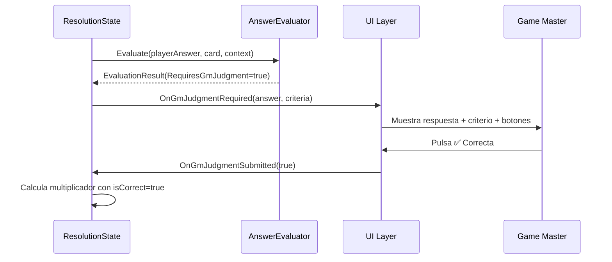
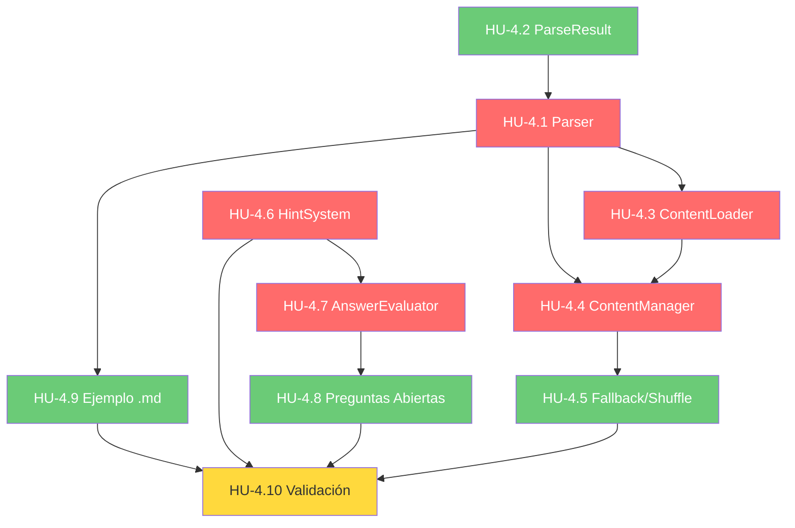

# Historias de Usuario — Épica 4: Parser de Contenido y Sistema de Cartas

> **Épica:** [epic4.md](../epics/epic4.md)  
> **Prioridad:** 🟡 Alta  
> **Sprint estimado:** 4–5  
> **Total HUs:** 10  
> **Dependencias externas:** Épica 1 (`IContentParser`, `CardData`, `GameEvents`), Épica 3 (`TurnContext`, `ResolutionState`)

---

## Índice de Historias

| ID | Título | Tipo | Prioridad | Estimación |
|---|---|---|---|---|
| HU-4.1 | MarkdownContentParser — Motor de parsing | Técnica | 🔴 Crítica | 8 SP |
| HU-4.2 | ParseResult y sistema de errores/warnings | Técnica | 🟡 Alta | 3 SP |
| HU-4.3 | ContentLoader — Carga de archivo en runtime | Funcional | 🔴 Crítica | 3 SP |
| HU-4.4 | ContentManager — Mazo de cartas por dificultad | Técnica | 🔴 Crítica | 5 SP |
| HU-4.5 | Fallback y barajado del mazo | Técnica | 🟡 Alta | 2 SP |
| HU-4.6 | HintSystem — Sistema de pistas consumibles | Funcional | 🔴 Crítica | 3 SP |
| HU-4.7 | AnswerEvaluator — Evaluación de respuestas | Técnica | 🔴 Crítica | 5 SP |
| HU-4.8 | Soporte de preguntas abiertas (evaluación del GM) | Funcional | 🟡 Alta | 3 SP |
| HU-4.9 | Archivo .md de ejemplo y documentación de formato | Documentación | 🟡 Alta | 2 SP |
| HU-4.10 | Validación e integración del sistema de contenido | QA | 🔴 Crítica | 5 SP |

**Total estimado:** ~39 Story Points

---

## Definición de Done (Global para Épica 4)

Todas las HU de esta épica deben cumplir:

- [ ] Código compila sin errores ni warnings en Unity (`Unity_ReadConsole`)
- [ ] Se respetan las convenciones del [Architect.md](../../.agents/Architect.md):
  - Campos privados con `_camelCase`
  - Métodos en PascalCase con verbos de acción
  - Separación estricta datos/lógica (ScriptableObjects ≠ MonoBehaviours)
- [ ] No existe ningún `GameObject.Find()`, `FindObjectOfType()`, ni Singleton
- [ ] Dependencias inyectadas via `[SerializeField]` o constructor
- [ ] Comunicación hacia UI exclusivamente via `GameEvents`
- [ ] Documentación XML (`<summary>`) en todos los miembros públicos
- [ ] Archivos ubicados en `Assets/Scripts/Data/` y `Assets/Scripts/Gameplay/`
- [ ] El parser soporta encoding UTF-8 con caracteres especiales (acentos, ñ, emojis, etc.)

---

## HU-4.1 — MarkdownContentParser: Motor de Parsing

### Descripción

**Como** GM,  
**quiero** que el juego procese automáticamente mi archivo `.md` extrayendo preguntas, pistas, opciones y respuestas,  
**para que** pueda crear contenido personalizado en un formato simple sin modificar código.

### Criterios de Aceptación

- [ ] Archivo: `Assets/Scripts/Data/MarkdownContentParser.cs`
- [ ] Namespace: `ChronosAndCards.Data`
- [ ] Implementa `IContentParser` (HU-1.3)
- [ ] **Clase pura** (no MonoBehaviour) para facilitar unit testing

#### Formato soportado (GDD §8)

```markdown
# [N] Texto de la pregunta
> Texto de la pista (opcional)
- Opción A (opcional, puede haber 2–6 opciones)
- Opción B
* Opción C  (acepta tanto - como *)
= Respuesta correcta o criterio de evaluación

## [GM] Texto del reto del GM
> Pista del reto (opcional)
- Opción A
= Respuesta correcta
```

#### Reglas de parsing línea por línea

- [ ] `# [N] texto` → Inicia una nueva pregunta con dificultad N (1–6) y texto de pregunta
  - Regex sugerido: `^#\s*\[(\d+)\]\s*(.+)$`
  - El texto de la pregunta es todo lo que sigue al `]`
- [ ] `## [GM] texto` → Pregunta especial del GM (`CardData.IsGmChallenge = true`)
  - Regex sugerido: `^##\s*\[GM\]\s*(.+)$`
  - Dificultad por defecto: 5 (o configurable)
- [ ] `> texto` → Pista asociada a la pregunta actual
  - Si aparecen múltiples `>`, se concatenan con `\n`
  - Si no aparece ningún `>`, `CardData.Hint = null`
- [ ] `- texto` o `* texto` → Opción múltiple
  - Se acumulan en `CardData.Options` en orden de aparición
  - Si no aparecen opciones, `CardData.Options = null` (pregunta abierta)
- [ ] `= texto` → Respuesta correcta o criterio de evaluación
  - **Obligatorio:** una pregunta sin `=` es inválida
  - El texto puede contener corchetes `[Criterio del GM: ...]` para preguntas abiertas

#### Implementación

```csharp
public class MarkdownContentParser : IContentParser
{
    /// <summary>Parsea contenido Markdown y retorna las cartas extraídas.</summary>
    public List<CardData> Parse(string markdownContent)
    {
        // 1. Dividir el contenido en líneas
        // 2. Iterar línea por línea con una FSM interna:
        //    - Estado IDLE: esperando #
        //    - Estado IN_QUESTION: acumulando >, -, *, =
        //    - Al encontrar un nuevo # o EOF: finalizar la pregunta actual
        // 3. Validar cada pregunta completada
        // 4. Retornar lista ordenada por DifficultyLevel
    }

    /// <summary>Parsea y retorna resultado detallado con errores y warnings.</summary>
    public ParseResult ParseWithDetails(string markdownContent);
}
```

- [ ] Líneas vacías se ignoran (no interrumpen la pregunta actual)
- [ ] Líneas que no matchean ningún patrón se registran como warning y se omiten
- [ ] Whitespace al inicio/final de cada campo se hace `Trim()`
- [ ] El parsing es **síncrono** para archivos normales (< 500 preguntas). Para archivos grandes, considerar `async Task<List<CardData>>` como overload futuro.
- [ ] Documentación XML completa

### Notas de Implementación

- GDD §8: _"El contenido no se compila con el juego. El agente debe implementar un Parser en C# que procese un archivo externo .md cargado por el GM."_
- **El parser es la pieza más frágil del sistema** (nota técnica de la épica). La robustez del parsing y los mensajes de error son más importantes que la velocidad.
- La FSM interna del parser (IDLE → IN_QUESTION → IDLE) es un patrón simple de acumulación que evita complejidad de un AST completo.
- El soporte de `## [GM]` es anticipación para la Épica 6 (Desafío del GM). Si no se define el delimitador en esta épica, las cartas GM se mezclarían con el mazo normal.

### Dependencias

- HU-1.3 (`IContentParser`)
- HU-1.5 (`CardData`)
- HU-4.2 (`ParseResult` para el overload detallado)

---

## HU-4.2 — ParseResult y Sistema de Errores/Warnings

### Descripción

**Como** GM,  
**quiero** recibir un reporte claro de errores y warnings tras cargar mi archivo de preguntas,  
**para que** pueda corregir problemas de formato sin adivinar qué salió mal.

### Criterios de Aceptación

- [ ] Archivo: `Assets/Scripts/Data/ParseResult.cs`
- [ ] Namespace: `ChronosAndCards.Data`
- [ ] Estructura de resultado:

```csharp
public class ParseResult
{
    /// <summary>Cartas parseadas exitosamente.</summary>
    public List<CardData> Cards { get; } = new();

    /// <summary>Errores fatales que impiden el uso de una pregunta.</summary>
    public List<ParseError> Errors { get; } = new();

    /// <summary>Warnings que no impiden el parsing pero indican problemas.</summary>
    public List<ParseWarning> Warnings { get; } = new();

    /// <summary>Indica si el resultado es utilizable (tiene al menos 1 carta válida).</summary>
    public bool IsUsable => Cards.Count > 0;

    /// <summary>Indica si no hubo errores ni warnings.</summary>
    public bool IsClean => Errors.Count == 0 && Warnings.Count == 0;

    /// <summary>Resumen legible del resultado.</summary>
    public string GetSummary();
}

public struct ParseError
{
    public int LineNumber;
    public string Message;
    public string SourceLine;
}

public struct ParseWarning
{
    public int LineNumber;
    public string Message;
    public string SourceLine;
}
```

- [ ] Tipos de **errores** (pregunta descartada):
  - Pregunta sin respuesta correcta (`=` faltante)
  - Nivel de dificultad fuera de rango (< 1 o > 6)
  - Nivel de dificultad no numérico
  - Header `#` malformado (no matchea `# [N] texto`)
- [ ] Tipos de **warnings** (pregunta se incluye pero con observaciones):
  - Línea no reconocida (no matchea ningún patrón)
  - Pregunta sin opciones múltiples (se trata como pregunta abierta — puede ser intencional)
  - Pregunta sin pista
  - Opción duplicada
  - Nivel de dificultad sin preguntas (ej. no hay preguntas de nivel 2)
- [ ] `GetSummary()` retorna un string con formato:
  ```
  Parsing completado: 42 cartas válidas, 3 errores, 2 warnings.
  Distribución: N1=8, N2=7, N3=9, N4=8, N5=6, N6=4, GM=0
  Errores:
    - Línea 24: Pregunta sin respuesta correcta (= faltante)
    - Línea 51: Nivel de dificultad '9' fuera de rango (1-6)
  Warnings:
    - Línea 33: Línea no reconocida: "esto no es una pregunta"
  ```
- [ ] Documentación XML en todos los miembros

### Notas de Implementación

- El `ParseResult` es el mecanismo principal de feedback para el GM. Mensajes vagos como "Error de parsing" son inaceptables — cada error debe indicar línea y razón.
- El método `GetSummary()` se mostrará en la UI durante el `SetupState` (Épica 7) para que el GM valide su contenido antes de iniciar.
- Considerar un "modo preview" en el futuro que muestre las cartas parseadas en una interfaz visual antes de confirmar.

### Dependencias

- HU-1.5 (`CardData`)

---

## HU-4.3 — ContentLoader: Carga de Archivo en Runtime

### Descripción

**Como** GM,  
**quiero** seleccionar un archivo `.md` desde mi sistema de archivos al configurar la partida,  
**para que** el contenido de preguntas sea totalmente externo al build del juego y pueda cambiarlo entre sesiones.

### Criterios de Aceptación

- [ ] Archivo: `Assets/Scripts/Data/ContentLoader.cs`
- [ ] Namespace: `ChronosAndCards.Data`
- [ ] Es un `MonoBehaviour` (necesita acceso a coroutines y filesystem)
- [ ] Dependencias vía `[SerializeField]`:
  ```csharp
  [SerializeField] private ContentManager _contentManager;
  ```

#### Flujo de carga

```csharp
public class ContentLoader : MonoBehaviour
{
    public event Action<int> OnContentLoaded;       // totalCards
    public event Action<ParseResult> OnParseCompleted; // resultado detallado

    private readonly MarkdownContentParser _parser = new();

    /// <summary>Carga un archivo .md desde una ruta del sistema de archivos.</summary>
    public void LoadFromPath(string filePath)
    {
        // 1. Validar que el archivo existe
        // 2. Leer como string UTF-8 (File.ReadAllText con Encoding.UTF8)
        // 3. Parsear con _parser.ParseWithDetails()
        // 4. Loguear el resumen del ParseResult
        // 5. Pasar las cartas válidas al ContentManager
        // 6. Emitir OnParseCompleted y OnContentLoaded
    }

    /// <summary>Carga contenido desde un string directamente (para testing o hardcoded).</summary>
    public void LoadFromString(string markdownContent);

    /// <summary>Abre un diálogo nativo de selección de archivo.</summary>
    public void OpenFileDialog();
}
```

- [ ] `LoadFromPath(string)`:
  - Validación: `File.Exists(filePath)` → si no existe, `Debug.LogError` y retorna
  - Lectura: `File.ReadAllText(filePath, System.Text.Encoding.UTF8)`
  - Parsing: `_parser.ParseWithDetails(content)`
  - Resultado: pasa las cartas a `_contentManager.LoadCards(parseResult.Cards)`
  - Evento: `OnContentLoaded?.Invoke(parseResult.Cards.Count)`
  - Log: `parseResult.GetSummary()`
- [ ] `LoadFromString(string)`:
  - Igual que `LoadFromPath` pero sin acceso a disco
  - Útil para testing y para contenido embebido/hardcoded
- [ ] `OpenFileDialog()`:
  - Implementación con `UnityEditor.EditorUtility.OpenFilePanel` (solo en Editor)
  - Para builds: usar una librería nativa de file dialog (ej. `StandaloneFileBrowser`) o una ruta configurable
  - Filtro de archivo: `*.md`
- [ ] Validación post-parsing:
  - Warning si faltan preguntas de algún nivel de dificultad (1–6)
  - Warning si el total de preguntas es muy bajo (< `BoardConfig.TargetQuestionCount`)
  - Error si `parseResult.Cards.Count == 0`
- [ ] Encoding UTF-8: soporta acentos (`á, é, í, ó, ú`), ñ, caracteres especiales

### Notas de Implementación

- GDD §8: _"El contenido no se compila con el juego."_ — El archivo `.md` es completamente externo.
- Para la primera iteración, `OpenFileDialog` puede ser simplificado a una ruta configurable en un campo serializado del Inspector. El diálogo nativo es un nice-to-have.
- `LoadFromString` es crítico para unit tests — permite testing del pipeline completo sin acceso a disco.

### Dependencias

- HU-4.1 (`MarkdownContentParser`)
- HU-4.2 (`ParseResult`)
- HU-4.4 (`ContentManager`)

---

## HU-4.4 — ContentManager: Mazo de Cartas por Dificultad

### Descripción

**Como** sistema,  
**necesito** un gestor que organice las cartas por nivel de dificultad y las sirva bajo demanda,  
**para que** el `CardDrawState` de la FSM pueda obtener la carta correcta según el valor del dado.

### Criterios de Aceptación

- [ ] Archivo: `Assets/Scripts/Data/ContentManager.cs`
- [ ] Namespace: `ChronosAndCards.Data`
- [ ] Es un `MonoBehaviour` (se monta en la escena, referenciado por `GameManager`)
- [ ] Estructura interna:

```csharp
public class ContentManager : MonoBehaviour
{
    private Dictionary<int, Queue<CardData>> _cardsByLevel;
    private Queue<CardData> _gmChallengeCards;

    public event Action<int> OnDeckLevelEmpty;  // nivel agotado

    /// <summary>Carga cartas en el mazo, separando normales y GM.</summary>
    public void LoadCards(List<CardData> cards, bool shuffle = true)
    {
        _cardsByLevel = new Dictionary<int, Queue<CardData>>();
        _gmChallengeCards = new Queue<CardData>();

        // Separar cartas normales de cartas GM
        var normalCards = cards.Where(c => !c.IsGmChallenge).ToList();
        var gmCards = cards.Where(c => c.IsGmChallenge).ToList();

        // Agrupar normales por nivel
        for (int level = 1; level <= 6; level++)
        {
            var levelCards = normalCards.Where(c => c.DifficultyLevel == level).ToList();
            if (shuffle) Shuffle(levelCards);
            _cardsByLevel[level] = new Queue<CardData>(levelCards);
        }

        // Cola de GM
        if (shuffle) Shuffle(gmCards);
        _gmChallengeCards = new Queue<CardData>(gmCards);
    }

    /// <summary>Extrae la siguiente carta del nivel solicitado.</summary>
    public CardData DrawCard(int difficultyLevel);

    /// <summary>Extrae una carta del pool del GM.</summary>
    public CardData DrawGmChallenge();

    /// <summary>Retorna cuántas cartas quedan en el nivel.</summary>
    public int GetRemainingCards(int level);

    /// <summary>Retorna true si hay al menos 1 carta en el nivel.</summary>
    public bool HasCardsAvailable(int level);

    /// <summary>Retorna el total de cartas en todos los niveles.</summary>
    public int TotalRemainingCards { get; }
}
```

- [ ] `DrawCard(int level)`:
  - Dequeue de `_cardsByLevel[level]`
  - Si la cola está vacía → invoca fallback (HU-4.5)
  - Si la cola se vacía tras el draw → emite `OnDeckLevelEmpty(level)`
  - Retorna la `CardData`
- [ ] `DrawGmChallenge()`:
  - Dequeue de `_gmChallengeCards`
  - Si está vacía → fallback a carta normal de nivel 4–6
  - Log si se usa fallback
- [ ] `GetRemainingCards(int level)` → retorna `_cardsByLevel[level].Count`
- [ ] `HasCardsAvailable(int level)` → `_cardsByLevel.ContainsKey(level) && _cardsByLevel[level].Count > 0`
- [ ] `TotalRemainingCards` → suma de todas las colas
- [ ] Documentación XML en todos los miembros

### Notas de Implementación

- La separación entre cartas normales y cartas GM (`IsGmChallenge`) fue preparada en `CardData` (HU-1.5) y en el parser (HU-4.1, formato `## [GM]`).
- Las colas (`Queue`) garantizan que cada carta se sirve una sola vez (sin repetición hasta que se recargue el contenido).
- El shuffle se implementa con Fisher-Yates (O(n), in-place).

### Dependencias

- HU-1.5 (`CardData`)
- HU-4.1 (cartas parseadas como input)

---

## HU-4.5 — Fallback y Barajado del Mazo

### Descripción

**Como** sistema,  
**necesito** que el `ContentManager` tenga un mecanismo de fallback cuando un nivel se agota y un algoritmo de barajado justo,  
**para que** el juego nunca se detenga por falta de cartas y la distribución sea impredecible.

### Criterios de Aceptación

#### Fallback cuando un nivel se agota

- [ ] Estrategia de fallback por proximidad:
  ```
  Si nivel N está vacío:
    1. Buscar nivel N-1 (más fácil)
    2. Buscar nivel N+1 (más difícil)
    3. Buscar N-2, N+2, N-3, N+3... (expandir en ambas direcciones)
    4. Si TODOS los niveles están vacíos → log error + retornar CardData default con mensaje "Sin preguntas disponibles"
  ```
- [ ] Implementación:
  ```csharp
  private CardData DrawWithFallback(int requestedLevel)
  {
      // Intentar nivel solicitado
      if (HasCardsAvailable(requestedLevel))
          return _cardsByLevel[requestedLevel].Dequeue();

      // Búsqueda por proximidad
      for (int offset = 1; offset <= 5; offset++)
      {
          int lower = requestedLevel - offset;
          int upper = requestedLevel + offset;

          if (lower >= 1 && HasCardsAvailable(lower))
          {
              Debug.LogWarning($"Fallback: nivel {requestedLevel} agotado, usando nivel {lower}");
              return _cardsByLevel[lower].Dequeue();
          }
          if (upper <= 6 && HasCardsAvailable(upper))
          {
              Debug.LogWarning($"Fallback: nivel {requestedLevel} agotado, usando nivel {upper}");
              return _cardsByLevel[upper].Dequeue();
          }
      }

      // Todos los niveles agotados
      Debug.LogError("ContentManager: todas las cartas se han agotado.");
      return CreateEmptyCard();
  }
  ```
- [ ] Log de warning cada vez que se usa fallback (indica al GM que su archivo tiene desequilibrio)

#### Algoritmo de barajado

- [ ] Fisher-Yates shuffle:
  ```csharp
  private void Shuffle<T>(List<T> list)
  {
      var rng = new System.Random();
      for (int i = list.Count - 1; i > 0; i--)
      {
          int j = rng.Next(0, i + 1);
          (list[i], list[j]) = (list[j], list[i]);
      }
  }
  ```
- [ ] Opción de seed fijo para reproducibilidad (útil para testing y debugging)
- [ ] El shuffle se aplica por nivel, no globalmente (mantiene la distribución de dificultades)

#### Carta vacía de emergencia

- [ ] `CreateEmptyCard()` retorna una `CardData` con:
  - `DifficultyLevel = 1`
  - `QuestionText = "No hay más preguntas disponibles. El GM debe cargar más contenido."`
  - `Options = null`
  - `CorrectAnswer = "N/A"`
  - `Hint = null`

### Notas de Implementación

- El fallback por proximidad prioriza niveles más fáciles (N-1 antes que N+1) por diseño: es preferible dar una pregunta más fácil que una más difícil si el nivel deseado se agotó.
- Fisher-Yates es O(n) y garantiza distribución uniforme. No usar `.OrderBy(_ => Random.Next())` que es O(n log n) y sesgado.

### Dependencias

- HU-4.4 (`ContentManager` estructura base)

---

## HU-4.6 — HintSystem: Sistema de Pistas Consumibles

### Descripción

**Como** jugador,  
**quiero** poder consumir una pista de mi inventario para revelar una ayuda sobre la pregunta actual, a cambio de reducir mi multiplicador de avance,  
**para que** tenga una herramienta táctica ante preguntas difíciles.

### Criterios de Aceptación

- [ ] Archivo: `Assets/Scripts/Gameplay/HintSystem.cs`
- [ ] Namespace: `ChronosAndCards.Gameplay`
- [ ] Clase pura (no MonoBehaviour):

```csharp
public class HintSystem
{
    /// <summary>
    /// Intenta usar una pista del jugador para la carta actual.
    /// Retorna true si la pista fue usada exitosamente.
    /// </summary>
    public bool TryUseHint(IPlayer player, CardData card, TurnContext turnContext)
    {
        // 1. Validar que el jugador tiene pistas (HintCount > 0)
        if (player.HintCount <= 0)
        {
            Debug.LogWarning($"HintSystem: {player.PlayerName} no tiene pistas disponibles.");
            return false;
        }

        // 2. Validar que la carta tiene pista
        if (string.IsNullOrEmpty(card.Hint))
        {
            Debug.LogWarning($"HintSystem: La carta actual no tiene pista disponible.");
            return false;
        }

        // 3. Validar que no se ha usado ya una pista en este turno
        if (turnContext.UsedHint)
        {
            Debug.LogWarning($"HintSystem: Ya se usó una pista en este turno.");
            return false;
        }

        // 4. Consumir la pista
        player.AddHint(-1);
        turnContext.UsedHint = true;

        // 5. Emitir eventos
        GameEvents.OnHintChanged?.Invoke(player, player.HintCount);
        GameEvents.OnHintRevealed?.Invoke(card.Hint);

        Debug.Log($"HintSystem: {player.PlayerName} usó una pista. Restantes: {player.HintCount}");
        return true;
    }

    /// <summary>Verifica si el jugador puede usar una pista.</summary>
    public bool CanUseHint(IPlayer player, CardData card, TurnContext turnContext)
    {
        return player.HintCount > 0
            && !string.IsNullOrEmpty(card.Hint)
            && !turnContext.UsedHint;
    }
}
```

- [ ] **Validaciones:**
  - `HintCount > 0` — el jugador debe tener pistas disponibles
  - `card.Hint != null` — la carta debe tener pista definida
  - `!turnContext.UsedHint` — solo se permite 1 pista por turno
- [ ] **Efectos:**
  - Decrementa `player.HintCount` en 1
  - Marca `turnContext.UsedHint = true`
  - Emite `GameEvents.OnHintRevealed(string)` con el texto de la pista (la UI lo muestra)
  - Emite `GameEvents.OnHintChanged(IPlayer, int)` con el nuevo count
- [ ] **Impacto en el multiplicador:**
  - Si `turnContext.UsedHint == true` Y `!turnContext.IsOverdriveActive`, el `PerformanceMultiplier` máximo posible es `WithHelp` (x0.5)
  - Si `turnContext.IsOverdriveActive == true`, la pista NO reduce el multiplicador (efecto del ítem Overdrive, Épica 5)
- [ ] `CanUseHint()` es un método de consulta para que la UI habilite/deshabilite el botón de pista
- [ ] Documentación XML completa

### Notas de Implementación

- GDD §3: _"Durante esta fase puede consumir recursos (Pistas)."_
- GDD §4: _"Multiplicador x0.5 (Respuesta con Ayuda): Responde correctamente habiendo consumido una pista o revelado las opciones (el resultado se redondea)."_
- Las pistas iniciales provienen de `BoardConfig.InitialHints` → se setean en el constructor de `Player` (HU-3.8).
- La integración con `Overdrive` (Épica 5) se prepara aquí con el flag `IsOverdriveActive` en `TurnContext` (ya definido en HU-3.7).

### Dependencias

- HU-1.2 (`IPlayer.HintCount`, `AddHint`)
- HU-1.5 (`CardData.Hint`)
- HU-1.9 (`GameEvents.OnHintRevealed`, `OnHintChanged`)
- HU-3.7 (`TurnContext.UsedHint`, `IsOverdriveActive`)

---

## HU-4.7 — AnswerEvaluator: Evaluación de Respuestas

### Descripción

**Como** sistema,  
**necesito** un evaluador que determine si la respuesta del jugador es correcta y calcule el multiplicador de desempeño resultante,  
**para que** la resolución del turno sea consistente, justa y configurada para los distintos tipos de pregunta.

### Criterios de Aceptación

- [ ] Archivo: `Assets/Scripts/Gameplay/AnswerEvaluator.cs`
- [ ] Namespace: `ChronosAndCards.Gameplay`
- [ ] Clase pura (no MonoBehaviour):

```csharp
public class AnswerEvaluator
{
    /// <summary>
    /// Evalúa la respuesta del jugador y retorna el resultado.
    /// </summary>
    public EvaluationResult Evaluate(
        string playerAnswer,
        CardData card,
        TurnContext turnContext)
    {
        bool isCorrect = IsAnswerCorrect(playerAnswer, card, turnContext);

        PerformanceMultiplier multiplier;
        if (!isCorrect)
        {
            multiplier = PerformanceMultiplier.Fail;
        }
        else if (turnContext.UsedHint || turnContext.RevealedOptions)
        {
            // Con ayuda, EXCEPTO si Overdrive está activo
            multiplier = turnContext.IsOverdriveActive
                ? PerformanceMultiplier.Perfect
                : PerformanceMultiplier.WithHelp;
        }
        else
        {
            multiplier = PerformanceMultiplier.Perfect;
        }

        return new EvaluationResult
        {
            IsCorrect = isCorrect,
            Multiplier = multiplier,
            RequiresGmJudgment = IsOpenEndedQuestion(card)
        };
    }

    /// <summary>Compara la respuesta del jugador con la respuesta correcta.</summary>
    private bool IsAnswerCorrect(string playerAnswer, CardData card, TurnContext context);

    /// <summary>Determina si es una pregunta abierta (sin opciones, evaluación del GM).</summary>
    private bool IsOpenEndedQuestion(CardData card);
}

public struct EvaluationResult
{
    public bool IsCorrect;
    public PerformanceMultiplier Multiplier;
    public bool RequiresGmJudgment;
}
```

#### Lógica de comparación

- [ ] **Con opciones seleccionadas** (el jugador eligió de la lista):
  - Comparación exacta: `playerAnswer.Trim() == card.CorrectAnswer.Trim()`
  - Case insensitive: `StringComparison.OrdinalIgnoreCase`
- [ ] **Respuesta abierta** (sin revelar opciones):
  - Misma comparación case insensitive + trim
  - Si la carta tiene opciones pero el jugador NO las reveló, se trata como respuesta abierta
- [ ] **Pregunta abierta pura** (sin opciones en `CardData`):
  - Si `CorrectAnswer` empieza con `[Criterio del GM:` → `RequiresGmJudgment = true`
  - El sistema NO evalúa automáticamente — espera input del GM (HU-4.8)
  - Si `CorrectAnswer` no tiene criterio → comparación estándar

#### Revelación de opciones

- [ ] Si el jugador llama `RevealOptions()`:
  - `turnContext.RevealedOptions = true`
  - Emite `GameEvents.OnOptionsRevealed?.Invoke(card.Options)` (evento nuevo)
  - A partir de aquí, el multiplicador máximo es `WithHelp` (x0.5)
- [ ] Si el jugador responde sin revelar opciones → mantiene `Perfect` (x1.0)
- [ ] El flag `RevealedOptions` se combina con `UsedHint` para el multiplicador: **el peor aplica**:
  - Usó pista Y reveló opciones → `WithHelp`
  - Usó pista O reveló opciones → `WithHelp`
  - Ninguno → `Perfect`
  - Incorrecta → `Fail`

### Notas de Implementación

- GDD §4: _"Multiplicador x1.0 (Respuesta Perfecta): Responde correctamente sin ver opciones múltiples ni pedir pistas."_
- La evaluación de preguntas abiertas con criterio del GM es un caso especial que se detalla en HU-4.8.
- `EvaluationResult` es un struct por valor — se crea y se consume, no se almacena ni se muta.

### Dependencias

- HU-1.4 (`PerformanceMultiplier`)
- HU-1.5 (`CardData`)
- HU-3.7 (`TurnContext`)

---

## HU-4.8 — Soporte de Preguntas Abiertas (Evaluación del GM)

### Descripción

**Como** GM,  
**quiero** poder evaluar manualmente las respuestas a preguntas abiertas que no tienen una respuesta única correcta,  
**para que** pueda calificar la profundidad y calidad de las respuestas de los jugadores.

### Criterios de Aceptación

- [ ] Detección automática de pregunta abierta:
  - `CardData.Options == null` O `CardData.Options.Count == 0`
  - `CardData.CorrectAnswer` empieza con `[Criterio del GM:`
- [ ] Cuando `EvaluationResult.RequiresGmJudgment == true`:
  1. El `ResolutionState` emite `GameEvents.OnGmJudgmentRequired(string playerAnswer, string criteria)`
  2. La UI muestra al GM:
     - La respuesta del jugador
     - El criterio de evaluación (texto del `=`)
     - Dos botones: ✅ Correcta / ❌ Incorrecta
  3. El GM pulsa uno de los botones
  4. La UI emite `GameEvents.OnGmJudgmentSubmitted(bool isCorrect)`
  5. El `ResolutionState` recibe el resultado y calcula el multiplicador normalmente

- [ ] Nuevos eventos necesarios:
  ```csharp
  public static Action<string, string> OnGmJudgmentRequired; // playerAnswer, criteria
  public static Action<bool> OnGmJudgmentSubmitted;           // isCorrect
  ```
- [ ] Timeout opcional: si el GM no responde en N segundos (configurable), la pregunta se marca como `Fail` por defecto (safety net)
- [ ] Log de debug: respuesta del jugador, criterio, decisión del GM

### Flujo de Resolución (Pregunta Abierta)



### Notas de Implementación

- GDD §8: _"`= : Define la respuesta correcta o el criterio de evaluación para el GM.`"_
- Notas Técnicas de la Épica: _"Preguntas abiertas (Nivel 6): La evaluación queda a criterio del GM."_
- El criterio `[Criterio del GM: ...]` es una convención de formato, no un delimitador obligatorio. Si el `=` no empieza con `[Criterio del GM:`, se intenta comparación automática primero.

### Dependencias

- HU-4.7 (`AnswerEvaluator`, `EvaluationResult`)
- HU-1.9 (`GameEvents` — extensión con eventos de juicio del GM)
- HU-3.9 (`ResolutionState` — modificación para soportar espera de GM)

---

## HU-4.9 — Archivo .md de Ejemplo y Documentación de Formato

### Descripción

**Como** GM,  
**quiero** tener un archivo de ejemplo completo y documentación clara del formato Markdown,  
**para que** pueda crear mi propio contenido sin ambigüedades y tenga una referencia de todas las opciones disponibles.

### Criterios de Aceptación

#### Archivo de ejemplo

- [ ] Archivo: `Assets/StreamingAssets/ExampleQuestions.md`
- [ ] Contiene al menos **18 preguntas** distribuidas uniformemente (3 por nivel):
  - 3 preguntas de Nivel 1 (Verdadero/Falso)
  - 3 preguntas de Nivel 2 (Opción múltiple simple, 3 opciones)
  - 3 preguntas de Nivel 3 (Opción múltiple, 4 opciones, con pista)
  - 3 preguntas de Nivel 4 (Opción múltiple difícil, 4 opciones, con pista)
  - 3 preguntas de Nivel 5 (Pregunta semi-abierta, opciones opcionales, con pista)
  - 3 preguntas de Nivel 6 (Pregunta abierta, sin opciones, criterio del GM)
- [ ] Incluye al menos **2 preguntas GM** (`## [GM]`)
- [ ] Temática coherente (ej. programación, ciencia, historia, cultura general)
- [ ] Demuestra todos los patrones soportados:
  - Pregunta con opciones (`-` y `*`)
  - Pregunta sin opciones (abierta)
  - Pregunta con pista (`>`)
  - Pregunta sin pista
  - Pregunta con criterio del GM (`= [Criterio del GM: ...]`)
  - Pregunta con múltiples líneas de pista
- [ ] Encoding UTF-8 con caracteres especiales (acentos, ñ)

#### Documentación de formato

- [ ] Archivo: `docs/content-format.md`
- [ ] Contenido:
  - Explicación del formato Markdown soportado
  - Tabla de delimitadores (`#`, `>`, `-`/`*`, `=`, `## [GM]`)
  - Ejemplos por tipo de pregunta
  - Lista de errores comunes y cómo evitarlos
  - Recomendaciones de distribución (cuántas preguntas por nivel)
  - Notas sobre encoding (UTF-8)

### Notas de Implementación

- `StreamingAssets/` es el directorio estándar de Unity para archivos que se incluyen sin procesar en el build. El GM puede acceder a este archivo como referencia.
- El archivo de ejemplo también se usa como fixture en los tests de la Épica (HU-4.10).

### Dependencias

- HU-4.1 (el formato debe coincidir con lo que el parser acepta)

---

## HU-4.10 — Validación e Integración del Sistema de Contenido

### Descripción

**Como** QA / desarrollador,  
**quiero** verificar que el parser, el mazo, el sistema de pistas y la evaluación de respuestas funcionan correctamente de extremo a extremo,  
**para que** el sistema de contenido sea robusto y confiable.

### Criterios de Aceptación

#### Tests Unitarios — Parser

- [ ] Archivo: `Assets/Tests/EditMode/Content/MarkdownContentParserTests.cs`
- [ ] Test: `Parse_ValidFile_ExtractsAllQuestions`
- [ ] Test: `Parse_QuestionWithAllFields_CorrectCardData`
- [ ] Test: `Parse_QuestionWithoutHint_HintIsNull`
- [ ] Test: `Parse_QuestionWithoutOptions_OptionsIsNull`
- [ ] Test: `Parse_QuestionWithMultipleHintLines_ConcatenatesHints`
- [ ] Test: `Parse_AsteriskAndDashOptions_BothWork`
- [ ] Test: `Parse_GmQuestion_IsGmChallengeTrue`
- [ ] Test: `Parse_InvalidLevel_ErrorLogged_QuestionSkipped`
- [ ] Test: `Parse_MissingAnswer_ErrorLogged_QuestionSkipped`
- [ ] Test: `Parse_MalformedHeader_ErrorLogged_LineSkipped`
- [ ] Test: `Parse_UnrecognizedLine_WarningLogged`
- [ ] Test: `Parse_EmptyFile_ReturnsEmptyList`
- [ ] Test: `Parse_Utf8WithSpecialCharacters_PreservesText`
- [ ] Test: `Parse_ReturnsCardsOrderedByLevel`

#### Tests Unitarios — ContentManager

- [ ] Archivo: `Assets/Tests/EditMode/Content/ContentManagerTests.cs`
- [ ] Test: `DrawCard_ReturnsCardOfRequestedLevel`
- [ ] Test: `DrawCard_ExhaustedLevel_FallsBackToClosestLevel`
- [ ] Test: `DrawCard_AllLevelsExhausted_ReturnsEmptyCard`
- [ ] Test: `DrawCard_EmitsOnDeckLevelEmpty_WhenLevelExhausted`
- [ ] Test: `DrawGmChallenge_ReturnsGmCard`
- [ ] Test: `DrawGmChallenge_NoGmCards_FallsBackToHighLevel`
- [ ] Test: `LoadCards_WithShuffle_DifferentOrderThanInput`
- [ ] Test: `GetRemainingCards_ReturnsCorrectCount`
- [ ] Test: `HasCardsAvailable_TrueWhenNotEmpty_FalseWhenEmpty`

#### Tests Unitarios — HintSystem

- [ ] Archivo: `Assets/Tests/EditMode/Content/HintSystemTests.cs`
- [ ] Test: `TryUseHint_HasHints_DecreasesCount`
- [ ] Test: `TryUseHint_NoHints_ReturnsFalse`
- [ ] Test: `TryUseHint_NoHintOnCard_ReturnsFalse`
- [ ] Test: `TryUseHint_AlreadyUsed_ReturnsFalse`
- [ ] Test: `TryUseHint_EmitsOnHintRevealed`
- [ ] Test: `TryUseHint_SetsUsedHintOnContext`
- [ ] Test: `CanUseHint_ReflectsCorrectState`

#### Tests Unitarios — AnswerEvaluator

- [ ] Archivo: `Assets/Tests/EditMode/Content/AnswerEvaluatorTests.cs`
- [ ] Test: `Evaluate_CorrectAnswer_PerfectMultiplier`
- [ ] Test: `Evaluate_CorrectWithHint_WithHelpMultiplier`
- [ ] Test: `Evaluate_CorrectWithRevealedOptions_WithHelpMultiplier`
- [ ] Test: `Evaluate_CorrectWithOverdrive_PerfectMultiplier`
- [ ] Test: `Evaluate_WrongAnswer_FailMultiplier`
- [ ] Test: `Evaluate_CaseInsensitive_StillCorrect`
- [ ] Test: `Evaluate_WhitespaceAroundAnswer_StillCorrect`
- [ ] Test: `Evaluate_OpenQuestion_RequiresGmJudgment`
- [ ] Test: `Evaluate_OpenQuestionWithGmCriteria_RequiresGmJudgment`

#### Test de Integración — Pipeline Completo

- [ ] Archivo: `Assets/Tests/EditMode/Content/ContentPipelineIntegrationTests.cs`
- [ ] Test: `FullPipeline_ParseLoadDrawEvaluate_WorksEndToEnd`
  - Input: string de Markdown
  - Parse → Load → Draw → Evaluate → verificar resultado
- [ ] Test: `FullPipeline_WithHintUsage_ReducesMultiplier`
- [ ] Test: `FullPipeline_WithFallback_DrawsFromClosestLevel`

#### Compilación

- [ ] Proyecto compila sin errores en Unity (`Unity_ReadConsole`)
- [ ] El archivo de ejemplo `ExampleQuestions.md` se parsea sin errores

### Dependencias

- Todas las HU previas (HU-4.1 a HU-4.9)

---

## Diagrama de Dependencias entre HUs



**Leyenda:** 🔴 Rojo = Crítica | 🟡 Amarillo = QA | 🟢 Verde = Alta

---

## Orden de Implementación Recomendado

```
 1. HU-4.2  (ParseResult)             ← Sin deps internas
 2. HU-4.1  (MarkdownContentParser)   ← Necesita HU-4.2
 3. HU-4.4  (ContentManager)          ← Necesita CardData de Épica 1
 4. HU-4.5  (Fallback/Shuffle)        ← Necesita HU-4.4
 5. HU-4.3  (ContentLoader)           ← Necesita HU-4.1, HU-4.4
 6. HU-4.6  (HintSystem)              ← Necesita IPlayer, TurnContext
 7. HU-4.7  (AnswerEvaluator)         ← Necesita HU-4.6
 8. HU-4.8  (Preguntas Abiertas)      ← Necesita HU-4.7
 9. HU-4.9  (Ejemplo .md + docs)      ← Necesita formato definido por HU-4.1
10. HU-4.10 (Validación)              ← Necesita todo
```

---

## Eventos Nuevos Requeridos (extensión de GameEvents)

Esta épica requiere añadir los siguientes eventos a `GameEvents.cs`:

```csharp
// === Contenido ===
/// <summary>Se dispara cuando el contenido ha sido cargado y está listo.</summary>
public static Action<int> OnContentLoaded; // totalCards

/// <summary>Se dispara cuando un nivel de dificultad se queda sin cartas.</summary>
public static Action<int> OnDeckLevelEmpty; // level

// === Opciones ===
/// <summary>Se dispara cuando el jugador revela las opciones múltiples.</summary>
public static Action<List<string>> OnOptionsRevealed;

// === Evaluación del GM ===
/// <summary>Se dispara cuando se requiere la evaluación manual del GM.</summary>
public static Action<string, string> OnGmJudgmentRequired; // playerAnswer, criteria

/// <summary>Se dispara cuando el GM envía su veredicto.</summary>
public static Action<bool> OnGmJudgmentSubmitted; // isCorrect
```

Todos deben incluirse en `ClearAll()` y documentarse con XML.
