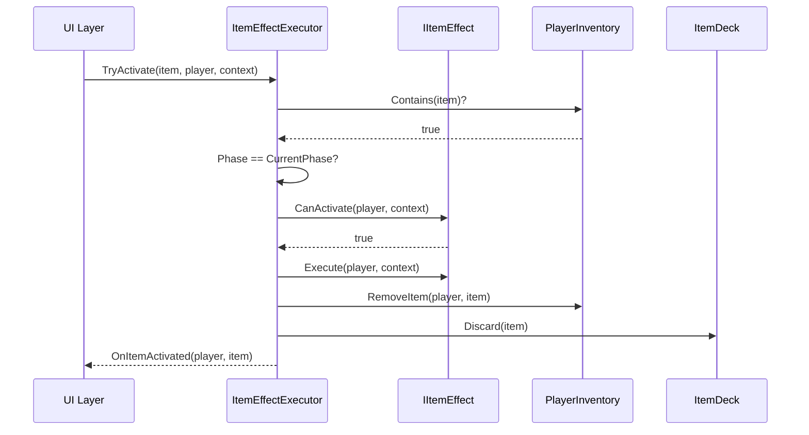
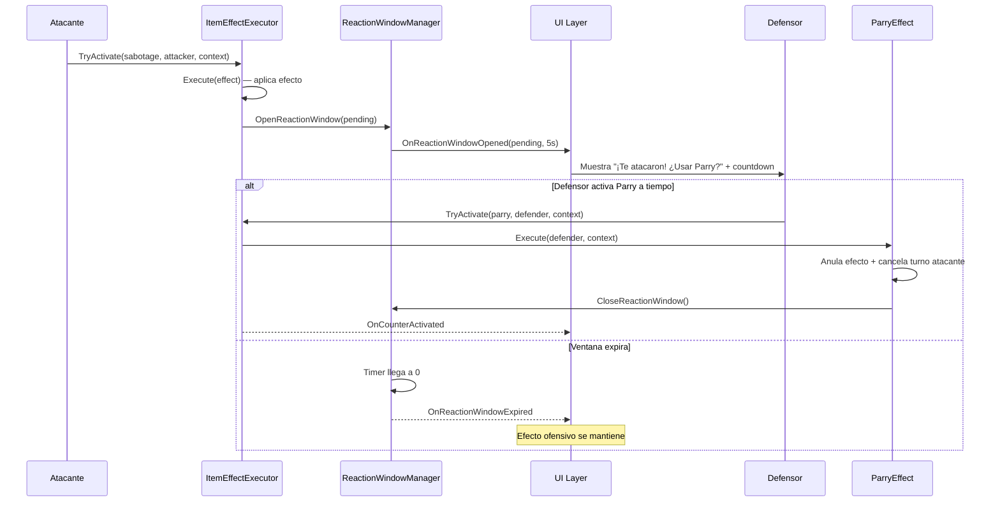
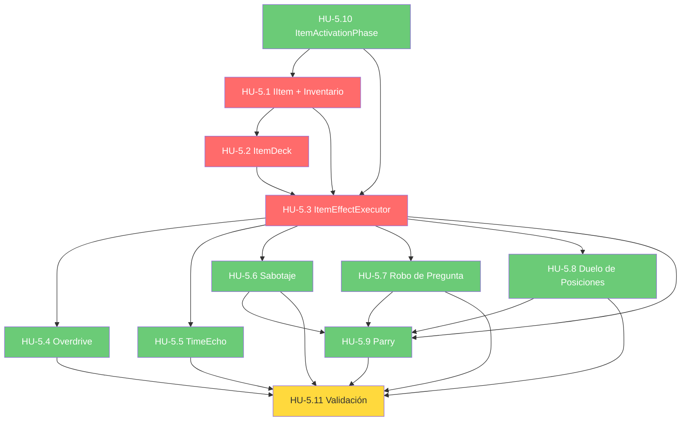

# Historias de Usuario — Épica 5: Sistema de Objetos / Consumibles

> **Épica:** [epic5.md](../epics/epic5.md)  
> **Prioridad:** 🟡 Alta  
> **Sprint estimado:** 5–7  
> **Total HUs:** 11  
> **Dependencias externas:** Épica 1 (`IItemEffect`, `ItemActivationPhase`, `GameContext`), Épica 3 (integración con turno, FSM)

---

## Índice de Historias

| ID | Título | Tipo | Prioridad | Estimación |
|---|---|---|---|---|
| HU-5.1 | IItem e Inventario del Jugador | Técnica | 🔴 Crítica | 5 SP |
| HU-5.2 | ItemDeck — Mazo de Objetos y Distribución | Técnica | 🔴 Crítica | 5 SP |
| HU-5.3 | ItemEffectExecutor — Orquestador de Efectos | Técnica | 🔴 Crítica | 8 SP |
| HU-5.4 | Avance sin Límites (Overdrive) — Buff | Funcional | 🟡 Alta | 3 SP |
| HU-5.5 | Eco del Tiempo (TimeEcho) — Buff | Funcional | 🟡 Alta | 5 SP |
| HU-5.6 | Sabotaje de Opciones — Debuff | Funcional | 🟡 Alta | 3 SP |
| HU-5.7 | Robo de Pregunta — Debuff | Funcional | 🟡 Alta | 5 SP |
| HU-5.8 | Duelo de Posiciones — Debuff | Funcional | 🟡 Alta | 8 SP |
| HU-5.9 | Reflejo Perfecto (Parry) — Counter | Funcional | 🟡 Alta | 5 SP |
| HU-5.10 | ItemActivationPhase y Enums de Soporte | Técnica | 🔴 Crítica | 2 SP |
| HU-5.11 | Validación e Integración del Sistema de Ítems | QA | 🔴 Crítica | 8 SP |

**Total estimado:** ~57 Story Points

---

## Definición de Done (Global para Épica 5)

Todas las HU de esta épica deben cumplir:

- [ ] Código compila sin errores ni warnings en Unity (`Unity_ReadConsole`)
- [ ] Se respetan las convenciones del [Architect.md](../../.agents/Architect.md):
  - Campos privados con `_camelCase`
  - Métodos en PascalCase con verbos de acción
  - Separación estricta datos/lógica (ScriptableObjects ≠ MonoBehaviours)
- [ ] No existe ningún `GameObject.Find()`, `FindObjectOfType()`, ni Singleton
- [ ] Dependencias inyectadas vía `[SerializeField]` o constructor
- [ ] Comunicación hacia UI exclusivamente vía `GameEvents`
- [ ] Documentación XML (`<summary>`) en todos los miembros públicos
- [ ] Archivos ubicados en `Assets/Scripts/Interfaces/`, `Assets/Scripts/Gameplay/Items/`, y `Assets/Scripts/Data/`
- [ ] Cada efecto implementa `IItemEffect` como clase Strategy independiente — **prohibido** switch/case monolítico o lógica de ítems en `PlayerController`
- [ ] Cada efecto valida `CanActivate()` antes de ejecutar

---

## HU-5.1 — IItem e Inventario del Jugador

### Descripción

**Como** jugador,  
**quiero** almacenar los objetos que obtengo en las casillas de tipo Item,  
**para que** pueda usarlos estratégicamente en el momento adecuado.

### Criterios de Aceptación

#### Interfaz IItem

- [ ] Archivo: `Assets/Scripts/Interfaces/IItem.cs`
- [ ] Namespace: `ChronosAndCards.Interfaces`
- [ ] Definición:

```csharp
/// <summary>
/// Representa un objeto consumible que el jugador puede almacenar y usar.
/// Cada ítem encapsula su efecto mediante el patrón Strategy.
/// </summary>
public interface IItem
{
    /// <summary>Nombre visible del ítem.</summary>
    string Name { get; }

    /// <summary>Descripción del efecto para la UI.</summary>
    string Description { get; }

    /// <summary>Fase de activación en la que este ítem puede ser usado.</summary>
    ItemActivationPhase Phase { get; }

    /// <summary>Icono para mostrar en el inventario del jugador.</summary>
    Sprite Icon { get; }

    /// <summary>Referencia al efecto que se ejecuta al usar este ítem.</summary>
    IItemEffect Effect { get; }
}
```

#### Enum InventoryAction

- [ ] Archivo: `Assets/Scripts/Interfaces/InventoryAction.cs`
- [ ] Namespace: `ChronosAndCards.Interfaces`

```csharp
/// <summary>Tipos de acción sobre el inventario de un jugador.</summary>
public enum InventoryAction
{
    /// <summary>Se añadió un ítem al inventario.</summary>
    Added,

    /// <summary>Se removió un ítem del inventario (consumido o robado).</summary>
    Removed
}
```

#### PlayerInventory (Componente de inventario)

- [ ] Archivo: `Assets/Scripts/Gameplay/Items/PlayerInventory.cs`
- [ ] Namespace: `ChronosAndCards.Gameplay.Items`
- [ ] Clase pura (no MonoBehaviour):

```csharp
/// <summary>
/// Gestiona el inventario de ítems de un jugador.
/// Encapsula la lista de ítems y emite eventos de cambio.
/// </summary>
public class PlayerInventory
{
    private readonly List<IItem> _items = new();
    private readonly int _maxCapacity;

    /// <summary>Evento disparado cuando el inventario cambia.</summary>
    public event Action<IPlayer, IItem, InventoryAction> OnInventoryChanged;

    /// <summary>Lista de lectura de los ítems actuales.</summary>
    public IReadOnlyList<IItem> Items => _items.AsReadOnly();

    /// <summary>Número de ítems en el inventario.</summary>
    public int Count => _items.Count;

    /// <summary>Indica si el inventario está lleno.</summary>
    public bool IsFull => _maxCapacity > 0 && _items.Count >= _maxCapacity;

    /// <param name="maxCapacity">Capacidad máxima. 0 o negativo = ilimitado.</param>
    public PlayerInventory(int maxCapacity = 0)
    {
        _maxCapacity = maxCapacity;
    }

    /// <summary>Añade un ítem al inventario si hay capacidad.</summary>
    /// <returns>true si se añadió, false si el inventario está lleno.</returns>
    public bool AddItem(IPlayer owner, IItem item)
    {
        if (IsFull)
        {
            Debug.LogWarning($"PlayerInventory: Inventario de {owner.PlayerName} lleno. No se puede añadir '{item.Name}'.");
            return false;
        }

        _items.Add(item);
        OnInventoryChanged?.Invoke(owner, item, InventoryAction.Added);
        Debug.Log($"PlayerInventory: {owner.PlayerName} obtuvo '{item.Name}'. Total: {_items.Count}");
        return true;
    }

    /// <summary>Remueve un ítem del inventario.</summary>
    /// <returns>true si se removió, false si no se encontró.</returns>
    public bool RemoveItem(IPlayer owner, IItem item)
    {
        if (!_items.Remove(item))
        {
            Debug.LogWarning($"PlayerInventory: '{item.Name}' no encontrado en inventario de {owner.PlayerName}.");
            return false;
        }

        OnInventoryChanged?.Invoke(owner, item, InventoryAction.Removed);
        Debug.Log($"PlayerInventory: {owner.PlayerName} perdió '{item.Name}'. Total: {_items.Count}");
        return true;
    }

    /// <summary>Verifica si el jugador tiene al menos un ítem de tipo T.</summary>
    public bool HasItem<T>() where T : IItem
    {
        return _items.Any(i => i is T);
    }

    /// <summary>Obtiene el primer ítem de tipo T, o null si no existe.</summary>
    public T GetItem<T>() where T : class, IItem
    {
        return _items.FirstOrDefault(i => i is T) as T;
    }

    /// <summary>Obtiene todos los ítems activables en la fase actual.</summary>
    public List<IItem> GetActivableItems(ItemActivationPhase currentPhase)
    {
        return _items.Where(i => i.Phase == currentPhase).ToList();
    }
}
```

#### Integración con IPlayer

- [ ] Añadir propiedad `PlayerInventory Inventory { get; }` a la implementación de `IPlayer`
- [ ] Métodos delegados en `IPlayer`: `AddItem(IItem)`, `RemoveItem(IItem)`, `HasItem<T>()`
- [ ] El `PlayerInventory` se instancia en el constructor de `Player` con capacidad configurable

### Notas de Implementación

- La capacidad del inventario es configurable (por defecto ilimitado) pero el sistema está preparado para un cap si se necesita en el futuro.
- `GetActivableItems()` es usado por la UI para mostrar solo los ítems que el jugador puede usar en la fase actual.
- Se usa `IReadOnlyList<IItem>` para evitar mutación externa del inventario.
- El evento `OnInventoryChanged` es local al `PlayerInventory`, pero la UI también puede suscribirse vía `GameEvents` si se necesita centralización (ver HU-5.3).

### Dependencias

- HU-1.2 (`IPlayer`)
- HU-5.10 (`ItemActivationPhase`)
- Épica 1 (`IItemEffect`)

---

## HU-5.2 — ItemDeck: Mazo de Objetos y Distribución

### Descripción

**Como** sistema,  
**necesito** un mazo de objetos que se baraje y se distribuya cuando un jugador cae en `ItemTile`,  
**para que** la obtención de objetos sea aleatoria y balanceada.

### Criterios de Aceptación

#### ItemDeckConfig (ScriptableObject)

- [ ] Archivo: `Assets/Scripts/Data/ItemDeckConfig.cs`
- [ ] Namespace: `ChronosAndCards.Data`

```csharp
/// <summary>
/// Configuración del mazo de objetos. Define qué ítems están disponibles,
/// cuántas copias de cada uno, y su peso de aparición.
/// </summary>
[CreateAssetMenu(fileName = "ItemDeckConfig", menuName = "ChronosAndCards/ItemDeckConfig")]
public class ItemDeckConfig : ScriptableObject
{
    /// <summary>Lista de entradas que definen el contenido del mazo.</summary>
    [SerializeField] private List<ItemDeckEntry> _entries = new();

    /// <summary>Si true, re-baraja el mazo cuando se agota. Si false, notifica agotamiento.</summary>
    [SerializeField] private bool _reshuffleOnEmpty = true;

    public IReadOnlyList<ItemDeckEntry> Entries => _entries.AsReadOnly();
    public bool ReshuffleOnEmpty => _reshuffleOnEmpty;
}

/// <summary>Entrada del mazo: define un tipo de ítem, sus copias y su peso.</summary>
[System.Serializable]
public class ItemDeckEntry
{
    /// <summary>Referencia al ScriptableObject del ítem.</summary>
    [SerializeField] private ItemDefinition _itemDefinition;

    /// <summary>Número de copias de este ítem en el mazo.</summary>
    [SerializeField, Range(1, 10)] private int _copies = 1;

    /// <summary>Peso de aparición relativo (mayor peso = más probable).</summary>
    [SerializeField, Range(0.1f, 10f)] private float _weight = 1f;

    public ItemDefinition ItemDefinition => _itemDefinition;
    public int Copies => _copies;
    public float Weight => _weight;
}
```

#### ItemDefinition (ScriptableObject base para ítems)

- [ ] Archivo: `Assets/Scripts/Data/ItemDefinition.cs`
- [ ] Namespace: `ChronosAndCards.Data`

```csharp
/// <summary>
/// Definición base de un ítem consumible.
/// Cada ScriptableObject representa un tipo de ítem con su efecto asociado.
/// </summary>
[CreateAssetMenu(fileName = "NewItem", menuName = "ChronosAndCards/ItemDefinition")]
public class ItemDefinition : ScriptableObject, IItem
{
    [SerializeField] private string _name;
    [SerializeField, TextArea(2, 4)] private string _description;
    [SerializeField] private ItemActivationPhase _phase;
    [SerializeField] private Sprite _icon;

    public string Name => _name;
    public string Description => _description;
    public ItemActivationPhase Phase => _phase;
    public Sprite Icon => _icon;

    /// <summary>
    /// Referencia al efecto. Se asigna desde la factory o via SerializeReference.
    /// </summary>
    public virtual IItemEffect Effect { get; protected set; }
}
```

#### ItemDeck (Mazo de objetos)

- [ ] Archivo: `Assets/Scripts/Gameplay/Items/ItemDeck.cs`
- [ ] Namespace: `ChronosAndCards.Gameplay.Items`

```csharp
/// <summary>
/// Mazo de objetos consumibles. Gestiona la distribución aleatoria de ítems
/// cuando un jugador cae en una casilla de tipo Item.
/// </summary>
public class ItemDeck
{
    private readonly ItemDeckConfig _config;
    private List<IItem> _drawPile = new();
    private readonly List<IItem> _discardPile = new();

    /// <summary>Se dispara cuando el mazo se agota.</summary>
    public event Action OnDeckEmpty;

    /// <summary>Se dispara cuando el mazo se re-baraja.</summary>
    public event Action<int> OnDeckReshuffled; // totalCards

    /// <summary>Cartas restantes en el mazo.</summary>
    public int RemainingCards => _drawPile.Count;

    public ItemDeck(ItemDeckConfig config)
    {
        _config = config;
        InitializeDeck();
    }

    /// <summary>Inicializa el mazo con las entradas de la configuración.</summary>
    private void InitializeDeck()
    {
        _drawPile.Clear();
        _discardPile.Clear();

        foreach (var entry in _config.Entries)
        {
            for (int i = 0; i < entry.Copies; i++)
            {
                // Instanciar una copia del ítem desde la definición
                _drawPile.Add(entry.ItemDefinition);
            }
        }

        Shuffle(_drawPile);
        Debug.Log($"ItemDeck: Mazo inicializado con {_drawPile.Count} ítems.");
    }

    /// <summary>
    /// Extrae un ítem aleatorio del mazo.
    /// Si el mazo está vacío y reshuffleOnEmpty está activo, re-baraja.
    /// </summary>
    /// <returns>El ítem extraído, o null si el mazo está agotado y no se re-baraja.</returns>
    public IItem DrawItem()
    {
        if (_drawPile.Count == 0)
        {
            if (_config.ReshuffleOnEmpty && _discardPile.Count > 0)
            {
                ReshuffleDeck();
            }
            else
            {
                Debug.LogWarning("ItemDeck: El mazo de objetos está agotado.");
                OnDeckEmpty?.Invoke();
                return null;
            }
        }

        var item = _drawPile[0];
        _drawPile.RemoveAt(0);

        Debug.Log($"ItemDeck: Se extrajo '{item.Name}'. Restantes: {_drawPile.Count}");
        return item;
    }

    /// <summary>Re-baraja la pila de descarte y la convierte en el nuevo mazo.</summary>
    private void ReshuffleDeck()
    {
        _drawPile = new List<IItem>(_discardPile);
        _discardPile.Clear();
        Shuffle(_drawPile);
        OnDeckReshuffled?.Invoke(_drawPile.Count);
        Debug.Log($"ItemDeck: Mazo re-barajado con {_drawPile.Count} ítems.");
    }

    /// <summary>Envía un ítem usado a la pila de descarte.</summary>
    public void Discard(IItem item)
    {
        _discardPile.Add(item);
    }

    /// <summary>Fisher-Yates shuffle O(n).</summary>
    private void Shuffle<T>(List<T> list)
    {
        var rng = new System.Random();
        for (int i = list.Count - 1; i > 0; i--)
        {
            int j = rng.Next(0, i + 1);
            (list[i], list[j]) = (list[j], list[i]);
        }
    }
}
```

#### Integración con ItemTile

- [ ] La `ItemTile` (definida en Épica 2) invoca `ItemDeck.DrawItem()` al ser activada
- [ ] El ítem extraído se añade al inventario del jugador: `player.Inventory.AddItem(player, drawnItem)`
- [ ] Si `DrawItem()` retorna `null`, se notifica al jugador que el mazo está vacío
- [ ] Evento: `GameEvents.OnItemObtained?.Invoke(player, item)` para que la UI muestre feedback

### Notas de Implementación

- El mazo usa un modelo de draw pile + discard pile (similar a un mazo de cartas real). Los ítems usados van al descarte y solo vuelven al mazo si se re-baraja.
- `ItemDeckConfig` es un ScriptableObject para que el diseñador pueda ajustar la composición del mazo desde el Inspector sin tocar código.
- Los pesos de aparición (`Weight`) están preparados pero la implementación inicial usa distribución uniforme por copias. La ponderación por peso se puede activar en una iteración futura.

### Dependencias

- HU-5.1 (`IItem`, `PlayerInventory`)
- HU-5.10 (`ItemActivationPhase`)
- Épica 2 (`ItemTile`)

---

## HU-5.3 — ItemEffectExecutor: Orquestador de Efectos

### Descripción

**Como** sistema,  
**necesito** un componente que gestione la activación de objetos validando fase, condiciones y resolución,  
**para que** los efectos se apliquen de forma consistente y controlada.

### Criterios de Aceptación

- [ ] Archivo: `Assets/Scripts/Gameplay/Items/ItemEffectExecutor.cs`
- [ ] Namespace: `ChronosAndCards.Gameplay.Items`
- [ ] Clase pura (no MonoBehaviour) para facilitar testing:

```csharp
/// <summary>
/// Orquestador central para la activación de ítems.
/// Valida la fase de activación, ejecuta el efecto, y gestiona
/// el ciclo de vida del ítem (consumo tras uso exitoso).
/// </summary>
public class ItemEffectExecutor
{
    private readonly ItemDeck _itemDeck;

    /// <summary>Se dispara cuando un ítem se activa exitosamente.</summary>
    public event Action<IPlayer, IItem> OnItemActivated;

    /// <summary>Se dispara cuando un ítem es bloqueado (CanActivate = false).</summary>
    public event Action<IPlayer, IItem, string> OnItemBlocked; // reason

    /// <summary>Se dispara cuando un ítem ofensivo requiere ventana de reacción.</summary>
    public event Action<IPlayer, IPlayer, IItem> OnOffensiveItemUsed; // attacker, target, item

    public ItemEffectExecutor(ItemDeck itemDeck)
    {
        _itemDeck = itemDeck;
    }

    /// <summary>
    /// Intenta activar un ítem del jugador.
    /// Valida fase, condiciones y ejecuta el efecto si es posible.
    /// </summary>
    /// <returns>true si el ítem se activó exitosamente.</returns>
    public bool TryActivate(IItem item, IPlayer owner, GameContext context)
    {
        // 1. Validar que el ítem pertenece al jugador
        if (!owner.Inventory.Items.Contains(item))
        {
            Debug.LogError($"ItemEffectExecutor: {owner.PlayerName} no posee '{item.Name}'.");
            OnItemBlocked?.Invoke(owner, item, "Ítem no encontrado en inventario");
            return false;
        }

        // 2. Validar fase de activación
        if (item.Phase != context.CurrentPhase)
        {
            Debug.LogWarning($"ItemEffectExecutor: '{item.Name}' requiere fase {item.Phase}, fase actual: {context.CurrentPhase}.");
            OnItemBlocked?.Invoke(owner, item, $"Fase incorrecta. Requiere: {item.Phase}");
            return false;
        }

        // 3. Validar condiciones del efecto
        if (!item.Effect.CanActivate(owner, context))
        {
            Debug.LogWarning($"ItemEffectExecutor: '{item.Name}' no cumple condiciones de activación.");
            OnItemBlocked?.Invoke(owner, item, "Condiciones de activación no cumplidas");
            return false;
        }

        // 4. Ejecutar el efecto
        item.Effect.Execute(owner, context);

        // 5. Consumir el ítem del inventario
        owner.Inventory.RemoveItem(owner, item);

        // 6. Enviar al descarte del mazo
        _itemDeck.Discard(item);

        // 7. Emitir eventos
        OnItemActivated?.Invoke(owner, item);
        GameEvents.OnItemUsed?.Invoke(owner, item);

        Debug.Log($"ItemEffectExecutor: {owner.PlayerName} usó '{item.Name}' exitosamente.");
        return true;
    }

    /// <summary>
    /// Verifica si un ítem puede ser activado sin ejecutarlo.
    /// Útil para la UI (habilitar/deshabilitar botones de ítems).
    /// </summary>
    public bool CanActivate(IItem item, IPlayer owner, GameContext context)
    {
        return owner.Inventory.Items.Contains(item)
            && item.Phase == context.CurrentPhase
            && item.Effect.CanActivate(owner, context);
    }

    /// <summary>
    /// Retorna todos los ítems del jugador que pueden ser activados en la fase actual.
    /// </summary>
    public List<IItem> GetActivableItems(IPlayer player, GameContext context)
    {
        return player.Inventory.Items
            .Where(item => CanActivate(item, player, context))
            .ToList();
    }
}
```

#### Flujo de activación



#### Eventos nuevos requeridos

- [ ] `GameEvents.OnItemUsed(IPlayer, IItem)` — notifica a la UI que un ítem fue consumido
- [ ] `GameEvents.OnItemObtained(IPlayer, IItem)` — notifica a la UI que un ítem fue añadido
- [ ] `GameEvents.OnItemBlocked(IPlayer, IItem, string)` — notifica bloqueo con razón

### Notas de Implementación

- El `ItemEffectExecutor` es el **punto único** de activación de ítems. Ningún otro componente debe invocar `IItemEffect.Execute()` directamente.
- El patrón Strategy se manifiesta aquí: el Executor no sabe qué hace cada efecto — solo valida y delega.
- La ventana de reacción para counters (Parry) se gestiona emitiendo `OnOffensiveItemUsed` cuando el efecto es ofensivo. El sistema de reacción (HU-5.9) escucha este evento.

### Dependencias

- HU-5.1 (`PlayerInventory`, `IItem`)
- HU-5.2 (`ItemDeck`)
- HU-5.10 (`ItemActivationPhase`)
- Épica 1 (`IItemEffect`, `GameContext`)
- HU-1.9 (`GameEvents`)

---

## HU-5.4 — Avance sin Límites (Overdrive) — Buff

### Descripción

**Como** jugador,  
**quiero** usar una pista sin perder mi multiplicador de desempeño,  
**para que** pueda obtener ayuda y avanzar al máximo.

### Criterios de Aceptación

- [ ] Archivo: `Assets/Scripts/Gameplay/Items/Effects/OverdriveEffect.cs`
- [ ] Namespace: `ChronosAndCards.Gameplay.Items.Effects`

```csharp
/// <summary>
/// Efecto Buff: "Avance sin Límites (Overdrive)".
/// Permite al jugador usar una pista sin reducir su multiplicador de desempeño.
/// Activa el flag IsOverdriveActive en el TurnContext del turno actual.
/// </summary>
public class OverdriveEffect : IItemEffect
{
    /// <summary>Solo puede activarse antes de responder la pregunta.</summary>
    public ItemActivationPhase ActivationPhase => ItemActivationPhase.BeforeAnswer;

    /// <summary>
    /// Condiciones: el jugador tiene al menos 1 pista disponible
    /// y está en la fase de respuesta de su turno.
    /// </summary>
    public bool CanActivate(IPlayer owner, GameContext context)
    {
        return owner.HintCount > 0
            && context.CurrentTurnContext != null
            && !context.CurrentTurnContext.IsOverdriveActive;
    }

    /// <summary>
    /// Activa el flag de Overdrive en el contexto del turno.
    /// El HintSystem verificará este flag para no reducir el multiplicador.
    /// </summary>
    public void Execute(IPlayer owner, GameContext context)
    {
        context.CurrentTurnContext.IsOverdriveActive = true;

        Debug.Log($"OverdriveEffect: {owner.PlayerName} activó Overdrive. " +
                  "Las pistas no reducirán el multiplicador este turno.");

        GameEvents.OnBuffApplied?.Invoke(owner, "Overdrive");
    }
}
```

- [ ] `ActivationPhase`: `BeforeAnswer`
- [ ] `CanActivate`: el jugador tiene `HintCount > 0` Y `IsOverdriveActive == false` (no se puede usar doble)
- [ ] Efecto: activa `TurnContext.IsOverdriveActive = true`
- [ ] El `HintSystem` (HU-4.6) ya verifica `IsOverdriveActive` para no reducir el multiplicador
- [ ] Se consume al usarse (gestionado por `ItemEffectExecutor`)
- [ ] Documentación XML completa

### Notas de Implementación

- GDD: _"Usa una pista sin perder tu multiplicador de desempeño."_
- La integración con `HintSystem` ya está preparada en HU-4.6: `if (turnContext.UsedHint && !turnContext.IsOverdriveActive)` → multiplicador `WithHelp`.
- El Overdrive solo aplica al turno actual. El flag se resetea automáticamente cuando se crea un nuevo `TurnContext`.

### Dependencias

- HU-5.10 (`ItemActivationPhase.BeforeAnswer`)
- HU-4.6 (`HintSystem`, `TurnContext.IsOverdriveActive`)
- Épica 1 (`IItemEffect`, `GameContext`)

---

## HU-5.5 — Eco del Tiempo (TimeEcho) — Buff

### Descripción

**Como** jugador,  
**quiero** una segunda oportunidad tras fallar, aunque con mayor riesgo,  
**para que** un fallo no sea siempre el fin de mi turno.

### Criterios de Aceptación

- [ ] Archivo: `Assets/Scripts/Gameplay/Items/Effects/TimeEchoEffect.cs`
- [ ] Namespace: `ChronosAndCards.Gameplay.Items.Effects`

```csharp
/// <summary>
/// Efecto Buff: "Eco del Tiempo".
/// Tras fallar, re-lanza el dado y extrae una nueva carta.
/// El jugador no puede usar pistas ni revelar opciones (forzado a x1.0 o x0.0).
/// Interrumpe la FSM: transiciona de ResolutionState (post-fallo) de vuelta a DiceRollState.
/// </summary>
public class TimeEchoEffect : IItemEffect
{
    /// <summary>Solo puede activarse tras un fallo en la respuesta.</summary>
    public ItemActivationPhase ActivationPhase => ItemActivationPhase.AfterFail;

    /// <summary>
    /// Condiciones: el jugador acaba de fallar en este turno.
    /// </summary>
    public bool CanActivate(IPlayer owner, GameContext context)
    {
        return context.CurrentTurnContext != null
            && context.CurrentTurnContext.FailedThisTurn
            && !context.CurrentTurnContext.UsedTimeEcho; // Solo 1 eco por turno
    }

    /// <summary>
    /// Ejecuta el Eco del Tiempo:
    /// 1. Marca el turno como "eco activo" (deshabilita pistas y revelación de opciones)
    /// 2. Solicita transición de la FSM a DiceRollState
    /// </summary>
    public void Execute(IPlayer owner, GameContext context)
    {
        var turnContext = context.CurrentTurnContext;

        // Marcar restricciones del eco
        turnContext.UsedTimeEcho = true;
        turnContext.HintsBlocked = true;
        turnContext.OptionsBlocked = true;

        // Solicitar transición de la FSM
        context.RequestStateTransition(GameStateType.DiceRoll);

        Debug.Log($"TimeEchoEffect: {owner.PlayerName} activó Eco del Tiempo. " +
                  "Re-lanzando dado sin pistas ni opciones.");

        GameEvents.OnBuffApplied?.Invoke(owner, "Eco del Tiempo");
    }
}
```

- [ ] `ActivationPhase`: `AfterFail`
- [ ] `CanActivate`: `FailedThisTurn == true` Y `UsedTimeEcho == false`
- [ ] Efecto:
  - Marca `HintsBlocked = true` → el `HintSystem` no permite pistas
  - Marca `OptionsBlocked = true` → la UI no muestra botón de revelar opciones
  - Solicita transición de FSM a `DiceRollState` (interrumpe el flujo normal)
- [ ] Se consume al usarse
- [ ] Solo se permite 1 Eco del Tiempo por turno

#### Nuevas propiedades en TurnContext

- [ ] `bool UsedTimeEcho` — flag para evitar doble eco
- [ ] `bool HintsBlocked` — bloquea uso de pistas durante el eco
- [ ] `bool OptionsBlocked` — bloquea revelación de opciones durante el eco

#### Interrupción de FSM

- [ ] La FSM debe soportar `RequestStateTransition()` para permitir que un efecto fuerce una transición
- [ ] De `ResolutionState` (post-fallo) → `DiceRollState` (nuevo lanzamiento)
- [ ] El `HintSystem` debe verificar `!turnContext.HintsBlocked` antes de permitir pistas
- [ ] La UI debe verificar `!turnContext.OptionsBlocked` antes de mostrar el botón de opciones

### Notas de Implementación

- GDD: _"Re-lanza el dado y extrae una nueva carta, pero el jugador no puede usar pistas ni revelar opciones (forzado a multiplicador x1.0 o x0.0)."_
- Esta es la primera HU que **interrumpe la FSM**. Requiere que el `GameManager` exponga un mecanismo de transición forzada.
- El "mayor riesgo" se manifiesta en que el jugador está forzado a responder sin ayuda: o acierta (x1.0) o falla (x0.0). No hay término medio.
- Si la FSM usa un stack de estados, el Eco del Tiempo hace un "push" de un nuevo ciclo. Si no, hace una transición directa.

### Dependencias

- HU-5.10 (`ItemActivationPhase.AfterFail`)
- HU-3.7 (`TurnContext` — extensión con nuevos flags)
- HU-3.9 (`ResolutionState` — punto de activación)
- Épica 1 (`IItemEffect`, `GameContext`)
- Épica 3 (FSM — soporte de transición forzada)

---

## HU-5.6 — Sabotaje de Opciones — Debuff

### Descripción

**Como** jugador,  
**quiero** dificultar la pregunta de un rival ocultando sus opciones múltiples,  
**para que** pueda interferir tácticamente en su desempeño.

### Criterios de Aceptación

- [ ] Archivo: `Assets/Scripts/Gameplay/Items/Effects/OptionSabotageEffect.cs`
- [ ] Namespace: `ChronosAndCards.Gameplay.Items.Effects`

```csharp
/// <summary>
/// Efecto Debuff: "Sabotaje de Opciones".
/// Oculta las opciones múltiples de la pregunta del rival,
/// forzándolo a responder como si fuera una pregunta abierta de Nivel 6.
/// No modifica la pregunta real ni la respuesta correcta, solo la presentación.
/// </summary>
public class OptionSabotageEffect : IItemEffect
{
    /// <summary>Se activa durante el turno de un rival (tras su dado).</summary>
    public ItemActivationPhase ActivationPhase => ItemActivationPhase.RivalTurn;

    /// <summary>
    /// Condiciones: es el turno de otro jugador y ese jugador acaba de tirar el dado.
    /// </summary>
    public bool CanActivate(IPlayer owner, GameContext context)
    {
        return context.ActivePlayer != null
            && context.ActivePlayer != owner
            && context.CurrentTurnContext != null
            && context.CurrentTurnContext.DiceRolled
            && !context.CurrentTurnContext.IsSabotaged; // No se puede sabotear 2 veces
    }

    /// <summary>
    /// Marca la pregunta del turno activo como "saboteada":
    /// la UI ocultará las opciones múltiples.
    /// </summary>
    public void Execute(IPlayer owner, GameContext context)
    {
        context.CurrentTurnContext.IsSabotaged = true;
        context.CurrentTurnContext.SabotagedBy = owner;

        Debug.Log($"OptionSabotageEffect: {owner.PlayerName} saboteó las opciones de " +
                  $"{context.ActivePlayer.PlayerName}.");

        GameEvents.OnDebuffApplied?.Invoke(owner, context.ActivePlayer, "Sabotaje de Opciones");
    }
}
```

- [ ] `ActivationPhase`: `RivalTurn`
- [ ] `CanActivate`: turno de otro jugador + dado lanzado + no saboteado previamente
- [ ] Efecto: `IsSabotaged = true` en el `TurnContext` del rival
- [ ] La UI verifica `IsSabotaged` para ocultar las opciones (mostrar solo campo de texto libre)
- [ ] No modifica la `CardData` — la respuesta correcta sigue siendo la misma
- [ ] Se consume al usarse
- [ ] Es un efecto **ofensivo** — puede ser anulado por Parry (HU-5.9)

#### Nuevas propiedades en TurnContext

- [ ] `bool IsSabotaged` — indica que las opciones están ocultas
- [ ] `IPlayer SabotagedBy` — referencia al atacante (para Parry)

### Notas de Implementación

- GDD: _"La pregunta del rival se presenta como pregunta abierta de Nivel 6 (se ocultan las opciones)."_
- El sabotaje es puramente visual — no cambia la `CardData`, solo lo que la UI muestra.
- La evaluación de la respuesta sigue siendo contra `CardData.CorrectAnswer`, que no cambia.
- Si el jugador saboteado tenía una pregunta sin opciones (ya era abierta), el sabotaje no tiene efecto visible pero sí se consume.

### Dependencias

- HU-5.10 (`ItemActivationPhase.RivalTurn`)
- HU-3.7 (`TurnContext` — extensión)
- Épica 1 (`IItemEffect`, `GameContext`)

---

## HU-5.7 — Robo de Pregunta — Debuff

### Descripción

**Como** jugador,  
**quiero** intentar responder la pregunta que un rival falló para robarle el avance,  
**para que** los fallos ajenos sean mi oportunidad.

### Criterios de Aceptación

- [ ] Archivo: `Assets/Scripts/Gameplay/Items/Effects/QuestionTheftEffect.cs`
- [ ] Namespace: `ChronosAndCards.Gameplay.Items.Effects`

```csharp
/// <summary>
/// Efecto Debuff: "Robo de Pregunta".
/// Cuando un rival falla, el atacante intenta responder la misma pregunta.
/// Si acierta: avanza las casillas que el rival habría ganado.
/// Si falla: pierde 1 pista.
/// Crea un sub-turno de resolución para el atacante.
/// </summary>
public class QuestionTheftEffect : IItemEffect
{
    /// <summary>Se activa durante el turno de un rival (tras su fallo).</summary>
    public ItemActivationPhase ActivationPhase => ItemActivationPhase.RivalTurn;

    /// <summary>
    /// Condiciones: el rival acaba de fallar Y el atacante tiene al menos 1 pista (riesgo).
    /// </summary>
    public bool CanActivate(IPlayer owner, GameContext context)
    {
        return context.ActivePlayer != null
            && context.ActivePlayer != owner
            && context.CurrentTurnContext != null
            && context.CurrentTurnContext.FailedThisTurn
            && owner.HintCount > 0; // Necesita al menos 1 pista como riesgo
    }

    /// <summary>
    /// Ejecuta el robo de pregunta:
    /// 1. Crea un sub-turno para el atacante con la misma CardData
    /// 2. Si el atacante acierta: avanza las casillas del dado original del rival
    /// 3. Si el atacante falla: pierde 1 pista
    /// </summary>
    public void Execute(IPlayer owner, GameContext context)
    {
        var stolenCard = context.CurrentTurnContext.CurrentCard;
        var stolenDiceValue = context.CurrentTurnContext.DiceValue;
        var targetPlayer = context.ActivePlayer;

        // Crear sub-turno de resolución
        var theftContext = new TheftSubTurnContext
        {
            Attacker = owner,
            Target = targetPlayer,
            StolenCard = stolenCard,
            StolenDiceValue = stolenDiceValue
        };

        // Solicitar transición a un estado de sub-turno
        context.PushSubTurn(theftContext);

        Debug.Log($"QuestionTheftEffect: {owner.PlayerName} intenta robar la pregunta de " +
                  $"{targetPlayer.PlayerName}. Dado original: {stolenDiceValue}.");

        GameEvents.OnDebuffApplied?.Invoke(owner, targetPlayer, "Robo de Pregunta");
    }
}

/// <summary>
/// Contexto para un sub-turno de robo de pregunta.
/// Contiene la información necesaria para resolver el robo.
/// </summary>
public class TheftSubTurnContext
{
    /// <summary>El jugador que está intentando robar.</summary>
    public IPlayer Attacker { get; set; }

    /// <summary>El jugador al que se le roba.</summary>
    public IPlayer Target { get; set; }

    /// <summary>La carta que el rival falló.</summary>
    public CardData StolenCard { get; set; }

    /// <summary>El valor del dado original del rival (casillas a avanzar si acierta).</summary>
    public int StolenDiceValue { get; set; }
}
```

- [ ] `ActivationPhase`: `RivalTurn` (tras fallo del rival)
- [ ] `CanActivate`: rival falló + atacante tiene ≥ 1 pista
- [ ] Efecto:
  - Si acierta: avanza las casillas del dado original del rival
  - Si falla: pierde 1 pista (`owner.AddHint(-1)`)
- [ ] Interrumpe la FSM: crea un sub-turno de resolución para el atacante
- [ ] Se consume al usarse
- [ ] Es un efecto **ofensivo** — puede ser anulado por Parry

#### Resolución del sub-turno

- [ ] El `ResolutionState` debe soportar un modo "theft" donde:
  - Se muestra la misma `CardData` al atacante
  - Las pistas y opciones ya fueron consumidas por el turno original (el atacante responde "crudo")
  - Si acierta → `owner.MoveForward(stolenDiceValue)`
  - Si falla → `owner.AddHint(-1)`, emite `GameEvents.OnHintChanged`
  - Se retorna al flujo normal del turno del rival

### Notas de Implementación

- GDD: _"El jugador atacante intenta responder la misma pregunta. Si acierta: avanza las casillas que el rival habría ganado. Si falla: pierde 1 pista."_
- El sub-turno es un concepto nuevo para la FSM. Requiere que la FSM soporte "push/pop" de estados o un estado especial `TheftResolutionState`.
- La pregunta se muestra exactamente como la vio el rival (misma `CardData`), pero las opciones NO se ocultan — el atacante responde la misma pregunta que falló el rival.

### Dependencias

- HU-5.10 (`ItemActivationPhase.RivalTurn`)
- HU-3.7 (`TurnContext.FailedThisTurn`, `CurrentCard`, `DiceValue`)
- HU-3.9 (`ResolutionState` — extensión para sub-turnos)
- Épica 1 (`IItemEffect`, `GameContext`)
- HU-1.2 (`IPlayer.HintCount`, `AddHint`)

---

## HU-5.8 — Duelo de Posiciones — Debuff

### Descripción

**Como** jugador,  
**quiero** desafiar a otro jugador a una pregunta de muerte súbita para intercambiar posiciones,  
**para que** pueda dar un salto estratégico en el tablero.

### Criterios de Aceptación

- [ ] Archivo: `Assets/Scripts/Gameplay/Items/Effects/PositionDuelEffect.cs`
- [ ] Namespace: `ChronosAndCards.Gameplay.Items.Effects`

```csharp
/// <summary>
/// Efecto Debuff: "Duelo de Posiciones".
/// Sustituye el lanzamiento normal del turno por un duelo de muerte súbita.
/// Si el atacante gana: intercambia posiciones en el tablero con el defensor.
/// Si el defensor gana: roba 1 pista o 1 objeto al atacante.
/// Si el atacante no tiene nada: pierde su próximo turno.
/// </summary>
public class PositionDuelEffect : IItemEffect
{
    /// <summary>Sustituye el turno normal (se activa en lugar de tirar el dado).</summary>
    public ItemActivationPhase ActivationPhase => ItemActivationPhase.ReplaceTurn;

    /// <summary>
    /// Condiciones: inicio del turno propio, hay al menos 1 rival.
    /// </summary>
    public bool CanActivate(IPlayer owner, GameContext context)
    {
        return context.ActivePlayer == owner
            && context.Players.Count(p => p != owner && p.IsActive) > 0;
    }

    /// <summary>
    /// Inicia el flujo del duelo:
    /// 1. El atacante selecciona un rival objetivo (via UI)
    /// 2. Transiciona la FSM al DuelState
    /// </summary>
    public void Execute(IPlayer owner, GameContext context)
    {
        // Solicitar selección de rival (la UI emitirá el evento con el rival elegido)
        var availableRivals = context.Players
            .Where(p => p != owner && p.IsActive)
            .ToList();

        var duelContext = new DuelContext
        {
            Attacker = owner,
            AvailableRivals = availableRivals
        };

        // Transicionar al DuelState
        context.PushSubTurn(duelContext);
        context.RequestStateTransition(GameStateType.Duel);

        Debug.Log($"PositionDuelEffect: {owner.PlayerName} inicia un Duelo de Posiciones.");

        GameEvents.OnDuelInitiated?.Invoke(owner);
    }
}

/// <summary>
/// Contexto para un duelo de posiciones.
/// </summary>
public class DuelContext
{
    public IPlayer Attacker { get; set; }
    public IPlayer Defender { get; set; }
    public List<IPlayer> AvailableRivals { get; set; }
    public CardData DuelCard { get; set; }
}
```

#### DuelState (Estado de la FSM para Duelos)

- [ ] Archivo: `Assets/Scripts/Core/States/DuelState.cs`
- [ ] Namespace: `ChronosAndCards.Core.States`

```csharp
/// <summary>
/// Estado de la FSM que gestiona un duelo de posiciones entre dos jugadores.
/// Ambos responden la misma pregunta simultáneamente (muerte súbita).
/// </summary>
public class DuelState : IGameState
{
    private DuelContext _duelContext;
    private bool _attackerAnswered;
    private bool _defenderAnswered;
    private string _attackerAnswer;
    private string _defenderAnswer;

    /// <summary>Inicializa el duelo con el contexto proporcionado.</summary>
    public void Enter(GameContext context)
    {
        _duelContext = context.GetSubTurnContext<DuelContext>();

        // 1. Esperar selección de rival si no está definido
        if (_duelContext.Defender == null)
        {
            GameEvents.OnRivalSelectionRequired?.Invoke(_duelContext.AvailableRivals);
            // Suscribirse al evento de selección
            GameEvents.OnRivalSelected += OnRivalSelected;
            return;
        }

        StartDuel(context);
    }

    private void OnRivalSelected(IPlayer selectedRival)
    {
        _duelContext.Defender = selectedRival;
        GameEvents.OnRivalSelected -= OnRivalSelected;
        // Continuar con el duelo...
    }

    private void StartDuel(GameContext context)
    {
        // 2. Extraer una carta de dificultad aleatoria (1-6)
        var randomLevel = UnityEngine.Random.Range(1, 7);
        _duelContext.DuelCard = context.ContentManager.DrawCard(randomLevel);

        // 3. Presentar la pregunta a ambos jugadores
        GameEvents.OnDuelQuestionPresented?.Invoke(
            _duelContext.Attacker,
            _duelContext.Defender,
            _duelContext.DuelCard
        );

        // 4. Esperar respuestas de ambos jugadores
        _attackerAnswered = false;
        _defenderAnswered = false;
    }

    /// <summary>Procesa la respuesta de un jugador del duelo.</summary>
    public void SubmitDuelAnswer(IPlayer player, string answer, GameContext context)
    {
        if (player == _duelContext.Attacker)
        {
            _attackerAnswer = answer;
            _attackerAnswered = true;
        }
        else if (player == _duelContext.Defender)
        {
            _defenderAnswer = answer;
            _defenderAnswered = true;
        }

        // Cuando ambos han respondido, resolver
        if (_attackerAnswered && _defenderAnswered)
        {
            ResolveDuel(context);
        }
    }

    private void ResolveDuel(GameContext context)
    {
        var evaluator = context.AnswerEvaluator;
        bool attackerCorrect = evaluator.IsAnswerCorrect(
            _attackerAnswer, _duelContext.DuelCard);
        bool defenderCorrect = evaluator.IsAnswerCorrect(
            _defenderAnswer, _duelContext.DuelCard);

        if (attackerCorrect && !defenderCorrect)
        {
            // Atacante gana → intercambiar posiciones
            SwapPositions(_duelContext.Attacker, _duelContext.Defender);
            GameEvents.OnDuelResolved?.Invoke(
                _duelContext.Attacker, _duelContext.Defender, DuelResult.AttackerWins);
        }
        else if (!attackerCorrect && defenderCorrect)
        {
            // Defensor gana → roba pista u objeto al atacante
            ApplyDefenderVictory(_duelContext.Attacker, _duelContext.Defender);
            GameEvents.OnDuelResolved?.Invoke(
                _duelContext.Attacker, _duelContext.Defender, DuelResult.DefenderWins);
        }
        else if (attackerCorrect && defenderCorrect)
        {
            // Empate: ambos aciertan → no pasa nada (o se repite, configurable)
            GameEvents.OnDuelResolved?.Invoke(
                _duelContext.Attacker, _duelContext.Defender, DuelResult.Draw);
        }
        else
        {
            // Ambos fallan → no pasa nada
            GameEvents.OnDuelResolved?.Invoke(
                _duelContext.Attacker, _duelContext.Defender, DuelResult.Draw);
        }

        // Retornar al flujo normal
        context.PopSubTurn();
    }

    private void SwapPositions(IPlayer a, IPlayer b)
    {
        int posA = a.CurrentPosition;
        int posB = b.CurrentPosition;
        a.SetPosition(posB);
        b.SetPosition(posA);

        Debug.Log($"DuelState: Posiciones intercambiadas. " +
                  $"{a.PlayerName}: {posA}→{posB}, {b.PlayerName}: {posB}→{posA}");
    }

    private void ApplyDefenderVictory(IPlayer attacker, IPlayer defender)
    {
        // Intentar robar 1 pista
        if (attacker.HintCount > 0)
        {
            attacker.AddHint(-1);
            defender.AddHint(1);
            Debug.Log($"DuelState: {defender.PlayerName} robó 1 pista a {attacker.PlayerName}.");
        }
        // Si no tiene pistas, intentar robar 1 objeto
        else if (attacker.Inventory.Count > 0)
        {
            var stolenItem = attacker.Inventory.Items[0]; // Primer ítem
            attacker.Inventory.RemoveItem(attacker, stolenItem);
            defender.Inventory.AddItem(defender, stolenItem);
            Debug.Log($"DuelState: {defender.PlayerName} robó '{stolenItem.Name}' a {attacker.PlayerName}.");
        }
        // Si no tiene nada → pierde próximo turno
        else
        {
            attacker.SkipNextTurn = true;
            Debug.Log($"DuelState: {attacker.PlayerName} no tiene nada. Pierde su próximo turno.");
        }
    }

    public void Exit(GameContext context)
    {
        _duelContext = null;
        _attackerAnswered = false;
        _defenderAnswered = false;
    }
}

/// <summary>Resultado de un duelo de posiciones.</summary>
public enum DuelResult
{
    AttackerWins,
    DefenderWins,
    Draw
}
```

- [ ] `ActivationPhase`: `ReplaceTurn` (sustituye el turno normal)
- [ ] `CanActivate`: inicio del turno propio + al menos 1 rival activo
- [ ] Flujo del duelo:
  1. El atacante selecciona un rival (vía UI)
  2. Se presenta una pregunta de dificultad aleatoria a ambos simultáneamente
  3. **Si el atacante gana:** intercambian posiciones en el tablero
  4. **Si el defensor gana:** roba 1 pista o 1 objeto al atacante
  5. **Si el atacante no tiene nada:** pierde su próximo turno
  6. **Empate (ambos aciertan o ambos fallan):** no pasa nada
- [ ] Se consume al usarse
- [ ] Es un efecto **ofensivo** — puede ser anulado por Parry

#### Eventos nuevos requeridos

- [ ] `GameEvents.OnDuelInitiated(IPlayer attacker)` — notifica que se inició un duelo
- [ ] `GameEvents.OnRivalSelectionRequired(List<IPlayer>)` — solicita selección de rival a la UI
- [ ] `GameEvents.OnRivalSelected(IPlayer)` — la UI informa qué rival se seleccionó
- [ ] `GameEvents.OnDuelQuestionPresented(IPlayer, IPlayer, CardData)` — pregunta presentada a ambos
- [ ] `GameEvents.OnDuelResolved(IPlayer attacker, IPlayer defender, DuelResult)` — resultado del duelo

#### Propiedad nueva en IPlayer

- [ ] `bool SkipNextTurn { get; set; }` — indica que el jugador pierde su próximo turno
- [ ] El `TurnManager` verifica este flag al inicio de cada turno y lo resetea tras saltarlo

### Notas de Implementación

- GDD: _"El atacante selecciona un rival objetivo. Se presenta una pregunta de dificultad aleatoria a ambos simultáneamente."_
- El `DuelState` es el estado más complejo de la FSM. Gestiona concurrencia (ambos jugadores responden) y múltiples outcomes.
- La selección de rival es asíncrona (requiere input de UI). El `DuelState` espera el evento `OnRivalSelected` antes de continuar.
- En un juego local (misma pantalla), la "simultaneidad" puede resolverse con un timer compartido y campos de respuesta separados.

### Dependencias

- HU-5.10 (`ItemActivationPhase.ReplaceTurn`)
- HU-5.1 (`PlayerInventory`)
- HU-1.2 (`IPlayer.HintCount`, `AddHint`, `CurrentPosition`, `SetPosition`)
- HU-4.4 (`ContentManager.DrawCard`)
- HU-4.7 (`AnswerEvaluator`)
- Épica 1 (`IItemEffect`, `GameContext`)
- Épica 3 (FSM — nuevo estado `DuelState`)

---

## HU-5.9 — Reflejo Perfecto (Parry) — Counter

### Descripción

**Como** jugador,  
**quiero** anular un objeto ofensivo lanzado contra mí,  
**para que** tenga una herramienta de defensa ante el sabotaje.

### Criterios de Aceptación

- [ ] Archivo: `Assets/Scripts/Gameplay/Items/Effects/ParryEffect.cs`
- [ ] Namespace: `ChronosAndCards.Gameplay.Items.Effects`

```csharp
/// <summary>
/// Efecto Counter: "Reflejo Perfecto (Parry)".
/// Anula completamente el efecto ofensivo dirigido al jugador.
/// Efecto adicional: cancela el turno del atacante.
/// Se activa en fase de Reacción, con una ventana de tiempo configurable.
/// </summary>
public class ParryEffect : IItemEffect
{
    /// <summary>Se activa en ventana de reacción (tras un efecto ofensivo).</summary>
    public ItemActivationPhase ActivationPhase => ItemActivationPhase.Reaction;

    /// <summary>
    /// Condiciones: un objeto ofensivo fue activado apuntando a este jugador.
    /// </summary>
    public bool CanActivate(IPlayer owner, GameContext context)
    {
        return context.PendingOffensiveEffect != null
            && context.PendingOffensiveEffect.Target == owner
            && !context.PendingOffensiveEffect.IsCountered;
    }

    /// <summary>
    /// Ejecuta el Parry:
    /// 1. Anula el efecto ofensivo pendiente
    /// 2. Cancela el turno del atacante
    /// </summary>
    public void Execute(IPlayer owner, GameContext context)
    {
        var offensiveEffect = context.PendingOffensiveEffect;
        var attacker = offensiveEffect.Attacker;

        // 1. Anular el efecto ofensivo
        offensiveEffect.IsCountered = true;

        // 2. Revertir cualquier cambio ya aplicado por el efecto ofensivo
        RevertOffensiveEffect(offensiveEffect, context);

        // 3. Cancelar el turno del atacante
        if (context.ActivePlayer == attacker)
        {
            context.CurrentTurnContext.TurnCancelled = true;
        }
        else
        {
            attacker.SkipNextTurn = true;
        }

        Debug.Log($"ParryEffect: {owner.PlayerName} anuló el ataque de " +
                  $"{attacker.PlayerName} con Reflejo Perfecto. " +
                  "El turno del atacante ha sido cancelado.");

        GameEvents.OnCounterActivated?.Invoke(owner, attacker, "Reflejo Perfecto");
    }

    /// <summary>Revierte los cambios aplicados por el efecto ofensivo anulado.</summary>
    private void RevertOffensiveEffect(PendingOffensiveEffect effect, GameContext context)
    {
        // Restaurar el TurnContext del defensor a su estado pre-ataque
        if (effect.OriginalTurnContextState != null)
        {
            context.CurrentTurnContext.RestoreFrom(effect.OriginalTurnContextState);
        }
    }
}

/// <summary>
/// Representa un efecto ofensivo pendiente que puede ser contrarrestado.
/// Se crea cuando un efecto ofensivo se activa y se mantiene durante la ventana de reacción.
/// </summary>
public class PendingOffensiveEffect
{
    /// <summary>Jugador que activó el efecto ofensivo.</summary>
    public IPlayer Attacker { get; set; }

    /// <summary>Jugador objetivo del efecto ofensivo.</summary>
    public IPlayer Target { get; set; }

    /// <summary>El ítem ofensivo que fue usado.</summary>
    public IItem UsedItem { get; set; }

    /// <summary>Si true, el efecto fue anulado por un counter.</summary>
    public bool IsCountered { get; set; }

    /// <summary>Snapshot del TurnContext antes de aplicar el efecto (para revert).</summary>
    public TurnContextSnapshot OriginalTurnContextState { get; set; }

    /// <summary>Tiempo restante de la ventana de reacción (en segundos).</summary>
    public float ReactionTimeRemaining { get; set; }
}
```

- [ ] `ActivationPhase`: `Reaction`
- [ ] `CanActivate`: existe un `PendingOffensiveEffect` apuntando a este jugador + no contrarrestado aún
- [ ] Efecto:
  - Marca `IsCountered = true` → el efecto ofensivo se anula
  - Revierte cambios ya aplicados por el efecto ofensivo
  - Cancela el turno del atacante (o su próximo turno si no es el turno actual)
- [ ] Se consume al usarse

#### Sistema de Ventana de Reacción

- [ ] Archivo: `Assets/Scripts/Gameplay/Items/ReactionWindowManager.cs`
- [ ] Namespace: `ChronosAndCards.Gameplay.Items`

```csharp
/// <summary>
/// Gestiona la ventana de reacción para counters.
/// Cuando un efecto ofensivo se activa, abre una ventana de N segundos
/// donde el defensor puede activar un counter (Parry).
/// </summary>
public class ReactionWindowManager
{
    /// <summary>Tiempo de la ventana de reacción en segundos (configurable).</summary>
    private readonly float _reactionWindowDuration;

    /// <summary>Efecto ofensivo pendiente actual.</summary>
    public PendingOffensiveEffect CurrentPending { get; private set; }

    /// <summary>Se dispara cuando la ventana de reacción expira sin counter.</summary>
    public event Action<PendingOffensiveEffect> OnReactionWindowExpired;

    /// <summary>Se dispara cuando se abre una ventana de reacción.</summary>
    public event Action<PendingOffensiveEffect, float> OnReactionWindowOpened; // effect, duration

    public ReactionWindowManager(float reactionWindowDuration = 5f)
    {
        _reactionWindowDuration = reactionWindowDuration;
    }

    /// <summary>
    /// Abre una ventana de reacción para un efecto ofensivo.
    /// El defensor tiene _reactionWindowDuration segundos para activar un counter.
    /// </summary>
    public void OpenReactionWindow(PendingOffensiveEffect effect)
    {
        CurrentPending = effect;
        effect.ReactionTimeRemaining = _reactionWindowDuration;

        OnReactionWindowOpened?.Invoke(effect, _reactionWindowDuration);

        Debug.Log($"ReactionWindowManager: Ventana de reacción abierta para " +
                  $"{effect.Target.PlayerName}. {_reactionWindowDuration}s para responder.");
    }

    /// <summary>Actualiza el timer de la ventana. Llamar desde Update().</summary>
    public void UpdateTimer(float deltaTime)
    {
        if (CurrentPending == null) return;

        CurrentPending.ReactionTimeRemaining -= deltaTime;

        if (CurrentPending.ReactionTimeRemaining <= 0)
        {
            // Ventana expirada → el efecto ofensivo se aplica normalmente
            OnReactionWindowExpired?.Invoke(CurrentPending);
            Debug.Log("ReactionWindowManager: Ventana expirada. El efecto ofensivo se aplica.");
            CurrentPending = null;
        }
    }

    /// <summary>Cierra la ventana de reacción (counter fue activado o cancelado).</summary>
    public void CloseReactionWindow()
    {
        CurrentPending = null;
    }
}
```

#### Flujo de activación del Parry



#### Eventos nuevos requeridos

- [ ] `GameEvents.OnCounterActivated(IPlayer defender, IPlayer attacker, string counterName)`
- [ ] `GameEvents.OnReactionWindowOpened(PendingOffensiveEffect, float duration)`
- [ ] `GameEvents.OnReactionWindowExpired(PendingOffensiveEffect)`

### Notas de Implementación

- GDD: _"Anula completamente el efecto del objeto ofensivo dirigido al jugador. Cancela el turno del atacante."_
- Nota Técnica de la Épica: _"Ventana de reacción del Parry: Implementar con un timer configurable. Si el jugador no activa el Parry en N segundos, el efecto ofensivo se aplica normalmente."_
- El patrón implementado es "apply then revert": el efecto ofensivo se aplica inmediatamente, y si el Parry se activa, se revierte. Esto simplifica el flujo vs. "hold then apply".
- El `TurnContextSnapshot` es una copia inmutable del estado del `TurnContext` antes del efecto ofensivo, para poder revertirlo.
- La ventana de reacción se actualiza desde el `Update()` del `GameManager` o un MonoBehaviour dedicado.

### Dependencias

- HU-5.10 (`ItemActivationPhase.Reaction`)
- HU-5.3 (`ItemEffectExecutor` — integración con `OnOffensiveItemUsed`)
- HU-3.7 (`TurnContext`)
- Épica 1 (`IItemEffect`, `GameContext`)

---

## HU-5.10 — ItemActivationPhase y Enums de Soporte

### Descripción

**Como** sistema,  
**necesito** un enum que defina las fases en las que un ítem puede ser activado,  
**para que** el `ItemEffectExecutor` pueda validar el uso de ítems contra la fase actual del turno.

### Criterios de Aceptación

- [ ] Archivo: `Assets/Scripts/Interfaces/ItemActivationPhase.cs`
- [ ] Namespace: `ChronosAndCards.Interfaces`

```csharp
/// <summary>
/// Fases del turno en las que un ítem puede ser activado.
/// Cada ítem define su fase requerida; el ItemEffectExecutor
/// solo permite la activación si la fase actual coincide.
/// </summary>
public enum ItemActivationPhase
{
    /// <summary>
    /// Antes de responder la pregunta (ej. Overdrive).
    /// El jugador ya tiene la carta pero no ha respondido.
    /// </summary>
    BeforeAnswer,

    /// <summary>
    /// Después de fallar una respuesta (ej. Eco del Tiempo).
    /// El jugador acaba de recibir el resultado negativo.
    /// </summary>
    AfterFail,

    /// <summary>
    /// Durante el turno de un rival (ej. Sabotaje, Robo de Pregunta).
    /// El ítem se usa para interferir con otro jugador.
    /// </summary>
    RivalTurn,

    /// <summary>
    /// Sustituye el turno normal del jugador (ej. Duelo de Posiciones).
    /// Se activa en lugar de tirar el dado.
    /// </summary>
    ReplaceTurn,

    /// <summary>
    /// Ventana de reacción ante un efecto ofensivo (ej. Parry).
    /// Se activa en respuesta a un ataque de otro jugador.
    /// </summary>
    Reaction
}
```

- [ ] 5 fases de activación definidas: `BeforeAnswer`, `AfterFail`, `RivalTurn`, `ReplaceTurn`, `Reaction`
- [ ] Documentación XML en cada valor del enum
- [ ] Utilizado por `IItem.Phase`, `IItemEffect.ActivationPhase`, y `ItemEffectExecutor`

#### Eventos nuevos consolidados para GameEvents

- [ ] Todos los eventos nuevos de esta épica deben ser añadidos a `GameEvents.cs`:

```csharp
// === Ítems ===
/// <summary>Se dispara cuando un jugador obtiene un ítem del mazo.</summary>
public static Action<IPlayer, IItem> OnItemObtained;

/// <summary>Se dispara cuando un jugador usa un ítem exitosamente.</summary>
public static Action<IPlayer, IItem> OnItemUsed;

/// <summary>Se dispara cuando un ítem es bloqueado (no se puede usar).</summary>
public static Action<IPlayer, IItem, string> OnItemBlocked; // reason

// === Buffs / Debuffs ===
/// <summary>Se dispara cuando un buff se aplica al jugador activo.</summary>
public static Action<IPlayer, string> OnBuffApplied; // buffName

/// <summary>Se dispara cuando un debuff se aplica a un rival.</summary>
public static Action<IPlayer, IPlayer, string> OnDebuffApplied; // attacker, target, debuffName

// === Duelos ===
/// <summary>Se dispara cuando se inicia un duelo de posiciones.</summary>
public static Action<IPlayer> OnDuelInitiated;

/// <summary>Se dispara cuando la UI debe mostrar selección de rival.</summary>
public static Action<List<IPlayer>> OnRivalSelectionRequired;

/// <summary>Se dispara cuando la UI confirma el rival seleccionado.</summary>
public static Action<IPlayer> OnRivalSelected;

/// <summary>Se dispara cuando la pregunta del duelo se presenta a ambos.</summary>
public static Action<IPlayer, IPlayer, CardData> OnDuelQuestionPresented;

/// <summary>Se dispara cuando el duelo se resuelve.</summary>
public static Action<IPlayer, IPlayer, DuelResult> OnDuelResolved;

// === Counters / Reacción ===
/// <summary>Se dispara cuando un counter anula un efecto ofensivo.</summary>
public static Action<IPlayer, IPlayer, string> OnCounterActivated; // defender, attacker, counterName

/// <summary>Se dispara cuando se abre una ventana de reacción.</summary>
public static Action<PendingOffensiveEffect, float> OnReactionWindowOpened;

/// <summary>Se dispara cuando la ventana de reacción expira.</summary>
public static Action<PendingOffensiveEffect> OnReactionWindowExpired;
```

- [ ] Todos los nuevos eventos incluidos en `GameEvents.ClearAll()`
- [ ] Documentación XML en cada evento

### Notas de Implementación

- `ItemActivationPhase` es referenciado por la Épica 1 (`IItemEffect.ActivationPhase`) pero se define completamente aquí con todos los valores necesarios.
- El `GameContext` debe exponer `CurrentPhase` como `ItemActivationPhase` para que el `ItemEffectExecutor` pueda comparar.
- Los eventos de esta épica son numerosos. Agruparlos en secciones claras dentro de `GameEvents.cs` para mantenibilidad.

### Dependencias

- HU-1.9 (`GameEvents.cs` — extensión)
- Épica 1 (`IItemEffect`)

---

## HU-5.11 — Validación e Integración del Sistema de Ítems

### Descripción

**Como** QA / desarrollador,  
**quiero** verificar que el inventario, el mazo, el executor, y todos los efectos funcionan correctamente,  
**para que** el sistema de ítems sea robusto y confiable.

### Criterios de Aceptación

#### Tests Unitarios — PlayerInventory

- [ ] Archivo: `Assets/Tests/EditMode/Items/PlayerInventoryTests.cs`
- [ ] Test: `AddItem_AddsToInventory_EmitsEvent`
- [ ] Test: `AddItem_FullInventory_ReturnsFalse`
- [ ] Test: `RemoveItem_RemovesFromInventory_EmitsEvent`
- [ ] Test: `RemoveItem_NotFound_ReturnsFalse`
- [ ] Test: `HasItem_ByType_ReturnsCorrectly`
- [ ] Test: `GetActivableItems_FiltersCorrectPhase`
- [ ] Test: `Count_ReflectsCurrentInventorySize`
- [ ] Test: `IsFull_WithCapacity_ReflectsCorrectly`

#### Tests Unitarios — ItemDeck

- [ ] Archivo: `Assets/Tests/EditMode/Items/ItemDeckTests.cs`
- [ ] Test: `DrawItem_ReturnsItemFromDeck`
- [ ] Test: `DrawItem_DeckEmpty_ReshuffleEnabled_ReshufflesAndDraws`
- [ ] Test: `DrawItem_DeckEmpty_ReshuffleDisabled_ReturnsNull`
- [ ] Test: `DrawItem_DeckEmpty_EmitsOnDeckEmpty`
- [ ] Test: `Discard_AddsToDiscardPile`
- [ ] Test: `RemainingCards_ReflectsCorrectCount`

#### Tests Unitarios — ItemEffectExecutor

- [ ] Archivo: `Assets/Tests/EditMode/Items/ItemEffectExecutorTests.cs`
- [ ] Test: `TryActivate_ValidItem_ExecutesAndConsumes`
- [ ] Test: `TryActivate_WrongPhase_ReturnsFalse_EmitsBlocked`
- [ ] Test: `TryActivate_CanActivateFalse_ReturnsFalse_EmitsBlocked`
- [ ] Test: `TryActivate_ItemNotInInventory_ReturnsFalse`
- [ ] Test: `CanActivate_ReflectsCorrectState`
- [ ] Test: `GetActivableItems_ReturnsOnlyValidItems`
- [ ] Test: `TryActivate_EmitsOnItemActivated`

#### Tests Unitarios — Efectos Individuales

- [ ] Archivo: `Assets/Tests/EditMode/Items/Effects/OverdriveEffectTests.cs`
- [ ] Test: `CanActivate_HasHints_ReturnsTrue`
- [ ] Test: `CanActivate_NoHints_ReturnsFalse`
- [ ] Test: `CanActivate_AlreadyActive_ReturnsFalse`
- [ ] Test: `Execute_SetsOverdriveActiveTrue`

- [ ] Archivo: `Assets/Tests/EditMode/Items/Effects/TimeEchoEffectTests.cs`
- [ ] Test: `CanActivate_FailedThisTurn_ReturnsTrue`
- [ ] Test: `CanActivate_NotFailed_ReturnsFalse`
- [ ] Test: `CanActivate_AlreadyUsedEcho_ReturnsFalse`
- [ ] Test: `Execute_BlocksHintsAndOptions`
- [ ] Test: `Execute_RequestsTransitionToDiceRoll`

- [ ] Archivo: `Assets/Tests/EditMode/Items/Effects/OptionSabotageEffectTests.cs`
- [ ] Test: `CanActivate_RivalTurn_DiceRolled_ReturnsTrue`
- [ ] Test: `CanActivate_OwnTurn_ReturnsFalse`
- [ ] Test: `CanActivate_AlreadySabotaged_ReturnsFalse`
- [ ] Test: `Execute_SetsIsSabotagedTrue`

- [ ] Archivo: `Assets/Tests/EditMode/Items/Effects/QuestionTheftEffectTests.cs`
- [ ] Test: `CanActivate_RivalFailed_HasHints_ReturnsTrue`
- [ ] Test: `CanActivate_RivalNotFailed_ReturnsFalse`
- [ ] Test: `CanActivate_NoHints_ReturnsFalse`
- [ ] Test: `Execute_CreatesTheftSubTurn`

- [ ] Archivo: `Assets/Tests/EditMode/Items/Effects/PositionDuelEffectTests.cs`
- [ ] Test: `CanActivate_OwnTurn_HasRivals_ReturnsTrue`
- [ ] Test: `CanActivate_NotOwnTurn_ReturnsFalse`
- [ ] Test: `CanActivate_NoRivals_ReturnsFalse`
- [ ] Test: `Execute_InitiatesDuelState`

- [ ] Archivo: `Assets/Tests/EditMode/Items/Effects/ParryEffectTests.cs`
- [ ] Test: `CanActivate_PendingOffensive_TargetIsOwner_ReturnsTrue`
- [ ] Test: `CanActivate_NoPendingOffensive_ReturnsFalse`
- [ ] Test: `CanActivate_AlreadyCountered_ReturnsFalse`
- [ ] Test: `Execute_CountersOffensiveEffect`
- [ ] Test: `Execute_CancelsAttackerTurn`

#### Tests de Integración — DuelState

- [ ] Archivo: `Assets/Tests/EditMode/Items/DuelStateTests.cs`
- [ ] Test: `Duel_AttackerWins_PositionsSwapped`
- [ ] Test: `Duel_DefenderWins_AttackerLosesPista`
- [ ] Test: `Duel_DefenderWins_AttackerLosesItem_WhenNoHints`
- [ ] Test: `Duel_DefenderWins_AttackerSkipsTurn_WhenNothingToSteal`
- [ ] Test: `Duel_BothCorrect_Draw`
- [ ] Test: `Duel_BothWrong_Draw`

#### Tests de Integración — ReactionWindowManager

- [ ] Archivo: `Assets/Tests/EditMode/Items/ReactionWindowManagerTests.cs`
- [ ] Test: `OpenWindow_SetsCurrentPending`
- [ ] Test: `UpdateTimer_WindowExpires_EmitsEvent`
- [ ] Test: `CloseWindow_ClearsCurrentPending`
- [ ] Test: `ParryWithinWindow_CountersEffect`

#### Compilación

- [ ] Proyecto compila sin errores en Unity (`Unity_ReadConsole`)
- [ ] Todos los efectos son instanciables y ejecutables de forma aislada
- [ ] Cada efecto valida `CanActivate` correctamente

### Dependencias

- Todas las HU previas (HU-5.1 a HU-5.10)

---

## Diagrama de Dependencias entre HUs



**Leyenda:** 🔴 Rojo = Crítica | 🟡 Amarillo = QA | 🟢 Verde = Alta

---

## Orden de Implementación Recomendado

```
 1. HU-5.10 (ItemActivationPhase + Enums)       ← Sin deps internas
 2. HU-5.1  (IItem + PlayerInventory)            ← Necesita HU-5.10
 3. HU-5.2  (ItemDeck)                           ← Necesita HU-5.1
 4. HU-5.3  (ItemEffectExecutor)                 ← Necesita HU-5.1, HU-5.2
 5. HU-5.4  (Overdrive — Buff)                   ← Necesita HU-5.3
 6. HU-5.5  (TimeEcho — Buff)                    ← Necesita HU-5.3
 7. HU-5.6  (Sabotaje — Debuff)                  ← Necesita HU-5.3
 8. HU-5.7  (Robo de Pregunta — Debuff)          ← Necesita HU-5.3
 9. HU-5.8  (Duelo de Posiciones — Debuff)       ← Necesita HU-5.3, más complejo
10. HU-5.9  (Parry — Counter)                    ← Necesita HU-5.6, HU-5.7, HU-5.8
11. HU-5.11 (Validación)                         ← Necesita todo
```

---

## Eventos Nuevos Requeridos (extensión de GameEvents)

Esta épica requiere añadir los siguientes eventos a `GameEvents.cs`:

```csharp
// === Ítems ===
/// <summary>Se dispara cuando un jugador obtiene un ítem del mazo.</summary>
public static Action<IPlayer, IItem> OnItemObtained;

/// <summary>Se dispara cuando un jugador usa un ítem exitosamente.</summary>
public static Action<IPlayer, IItem> OnItemUsed;

/// <summary>Se dispara cuando un ítem es bloqueado (no se puede usar).</summary>
public static Action<IPlayer, IItem, string> OnItemBlocked;

// === Buffs / Debuffs ===
/// <summary>Se dispara cuando un buff se aplica al jugador activo.</summary>
public static Action<IPlayer, string> OnBuffApplied;

/// <summary>Se dispara cuando un debuff se aplica a un rival.</summary>
public static Action<IPlayer, IPlayer, string> OnDebuffApplied;

// === Duelos ===
/// <summary>Se dispara cuando se inicia un duelo de posiciones.</summary>
public static Action<IPlayer> OnDuelInitiated;

/// <summary>Se dispara cuando la UI debe mostrar selección de rival.</summary>
public static Action<List<IPlayer>> OnRivalSelectionRequired;

/// <summary>Se dispara cuando la UI confirma el rival seleccionado.</summary>
public static Action<IPlayer> OnRivalSelected;

/// <summary>Se dispara cuando la pregunta del duelo se presenta a ambos.</summary>
public static Action<IPlayer, IPlayer, CardData> OnDuelQuestionPresented;

/// <summary>Se dispara cuando el duelo se resuelve.</summary>
public static Action<IPlayer, IPlayer, DuelResult> OnDuelResolved;

// === Counters / Reacción ===
/// <summary>Se dispara cuando un counter anula un efecto ofensivo.</summary>
public static Action<IPlayer, IPlayer, string> OnCounterActivated;

/// <summary>Se dispara cuando se abre una ventana de reacción.</summary>
public static Action<PendingOffensiveEffect, float> OnReactionWindowOpened;

/// <summary>Se dispara cuando la ventana de reacción expira.</summary>
public static Action<PendingOffensiveEffect> OnReactionWindowExpired;
```

Todos deben incluirse en `ClearAll()` y documentarse con XML.

---

## Notas Técnicas Consolidadas

- **Strategy pattern es obligatorio.** Cada efecto es una clase independiente que implementa `IItemEffect`. Si alguien intenta poner lógica de ítems en el `PlayerController` o en un switch/case monolítico, se viola directamente el GDD y el Architect.md.
- **Duelo y Parry interrumpen la FSM.** Esto requiere que la FSM soporte "push" de estados (stack de estados) o transiciones especiales que puedan volver al flujo normal. Diseñar esto en coordinación con Épica 1.
- **Ventana de reacción del Parry.** Implementar con un timer configurable. Si el jugador no activa el Parry en N segundos, el efecto ofensivo se aplica normalmente.
- **Sub-turnos (Robo de Pregunta, Duelo).** La FSM necesita soporte para sub-turnos o "push/pop" de estados. El `GameContext` debe exponer `PushSubTurn()` y `PopSubTurn()` para gestionar contextos anidados.
- **Ítems ofensivos vs defensivos.** Los efectos ofensivos (Sabotaje, Robo, Duelo) activan la ventana de reacción. Los defensivos (Parry) se activan dentro de esa ventana. Los buffs (Overdrive, TimeEcho) no activan ventana de reacción.
