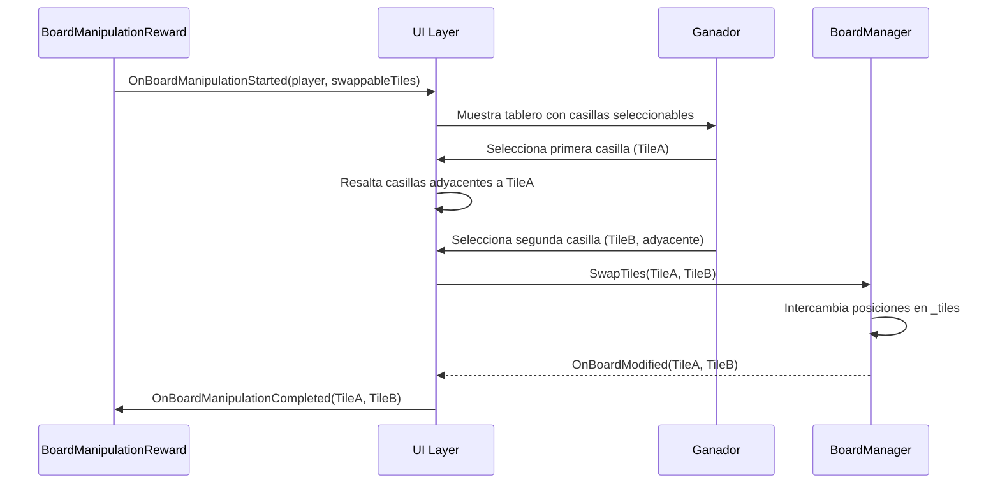
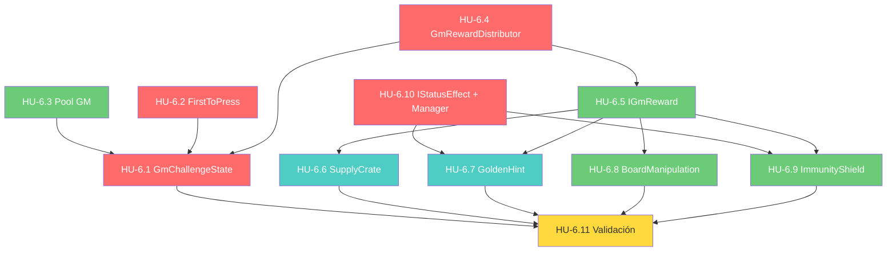

# Historias de Usuario — Épica 6: Desafío del GM y Concurrencia

> **Épica:** [epic6.md](../epics/epic6.md)  
> **Prioridad:** 🟠 Media  
> **Sprint estimado:** 6–8  
> **Total HUs:** 11  
> **Dependencias externas:** Épica 1 (FSM, `IGameState`, `GameContext`), Épica 3 (flujo por turnos), Épica 4 (`ContentManager`, `CardData`), Épica 5 (`ItemEffectExecutor`, `IItem`, `ItemDeck`)

---

## Índice de Historias

| ID | Título | Tipo | Prioridad | Estimación |
|---|---|---|---|---|
| HU-6.1 | GmChallengeState — Estado de la FSM | Técnica | 🔴 Crítica | 8 SP |
| HU-6.2 | FirstToPressManager — Sistema de First-to-Press | Técnica | 🔴 Crítica | 5 SP |
| HU-6.3 | Pool de Retos del GM — Integración con ContentManager | Técnica | 🟡 Alta | 3 SP |
| HU-6.4 | GmRewardDistributor — Sistema de Recompensas Variables | Técnica | 🔴 Crítica | 5 SP |
| HU-6.5 | IGmReward e Infraestructura de Recompensas | Técnica | 🟡 Alta | 3 SP |
| HU-6.6 | SupplyCrate — Recompensa: Cajón de Suministros | Funcional | 🟢 Media | 2 SP |
| HU-6.7 | GoldenHint — Recompensa: Pista Dorada | Funcional | 🟢 Media | 3 SP |
| HU-6.8 | BoardManipulation — Recompensa: Manipulación del Tablero | Funcional | 🟡 Alta | 5 SP |
| HU-6.9 | ImmunityShield — Recompensa: Escudo de Inmunidad | Funcional | 🟡 Alta | 5 SP |
| HU-6.10 | IStatusEffect y Sistema de Modificadores Temporales | Técnica | 🔴 Crítica | 5 SP |
| HU-6.11 | Validación e Integración del Desafío del GM | QA | 🔴 Crítica | 8 SP |

**Total estimado:** ~52 Story Points

---

## Definición de Done (Global para Épica 6)

Todas las HU de esta épica deben cumplir:

- [ ] Código compila sin errores ni warnings en Unity (`Unity_ReadConsole`)
- [ ] Se respetan las convenciones del [Architect.md](../../.agents/Architect.md):
  - Campos privados con `_camelCase`
  - Métodos en PascalCase con verbos de acción
  - Separación estricta datos/lógica (ScriptableObjects ≠ MonoBehaviours)
- [ ] No existe ningún `GameObject.Find()`, `FindObjectOfType()`, ni Singleton
- [ ] Dependencias inyectadas vía `[SerializeField]` o constructor
- [ ] Comunicación hacia UI exclusivamente vía `GameEvents`
- [ ] Documentación XML (`<summary>`) en todos los miembros públicos
- [ ] Archivos ubicados en `Assets/Scripts/Core/States/`, `Assets/Scripts/Gameplay/GmChallenge/`, y `Assets/Scripts/Interfaces/`
- [ ] La concurrencia de inputs solo cubre el caso **local** (un solo dispositivo, teclas por jugador). No se implementa red en esta épica.
- [ ] Cada recompensa implementa `IGmReward` como clase Strategy independiente

---

## HU-6.1 — GmChallengeState: Estado de la FSM

### Descripción

**Como** sistema,  
**necesito** un estado dedicado en la FSM para gestionar la fase de cierre de ronda,  
**para que** la concurrencia global no interfiera con el flujo normal por turnos.

### Criterios de Aceptación

- [ ] Archivo: `Assets/Scripts/Core/States/GmChallengeState.cs` (completar el stub de Épica 1)
- [ ] Namespace: `ChronosAndCards.Core.States`
- [ ] Implementa `IGameState`

```csharp
/// <summary>
/// Estado de la FSM que gestiona el Desafío del GM (cierre de ronda).
/// Pausa el flujo por turnos y activa una fase de concurrencia global
/// donde todos los jugadores compiten simultáneamente.
/// </summary>
public class GmChallengeState : IGameState
{
    private readonly FirstToPressManager _firstToPressManager;
    private readonly GmRewardDistributor _rewardDistributor;
    private readonly AnswerEvaluator _answerEvaluator;

    private CardData _currentChallenge;
    private readonly List<IPlayer> _blockedPlayers = new();
    private IPlayer _currentContestant;
    private bool _challengeResolved;
    private float _timeoutTimer;
    private readonly float _timeoutDuration;

    /// <summary>Estado actual de la fase del desafío.</summary>
    private GmChallengePhase _currentPhase;

    public GmChallengeState(
        FirstToPressManager firstToPressManager,
        GmRewardDistributor rewardDistributor,
        AnswerEvaluator answerEvaluator,
        float timeoutDuration = 10f)
    {
        _firstToPressManager = firstToPressManager;
        _rewardDistributor = rewardDistributor;
        _answerEvaluator = answerEvaluator;
        _timeoutDuration = timeoutDuration;
    }

    /// <summary>
    /// Inicia el desafío del GM:
    /// 1. Pausa el flujo por turnos
    /// 2. Extrae un reto del pool del GM
    /// 3. Habilita inputs simultáneos de todos los jugadores
    /// </summary>
    public void Enter(GameContext context)
    {
        _challengeResolved = false;
        _blockedPlayers.Clear();
        _currentContestant = null;
        _timeoutTimer = _timeoutDuration;
        _currentPhase = GmChallengePhase.WaitingForPress;

        // 1. Extraer reto del GM
        _currentChallenge = context.ContentManager.DrawGmChallenge();

        if (_currentChallenge == null)
        {
            Debug.LogWarning("GmChallengeState: No hay retos del GM disponibles. Saltando fase.");
            _challengeResolved = true;
            GameEvents.OnGmChallengeSkipped?.Invoke();
            return;
        }

        // 2. Habilitar inputs de todos los jugadores
        var activePlayers = context.Players.Where(p => p.IsActive).ToList();
        _firstToPressManager.EnableAllInputs(activePlayers);

        // 3. Suscribirse a eventos
        _firstToPressManager.OnFirstPress += OnPlayerPressed;

        // 4. Notificar UI
        GameEvents.OnGmChallengeStarted?.Invoke(_currentChallenge);

        Debug.Log($"GmChallengeState: Desafío del GM iniciado. " +
                  $"Pregunta: '{_currentChallenge.QuestionText}'. " +
                  $"Timeout: {_timeoutDuration}s. Jugadores activos: {activePlayers.Count}.");
    }

    /// <summary>
    /// Tick del desafío:
    /// - Fase WaitingForPress: monitorea timeout y primer press
    /// - Fase WaitingForAnswer: espera respuesta del contestant
    /// </summary>
    public void Tick(GameContext context, float deltaTime)
    {
        if (_challengeResolved) return;

        switch (_currentPhase)
        {
            case GmChallengePhase.WaitingForPress:
                TickWaitingForPress(deltaTime);
                break;

            case GmChallengePhase.WaitingForAnswer:
                // Espera pasiva — la respuesta llega vía evento
                break;
        }
    }

    private void TickWaitingForPress(float deltaTime)
    {
        _timeoutTimer -= deltaTime;

        if (_timeoutTimer <= 0f)
        {
            // Timeout: nadie presionó → ronda sin ganador
            Debug.Log("GmChallengeState: Timeout alcanzado. No hay ganador.");
            EndChallenge(null, context: null);
        }
    }

    /// <summary>Callback cuando un jugador presiona primero.</summary>
    private void OnPlayerPressed(IPlayer presser)
    {
        if (_challengeResolved) return;
        if (_blockedPlayers.Contains(presser)) return;

        _currentContestant = presser;
        _currentPhase = GmChallengePhase.WaitingForAnswer;

        // Deshabilitar todos los inputs
        _firstToPressManager.DisableAllInputs();

        // Notificar UI: mostrar pregunta al contestant
        GameEvents.OnGmChallengeContestantSelected?.Invoke(presser, _currentChallenge);

        Debug.Log($"GmChallengeState: {presser.PlayerName} presionó primero. " +
                  "Mostrando pregunta.");
    }

    /// <summary>
    /// Recibe la respuesta del contestant actual.
    /// Si acierta → recompensa. Si falla → bloqueado, vuelve a esperar press.
    /// </summary>
    public void SubmitAnswer(string answer, GameContext context)
    {
        if (_currentContestant == null || _challengeResolved) return;

        bool isCorrect = _answerEvaluator.IsAnswerCorrect(
            answer, _currentChallenge);

        if (isCorrect)
        {
            // ¡Ganador!
            Debug.Log($"GmChallengeState: {_currentContestant.PlayerName} " +
                      "respondió correctamente al desafío del GM.");
            EndChallenge(_currentContestant, context);
        }
        else
        {
            // Fallo: bloquear contestant y reabrir inputs
            Debug.Log($"GmChallengeState: {_currentContestant.PlayerName} " +
                      "falló. Queda bloqueado para este reto.");

            _blockedPlayers.Add(_currentContestant);

            GameEvents.OnGmChallengeContestantFailed?.Invoke(_currentContestant);

            // Verificar si todos están bloqueados
            var activePlayers = context.Players.Where(p => p.IsActive).ToList();
            var remainingPlayers = activePlayers
                .Where(p => !_blockedPlayers.Contains(p))
                .ToList();

            if (remainingPlayers.Count == 0)
            {
                // Todos fallaron → sin ganador
                Debug.Log("GmChallengeState: Todos los jugadores fallaron. Sin ganador.");
                EndChallenge(null, context);
            }
            else
            {
                // Reabrir inputs para los no bloqueados
                _currentContestant = null;
                _currentPhase = GmChallengePhase.WaitingForPress;
                _firstToPressManager.EnableInputs(remainingPlayers);
            }
        }
    }

    /// <summary>Finaliza el desafío, otorga recompensa si hay ganador.</summary>
    private void EndChallenge(IPlayer winner, GameContext context)
    {
        _challengeResolved = true;
        _firstToPressManager.DisableAllInputs();
        _firstToPressManager.OnFirstPress -= OnPlayerPressed;

        if (winner != null && context != null)
        {
            // Otorgar recompensa
            var reward = _rewardDistributor.GrantRandomReward(winner, context);
            GameEvents.OnGmChallengeEnded?.Invoke(winner, reward);
            Debug.Log($"GmChallengeState: {winner.PlayerName} ganó. " +
                      $"Recompensa: {reward}.");
        }
        else
        {
            GameEvents.OnGmChallengeEndedNoWinner?.Invoke();
            Debug.Log("GmChallengeState: Desafío terminado sin ganador.");
        }
    }

    /// <summary>
    /// Sale del estado:
    /// Restaura el flujo por turnos y limpia el estado.
    /// </summary>
    public void Exit(GameContext context)
    {
        _firstToPressManager.DisableAllInputs();
        _firstToPressManager.OnFirstPress -= OnPlayerPressed;
        _blockedPlayers.Clear();
        _currentContestant = null;
        _currentChallenge = null;
        _currentPhase = GmChallengePhase.WaitingForPress;
    }
}

/// <summary>Fases internas del desafío del GM.</summary>
public enum GmChallengePhase
{
    /// <summary>Esperando que algún jugador presione su botón.</summary>
    WaitingForPress,

    /// <summary>Un jugador presionó, esperando su respuesta.</summary>
    WaitingForAnswer
}
```

#### Configuración del desafío

- [ ] Archivo: `Assets/Scripts/Data/GmChallengeConfig.cs`
- [ ] Namespace: `ChronosAndCards.Data`

```csharp
/// <summary>
/// Configuración del Desafío del GM.
/// Define tiempos, frecuencia y parámetros del cierre de ronda.
/// </summary>
[CreateAssetMenu(fileName = "GmChallengeConfig", menuName = "ChronosAndCards/GmChallengeConfig")]
public class GmChallengeConfig : ScriptableObject
{
    /// <summary>Segundos para que un jugador presione antes del timeout.</summary>
    [SerializeField, Range(5f, 30f)] private float _pressTimeoutDuration = 10f;

    /// <summary>Segundos para que el contestant responda la pregunta.</summary>
    [SerializeField, Range(10f, 60f)] private float _answerTimeoutDuration = 30f;

    /// <summary>Umbral de simultaneidad para empates de press (en ms).</summary>
    [SerializeField, Range(1f, 50f)] private float _simultaneityThresholdMs = 16f;

    /// <summary>Cada cuántas rondas se activa el desafío del GM.</summary>
    [SerializeField, Range(1, 5)] private int _challengeFrequencyRounds = 1;

    public float PressTimeoutDuration => _pressTimeoutDuration;
    public float AnswerTimeoutDuration => _answerTimeoutDuration;
    public float SimultaneityThresholdMs => _simultaneityThresholdMs;
    public int ChallengeFrequencyRounds => _challengeFrequencyRounds;
}
```

#### Cuándo se dispara el desafío

- [ ] El `TurnManager` (Épica 3) verifica al final de cada ronda completa si corresponde un desafío del GM
- [ ] Condición: `currentRound % GmChallengeConfig.ChallengeFrequencyRounds == 0`
- [ ] Si corresponde, transiciona la FSM a `GmChallengeState` en lugar de iniciar la siguiente ronda
- [ ] Tras el `Exit()` del `GmChallengeState`, la FSM transiciona a `PlayerTurnState` de la nueva ronda

### Notas de Implementación

- GDD: _"Fase de cierre de ronda: un estado de concurrencia global donde todos los jugadores compiten simultáneamente."_
- El `GmChallengeState` rompe temporalmente el paradigma de "un jugador por turno". Debe gestionar inputs de todos los jugadores de forma segura.
- El timeout evita bloqueos infinitos si nadie presiona o si el contestant no responde.
- El stub de `GmChallengeState` fue creado en la Épica 1. Esta HU lo completa con la implementación real.

### Dependencias

- Épica 1 (`IGameState`, `GameContext`)
- HU-6.2 (`FirstToPressManager`)
- HU-6.3 (pool de retos del GM en `ContentManager`)
- HU-6.4 (`GmRewardDistributor`)
- HU-4.7 (`AnswerEvaluator`)

---

## HU-6.2 — FirstToPressManager: Sistema de First-to-Press

### Descripción

**Como** jugador,  
**quiero** que el primer jugador en pulsar su botón tenga el derecho a responder,  
**para que** la fase del GM sea una competencia de reflejos y conocimiento.

### Criterios de Aceptación

- [ ] Archivo: `Assets/Scripts/Gameplay/GmChallenge/FirstToPressManager.cs`
- [ ] Namespace: `ChronosAndCards.Gameplay.GmChallenge`
- [ ] Clase pura (no MonoBehaviour) — el polling de inputs se hace desde un MonoBehaviour externo:

```csharp
/// <summary>
/// Gestiona el sistema First-to-Press para el Desafío del GM.
/// Asigna un botón/tecla a cada jugador, detecta el primer press,
/// y bloquea los demás inputs para evitar competencia posterior.
/// </summary>
public class FirstToPressManager
{
    private readonly GmChallengeConfig _config;
    private readonly Dictionary<IPlayer, KeyCode> _playerKeys = new();
    private bool _inputsEnabled;
    private readonly List<IPlayer> _activePlayers = new();
    private readonly List<IPlayer> _blockedPlayers = new();

    /// <summary>Se dispara cuando un jugador presiona primero.</summary>
    public event Action<IPlayer> OnFirstPress;

    /// <summary>Se dispara en caso de empate (simultaneidad).</summary>
    public event Action<List<IPlayer>> OnSimultaneousPress;

    /// <summary>Timestamp del último press detectado (en ms).</summary>
    private double _lastPressTimestamp;

    /// <summary>Buffer de presses simultáneos dentro del umbral.</summary>
    private readonly List<(IPlayer player, double timestamp)> _pressBuffer = new();

    public FirstToPressManager(GmChallengeConfig config)
    {
        _config = config;
    }

    /// <summary>
    /// Configura las teclas asignadas a cada jugador.
    /// Debe llamarse durante el setup de la partida.
    /// </summary>
    public void ConfigurePlayerKeys(Dictionary<IPlayer, KeyCode> playerKeys)
    {
        _playerKeys.Clear();
        foreach (var kvp in playerKeys)
        {
            _playerKeys[kvp.Key] = kvp.Value;
        }
    }

    /// <summary>Habilita los inputs de todos los jugadores activos.</summary>
    public void EnableAllInputs(List<IPlayer> players)
    {
        _activePlayers.Clear();
        _activePlayers.AddRange(players);
        _pressBuffer.Clear();
        _lastPressTimestamp = 0;
        _inputsEnabled = true;

        Debug.Log($"FirstToPressManager: Inputs habilitados para {players.Count} jugadores.");
    }

    /// <summary>Habilita inputs solo para un subconjunto de jugadores.</summary>
    public void EnableInputs(List<IPlayer> players)
    {
        _activePlayers.Clear();
        _activePlayers.AddRange(players);
        _pressBuffer.Clear();
        _lastPressTimestamp = 0;
        _inputsEnabled = true;
    }

    /// <summary>Deshabilita todos los inputs.</summary>
    public void DisableAllInputs()
    {
        _inputsEnabled = false;
        _activePlayers.Clear();
        _pressBuffer.Clear();
    }

    /// <summary>Bloquea un jugador específico (tras fallo).</summary>
    public void BlockPlayer(IPlayer player)
    {
        _blockedPlayers.Add(player);
        _activePlayers.Remove(player);
    }

    /// <summary>
    /// Polling de inputs. Debe llamarse desde Update() de un MonoBehaviour.
    /// Detecta presses y gestiona el lock atómico.
    /// </summary>
    public void PollInputs()
    {
        if (!_inputsEnabled) return;

        foreach (var player in _activePlayers)
        {
            if (_blockedPlayers.Contains(player)) continue;
            if (!_playerKeys.ContainsKey(player)) continue;

            if (Input.GetKeyDown(_playerKeys[player]))
            {
                double timestamp = Time.realtimeSinceStartupAsDouble * 1000.0; // ms
                RegisterPress(player, timestamp);
            }
        }

        // Resolver buffer de simultaneidad si hay presses pendientes
        ResolveSimultaneityBuffer();
    }

    /// <summary>Registra un press y lo añade al buffer de simultaneidad.</summary>
    private void RegisterPress(IPlayer player, double timestampMs)
    {
        _pressBuffer.Add((player, timestampMs));

        if (_pressBuffer.Count == 1)
        {
            _lastPressTimestamp = timestampMs;
        }
    }

    /// <summary>
    /// Resuelve el buffer de presses.
    /// Si hay presses dentro del umbral de simultaneidad, se tratan como empate.
    /// Si solo hay uno, se declara ganador.
    /// </summary>
    private void ResolveSimultaneityBuffer()
    {
        if (_pressBuffer.Count == 0) return;

        // Esperar 1 frame adicional para capturar presses simultáneos
        var firstTimestamp = _pressBuffer[0].timestamp;
        var threshold = _config.SimultaneityThresholdMs;

        // Filtrar presses dentro del umbral
        var simultaneousPresses = _pressBuffer
            .Where(p => Math.Abs(p.timestamp - firstTimestamp) <= threshold)
            .ToList();

        if (simultaneousPresses.Count == 1)
        {
            // Un solo press → ganador claro
            var winner = simultaneousPresses[0].player;
            _inputsEnabled = false;
            _pressBuffer.Clear();

            Debug.Log($"FirstToPressManager: {winner.PlayerName} presionó primero " +
                      $"(t={simultaneousPresses[0].timestamp:F2}ms).");

            OnFirstPress?.Invoke(winner);
        }
        else if (simultaneousPresses.Count > 1)
        {
            // Empate → notificar simultaneidad (resolución por el GmChallengeState)
            _inputsEnabled = false;
            var tiedPlayers = simultaneousPresses.Select(p => p.player).ToList();
            _pressBuffer.Clear();

            Debug.Log($"FirstToPressManager: Empate detectado entre " +
                      $"{string.Join(", ", tiedPlayers.Select(p => p.PlayerName))}. " +
                      $"Umbral: {threshold}ms.");

            OnSimultaneousPress?.Invoke(tiedPlayers);
        }
    }

    /// <summary>Limpia el estado del manager para un nuevo desafío.</summary>
    public void Reset()
    {
        _inputsEnabled = false;
        _activePlayers.Clear();
        _blockedPlayers.Clear();
        _pressBuffer.Clear();
        _lastPressTimestamp = 0;
    }
}
```

- [ ] Asigna un `KeyCode` único a cada jugador (configurable, ej. `Alpha1` a `Alpha6`)
- [ ] Lock atómico: una vez detectado el primer press, se deshabilitan todos los inputs
- [ ] Registro de timestamp del press para resolver empates (< umbral → simultaneidad)
- [ ] Buffer de simultaneidad: presses dentro del umbral de ms se agrupan como empate
- [ ] Evento `OnFirstPress(IPlayer)` para el ganador del press
- [ ] Evento `OnSimultaneousPress(List<IPlayer>)` para empates
- [ ] `BlockPlayer()` para jugadores que ya fallaron
- [ ] `PollInputs()` se llama desde `Update()` de un MonoBehaviour externo

#### Configuración de teclas por defecto

- [ ] Jugador 1: `KeyCode.Alpha1` (tecla "1")
- [ ] Jugador 2: `KeyCode.Alpha2` (tecla "2")
- [ ] Jugador 3: `KeyCode.Alpha3` (tecla "3")
- [ ] Jugador 4: `KeyCode.Alpha4` (tecla "4")
- [ ] Jugador 5: `KeyCode.Alpha5` (tecla "5")
- [ ] Jugador 6: `KeyCode.Alpha6` (tecla "6")
- [ ] Las teclas son configurables desde el Inspector vía un ScriptableObject o serializado en escena

#### Resolución de empates

- [ ] Si `|timestampA - timestampB| <= SimultaneityThresholdMs` (por defecto 16ms):
  - Se considera empate
  - El `GmChallengeState` puede resolver por orden aleatorio o re-intentar
- [ ] Si `|timestampA - timestampB| > threshold`:
  - El de menor timestamp gana

### Notas de Implementación

- GDD: _"El primer jugador en pulsar su botón tiene el derecho a responder."_
- La concurrencia solo cubre el caso local (un solo dispositivo). Cada jugador tiene una tecla asignada. No se implementa networking.
- `Time.realtimeSinceStartupAsDouble` da precisión de milisegundos suficiente para detectar simultaneidad en un solo frame.
- El buffer de simultaneidad espera un frame completo antes de resolver, para capturar todos los inputs del mismo frame.
- `PollInputs()` NO es llamado internamente — requiere un MonoBehaviour (ej. `GmChallengeInputPoller`) que llame en `Update()`. Esto mantiene la clase testeable.

### Dependencias

- HU-6.1 (`GmChallengeState` consume este manager)
- HU-6.1 (`GmChallengeConfig.SimultaneityThresholdMs`)
- HU-1.2 (`IPlayer`)

---

## HU-6.3 — Pool de Retos del GM: Integración con ContentManager

### Descripción

**Como** GM,  
**quiero** definir preguntas especiales para el cierre de ronda,  
**para que** los desafíos del GM se sientan distintos a las preguntas normales del turno.

### Criterios de Aceptación

- [ ] Modificaciones en `Assets/Scripts/Data/MarkdownContentParser.cs`
- [ ] Modificaciones en `Assets/Scripts/Data/ContentManager.cs`

#### Formato Markdown extendido para retos GM

```markdown
## [GM] Texto del reto especial del GM
> Pista del reto (opcional)
- Opción A
- Opción B
= Respuesta correcta
```

- [ ] El parser ya soporta `## [GM]` (implementado en HU-4.1). Verificar que funciona correctamente.
- [ ] Las cartas con `## [GM]` se marcan con `CardData.IsGmChallenge = true`

#### Separación de pools en ContentManager

- [ ] `ContentManager` ya tiene `_gmChallengeCards` (HU-4.4). Verificar separación correcta.
- [ ] `DrawGmChallenge()` extrae de `_gmChallengeCards`
- [ ] Si no hay cartas GM → fallback a cartas normales de nivel 4–6
- [ ] Las cartas GM **no** se mezclan con el mazo regular de preguntas por turno
- [ ] Log de warning si se usa fallback

#### Validaciones adicionales

- [ ] Si el archivo `.md` no contiene ningún reto `## [GM]`:
  - Warning en `ParseResult`: "No se encontraron retos del GM. Se usarán cartas de nivel 4-6 como fallback."
- [ ] Si hay retos GM pero son muy pocos (< 3):
  - Warning en `ParseResult`: "Solo se encontraron N retos del GM. Se recomienda al menos 3."
- [ ] Dificultad por defecto de cartas GM: 5 (configurable en `GmChallengeConfig`)

### Notas de Implementación

- La mayor parte de esta HU es **verificación** de funcionalidad ya preparada en la Épica 4 (HU-4.1 y HU-4.4). El parser ya soporta `## [GM]` y el `ContentManager` ya separa las colas.
- El trabajo nuevo es: validaciones adicionales en `ParseResult`, ajustar la dificultad por defecto de cartas GM, y asegurar que el fallback funciona correctamente.
- Las cartas GM son temáticamente distintas: pueden ser más desafiantes, más creativas, o más abiertas que las preguntas normales.

### Dependencias

- HU-4.1 (`MarkdownContentParser` — formato `## [GM]`)
- HU-4.2 (`ParseResult` — warnings nuevos)
- HU-4.4 (`ContentManager` — `_gmChallengeCards`, `DrawGmChallenge()`)

---

## HU-6.4 — GmRewardDistributor: Sistema de Recompensas Variables

### Descripción

**Como** sistema,  
**necesito** un distribuidor de recompensas que seleccione aleatoriamente y aplique una recompensa al ganador del desafío del GM,  
**para que** el cierre de ronda sea emocionante e impactante.

### Criterios de Aceptación

- [ ] Archivo: `Assets/Scripts/Gameplay/GmChallenge/GmRewardDistributor.cs`
- [ ] Namespace: `ChronosAndCards.Gameplay.GmChallenge`

```csharp
/// <summary>
/// Distribuye recompensas aleatorias al ganador del Desafío del GM.
/// Selecciona una recompensa según pesos configurados y la aplica al jugador.
/// </summary>
public class GmRewardDistributor
{
    private readonly GmRewardConfig _config;
    private readonly Dictionary<GmRewardType, IGmReward> _rewardImplementations;

    /// <summary>Se dispara cuando una recompensa es otorgada.</summary>
    public event Action<IPlayer, GmRewardType> OnRewardGranted;

    public GmRewardDistributor(
        GmRewardConfig config,
        Dictionary<GmRewardType, IGmReward> rewardImplementations)
    {
        _config = config;
        _rewardImplementations = rewardImplementations;
    }

    /// <summary>
    /// Selecciona una recompensa aleatoria (ponderada) y la aplica al jugador.
    /// </summary>
    /// <returns>El tipo de recompensa otorgada.</returns>
    public GmRewardType GrantRandomReward(IPlayer winner, GameContext context)
    {
        var rewardType = SelectWeightedRandom();

        if (_rewardImplementations.TryGetValue(rewardType, out var reward))
        {
            reward.Apply(winner, context);

            Debug.Log($"GmRewardDistributor: {winner.PlayerName} recibió " +
                      $"recompensa '{rewardType}'.");

            OnRewardGranted?.Invoke(winner, rewardType);
            GameEvents.OnGmRewardGranted?.Invoke(winner, rewardType);
        }
        else
        {
            Debug.LogError($"GmRewardDistributor: No hay implementación para " +
                           $"recompensa '{rewardType}'.");
        }

        return rewardType;
    }

    /// <summary>
    /// Selección aleatoria ponderada usando los pesos del config.
    /// </summary>
    private GmRewardType SelectWeightedRandom()
    {
        var entries = _config.RewardEntries;
        float totalWeight = entries.Sum(e => e.Weight);
        float roll = UnityEngine.Random.Range(0f, totalWeight);

        float accumulated = 0f;
        foreach (var entry in entries)
        {
            accumulated += entry.Weight;
            if (roll <= accumulated)
            {
                return entry.RewardType;
            }
        }

        // Fallback (nunca debería llegar aquí)
        return entries[entries.Count - 1].RewardType;
    }
}
```

#### GmRewardConfig (ScriptableObject)

- [ ] Archivo: `Assets/Scripts/Data/GmRewardConfig.cs`
- [ ] Namespace: `ChronosAndCards.Data`

```csharp
/// <summary>
/// Configuración de las recompensas del Desafío del GM.
/// Define los tipos disponibles y sus pesos de probabilidad.
/// </summary>
[CreateAssetMenu(fileName = "GmRewardConfig", menuName = "ChronosAndCards/GmRewardConfig")]
public class GmRewardConfig : ScriptableObject
{
    /// <summary>Entradas de recompensas con sus pesos.</summary>
    [SerializeField] private List<GmRewardEntry> _rewardEntries = new();

    public IReadOnlyList<GmRewardEntry> RewardEntries => _rewardEntries.AsReadOnly();
}

/// <summary>Entrada de configuración para una recompensa del GM.</summary>
[System.Serializable]
public class GmRewardEntry
{
    /// <summary>Tipo de recompensa.</summary>
    [SerializeField] private GmRewardType _rewardType;

    /// <summary>Peso de probabilidad (mayor = más probable).</summary>
    [SerializeField, Range(0.1f, 10f)] private float _weight = 1f;

    /// <summary>Descripción para la UI.</summary>
    [SerializeField, TextArea(1, 3)] private string _description;

    public GmRewardType RewardType => _rewardType;
    public float Weight => _weight;
    public string Description => _description;
}
```

#### GmRewardType (Enum)

- [ ] Archivo: `Assets/Scripts/Gameplay/GmChallenge/GmRewardType.cs`
- [ ] Namespace: `ChronosAndCards.Gameplay.GmChallenge`

```csharp
/// <summary>
/// Tipos de recompensa disponibles en el Desafío del GM.
/// Cada tipo tiene una implementación IGmReward correspondiente.
/// </summary>
public enum GmRewardType
{
    /// <summary>+1 Pista y +1 Objeto del mazo.</summary>
    SupplyCrate,

    /// <summary>Token que permite responder un N6 sin penalización de multiplicador.</summary>
    GoldenHint,

    /// <summary>El ganador elige dos casillas adyacentes y las intercambia.</summary>
    BoardManipulation,

    /// <summary>Invulnerabilidad a efectos ofensivos durante 1 ronda.</summary>
    ImmunityShield
}
```

### Notas de Implementación

- GDD: _"Recibir una recompensa aleatoria al superar el desafío del GM."_
- La selección ponderada permite al diseñador balancear la frecuencia de cada recompensa desde el Inspector. Recompensas más poderosas (BoardManipulation, ImmunityShield) pueden tener pesos menores.
- Las implementaciones de `IGmReward` se registran en el diccionario vía inyección en el constructor del distribuidor.
- Los pesos por defecto sugeridos: SupplyCrate (3.0), GoldenHint (2.5), BoardManipulation (1.5), ImmunityShield (1.0).

### Dependencias

- HU-6.5 (`IGmReward`)
- HU-6.1 (`GmChallengeState` consume el distribuidor)
- Épica 1 (`GameContext`)
- HU-1.9 (`GameEvents`)

---

## HU-6.5 — IGmReward e Infraestructura de Recompensas

### Descripción

**Como** sistema,  
**necesito** una interfaz común para las recompensas del GM y la infraestructura para registrarlas,  
**para que** cada recompensa sea un módulo Strategy independiente y fácil de extender.

### Criterios de Aceptación

- [ ] Archivo: `Assets/Scripts/Gameplay/GmChallenge/Rewards/IGmReward.cs`
- [ ] Namespace: `ChronosAndCards.Gameplay.GmChallenge.Rewards`

```csharp
/// <summary>
/// Interfaz para las recompensas del Desafío del GM.
/// Cada recompensa implementa su efecto de forma independiente
/// siguiendo el patrón Strategy.
/// </summary>
public interface IGmReward
{
    /// <summary>Nombre visible de la recompensa.</summary>
    string Name { get; }

    /// <summary>Descripción del efecto para la UI.</summary>
    string Description { get; }

    /// <summary>Tipo de recompensa para identificación.</summary>
    GmRewardType RewardType { get; }

    /// <summary>
    /// Aplica el efecto de la recompensa al jugador ganador.
    /// </summary>
    /// <param name="winner">El jugador que ganó el desafío.</param>
    /// <param name="context">Contexto del juego para acceso a sistemas.</param>
    void Apply(IPlayer winner, GameContext context);

    /// <summary>
    /// Verifica si la recompensa requiere interacción adicional del jugador.
    /// (ej. BoardManipulation necesita selección de casillas).
    /// </summary>
    bool RequiresInteraction { get; }
}
```

- [ ] Interfaz `IGmReward` con: `Name`, `Description`, `RewardType`, `Apply()`, `RequiresInteraction`
- [ ] `RequiresInteraction` diferencia recompensas pasivas (SupplyCrate, GoldenHint, ImmunityShield) de interactivas (BoardManipulation)
- [ ] Las recompensas interactivas requieren input adicional de la UI antes de completarse
- [ ] Documentación XML completa

### Notas de Implementación

- La interfaz `IGmReward` es análoga a `IItemEffect` de la Épica 5: encapsula el efecto como un Strategy independiente.
- Las recompensas interactivas (BoardManipulation) requieren un flujo asíncrono: `Apply()` inicia el flujo, la UI gestiona la selección, y un evento notifica la resolución.
- Se puede considerar un método `ApplyAsync()` o un callback para recompensas interactivas, pero para mantener consistencia con el resto del sistema se usa el patrón de eventos.

### Dependencias

- HU-6.4 (`GmRewardType`, `GmRewardDistributor`)
- Épica 1 (`GameContext`)
- HU-1.2 (`IPlayer`)

---

## HU-6.6 — SupplyCrate: Recompensa Cajón de Suministros

### Descripción

**Como** jugador ganador del desafío del GM,  
**quiero** recibir +1 Pista y +1 Objeto del mazo,  
**para que** el desafío me proporcione recursos tácticos inmediatos.

### Criterios de Aceptación

- [ ] Archivo: `Assets/Scripts/Gameplay/GmChallenge/Rewards/SupplyCrateReward.cs`
- [ ] Namespace: `ChronosAndCards.Gameplay.GmChallenge.Rewards`

```csharp
/// <summary>
/// Recompensa "Cajón de Suministros" del Desafío del GM.
/// Otorga al ganador +1 Pista y +1 Objeto aleatorio del mazo de ítems.
/// Es una recompensa pasiva (no requiere interacción adicional).
/// </summary>
public class SupplyCrateReward : IGmReward
{
    public string Name => "Cajón de Suministros";
    public string Description => "+1 Pista y +1 Objeto del mazo.";
    public GmRewardType RewardType => GmRewardType.SupplyCrate;
    public bool RequiresInteraction => false;

    /// <summary>
    /// Aplica la recompensa:
    /// 1. Añade 1 pista al jugador
    /// 2. Extrae 1 objeto del mazo de ítems y lo añade al inventario
    /// </summary>
    public void Apply(IPlayer winner, GameContext context)
    {
        // +1 Pista
        winner.AddHint(1);
        GameEvents.OnHintChanged?.Invoke(winner, winner.HintCount);

        Debug.Log($"SupplyCrateReward: {winner.PlayerName} recibió +1 Pista. " +
                  $"Total pistas: {winner.HintCount}.");

        // +1 Objeto del mazo
        var drawnItem = context.ItemDeck.DrawItem();
        if (drawnItem != null)
        {
            winner.Inventory.AddItem(winner, drawnItem);
            GameEvents.OnItemObtained?.Invoke(winner, drawnItem);

            Debug.Log($"SupplyCrateReward: {winner.PlayerName} recibió " +
                      $"objeto '{drawnItem.Name}'.");
        }
        else
        {
            Debug.LogWarning("SupplyCrateReward: El mazo de objetos está vacío. " +
                             "Solo se otorgó la pista.");
        }
    }
}
```

- [ ] Recompensa pasiva (`RequiresInteraction = false`)
- [ ] Otorga +1 pista vía `player.AddHint(1)`
- [ ] Extrae 1 objeto aleatorio del `ItemDeck` vía `context.ItemDeck.DrawItem()`
- [ ] Si el mazo está vacío, solo otorga la pista (+ warning)
- [ ] Emite `GameEvents.OnHintChanged` y `GameEvents.OnItemObtained`

### Notas de Implementación

- Es la recompensa más sencilla y directa. Debería tener el mayor peso de probabilidad en `GmRewardConfig` (por defecto 3.0).
- La pista se suma directamente. El objeto depende de la disponibilidad del mazo.

### Dependencias

- HU-6.5 (`IGmReward`)
- HU-5.2 (`ItemDeck.DrawItem()`)
- HU-5.1 (`PlayerInventory.AddItem()`)
- HU-1.2 (`IPlayer.AddHint()`)

---

## HU-6.7 — GoldenHint: Recompensa Pista Dorada

### Descripción

**Como** jugador ganador del desafío del GM,  
**quiero** recibir un token especial que me permita responder una pregunta de Nivel 6 sin penalización de multiplicador,  
**para que** el desafío me otorgue una ventaja significativa en preguntas difíciles.

### Criterios de Aceptación

- [ ] Archivo: `Assets/Scripts/Gameplay/GmChallenge/Rewards/GoldenHintReward.cs`
- [ ] Namespace: `ChronosAndCards.Gameplay.GmChallenge.Rewards`

```csharp
/// <summary>
/// Recompensa "Pista Dorada" del Desafío del GM.
/// Otorga un token que permite responder una pregunta de Nivel 6
/// sin penalización de multiplicador (similar a Overdrive pero para N6).
/// Se implementa como un IStatusEffect temporal de 1 uso.
/// </summary>
public class GoldenHintReward : IGmReward
{
    public string Name => "Pista Dorada";
    public string Description => "La próxima pregunta de Nivel 6 no reduce tu multiplicador.";
    public GmRewardType RewardType => GmRewardType.GoldenHint;
    public bool RequiresInteraction => false;

    /// <summary>
    /// Aplica la recompensa: añade un StatusEffect "GoldenHint" al jugador.
    /// El efecto se activará automáticamente la próxima vez que enfrente un N6.
    /// </summary>
    public void Apply(IPlayer winner, GameContext context)
    {
        var goldenHintEffect = new GoldenHintStatusEffect();
        winner.AddStatusEffect(goldenHintEffect);

        Debug.Log($"GoldenHintReward: {winner.PlayerName} recibió Pista Dorada. " +
                  "Se activará en su próxima pregunta de Nivel 6.");

        GameEvents.OnStatusEffectApplied?.Invoke(winner, goldenHintEffect);
    }
}
```

#### GoldenHintStatusEffect (Efecto de estado temporal)

- [ ] Archivo: `Assets/Scripts/Gameplay/StatusEffects/GoldenHintStatusEffect.cs`
- [ ] Namespace: `ChronosAndCards.Gameplay.StatusEffects`

```csharp
/// <summary>
/// Efecto de estado: "Pista Dorada".
/// Se activa cuando el jugador enfrenta una pregunta de Nivel 6:
/// las pistas y revelación de opciones NO reducen el multiplicador.
/// Se consume tras un uso (1 shot).
/// </summary>
public class GoldenHintStatusEffect : IStatusEffect
{
    public string Name => "Pista Dorada";
    public string Description => "Tu próxima pregunta N6 no penaliza el multiplicador.";
    public StatusEffectDuration Duration => StatusEffectDuration.SingleUse;
    public bool IsActive { get; private set; } = true;

    /// <summary>
    /// Verifica si este efecto aplica al turno actual.
    /// Solo se activa si la carta del turno es de Nivel 6.
    /// </summary>
    public bool ShouldActivate(TurnContext turnContext)
    {
        return IsActive
            && turnContext.CurrentCard != null
            && turnContext.CurrentCard.DifficultyLevel == 6;
    }

    /// <summary>
    /// Aplica el efecto al turno: activa IsOverdriveActive
    /// para que pistas/opciones no reduzcan el multiplicador.
    /// </summary>
    public void ApplyToTurn(TurnContext turnContext)
    {
        if (!ShouldActivate(turnContext)) return;

        turnContext.IsOverdriveActive = true;
        IsActive = false; // Consumido

        Debug.Log("GoldenHintStatusEffect: Pista Dorada activada. " +
                  "El multiplicador no se reducirá por ayuda en esta pregunta N6.");
    }

    /// <summary>Indica si el efecto ha expirado y debe ser removido.</summary>
    public bool IsExpired => !IsActive;
}
```

- [ ] Recompensa pasiva (`RequiresInteraction = false`)
- [ ] Añade un `GoldenHintStatusEffect` a `IPlayer.ActiveEffects`
- [ ] El efecto se activa automáticamente cuando el jugador enfrenta un Nivel 6
- [ ] Funciona como Overdrive pero solo para N6 y solo 1 vez
- [ ] Se consume tras usarse (`IsActive = false`)
- [ ] El `ResolutionState` verifica `ActiveEffects` al inicio de cada turno para aplicar efectos pasivos

### Notas de Implementación

- Nota Técnica de la Épica: _"La Pista Dorada es funcionalmente similar al Overdrive pero solo para un Nivel 6 específico. Implementar como un IStatusEffect temporal de un turno."_
- Se reutiliza el flag `IsOverdriveActive` del `TurnContext` para no duplicar lógica en `HintSystem` y `AnswerEvaluator`.
- El efecto persiste entre turnos hasta que se usa en un N6. Si el jugador nunca enfrenta un N6, el efecto permanece indefinidamente.

### Dependencias

- HU-6.5 (`IGmReward`)
- HU-6.10 (`IStatusEffect`, `StatusEffectDuration`)
- HU-3.7 (`TurnContext.IsOverdriveActive`)
- HU-1.2 (`IPlayer.AddStatusEffect()`)

---

## HU-6.8 — BoardManipulation: Recompensa Manipulación del Tablero

### Descripción

**Como** jugador ganador del desafío del GM (con recompensa "Manipulación del Tablero"),  
**quiero** poder intercambiar dos casillas adyacentes del tablero,  
**para que** pueda alterar estratégicamente el mapa a mi favor.

### Criterios de Aceptación

- [ ] Archivo: `Assets/Scripts/Gameplay/GmChallenge/Rewards/BoardManipulationReward.cs`
- [ ] Namespace: `ChronosAndCards.Gameplay.GmChallenge.Rewards`

```csharp
/// <summary>
/// Recompensa "Manipulación del Tablero" del Desafío del GM.
/// El ganador elige dos casillas adyacentes del tablero y las intercambia.
/// Es una recompensa interactiva que requiere selección vía UI.
/// </summary>
public class BoardManipulationReward : IGmReward
{
    public string Name => "Manipulación del Tablero";
    public string Description => "Elige dos casillas adyacentes e intercámbielas.";
    public GmRewardType RewardType => GmRewardType.BoardManipulation;
    public bool RequiresInteraction => true;

    /// <summary>
    /// Inicia el flujo interactivo de selección de casillas.
    /// La UI gestionará la selección y notificará la resolución vía eventos.
    /// </summary>
    public void Apply(IPlayer winner, GameContext context)
    {
        // Obtener casillas intercambiables (excluyendo Inicio y Meta)
        var swappableTiles = context.BoardManager.GetSwappableTiles();

        if (swappableTiles.Count < 2)
        {
            Debug.LogWarning("BoardManipulationReward: No hay suficientes casillas " +
                             "intercambiables. Recompensa cancelada.");
            return;
        }

        // Solicitar selección a la UI
        GameEvents.OnBoardManipulationStarted?.Invoke(winner, swappableTiles);

        // Suscribirse al resultado
        GameEvents.OnBoardManipulationCompleted += OnManipulationCompleted;

        Debug.Log($"BoardManipulationReward: {winner.PlayerName} puede " +
                  "seleccionar dos casillas adyacentes para intercambiar.");
    }

    /// <summary>Callback cuando la UI confirma la selección de casillas.</summary>
    private void OnManipulationCompleted(ITile tileA, ITile tileB)
    {
        GameEvents.OnBoardManipulationCompleted -= OnManipulationCompleted;
        Debug.Log($"BoardManipulationReward: Casillas intercambiadas: " +
                  $"'{tileA.TileType}' ↔ '{tileB.TileType}'.");
    }
}
```

#### Extensión de BoardManager

- [ ] Modificaciones en `Assets/Scripts/Gameplay/Board/BoardManager.cs`:

```csharp
// Nuevos métodos en BoardManager:

/// <summary>
/// Retorna la lista de casillas que pueden ser intercambiadas.
/// Excluye casillas de Inicio (posición 0) y Meta (posición final).
/// </summary>
public List<ITile> GetSwappableTiles()
{
    return _tiles
        .Where(t => t.TileType != TileType.Start && t.TileType != TileType.Finish)
        .ToList();
}

/// <summary>
/// Retorna las casillas adyacentes a la casilla dada.
/// Adyacente = posición ±1 en el tablero lineal.
/// </summary>
public List<ITile> GetAdjacentTiles(ITile tile)
{
    int index = _tiles.IndexOf(tile);
    var adjacent = new List<ITile>();

    if (index > 0 && _tiles[index - 1].TileType != TileType.Start)
        adjacent.Add(_tiles[index - 1]);

    if (index < _tiles.Count - 1 && _tiles[index + 1].TileType != TileType.Finish)
        adjacent.Add(_tiles[index + 1]);

    return adjacent;
}

/// <summary>
/// Intercambia dos casillas en el tablero.
/// Modifica permanentemente la disposición del tablero.
/// </summary>
/// <returns>true si el intercambio fue exitoso.</returns>
public bool SwapTiles(ITile tileA, ITile tileB)
{
    int indexA = _tiles.IndexOf(tileA);
    int indexB = _tiles.IndexOf(tileB);

    if (indexA < 0 || indexB < 0)
    {
        Debug.LogError("BoardManager.SwapTiles: Una o ambas casillas no existen.");
        return false;
    }

    // Verificar adyacencia
    if (Math.Abs(indexA - indexB) != 1)
    {
        Debug.LogError("BoardManager.SwapTiles: Las casillas no son adyacentes.");
        return false;
    }

    // Verificar que no son Inicio/Meta
    if (tileA.TileType == TileType.Start || tileA.TileType == TileType.Finish ||
        tileB.TileType == TileType.Start || tileB.TileType == TileType.Finish)
    {
        Debug.LogError("BoardManager.SwapTiles: No se pueden intercambiar " +
                       "casillas de Inicio o Meta.");
        return false;
    }

    // Intercambiar
    (_tiles[indexA], _tiles[indexB]) = (_tiles[indexB], _tiles[indexA]);

    // Notificar
    GameEvents.OnBoardModified?.Invoke(tileA, tileB);

    Debug.Log($"BoardManager: Casillas intercambiadas en posiciones " +
              $"{indexA} ↔ {indexB}.");
    return true;
}
```

#### Flujo interactivo



- [ ] Solo casillas adyacentes pueden seleccionarse como segunda opción
- [ ] Las casillas de Inicio y Meta NO aparecen como seleccionables
- [ ] El intercambio es **permanente** para el resto de la partida
- [ ] La UI resalta las casillas adyacentes disponibles tras la primera selección
- [ ] Evento `OnBoardModified(ITile, ITile)` para que la vista actualice la representación visual

#### Eventos nuevos requeridos

- [ ] `GameEvents.OnBoardManipulationStarted(IPlayer, List<ITile>)` — inicio de selección
- [ ] `GameEvents.OnBoardManipulationCompleted(ITile, ITile)` — casillas confirmadas
- [ ] `GameEvents.OnBoardModified(ITile, ITile)` — tablero modificado (para la vista)

### Notas de Implementación

- GDD: _"El ganador elige dos nodos adyacentes e intercambia sus posiciones."_
- El intercambio es permanente. No existe un mecanismo de reversión. El jugador debe elegir con cuidado.
- En un tablero lineal, "adyacente" = posición ±1. Si el tablero fuera en red/grafos, la adyacencia dependería de las aristas.
- La validación de adyacencia es estricta: `Math.Abs(indexA - indexB) == 1`.
- Los jugadores que estén en las casillas intercambiadas NO se mueven — las casillas bajo ellos cambian de tipo.

### Dependencias

- HU-6.5 (`IGmReward`)
- Épica 2 (`BoardManager`, `ITile`)
- HU-1.9 (`GameEvents`)

---

## HU-6.9 — ImmunityShield: Recompensa Escudo de Inmunidad

### Descripción

**Como** jugador ganador del desafío del GM,  
**quiero** que el Escudo de Inmunidad me proteja de objetos ofensivos durante una ronda,  
**para que** la recompensa del GM me dé una ventaja táctica real.

### Criterios de Aceptación

- [ ] Archivo: `Assets/Scripts/Gameplay/GmChallenge/Rewards/ImmunityShieldReward.cs`
- [ ] Namespace: `ChronosAndCards.Gameplay.GmChallenge.Rewards`

```csharp
/// <summary>
/// Recompensa "Escudo de Inmunidad" del Desafío del GM.
/// Otorga invulnerabilidad a Duelos, Robos y Sabotajes durante 1 ronda.
/// Se implementa como un IStatusEffect temporal con duración de 1 ronda.
/// </summary>
public class ImmunityShieldReward : IGmReward
{
    public string Name => "Escudo de Inmunidad";
    public string Description => "Invulnerable a efectos ofensivos durante la próxima ronda.";
    public GmRewardType RewardType => GmRewardType.ImmunityShield;
    public bool RequiresInteraction => false;

    /// <summary>
    /// Aplica la recompensa: añade un StatusEffect "ImmunityShield" al jugador.
    /// El efecto durará 1 ronda completa.
    /// </summary>
    public void Apply(IPlayer winner, GameContext context)
    {
        var shieldEffect = new ImmunityShieldStatusEffect(context.CurrentRound + 1);
        winner.AddStatusEffect(shieldEffect);

        Debug.Log($"ImmunityShieldReward: {winner.PlayerName} recibió Escudo de Inmunidad. " +
                  $"Activo hasta el final de la ronda {context.CurrentRound + 1}.");

        GameEvents.OnStatusEffectApplied?.Invoke(winner, shieldEffect);
    }
}
```

#### ImmunityShieldStatusEffect (Efecto de estado temporal)

- [ ] Archivo: `Assets/Scripts/Gameplay/StatusEffects/ImmunityShieldStatusEffect.cs`
- [ ] Namespace: `ChronosAndCards.Gameplay.StatusEffects`

```csharp
/// <summary>
/// Efecto de estado: "Escudo de Inmunidad".
/// Protege al jugador de todos los efectos ofensivos (Sabotaje, Robo, Duelo)
/// durante 1 ronda completa. Se remueve automáticamente al inicio
/// de la ronda posterior a la de protección.
/// </summary>
public class ImmunityShieldStatusEffect : IStatusEffect
{
    private readonly int _expirationRound;

    public string Name => "Escudo de Inmunidad";
    public string Description => "Invulnerable a efectos ofensivos.";
    public StatusEffectDuration Duration => StatusEffectDuration.Rounds;
    public bool IsActive { get; private set; } = true;

    /// <summary>Ronda en la que expira el escudo.</summary>
    public int ExpirationRound => _expirationRound;

    /// <param name="expirationRound">Ronda en la que expira (exclusive).</param>
    public ImmunityShieldStatusEffect(int expirationRound)
    {
        _expirationRound = expirationRound;
    }

    /// <summary>
    /// Verifica si el escudo protege contra un efecto ofensivo en el turno actual.
    /// </summary>
    public bool ProtectsAgainstOffensive()
    {
        return IsActive;
    }

    /// <summary>
    /// Actualiza el estado del escudo basándose en la ronda actual.
    /// </summary>
    public void OnRoundChanged(int currentRound)
    {
        if (currentRound >= _expirationRound)
        {
            IsActive = false;
            Debug.Log("ImmunityShieldStatusEffect: Escudo de Inmunidad expirado.");
        }
    }

    /// <summary>Indica si el efecto ha expirado y debe ser removido.</summary>
    public bool IsExpired => !IsActive;

    /// <summary>
    /// No aplica nada al TurnContext directamente.
    /// La protección se verifica en ItemEffectExecutor.
    /// </summary>
    public bool ShouldActivate(TurnContext turnContext) => false;
    public void ApplyToTurn(TurnContext turnContext) { }
}
```

#### Integración con ItemEffectExecutor

- [ ] Modificaciones en `Assets/Scripts/Gameplay/Items/ItemEffectExecutor.cs`:

```csharp
// En TryActivate(), ANTES de ejecutar el efecto:

// Verificar si el objetivo tiene Escudo de Inmunidad
if (IsOffensiveEffect(item) && HasImmunityShield(targetPlayer))
{
    Debug.Log($"ItemEffectExecutor: {targetPlayer.PlayerName} está protegido " +
              "por Escudo de Inmunidad. Efecto ofensivo anulado.");

    OnItemBlocked?.Invoke(owner, item, "Objetivo protegido por Escudo de Inmunidad");

    // El ítem se consume igualmente (para evitar que se guarde para cuando expire)
    owner.Inventory.RemoveItem(owner, item);
    _itemDeck.Discard(item);

    return false;
}

/// <summary>Verifica si un ítem es ofensivo (fase RivalTurn o ReplaceTurn).</summary>
private bool IsOffensiveEffect(IItem item)
{
    return item.Phase == ItemActivationPhase.RivalTurn
        || item.Phase == ItemActivationPhase.ReplaceTurn;
}

/// <summary>Verifica si el jugador tiene un Escudo de Inmunidad activo.</summary>
private bool HasImmunityShield(IPlayer player)
{
    return player.ActiveEffects
        .OfType<ImmunityShieldStatusEffect>()
        .Any(e => e.IsActive);
}
```

- [ ] Recompensa pasiva (`RequiresInteraction = false`)
- [ ] Añade un `ImmunityShieldStatusEffect` al jugador con duración de 1 ronda
- [ ] El `ItemEffectExecutor` verifica `ActiveEffects` antes de aplicar efectos ofensivos
- [ ] Si el objetivo tiene `ImmunityShield`, el efecto se anula automáticamente (sin necesidad de Parry)
- [ ] El ítem ofensivo se consume igualmente (no se devuelve al atacante)
- [ ] El escudo se remueve automáticamente al inicio de la ronda siguiente
- [ ] Indicador visual en la UI: `GameEvents.OnStatusEffectApplied` para mostrar ícono de escudo

### Notas de Implementación

- GDD: _"Invulnerabilidad a Duelos, Robos y Sabotajes durante la próxima ronda."_
- El Escudo es **pasivo**: no requiere activación manual como el Parry. Protege automáticamente.
- El escudo NO protege contra el Parry (que es un counter, no un ataque).
- El ítem del atacante se consume aunque el escudo lo anule — esto evita que el atacante "guarde" el ítem para cuando expire el escudo.
- La expiración se gestiona con `OnRoundChanged()`, llamado por el `TurnManager` al inicio de cada ronda.

### Dependencias

- HU-6.5 (`IGmReward`)
- HU-6.10 (`IStatusEffect`, `StatusEffectDuration`)
- HU-5.3 (`ItemEffectExecutor` — modificación para verificar escudo)
- HU-5.10 (`ItemActivationPhase`)
- HU-1.2 (`IPlayer.ActiveEffects`, `AddStatusEffect()`)

---

## HU-6.10 — IStatusEffect y Sistema de Modificadores Temporales

### Descripción

**Como** sistema,  
**necesito** una interfaz para efectos de estado temporales y un gestor que los administre,  
**para que** el Escudo de Inmunidad, la Pista Dorada, y futuros buffs/debuffs temporales se gestionen de forma uniforme.

### Criterios de Aceptación

#### Interfaz IStatusEffect

- [ ] Archivo: `Assets/Scripts/Interfaces/IStatusEffect.cs`
- [ ] Namespace: `ChronosAndCards.Interfaces`

```csharp
/// <summary>
/// Interfaz para efectos de estado temporales aplicados a un jugador.
/// Los efectos pueden tener diferentes duraciones (por rondas, por turnos,
/// de un solo uso) y se aplican/expiran automáticamente.
/// </summary>
public interface IStatusEffect
{
    /// <summary>Nombre del efecto para la UI.</summary>
    string Name { get; }

    /// <summary>Descripción del efecto para la UI.</summary>
    string Description { get; }

    /// <summary>Tipo de duración del efecto.</summary>
    StatusEffectDuration Duration { get; }

    /// <summary>Indica si el efecto está activo.</summary>
    bool IsActive { get; }

    /// <summary>Indica si el efecto ha expirado y debe ser removido.</summary>
    bool IsExpired { get; }

    /// <summary>
    /// Verifica si este efecto debe activarse en el turno actual.
    /// </summary>
    bool ShouldActivate(TurnContext turnContext);

    /// <summary>
    /// Aplica el efecto al turno actual (ej. activa Overdrive, bloquea pistas, etc.).
    /// Solo se llama si ShouldActivate() retornó true.
    /// </summary>
    void ApplyToTurn(TurnContext turnContext);
}
```

#### Enum StatusEffectDuration

- [ ] Archivo: `Assets/Scripts/Interfaces/StatusEffectDuration.cs`
- [ ] Namespace: `ChronosAndCards.Interfaces`

```csharp
/// <summary>
/// Define la duración de un efecto de estado temporal.
/// </summary>
public enum StatusEffectDuration
{
    /// <summary>Se consume tras un uso (ej. Pista Dorada).</summary>
    SingleUse,

    /// <summary>Dura N rondas completas (ej. Escudo de Inmunidad).</summary>
    Rounds,

    /// <summary>Dura N turnos del jugador afectado.</summary>
    Turns,

    /// <summary>Permanente hasta remoción explícita.</summary>
    Permanent
}
```

#### StatusEffectManager

- [ ] Archivo: `Assets/Scripts/Gameplay/StatusEffects/StatusEffectManager.cs`
- [ ] Namespace: `ChronosAndCards.Gameplay.StatusEffects`

```csharp
/// <summary>
/// Gestiona los efectos de estado temporales de todos los jugadores.
/// Aplica, actualiza y remueve efectos basándose en rondas, turnos y uso.
/// </summary>
public class StatusEffectManager
{
    /// <summary>Se dispara cuando un efecto de estado se aplica.</summary>
    public event Action<IPlayer, IStatusEffect> OnEffectApplied;

    /// <summary>Se dispara cuando un efecto de estado expira.</summary>
    public event Action<IPlayer, IStatusEffect> OnEffectExpired;

    /// <summary>
    /// Añade un efecto de estado a un jugador.
    /// </summary>
    public void AddEffect(IPlayer player, IStatusEffect effect)
    {
        player.AddStatusEffect(effect);
        OnEffectApplied?.Invoke(player, effect);
        GameEvents.OnStatusEffectApplied?.Invoke(player, effect);

        Debug.Log($"StatusEffectManager: '{effect.Name}' aplicado a {player.PlayerName}.");
    }

    /// <summary>
    /// Aplica los efectos activos del jugador al turno actual.
    /// Llamar al inicio de cada turno, antes de la fase de respuesta.
    /// </summary>
    public void ApplyEffectsToTurn(IPlayer player, TurnContext turnContext)
    {
        foreach (var effect in player.ActiveEffects.ToList())
        {
            if (effect.IsActive && effect.ShouldActivate(turnContext))
            {
                effect.ApplyToTurn(turnContext);
                Debug.Log($"StatusEffectManager: '{effect.Name}' activado " +
                          $"para {player.PlayerName} en este turno.");
            }
        }
    }

    /// <summary>
    /// Notifica a todos los efectos que la ronda ha cambiado.
    /// Remueve efectos expirados.
    /// </summary>
    public void OnRoundChanged(List<IPlayer> players, int currentRound)
    {
        foreach (var player in players)
        {
            var expiredEffects = new List<IStatusEffect>();

            foreach (var effect in player.ActiveEffects)
            {
                // Notificar cambio de ronda a efectos basados en rondas
                if (effect is ImmunityShieldStatusEffect shield)
                {
                    shield.OnRoundChanged(currentRound);
                }

                if (effect.IsExpired)
                {
                    expiredEffects.Add(effect);
                }
            }

            // Remover efectos expirados
            foreach (var expired in expiredEffects)
            {
                player.RemoveStatusEffect(expired);
                OnEffectExpired?.Invoke(player, expired);
                GameEvents.OnStatusEffectExpired?.Invoke(player, expired);

                Debug.Log($"StatusEffectManager: '{expired.Name}' expiró " +
                          $"para {player.PlayerName}.");
            }
        }
    }

    /// <summary>
    /// Limpia los efectos de un solo uso que ya fueron consumidos.
    /// Llamar al final de cada turno.
    /// </summary>
    public void CleanupExpiredEffects(IPlayer player)
    {
        var expired = player.ActiveEffects.Where(e => e.IsExpired).ToList();
        foreach (var effect in expired)
        {
            player.RemoveStatusEffect(effect);
            OnEffectExpired?.Invoke(player, effect);
            GameEvents.OnStatusEffectExpired?.Invoke(player, effect);
        }
    }
}
```

#### Extensión de IPlayer

- [ ] Nuevas propiedades/métodos en `IPlayer`:

```csharp
/// <summary>Lista de efectos de estado activos.</summary>
List<IStatusEffect> ActiveEffects { get; }

/// <summary>Añade un efecto de estado.</summary>
void AddStatusEffect(IStatusEffect effect);

/// <summary>Remueve un efecto de estado.</summary>
void RemoveStatusEffect(IStatusEffect effect);

/// <summary>Verifica si tiene un efecto de estado específico activo.</summary>
bool HasStatusEffect<T>() where T : IStatusEffect;
```

#### Eventos nuevos requeridos

- [ ] `GameEvents.OnStatusEffectApplied(IPlayer, IStatusEffect)` — efecto añadido
- [ ] `GameEvents.OnStatusEffectExpired(IPlayer, IStatusEffect)` — efecto removido/expirado

### Notas de Implementación

- El sistema de `IStatusEffect` es la base para efectos temporales en todo el juego. Aunque la Épica 6 solo introduce Pista Dorada y Escudo de Inmunidad, el sistema es extensible para futuros efectos.
- `StatusEffectManager.ApplyEffectsToTurn()` se llama al inicio de cada turno (en `PlayerTurnState.Enter()` o `CardDrawState.Enter()`). Esto permite que efectos como la Pista Dorada se activen automáticamente.
- `StatusEffectManager.OnRoundChanged()` se llama al inicio de cada ronda para actualizar efectos basados en rondas y limpiar expirados.
- La lista `ActiveEffects` en `IPlayer` es una `List<IStatusEffect>` mutable. El `StatusEffectManager` es el único que la modifica.

### Dependencias

- HU-1.2 (`IPlayer` — extensión con `ActiveEffects`)
- HU-3.7 (`TurnContext`)
- HU-1.9 (`GameEvents` — extensión)

---

## HU-6.11 — Validación e Integración del Desafío del GM

### Descripción

**Como** QA / desarrollador,  
**quiero** verificar que el desafío del GM, el first-to-press, las recompensas y los efectos de estado funcionan correctamente,  
**para que** el sistema de cierre de ronda sea robusto y confiable.

### Criterios de Aceptación

#### Tests Unitarios — GmChallengeState

- [ ] Archivo: `Assets/Tests/EditMode/GmChallenge/GmChallengeStateTests.cs`
- [ ] Test: `Enter_ExtractsGmChallenge_EmitsStarted`
- [ ] Test: `Enter_NoGmCards_EmitsSkipped`
- [ ] Test: `Tick_TimeoutReached_EndsWithoutWinner`
- [ ] Test: `SubmitAnswer_Correct_GrantsReward`
- [ ] Test: `SubmitAnswer_Wrong_BlocksPlayer_ReopensInputs`
- [ ] Test: `SubmitAnswer_AllPlayersFail_EndsWithoutWinner`
- [ ] Test: `Exit_CleansUpState`

#### Tests Unitarios — FirstToPressManager

- [ ] Archivo: `Assets/Tests/EditMode/GmChallenge/FirstToPressManagerTests.cs`
- [ ] Test: `PollInputs_FirstPress_EmitsOnFirstPress`
- [ ] Test: `PollInputs_AfterFirstPress_InputsDisabled`
- [ ] Test: `PollInputs_BlockedPlayer_Ignored`
- [ ] Test: `PollInputs_SimultaneousPress_EmitsOnSimultaneousPress`
- [ ] Test: `PollInputs_InputsDisabled_NoEvents`
- [ ] Test: `EnableInputs_Subset_OnlyListedPlayersActive`
- [ ] Test: `Reset_ClearsAllState`

#### Tests Unitarios — GmRewardDistributor

- [ ] Archivo: `Assets/Tests/EditMode/GmChallenge/GmRewardDistributorTests.cs`
- [ ] Test: `GrantRandomReward_ReturnsValidRewardType`
- [ ] Test: `GrantRandomReward_EmitsOnRewardGranted`
- [ ] Test: `GrantRandomReward_AppliesRewardToWinner`
- [ ] Test: `SelectWeightedRandom_RespectsWeights`

#### Tests Unitarios — Recompensas Individuales

- [ ] Archivo: `Assets/Tests/EditMode/GmChallenge/Rewards/SupplyCrateRewardTests.cs`
- [ ] Test: `Apply_AddsHintToWinner`
- [ ] Test: `Apply_DrawsItemFromDeck_AddsToInventory`
- [ ] Test: `Apply_EmptyDeck_OnlyAddsHint`

- [ ] Archivo: `Assets/Tests/EditMode/GmChallenge/Rewards/GoldenHintRewardTests.cs`
- [ ] Test: `Apply_AddsGoldenHintStatusEffect`
- [ ] Test: `GoldenHint_ActivatesOnLevel6`
- [ ] Test: `GoldenHint_DoesNotActivateOnNonLevel6`
- [ ] Test: `GoldenHint_ConsumedAfterUse`

- [ ] Archivo: `Assets/Tests/EditMode/GmChallenge/Rewards/BoardManipulationRewardTests.cs`
- [ ] Test: `Apply_EmitsOnBoardManipulationStarted`
- [ ] Test: `SwapTiles_AdjacentTiles_Succeeds`
- [ ] Test: `SwapTiles_NonAdjacentTiles_Fails`
- [ ] Test: `SwapTiles_StartOrFinish_Fails`
- [ ] Test: `SwapTiles_EmitsOnBoardModified`

- [ ] Archivo: `Assets/Tests/EditMode/GmChallenge/Rewards/ImmunityShieldRewardTests.cs`
- [ ] Test: `Apply_AddsImmunityShieldStatusEffect`
- [ ] Test: `ImmunityShield_BlocksOffensiveEffects`
- [ ] Test: `ImmunityShield_ExpiresAfterRound`
- [ ] Test: `ImmunityShield_DoesNotBlockNonOffensive`
- [ ] Test: `ImmunityShield_ConsumesAttackerItem`

#### Tests Unitarios — StatusEffectManager

- [ ] Archivo: `Assets/Tests/EditMode/StatusEffects/StatusEffectManagerTests.cs`
- [ ] Test: `AddEffect_AddsToPlayerActiveEffects`
- [ ] Test: `ApplyEffectsToTurn_ActivatesMatchingEffects`
- [ ] Test: `OnRoundChanged_ExpiresRoundBasedEffects`
- [ ] Test: `CleanupExpiredEffects_RemovesSingleUseConsumed`
- [ ] Test: `OnEffectExpired_EmitsEvent`

#### Tests de Integración

- [ ] Archivo: `Assets/Tests/EditMode/GmChallenge/GmChallengeIntegrationTests.cs`
- [ ] Test: `FullFlow_PlayerPresses_AnswersCorrectly_GetsReward`
- [ ] Test: `FullFlow_PlayerFails_AnotherPlayerWins`
- [ ] Test: `FullFlow_AllFail_NoReward`
- [ ] Test: `FullFlow_Timeout_NoReward`
- [ ] Test: `ImmunityShield_BlocksSabotage_ThenExpires`
- [ ] Test: `GoldenHint_ActivatesOnLevel6_ThenConsumes`

#### Compilación

- [ ] Proyecto compila sin errores en Unity (`Unity_ReadConsole`)
- [ ] Todos los tipos de recompensa son instanciables y ejecutables
- [ ] El flujo completo Enter → Press → Answer → Reward → Exit funciona sin excepciones

### Dependencias

- Todas las HU previas (HU-6.1 a HU-6.10)

---

## Diagrama de Dependencias entre HUs



**Leyenda:** 🔴 Rojo = Crítica | 🟢 Verde = Alta | 🔵 Teal = Media | 🟡 Amarillo = QA

---

## Orden de Implementación Recomendado

```
 1. HU-6.10 (IStatusEffect + Enums + Manager)         ← Sin deps internas, base para recompensas
 2. HU-6.5  (IGmReward interfaz)                       ← Sin deps internas
 3. HU-6.2  (FirstToPressManager)                      ← Sin deps internas
 4. HU-6.3  (Pool GM — verificación/extensión)         ← Verificar Épica 4
 5. HU-6.4  (GmRewardDistributor + Config)             ← Necesita HU-6.5
 6. HU-6.6  (SupplyCrate — recompensa simple)          ← Necesita HU-6.5
 7. HU-6.7  (GoldenHint — recompensa + StatusEffect)   ← Necesita HU-6.5, HU-6.10
 8. HU-6.8  (BoardManipulation — recompensa compleja)  ← Necesita HU-6.5, BoardManager
 9. HU-6.9  (ImmunityShield — recompensa + StatusEff)  ← Necesita HU-6.5, HU-6.10
10. HU-6.1  (GmChallengeState — orquestación)          ← Necesita HU-6.2, HU-6.3, HU-6.4
11. HU-6.11 (Validación)                               ← Necesita todo
```

---

## Eventos Nuevos Requeridos (extensión de GameEvents)

Esta épica requiere añadir los siguientes eventos a `GameEvents.cs`:

```csharp
// === Desafío del GM ===
/// <summary>Se dispara al iniciar el desafío del GM con la carta del reto.</summary>
public static Action<CardData> OnGmChallengeStarted;

/// <summary>Se dispara cuando se salta el desafío (sin retos disponibles).</summary>
public static Action OnGmChallengeSkipped;

/// <summary>Se dispara cuando un jugador es seleccionado como contestant.</summary>
public static Action<IPlayer, CardData> OnGmChallengeContestantSelected;

/// <summary>Se dispara cuando un contestant falla y es bloqueado.</summary>
public static Action<IPlayer> OnGmChallengeContestantFailed;

/// <summary>Se dispara al finalizar con ganador.</summary>
public static Action<IPlayer, GmRewardType> OnGmChallengeEnded;

/// <summary>Se dispara al finalizar sin ganador.</summary>
public static Action OnGmChallengeEndedNoWinner;

// === Recompensas del GM ===
/// <summary>Se dispara cuando una recompensa es otorgada.</summary>
public static Action<IPlayer, GmRewardType> OnGmRewardGranted;

// === Manipulación del Tablero ===
/// <summary>Se dispara al iniciar la selección de casillas.</summary>
public static Action<IPlayer, List<ITile>> OnBoardManipulationStarted;

/// <summary>Se dispara cuando se completa la selección de casillas.</summary>
public static Action<ITile, ITile> OnBoardManipulationCompleted;

/// <summary>Se dispara cuando el tablero es modificado.</summary>
public static Action<ITile, ITile> OnBoardModified;

// === Efectos de Estado ===
/// <summary>Se dispara cuando un efecto de estado se aplica a un jugador.</summary>
public static Action<IPlayer, IStatusEffect> OnStatusEffectApplied;

/// <summary>Se dispara cuando un efecto de estado expira.</summary>
public static Action<IPlayer, IStatusEffect> OnStatusEffectExpired;
```

Todos deben incluirse en `ClearAll()` y documentarse con XML.

---

## Notas Técnicas Consolidadas

- **Concurrencia de inputs:** En local (un solo dispositivo), los jugadores tienen teclas asignadas (`Alpha1`–`Alpha6`). No se implementa networking en esta épica. La detección de simultaneidad usa `Time.realtimeSinceStartupAsDouble` con un umbral configurable (16ms por defecto).
- **Timeout configurable:** Por defecto 10 segundos para el First-to-Press y 30 segundos para responder. Almacenados en `GmChallengeConfig` (ScriptableObject).
- **La Pista Dorada** reutiliza el flag `IsOverdriveActive` del `TurnContext` para no duplicar lógica en `HintSystem` y `AnswerEvaluator`. Funciona como Overdrive pero solo para Nivel 6 y solo 1 uso.
- **El Escudo de Inmunidad** opera a nivel del `ItemEffectExecutor`, interceptando efectos ofensivos antes de que se ejecuten. No requiere activación manual del jugador protegido.
- **`IStatusEffect` es extensible.** Aunque esta épica solo introduce 2 efectos (GoldenHint, ImmunityShield), el sistema está diseñado para acomodar futuros buffs/debuffs temporales sin modificar la infraestructura base.
- **BoardManipulation es la recompensa más compleja** porque requiere interacción asíncrona con la UI (selección de 2 casillas). El flujo se gestiona con eventos (`OnBoardManipulationStarted` → selección → `OnBoardManipulationCompleted`).
