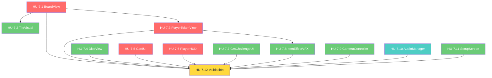

# Historias de Usuario — Épica 7: Capa de Presentación y UX

> **Épica:** [epic7.md](../epics/epic7.md)  
> **Prioridad:** 🟠 Media  
> **Sprint estimado:** 7–10  
> **Total HUs:** 12  
> **Dependencias externas:** Épicas 1–6 (todos los sistemas lógicos deben emitir eventos vía `GameEvents` para que la UI los observe)

---

## Índice de Historias

| ID | Título | Tipo | Prioridad | Estimación |
|---|---|---|---|---|
| HU-7.1 | BoardView — Representación Visual del Tablero | Funcional | 🔴 Crítica | 8 SP |
| HU-7.2 | TileVisual — Prefab y Estados Visuales de Casilla | Funcional | 🟡 Alta | 5 SP |
| HU-7.3 | PlayerTokenView — Fichas de Jugadores | Funcional | 🔴 Crítica | 5 SP |
| HU-7.4 | DiceView — Visualización Animada del Dado | Funcional | 🟡 Alta | 5 SP |
| HU-7.5 | CardUI — Interfaz de Preguntas y Respuestas | Funcional | 🔴 Crítica | 8 SP |
| HU-7.6 | PlayerHUD — Heads-Up Display del Jugador | Funcional | 🔴 Crítica | 5 SP |
| HU-7.7 | GmChallengeUI — Interfaz del Desafío del GM | Funcional | 🟡 Alta | 5 SP |
| HU-7.8 | ItemEffectVFX — Efectos Visuales de Ítems | Funcional | 🟡 Alta | 5 SP |
| HU-7.9 | CameraController — Sistema de Cámaras y Transiciones | Técnica | 🟡 Alta | 5 SP |
| HU-7.10 | AudioManager — Sonidos y Música | Funcional | 🟢 Media | 3 SP |
| HU-7.11 | SetupScreen — Pantalla de Configuración de Partida | Funcional | 🟡 Alta | 5 SP |
| HU-7.12 | Validación Visual e Integración UX | QA | 🔴 Crítica | 5 SP |

**Total estimado:** ~64 Story Points

---

## Definición de Done (Global para Épica 7)

Todas las HU de esta épica deben cumplir:

- [ ] Código compila sin errores ni warnings en Unity (`Unity_ReadConsole`)
- [ ] Se respetan las convenciones del [Architect.md](../../.agents/Architect.md):
  - Campos privados con `_camelCase`
  - Métodos en PascalCase con verbos de acción
- [ ] **La UI solo observa eventos del Core — nunca modifica la lógica directamente**
  - No se permite llamar métodos de sistemas Core desde la UI
  - La comunicación Core → UI es vía `GameEvents` (Observer)
  - La comunicación UI → Core es vía eventos de input (ej. `OnPlayerAnswerSubmitted`)
- [ ] No existe ningún `GameObject.Find()`, `FindObjectOfType()`, ni Singleton
- [ ] Dependencias inyectadas vía `[SerializeField]`
- [ ] Archivos ubicados en `Assets/Scripts/UI/` y prefabs en `Assets/Prefabs/`
- [ ] Responsive: funciona en resoluciones 1280×720 a 1920×1080 como mínimo
- [ ] Accesibilidad: textos con contraste legible, tamaño mínimo 14pt, no depender solo del color
- [ ] Documentación XML (`<summary>`) en todos los miembros públicos

---

## HU-7.1 — BoardView: Representación Visual del Tablero

### Descripción

**Como** jugador,  
**quiero** ver el tablero en pantalla con las casillas representadas visualmente,  
**para que** entienda mi progreso y el de los demás jugadores.

### Criterios de Aceptación

- [ ] Archivo: `Assets/Scripts/UI/BoardView.cs`
- [ ] Namespace: `ChronosAndCards.UI`
- [ ] MonoBehaviour (necesita acceso a escena, Transform, instanciación de prefabs):

```csharp
/// <summary>
/// Vista del tablero. Instancia y posiciona las casillas visuales
/// basándose en los datos del BoardManager.
/// Solo observa eventos del Core — nunca modifica la lógica.
/// </summary>
public class BoardView : MonoBehaviour
{
    [Header("Prefabs")]
    [SerializeField] private TileVisual _tilePrefab;
    [SerializeField] private LineRenderer _connectionLinePrefab;

    [Header("Layout Settings")]
    [SerializeField] private BoardLayoutConfig _layoutConfig;

    /// <summary>Referencias a las vistas de casilla instanciadas, indexadas por posición.</summary>
    private readonly List<TileVisual> _tileVisuals = new();

    /// <summary>Líneas de conexión entre casillas (modo Exploración).</summary>
    private readonly List<LineRenderer> _connectionLines = new();

    private void OnEnable()
    {
        GameEvents.OnBoardGenerated += OnBoardGenerated;
        GameEvents.OnBoardModified += OnBoardModified;
        GameEvents.OnTileDiscovered += OnTileDiscovered;
    }

    private void OnDisable()
    {
        GameEvents.OnBoardGenerated -= OnBoardGenerated;
        GameEvents.OnBoardModified -= OnBoardModified;
        GameEvents.OnTileDiscovered -= OnTileDiscovered;
    }

    /// <summary>
    /// Genera la representación visual completa del tablero.
    /// Instancia un TileVisual por cada ITile del BoardManager.
    /// </summary>
    private void OnBoardGenerated(List<ITile> tiles, BoardMode mode)
    {
        ClearBoard();

        for (int i = 0; i < tiles.Count; i++)
        {
            var tileVisual = Instantiate(_tilePrefab, transform);
            Vector3 position = CalculatePosition(i, tiles.Count, mode);
            tileVisual.Initialize(tiles[i], i, position);
            _tileVisuals.Add(tileVisual);
        }

        if (mode == BoardMode.Exploration)
        {
            GenerateConnectionLines();
            HideUndiscoveredTiles();
        }

        Debug.Log($"BoardView: Tablero renderizado con {tiles.Count} casillas " +
                  $"en modo {mode}.");
    }

    /// <summary>
    /// Calcula la posición de una casilla según el modo de layout.
    /// </summary>
    private Vector3 CalculatePosition(int index, int totalTiles, BoardMode mode)
    {
        if (mode == BoardMode.Linear)
            return CalculateSnakingPosition(index, totalTiles);
        else
            return CalculateGraphPosition(index, totalTiles);
    }

    /// <summary>
    /// Modo Lineal: ruta serpenteante (snaking path).
    /// Las casillas se disponen en filas que alternan dirección.
    /// </summary>
    private Vector3 CalculateSnakingPosition(int index, int totalTiles)
    {
        int tilesPerRow = _layoutConfig.TilesPerRow;
        int row = index / tilesPerRow;
        int col = index % tilesPerRow;

        // Alternar dirección cada fila
        if (row % 2 == 1)
            col = tilesPerRow - 1 - col;

        float x = col * _layoutConfig.TileSpacing;
        float y = -row * _layoutConfig.RowSpacing;

        return new Vector3(x, y, 0f);
    }

    /// <summary>
    /// Modo Exploración: layout de grafo con distribución radial o fuerza.
    /// Los nodos se distribuyen con separación uniforme.
    /// </summary>
    private Vector3 CalculateGraphPosition(int index, int totalTiles)
    {
        // Distribución en espiral para una visualización clara
        float angle = index * _layoutConfig.GraphAngleStep;
        float radius = _layoutConfig.GraphBaseRadius +
                       (index * _layoutConfig.GraphRadiusIncrement);

        float x = Mathf.Cos(angle * Mathf.Deg2Rad) * radius;
        float y = Mathf.Sin(angle * Mathf.Deg2Rad) * radius;

        return new Vector3(x, y, 0f);
    }

    /// <summary>Maneja el intercambio visual de casillas (BoardManipulation).</summary>
    private void OnBoardModified(ITile tileA, ITile tileB)
    {
        int indexA = _tileVisuals.FindIndex(tv => tv.TileData == tileA);
        int indexB = _tileVisuals.FindIndex(tv => tv.TileData == tileB);

        if (indexA >= 0 && indexB >= 0)
        {
            // Animar intercambio
            StartCoroutine(AnimateSwap(_tileVisuals[indexA], _tileVisuals[indexB]));
        }
    }

    /// <summary>Animación de intercambio de dos casillas.</summary>
    private IEnumerator AnimateSwap(TileVisual tileA, TileVisual tileB)
    {
        Vector3 posA = tileA.transform.position;
        Vector3 posB = tileB.transform.position;
        float duration = _layoutConfig.SwapAnimationDuration;
        float elapsed = 0f;

        while (elapsed < duration)
        {
            elapsed += Time.deltaTime;
            float t = Mathf.SmoothStep(0f, 1f, elapsed / duration);

            tileA.transform.position = Vector3.Lerp(posA, posB, t);
            tileB.transform.position = Vector3.Lerp(posB, posA, t);

            yield return null;
        }

        tileA.transform.position = posB;
        tileB.transform.position = posA;

        // Intercambiar datos internos
        tileA.UpdateTileData(tileB.TileData);
        tileB.UpdateTileData(tileA.TileData);
    }

    /// <summary>Revela una casilla en modo Exploración.</summary>
    private void OnTileDiscovered(int tileIndex)
    {
        if (tileIndex >= 0 && tileIndex < _tileVisuals.Count)
        {
            _tileVisuals[tileIndex].Reveal();
        }
    }

    /// <summary>Oculta casillas no descubiertas en modo Exploración.</summary>
    private void HideUndiscoveredTiles()
    {
        foreach (var tile in _tileVisuals)
        {
            if (!tile.TileData.IsDiscovered)
                tile.Hide();
        }
    }

    /// <summary>Genera líneas de conexión entre casillas adyacentes.</summary>
    private void GenerateConnectionLines() { /* ... */ }

    /// <summary>Destruye todas las casillas visuales.</summary>
    private void ClearBoard()
    {
        foreach (var tv in _tileVisuals)
            if (tv != null) Destroy(tv.gameObject);
        _tileVisuals.Clear();

        foreach (var line in _connectionLines)
            if (line != null) Destroy(line.gameObject);
        _connectionLines.Clear();
    }

    /// <summary>Retorna la posición mundial de una casilla por índice.</summary>
    public Vector3 GetTileWorldPosition(int index)
    {
        if (index >= 0 && index < _tileVisuals.Count)
            return _tileVisuals[index].transform.position;
        return Vector3.zero;
    }
}
```

#### BoardLayoutConfig (ScriptableObject)

- [ ] Archivo: `Assets/Scripts/Data/BoardLayoutConfig.cs`
- [ ] Namespace: `ChronosAndCards.Data`

```csharp
/// <summary>
/// Configuración del layout visual del tablero.
/// Define espaciados, tamaños y parámetros de animación.
/// </summary>
[CreateAssetMenu(fileName = "BoardLayoutConfig", menuName = "ChronosAndCards/BoardLayoutConfig")]
public class BoardLayoutConfig : ScriptableObject
{
    [Header("Modo Lineal (Snaking Path)")]
    [SerializeField] private int _tilesPerRow = 8;
    [SerializeField] private float _tileSpacing = 1.5f;
    [SerializeField] private float _rowSpacing = 1.5f;

    [Header("Modo Exploración (Graph)")]
    [SerializeField] private float _graphAngleStep = 45f;
    [SerializeField] private float _graphBaseRadius = 3f;
    [SerializeField] private float _graphRadiusIncrement = 0.5f;

    [Header("Animaciones")]
    [SerializeField] private float _swapAnimationDuration = 0.5f;
    [SerializeField] private float _discoverAnimationDuration = 0.3f;

    public int TilesPerRow => _tilesPerRow;
    public float TileSpacing => _tileSpacing;
    public float RowSpacing => _rowSpacing;
    public float GraphAngleStep => _graphAngleStep;
    public float GraphBaseRadius => _graphBaseRadius;
    public float GraphRadiusIncrement => _graphRadiusIncrement;
    public float SwapAnimationDuration => _swapAnimationDuration;
    public float DiscoverAnimationDuration => _discoverAnimationDuration;
}
```

- [ ] Dos modos de layout: **Lineal** (snaking path) y **Exploración** (graph/radial)
- [ ] Suscripción a: `OnBoardGenerated`, `OnBoardModified`, `OnTileDiscovered`
- [ ] `GetTileWorldPosition(int)` expuesto para que `PlayerTokenView` sepa dónde colocar fichas
- [ ] Animación suave de swap cuando se usa BoardManipulation
- [ ] Parámetros configurables vía `BoardLayoutConfig` ScriptableObject

### Notas de Implementación

- La `BoardView` es el componente más visual de toda la épica. Debe ser visualmente atractiva desde el primer momento.
- El snaking path se logra alternando la dirección de las columnas en cada fila (fila par: izq→der, fila impar: der→izq).
- En modo Exploración, las casillas no descubiertas están ocultas/difuminadas y se revelan con animación al acercarse.
- `GetTileWorldPosition()` es usado por `PlayerTokenView` para saber hacia dónde animar la ficha.

### Dependencias

- HU-7.2 (`TileVisual` prefab)
- Épica 2 (`BoardManager`, `ITile`, `BoardMode`)
- HU-1.9 (`GameEvents.OnBoardGenerated`, `OnBoardModified`)

---

## HU-7.2 — TileVisual: Prefab y Estados Visuales de Casilla

### Descripción

**Como** jugador,  
**quiero** que cada casilla tenga un aspecto visual único según su tipo,  
**para que** pueda anticipar el efecto de cada casilla antes de caer en ella.

### Criterios de Aceptación

- [ ] Archivo: `Assets/Scripts/UI/TileVisual.cs`
- [ ] Prefab: `Assets/Prefabs/Board/TileVisual.prefab`
- [ ] Namespace: `ChronosAndCards.UI`

```csharp
/// <summary>
/// Representación visual de una casilla individual del tablero.
/// Muestra el tipo, estado (normal/highlighted/discovered), y animaciones.
/// </summary>
public class TileVisual : MonoBehaviour
{
    [Header("Visual Components")]
    [SerializeField] private SpriteRenderer _background;
    [SerializeField] private SpriteRenderer _iconRenderer;
    [SerializeField] private TextMeshPro _positionLabel;
    [SerializeField] private GameObject _highlightEffect;
    [SerializeField] private GameObject _discoveryVFX;

    [Header("Tile Visual Config")]
    [SerializeField] private TileVisualConfig _visualConfig;

    /// <summary>Datos lógicos de la casilla asociada.</summary>
    public ITile TileData { get; private set; }

    /// <summary>Índice de posición en el tablero.</summary>
    public int TileIndex { get; private set; }

    /// <summary>Estado visual actual.</summary>
    private TileVisualState _currentState = TileVisualState.Normal;

    /// <summary>
    /// Inicializa la vista de la casilla con sus datos y posición.
    /// </summary>
    public void Initialize(ITile tileData, int index, Vector3 worldPosition)
    {
        TileData = tileData;
        TileIndex = index;
        transform.position = worldPosition;

        ApplyVisualStyle(tileData.TileType);
        _positionLabel.text = (index + 1).ToString();
        _highlightEffect.SetActive(false);
    }

    /// <summary>
    /// Aplica el estilo visual según el tipo de casilla.
    /// </summary>
    private void ApplyVisualStyle(TileType tileType)
    {
        var style = _visualConfig.GetStyle(tileType);
        _background.color = style.BackgroundColor;
        _iconRenderer.sprite = style.Icon;
        _iconRenderer.color = style.IconColor;
    }

    /// <summary>Actualiza los datos de la casilla (tras un swap).</summary>
    public void UpdateTileData(ITile newTileData)
    {
        TileData = newTileData;
        ApplyVisualStyle(newTileData.TileType);
    }

    /// <summary>Activa el efecto de highlight (casilla actual del jugador).</summary>
    public void SetHighlighted(bool highlighted)
    {
        _currentState = highlighted ? TileVisualState.Highlighted : TileVisualState.Normal;
        _highlightEffect.SetActive(highlighted);
    }

    /// <summary>Revela la casilla con animación (modo Exploración).</summary>
    public void Reveal()
    {
        _currentState = TileVisualState.Discovered;
        gameObject.SetActive(true);

        // Animación de revelación
        transform.localScale = Vector3.zero;
        StartCoroutine(AnimateReveal());
    }

    /// <summary>Oculta la casilla (modo Exploración, no descubierta).</summary>
    public void Hide()
    {
        _currentState = TileVisualState.Hidden;
        gameObject.SetActive(false);
    }

    /// <summary>Animación de revelación con scale + partículas.</summary>
    private IEnumerator AnimateReveal()
    {
        float duration = 0.3f;
        float elapsed = 0f;

        if (_discoveryVFX != null)
            _discoveryVFX.SetActive(true);

        while (elapsed < duration)
        {
            elapsed += Time.deltaTime;
            float t = Mathf.SmoothStep(0f, 1f, elapsed / duration);
            transform.localScale = Vector3.Lerp(Vector3.zero, Vector3.one, t);
            yield return null;
        }

        transform.localScale = Vector3.one;

        if (_discoveryVFX != null)
        {
            yield return new WaitForSeconds(0.5f);
            _discoveryVFX.SetActive(false);
        }
    }
}

/// <summary>Estados visuales de una casilla.</summary>
public enum TileVisualState
{
    /// <summary>Estado normal, visible.</summary>
    Normal,

    /// <summary>Casilla donde está el jugador activo.</summary>
    Highlighted,

    /// <summary>Casilla descubierta (modo Exploración).</summary>
    Discovered,

    /// <summary>Casilla oculta (modo Exploración, no descubierta).</summary>
    Hidden
}
```

#### TileVisualConfig (ScriptableObject)

- [ ] Archivo: `Assets/Scripts/Data/TileVisualConfig.cs`
- [ ] Namespace: `ChronosAndCards.Data`

```csharp
/// <summary>
/// Configuración visual para cada tipo de casilla.
/// Define color, ícono y estilo por TileType.
/// </summary>
[CreateAssetMenu(fileName = "TileVisualConfig", menuName = "ChronosAndCards/TileVisualConfig")]
public class TileVisualConfig : ScriptableObject
{
    [SerializeField] private List<TileStyle> _styles = new();

    /// <summary>Retorna el estilo visual para un tipo de casilla.</summary>
    public TileStyle GetStyle(TileType tileType)
    {
        var style = _styles.FirstOrDefault(s => s.TileType == tileType);
        return style ?? _styles.FirstOrDefault(); // Fallback al primer estilo
    }
}

/// <summary>Estilo visual de un tipo de casilla.</summary>
[System.Serializable]
public class TileStyle
{
    public TileType TileType;
    public Color BackgroundColor = Color.white;
    public Sprite Icon;
    public Color IconColor = Color.white;
    [TextArea(1, 2)] public string TooltipText;
}
```

#### Paleta de colores por tipo

| Tipo de Casilla | Color de Fondo | Ícono | Nota |
|---|---|---|---|
| Start | Blanco (#FFFFFF) | 🏁 | Casilla de inicio |
| Finish | Dorado (#FFD700) | 🏆 | Meta |
| Neutral | Gris claro (#D3D3D3) | — | Sin efecto |
| HintBoost | Verde (#4CAF50) | ✦ | +1 Pista |
| HintTrap | Rojo (#F44336) | ✧ | -1 Pista |
| Event | Amarillo (#FFC107) | ⚡ | Evento aleatorio |
| Item | Púrpura (#9C27B0) | 🎁 | Objeto del mazo |

- [ ] Colores configurables vía `TileVisualConfig` ScriptableObject
- [ ] Íconos como Sprites asignados en el Inspector
- [ ] Tooltip con descripción del efecto al hacer hover (futuro)

### Notas de Implementación

- El prefab `TileVisual` debe ser lo más liviano posible ya que se instanciará decenas de veces (tableros de 20–50 casillas).
- Usar `SpriteRenderer` en lugar de UI Canvas para el tablero 2D/3D. Si se decide que el tablero es puramente UI, migrar a `Image` dentro de un Canvas.
- La animación de revelación en modo Exploración es un scale de 0→1 con SmoothStep para suavidad.

### Dependencias

- HU-7.1 (`BoardView` instancia este prefab)
- Épica 2 (`ITile`, `TileType`)

---

## HU-7.3 — PlayerTokenView: Fichas de Jugadores

### Descripción

**Como** jugador,  
**quiero** ver mi ficha moverse por el tablero cuando avanzo,  
**para que** el progreso sea visualmente claro y satisfactorio.

### Criterios de Aceptación

- [ ] Archivo: `Assets/Scripts/UI/PlayerTokenView.cs`
- [ ] Prefab: `Assets/Prefabs/Players/PlayerToken.prefab`
- [ ] Namespace: `ChronosAndCards.UI`

```csharp
/// <summary>
/// Vista de la ficha de un jugador en el tablero.
/// Se suscribe a eventos de movimiento y anima el desplazamiento
/// casilla por casilla con easing.
/// </summary>
public class PlayerTokenView : MonoBehaviour
{
    [Header("Visual")]
    [SerializeField] private SpriteRenderer _tokenSprite;
    [SerializeField] private TextMeshPro _playerLabel;
    [SerializeField] private TrailRenderer _moveTrail;

    [Header("Animation")]
    [SerializeField] private float _moveTimePerTile = 0.3f;
    [SerializeField] private AnimationCurve _movementCurve = AnimationCurve.EaseInOut(0, 0, 1, 1);
    [SerializeField] private float _bounceHeight = 0.3f;
    [SerializeField] private float _stackOffset = 0.4f;

    /// <summary>Jugador asociado a esta ficha.</summary>
    public IPlayer Player { get; private set; }

    /// <summary>Referencia a la BoardView para obtener posiciones.</summary>
    private BoardView _boardView;

    /// <summary>Posición actual en el tablero.</summary>
    private int _currentTileIndex;

    /// <summary>Indica si la ficha está en movimiento.</summary>
    public bool IsMoving { get; private set; }

    /// <summary>
    /// Inicializa la ficha con los datos del jugador.
    /// </summary>
    public void Initialize(IPlayer player, BoardView boardView, Color playerColor)
    {
        Player = player;
        _boardView = boardView;
        _currentTileIndex = player.CurrentPosition;

        _tokenSprite.color = playerColor;
        _playerLabel.text = player.PlayerName[0].ToString().ToUpper();

        transform.position = _boardView.GetTileWorldPosition(_currentTileIndex);
    }

    /// <summary>
    /// Anima el movimiento de la ficha de la posición actual a la nueva,
    /// pasando por cada casilla intermedia.
    /// </summary>
    public IEnumerator AnimateMoveTo(int targetTileIndex)
    {
        if (IsMoving) yield break;
        IsMoving = true;

        int direction = targetTileIndex > _currentTileIndex ? 1 : -1;

        // Mover casilla por casilla
        while (_currentTileIndex != targetTileIndex)
        {
            int nextIndex = _currentTileIndex + direction;
            Vector3 startPos = _boardView.GetTileWorldPosition(_currentTileIndex);
            Vector3 endPos = _boardView.GetTileWorldPosition(nextIndex);

            yield return StartCoroutine(AnimateSingleStep(startPos, endPos));

            _currentTileIndex = nextIndex;
        }

        IsMoving = false;
    }

    /// <summary>Anima un paso individual entre dos casillas con bounce.</summary>
    private IEnumerator AnimateSingleStep(Vector3 from, Vector3 to)
    {
        float elapsed = 0f;

        if (_moveTrail != null)
            _moveTrail.emitting = true;

        while (elapsed < _moveTimePerTile)
        {
            elapsed += Time.deltaTime;
            float t = elapsed / _moveTimePerTile;
            float curveT = _movementCurve.Evaluate(t);

            // Interpolación horizontal
            Vector3 pos = Vector3.Lerp(from, to, curveT);

            // Bounce vertical (arco parabólico)
            float bounce = _bounceHeight * Mathf.Sin(t * Mathf.PI);
            pos.y += bounce;

            transform.position = pos;
            yield return null;
        }

        transform.position = to;

        if (_moveTrail != null)
            _moveTrail.emitting = false;
    }

    /// <summary>
    /// Animación especial para intercambio de posiciones (Duelo).
    /// Las fichas se cruzan con una animación de arco cruzado.
    /// </summary>
    public IEnumerator AnimateSwapWith(PlayerTokenView otherToken, float duration = 0.8f)
    {
        Vector3 startA = transform.position;
        Vector3 startB = otherToken.transform.position;
        float elapsed = 0f;

        while (elapsed < duration)
        {
            elapsed += Time.deltaTime;
            float t = Mathf.SmoothStep(0f, 1f, elapsed / duration);

            // Arcos cruzados: cada ficha sube en la primera mitad y baja en la segunda
            float arcA = Mathf.Sin(t * Mathf.PI) * 1.5f;
            float arcB = Mathf.Sin(t * Mathf.PI) * 1.5f;

            Vector3 posA = Vector3.Lerp(startA, startB, t);
            posA.y += arcA;
            transform.position = posA;

            Vector3 posB = Vector3.Lerp(startB, startA, t);
            posB.y += arcB;
            otherToken.transform.position = posB;

            yield return null;
        }

        transform.position = startB;
        otherToken.transform.position = startA;

        // Actualizar índices
        int tempIndex = _currentTileIndex;
        _currentTileIndex = otherToken._currentTileIndex;
        otherToken._currentTileIndex = tempIndex;
    }

    /// <summary>
    /// Aplica un offset visual cuando múltiples fichas están en la misma casilla.
    /// </summary>
    public void ApplyStackOffset(int stackIndex, int totalStacked)
    {
        if (totalStacked <= 1) return;

        float offset = (stackIndex - (totalStacked - 1) / 2f) * _stackOffset;
        Vector3 pos = _boardView.GetTileWorldPosition(_currentTileIndex);
        pos.x += offset;
        transform.position = pos;
    }
}
```

- [ ] Suscripción a `GameEvents.OnPlayerMoved(IPlayer, int fromPos, int toPos)`
- [ ] Movimiento casilla por casilla con `AnimationCurve` configurable
- [ ] Bounce vertical parabólico durante cada paso (sensación de "salto")
- [ ] TrailRenderer opcional para dejar rastro visual
- [ ] Animación especial para intercambio de posiciones (Duelo): arcos cruzados
- [ ] Stack offset cuando múltiples fichas están en la misma casilla
- [ ] Personalización: color por jugador, inicial en label

#### PlayerTokenManager

- [ ] Archivo: `Assets/Scripts/UI/PlayerTokenManager.cs`
- [ ] Gestiona la instanciación y el control de todas las fichas
- [ ] Suscribe a `OnPlayerMoved` y delega la animación a la ficha correcta
- [ ] Detecta fichas en la misma casilla y aplica stack offsets

### Notas de Implementación

- GDD: _"La ficha se desplaza casilla por casilla."_ — No teletransportar, animar paso a paso.
- El bounce con `Mathf.Sin(t * PI)` crea un arco suave: sube al 50% del recorrido y baja al final.
- `AnimationCurve` permite al diseñador ajustar el easing desde el Inspector (ease-in-out por defecto).
- El stack offset evita que fichas se superpongan cuando 2+ jugadores están en la misma casilla.

### Dependencias

- HU-7.1 (`BoardView.GetTileWorldPosition()`)
- HU-1.9 (`GameEvents.OnPlayerMoved`)
- Épica 3 (`MovementState` emite `OnPlayerMoved`)

---

## HU-7.4 — DiceView: Visualización Animada del Dado

### Descripción

**Como** jugador,  
**quiero** ver un dado rodar con animación cuando tiro,  
**para que** la experiencia de lanzamiento sea inmersiva.

### Criterios de Aceptación

- [ ] Archivo: `Assets/Scripts/UI/DiceView.cs`
- [ ] Namespace: `ChronosAndCards.UI`

```csharp
/// <summary>
/// Visualización animada del dado.
/// Se suscribe a OnDiceRolled y orquesta la animación de lanzamiento,
/// rebote y revelación del resultado.
/// </summary>
public class DiceView : MonoBehaviour
{
    [Header("Dice Object")]
    [SerializeField] private GameObject _diceModel;
    [SerializeField] private Transform _diceSpawnPoint;
    [SerializeField] private Transform _diceResultPoint;

    [Header("Animation")]
    [SerializeField] private float _rollDuration = 1.5f;
    [SerializeField] private float _rotationSpeed = 720f;
    [SerializeField] private AnimationCurve _rollCurve;
    [SerializeField] private int _bounceCount = 3;

    [Header("Result Display")]
    [SerializeField] private TextMeshProUGUI _resultText;
    [SerializeField] private ParticleSystem _resultParticles;
    [SerializeField] private float _resultDisplayDuration = 1f;

    [Header("Face Sprites")]
    [SerializeField] private Sprite[] _diceFaces; // 6 sprites para cada cara

    private bool _isRolling;

    private void OnEnable()
    {
        GameEvents.OnDiceRollStarted += OnDiceRollStarted;
        GameEvents.OnDiceRolled += OnDiceResult;
    }

    private void OnDisable()
    {
        GameEvents.OnDiceRollStarted -= OnDiceRollStarted;
        GameEvents.OnDiceRolled -= OnDiceResult;
    }

    /// <summary>Inicia la animación de lanzamiento del dado.</summary>
    private void OnDiceRollStarted(IPlayer player)
    {
        _diceModel.SetActive(true);
        StartCoroutine(AnimateRoll());
    }

    /// <summary>Muestra el resultado final del dado.</summary>
    private void OnDiceResult(IPlayer player, int result)
    {
        StartCoroutine(ShowResult(result));
    }

    /// <summary>
    /// Animación de lanzamiento: rotación rápida + rebotes decrecientes.
    /// </summary>
    private IEnumerator AnimateRoll()
    {
        _isRolling = true;
        float elapsed = 0f;

        _diceModel.transform.position = _diceSpawnPoint.position;

        while (elapsed < _rollDuration)
        {
            elapsed += Time.deltaTime;
            float t = elapsed / _rollDuration;

            // Rotación decreciente
            float rotSpeed = Mathf.Lerp(_rotationSpeed, 0f, _rollCurve.Evaluate(t));
            _diceModel.transform.Rotate(Vector3.right * rotSpeed * Time.deltaTime);
            _diceModel.transform.Rotate(Vector3.up * rotSpeed * 0.7f * Time.deltaTime);

            // Bouncing decreciente
            float bounceHeight = Mathf.Abs(Mathf.Sin(t * _bounceCount * Mathf.PI))
                                 * (1f - t) * 2f;
            Vector3 pos = Vector3.Lerp(
                _diceSpawnPoint.position, _diceResultPoint.position, t);
            pos.y += bounceHeight;
            _diceModel.transform.position = pos;

            yield return null;
        }

        _isRolling = false;
        _diceModel.transform.position = _diceResultPoint.position;
    }

    /// <summary>
    /// Muestra el resultado con énfasis visual: zoom, glow, partículas.
    /// </summary>
    private IEnumerator ShowResult(int result)
    {
        // Mostrar número
        _resultText.text = result.ToString();
        _resultText.gameObject.SetActive(true);

        // Partículas
        if (_resultParticles != null)
            _resultParticles.Play();

        // Scale punch
        yield return StartCoroutine(ScalePunch(_resultText.transform));

        // Esperar
        yield return new WaitForSeconds(_resultDisplayDuration);

        // Ocultar
        _resultText.gameObject.SetActive(false);
        _diceModel.SetActive(false);
    }

    /// <summary>Efecto de "punch" en escala para impacto visual.</summary>
    private IEnumerator ScalePunch(Transform target)
    {
        Vector3 original = target.localScale;
        Vector3 punched = original * 1.5f;
        float duration = 0.2f;
        float elapsed = 0f;

        while (elapsed < duration)
        {
            elapsed += Time.deltaTime;
            float t = elapsed / duration;
            target.localScale = Vector3.Lerp(
                t < 0.5f ? original : punched,
                t < 0.5f ? punched : original,
                t < 0.5f ? t * 2f : (t - 0.5f) * 2f);
            yield return null;
        }

        target.localScale = original;
    }
}
```

- [ ] Suscripción a: `OnDiceRollStarted`, `OnDiceRolled`
- [ ] Animación de lanzamiento: rotación rápida decreciente + rebotes
- [ ] Resultado con énfasis visual: scale punch, partículas, glow
- [ ] `AnimationCurve` configurable para el decay de la rotación
- [ ] 6 sprites de caras del dado (o modelo 3D con rotación final correcta)
- [ ] Sonidos: lanzamiento, rebotes, resultado (delegados a `AudioManager`)

### Notas de Implementación

- La animación del dado es pre-renderizada (no usa físicas reales para la visualización). El resultado ya está determinado por `DiceRoller` (Épica 3); la vista solo lo muestra de forma atractiva.
- Si se usa un dado 3D, la rotación final debe coincidir con la cara del resultado. Esto requiere un mapeo rotación→cara o un snap final al ángulo correcto.
- Los rebotes decrecientes se logran con `Sin(t * bounceCount * PI) * (1 - t)`.

### Dependencias

- HU-1.9 (`GameEvents.OnDiceRollStarted`, `OnDiceRolled`)
- Épica 3 (`DiceRoller` emite los eventos)
- HU-7.10 (`AudioManager` para sonidos)

---

## HU-7.5 — CardUI: Interfaz de Preguntas y Respuestas

### Descripción

**Como** jugador,  
**quiero** ver la pregunta presentada en una carta visual atractiva,  
**para que** la experiencia de responder sea clara y agradable.

### Criterios de Aceptación

- [ ] Archivo: `Assets/Scripts/UI/CardUI.cs`
- [ ] Prefab: `Assets/Prefabs/UI/CardPanel.prefab`
- [ ] Namespace: `ChronosAndCards.UI`

```csharp
/// <summary>
/// Interfaz visual de la carta de pregunta.
/// Presenta la pregunta, opciones, campo de texto, pista y timer.
/// Se suscribe a eventos del Core y emite eventos de input del jugador.
/// </summary>
public class CardUI : MonoBehaviour
{
    [Header("Card Layout")]
    [SerializeField] private CanvasGroup _cardCanvasGroup;
    [SerializeField] private Image _cardBackground;
    [SerializeField] private Image _difficultyBar;

    [Header("Question")]
    [SerializeField] private TextMeshProUGUI _questionText;
    [SerializeField] private TextMeshProUGUI _difficultyLabel;

    [Header("Options")]
    [SerializeField] private Transform _optionsContainer;
    [SerializeField] private Button _optionButtonPrefab;
    [SerializeField] private Button _revealOptionsButton;
    [SerializeField] private GameObject _sabotagedOverlay;

    [Header("Open Answer")]
    [SerializeField] private TMP_InputField _answerInput;
    [SerializeField] private Button _submitButton;

    [Header("Hint")]
    [SerializeField] private Button _useHintButton;
    [SerializeField] private TextMeshProUGUI _hintText;
    [SerializeField] private GameObject _hintPanel;

    [Header("Timer")]
    [SerializeField] private Image _timerFill;
    [SerializeField] private TextMeshProUGUI _timerText;

    [Header("Feedback")]
    [SerializeField] private GameObject _correctFeedback;
    [SerializeField] private GameObject _incorrectFeedback;
    [SerializeField] private ParticleSystem _correctParticles;

    [Header("Animation")]
    [SerializeField] private float _flipDuration = 0.4f;
    [SerializeField] private float _feedbackDuration = 1.5f;

    /// <summary>Carta actual mostrada.</summary>
    private CardData _currentCard;

    /// <summary>Opciones instanciadas.</summary>
    private readonly List<Button> _optionButtons = new();

    private void OnEnable()
    {
        GameEvents.OnCardDrawn += OnCardDrawn;
        GameEvents.OnHintRevealed += OnHintRevealed;
        GameEvents.OnAnswerEvaluated += OnAnswerEvaluated;
        GameEvents.OnDebuffApplied += OnDebuffApplied;
    }

    private void OnDisable()
    {
        GameEvents.OnCardDrawn -= OnCardDrawn;
        GameEvents.OnHintRevealed -= OnHintRevealed;
        GameEvents.OnAnswerEvaluated -= OnAnswerEvaluated;
        GameEvents.OnDebuffApplied -= OnDebuffApplied;
    }

    /// <summary>Presenta una nueva carta con animación de flip.</summary>
    private void OnCardDrawn(CardData card, IPlayer player)
    {
        _currentCard = card;
        StartCoroutine(PresentCard(card, player));
    }

    /// <summary>Animación de presentación de carta.</summary>
    private IEnumerator PresentCard(CardData card, IPlayer player)
    {
        // 1. Flip animation (aparece la carta)
        yield return StartCoroutine(FlipAnimation());

        // 2. Poblar contenido
        _questionText.text = card.QuestionText;
        _difficultyLabel.text = $"Nivel {card.DifficultyLevel}";
        _difficultyBar.color = GetDifficultyColor(card.DifficultyLevel);

        // 3. Configurar opciones (ocultas inicialmente)
        SetupOptions(card);

        // 4. Configurar hint button
        _useHintButton.interactable = !string.IsNullOrEmpty(card.Hint);
        _hintPanel.SetActive(false);

        // 5. Mostrar campo de respuesta abierta
        _answerInput.text = "";
        _answerInput.gameObject.SetActive(true);

        // 6. Resetear feedback
        _correctFeedback.SetActive(false);
        _incorrectFeedback.SetActive(false);
        _sabotagedOverlay.SetActive(false);
    }

    /// <summary>Configura los botones de opciones (ocultos inicialmente).</summary>
    private void SetupOptions(CardData card)
    {
        // Limpiar opciones previas
        foreach (var btn in _optionButtons)
            Destroy(btn.gameObject);
        _optionButtons.Clear();

        if (card.Options == null || card.Options.Count == 0)
        {
            _revealOptionsButton.gameObject.SetActive(false);
            return;
        }

        _revealOptionsButton.gameObject.SetActive(true);
        _optionsContainer.gameObject.SetActive(false);

        foreach (var option in card.Options)
        {
            var btn = Instantiate(_optionButtonPrefab, _optionsContainer);
            btn.GetComponentInChildren<TextMeshProUGUI>().text = option;
            string capturedOption = option;
            btn.onClick.AddListener(() => OnOptionSelected(capturedOption));
            _optionButtons.Add(btn);
        }
    }

    /// <summary>Revela las opciones con animación (penaliza multiplicador).</summary>
    public void OnRevealOptionsClicked()
    {
        _optionsContainer.gameObject.SetActive(true);
        _revealOptionsButton.gameObject.SetActive(false);

        // Notificar al Core que las opciones fueron reveladas
        GameEvents.OnPlayerRevealedOptions?.Invoke();

        // Animación de entrada por opción
        StartCoroutine(AnimateOptionsReveal());
    }

    /// <summary>Callback cuando el jugador selecciona una opción.</summary>
    private void OnOptionSelected(string option)
    {
        _answerInput.text = option;
        OnSubmitAnswer();
    }

    /// <summary>Envía la respuesta del jugador al Core.</summary>
    public void OnSubmitAnswer()
    {
        string answer = _answerInput.text.Trim();
        if (string.IsNullOrEmpty(answer)) return;

        GameEvents.OnPlayerAnswerSubmitted?.Invoke(answer);
    }

    /// <summary>Solicita uso de pista al Core.</summary>
    public void OnUseHintClicked()
    {
        GameEvents.OnPlayerRequestedHint?.Invoke();
    }

    /// <summary>Muestra la pista revelada con animación.</summary>
    private void OnHintRevealed(string hintText)
    {
        _hintPanel.SetActive(true);
        _hintText.text = hintText;
        _useHintButton.interactable = false;

        StartCoroutine(AnimateHintReveal());
    }

    /// <summary>Muestra feedback de respuesta correcta/incorrecta.</summary>
    private void OnAnswerEvaluated(bool isCorrect, PerformanceMultiplier multiplier)
    {
        StartCoroutine(ShowAnswerFeedback(isCorrect));
    }

    /// <summary>Aplica efecto visual de sabotaje (opciones bloqueadas).</summary>
    private void OnDebuffApplied(IPlayer attacker, IPlayer target, string debuffName)
    {
        if (debuffName == "Sabotaje de Opciones")
        {
            _sabotagedOverlay.SetActive(true);
            _revealOptionsButton.gameObject.SetActive(false);
            _optionsContainer.gameObject.SetActive(false);
        }
    }

    /// <summary>Animación de feedback con partículas y shake.</summary>
    private IEnumerator ShowAnswerFeedback(bool isCorrect)
    {
        if (isCorrect)
        {
            _correctFeedback.SetActive(true);
            if (_correctParticles != null) _correctParticles.Play();
        }
        else
        {
            _incorrectFeedback.SetActive(true);
            StartCoroutine(ShakeAnimation(transform, 0.3f, 10f));
        }

        yield return new WaitForSeconds(_feedbackDuration);

        _correctFeedback.SetActive(false);
        _incorrectFeedback.SetActive(false);

        // Ocultar carta
        StartCoroutine(DismissCard());
    }

    /// <summary>Color degradado por nivel de dificultad.</summary>
    private Color GetDifficultyColor(int level)
    {
        return level switch
        {
            1 => new Color(0.30f, 0.69f, 0.31f), // Verde
            2 => new Color(0.55f, 0.76f, 0.29f), // Verde claro
            3 => new Color(1.00f, 0.76f, 0.03f), // Amarillo
            4 => new Color(1.00f, 0.60f, 0.00f), // Naranja
            5 => new Color(0.96f, 0.26f, 0.21f), // Rojo
            6 => new Color(0.61f, 0.15f, 0.69f), // Púrpura
            _ => Color.gray
        };
    }

    // Animaciones auxiliares: FlipAnimation, AnimateOptionsReveal,
    // AnimateHintReveal, ShakeAnimation, DismissCard...
    private IEnumerator FlipAnimation() { /* Scale X: 1→0→1 con cambio de contenido */ yield break; }
    private IEnumerator AnimateOptionsReveal() { /* Fade-in secuencial por opción */ yield break; }
    private IEnumerator AnimateHintReveal() { /* Slide-down del panel de pista */ yield break; }
    private IEnumerator ShakeAnimation(Transform t, float dur, float mag) { /* Shake horizontal */ yield break; }
    private IEnumerator DismissCard() { /* Scale 1→0 o fade out */ yield break; }
}
```

- [ ] Suscripción a: `OnCardDrawn`, `OnHintRevealed`, `OnAnswerEvaluated`, `OnDebuffApplied`
- [ ] Emite hacia Core: `OnPlayerAnswerSubmitted`, `OnPlayerRevealedOptions`, `OnPlayerRequestedHint`
- [ ] Layout: header de dificultad (color degradado 1–6), pregunta, opciones ocultas, campo de texto, pista
- [ ] Animación de entrada: flip (scale X: 1→0→1)
- [ ] Feedback: correcta (verde, checkmark, partículas) / incorrecta (rojo, shake)
- [ ] Sabotaje: overlay rojo, opciones bloqueadas
- [ ] Timer visual (barra de progreso) si hay límite de tiempo
- [ ] Opciones se muestran solo al pulsar "Revelar Opciones"

#### Eventos nuevos (UI → Core)

- [ ] `GameEvents.OnPlayerAnswerSubmitted(string answer)` — jugador envía respuesta
- [ ] `GameEvents.OnPlayerRevealedOptions()` — jugador revela opciones (penaliza multiplicador)
- [ ] `GameEvents.OnPlayerRequestedHint()` — jugador solicita pista

### Notas de Implementación

- La `CardUI` es la interfaz más interactiva. Debe ser clara, legible y responsive.
- Las opciones están ocultas por defecto. Revelarlas penaliza el multiplicador, por lo que el jugador puede intentar responder sin verlas para obtener `x1.0`.
- El campo de texto libre está siempre visible — el jugador puede escribir directamente o seleccionar una opción revelada.
- La animación de flip crea la ilusión de "voltear" la carta: scale X va de 1 a 0 (se oculta el frente), se cambia el contenido, y de 0 a 1 (se muestra el dorso con la pregunta).

### Dependencias

- HU-1.9 (`GameEvents.OnCardDrawn`, `OnHintRevealed`, `OnAnswerEvaluated`)
- HU-1.5 (`CardData`)
- HU-1.4 (`PerformanceMultiplier`)
- Épica 3 (`CardDrawState` emite `OnCardDrawn`)
- Épica 4 (`HintSystem` emite `OnHintRevealed`)
- Épica 5 (`OnDebuffApplied` para Sabotaje)

---

## HU-7.6 — PlayerHUD: Heads-Up Display del Jugador

### Descripción

**Como** jugador,  
**quiero** ver en todo momento mi información relevante (pistas, inventario, posición),  
**para que** pueda tomar decisiones informadas.

### Criterios de Aceptación

- [ ] Archivo: `Assets/Scripts/UI/PlayerHUD.cs`
- [ ] Prefab: `Assets/Prefabs/UI/PlayerHUDPanel.prefab`
- [ ] Namespace: `ChronosAndCards.UI`

```csharp
/// <summary>
/// Panel HUD individual para un jugador.
/// Muestra nombre, posición, pistas, inventario, estados activos,
/// e indicador de turno activo.
/// </summary>
public class PlayerHUD : MonoBehaviour
{
    [Header("Player Info")]
    [SerializeField] private TextMeshProUGUI _playerNameText;
    [SerializeField] private Image _playerColorIndicator;
    [SerializeField] private TextMeshProUGUI _positionText;

    [Header("Hints")]
    [SerializeField] private TextMeshProUGUI _hintCountText;
    [SerializeField] private Image _hintIcon;

    [Header("Inventory")]
    [SerializeField] private Transform _inventoryIconsContainer;
    [SerializeField] private Image _itemIconPrefab;

    [Header("Status Effects")]
    [SerializeField] private Transform _statusEffectsContainer;
    [SerializeField] private Image _statusEffectIconPrefab;

    [Header("Turn Indicator")]
    [SerializeField] private GameObject _activeTurnGlow;
    [SerializeField] private CanvasGroup _hudCanvasGroup;

    /// <summary>Jugador asociado a este HUD.</summary>
    private IPlayer _player;

    /// <summary>Íconos de ítems instanciados.</summary>
    private readonly List<Image> _itemIcons = new();

    /// <summary>Íconos de status instanciados.</summary>
    private readonly List<Image> _statusIcons = new();

    /// <summary>Inicializa el HUD con los datos del jugador.</summary>
    public void Initialize(IPlayer player, Color playerColor)
    {
        _player = player;
        _playerNameText.text = player.PlayerName;
        _playerColorIndicator.color = playerColor;

        UpdatePosition(player.CurrentPosition);
        UpdateHintCount(player.HintCount);
        UpdateInventory();
        UpdateStatusEffects();
        SetActiveTurn(false);
    }

    /// <summary>Actualiza la posición mostrada.</summary>
    public void UpdatePosition(int position)
    {
        _positionText.text = $"Pos: {position + 1}";
    }

    /// <summary>Actualiza el contador de pistas con animación.</summary>
    public void UpdateHintCount(int count)
    {
        _hintCountText.text = count.ToString();
        StartCoroutine(PulseAnimation(_hintIcon.transform));
    }

    /// <summary>Reconstruye los íconos del inventario.</summary>
    public void UpdateInventory()
    {
        // Limpiar íconos previos
        foreach (var icon in _itemIcons)
            if (icon != null) Destroy(icon.gameObject);
        _itemIcons.Clear();

        foreach (var item in _player.Inventory.Items)
        {
            var icon = Instantiate(_itemIconPrefab, _inventoryIconsContainer);
            icon.sprite = item.Icon;

            // Tooltip al hover (futuro)
            _itemIcons.Add(icon);
        }
    }

    /// <summary>Reconstruye los íconos de estados activos.</summary>
    public void UpdateStatusEffects()
    {
        foreach (var icon in _statusIcons)
            if (icon != null) Destroy(icon.gameObject);
        _statusIcons.Clear();

        foreach (var effect in _player.ActiveEffects)
        {
            if (!effect.IsActive) continue;
            var icon = Instantiate(_statusEffectIconPrefab, _statusEffectsContainer);
            // Asignar sprite según tipo de efecto
            _statusIcons.Add(icon);
        }
    }

    /// <summary>Activa/desactiva el indicador de turno activo.</summary>
    public void SetActiveTurn(bool isActive)
    {
        _activeTurnGlow.SetActive(isActive);
        _hudCanvasGroup.alpha = isActive ? 1f : 0.7f;
    }

    /// <summary>Animación de pulso en un transform (para feedback de cambio).</summary>
    private IEnumerator PulseAnimation(Transform target)
    {
        Vector3 original = target.localScale;
        target.localScale = original * 1.3f;

        float elapsed = 0f;
        float duration = 0.2f;

        while (elapsed < duration)
        {
            elapsed += Time.deltaTime;
            target.localScale = Vector3.Lerp(original * 1.3f, original, elapsed / duration);
            yield return null;
        }

        target.localScale = original;
    }
}
```

#### HUDManager (Orquestador de todos los HUDs)

- [ ] Archivo: `Assets/Scripts/UI/HUDManager.cs`

```csharp
/// <summary>
/// Gestiona todos los paneles HUD de los jugadores.
/// Se suscribe a eventos del Core y delega a los HUDs individuales.
/// </summary>
public class HUDManager : MonoBehaviour
{
    [SerializeField] private PlayerHUD _hudPrefab;
    [SerializeField] private Transform _hudContainer;
    [SerializeField] private Color[] _playerColors;

    private readonly Dictionary<IPlayer, PlayerHUD> _playerHuds = new();

    private void OnEnable()
    {
        GameEvents.OnGameStarted += OnGameStarted;
        GameEvents.OnPlayerMoved += OnPlayerMoved;
        GameEvents.OnHintChanged += OnHintChanged;
        GameEvents.OnInventoryChanged += OnInventoryChanged;
        GameEvents.OnStatusEffectApplied += OnStatusEffectChanged;
        GameEvents.OnStatusEffectExpired += OnStatusEffectChanged;
        GameEvents.OnTurnStarted += OnTurnStarted;
    }

    private void OnDisable()
    {
        GameEvents.OnGameStarted -= OnGameStarted;
        GameEvents.OnPlayerMoved -= OnPlayerMoved;
        GameEvents.OnHintChanged -= OnHintChanged;
        GameEvents.OnInventoryChanged -= OnInventoryChanged;
        GameEvents.OnStatusEffectApplied -= OnStatusEffectChanged;
        GameEvents.OnStatusEffectExpired -= OnStatusEffectChanged;
        GameEvents.OnTurnStarted -= OnTurnStarted;
    }

    /// <summary>Instancia HUDs para todos los jugadores al inicio.</summary>
    private void OnGameStarted(List<IPlayer> players)
    {
        for (int i = 0; i < players.Count; i++)
        {
            var hud = Instantiate(_hudPrefab, _hudContainer);
            var color = i < _playerColors.Length ? _playerColors[i] : Color.white;
            hud.Initialize(players[i], color);
            _playerHuds[players[i]] = hud;
        }
    }

    private void OnPlayerMoved(IPlayer player, int from, int to)
    {
        if (_playerHuds.TryGetValue(player, out var hud))
            hud.UpdatePosition(to);
    }

    private void OnHintChanged(IPlayer player, int newCount)
    {
        if (_playerHuds.TryGetValue(player, out var hud))
            hud.UpdateHintCount(newCount);
    }

    private void OnInventoryChanged(IPlayer player, IItem item, InventoryAction action)
    {
        if (_playerHuds.TryGetValue(player, out var hud))
            hud.UpdateInventory();
    }

    private void OnStatusEffectChanged(IPlayer player, IStatusEffect effect)
    {
        if (_playerHuds.TryGetValue(player, out var hud))
            hud.UpdateStatusEffects();
    }

    private void OnTurnStarted(IPlayer activePlayer)
    {
        foreach (var kvp in _playerHuds)
            kvp.Value.SetActiveTurn(kvp.Key == activePlayer);
    }
}
```

- [ ] Panel por jugador con: nombre, color, posición, pistas, inventario, estados activos, indicador de turno
- [ ] Layout adaptable para 2–6 jugadores (LayoutGroup horizontal o vertical)
- [ ] Animación de pulso en cambios de pistas (+/-)
- [ ] Íconos de ítems con tooltip al hover (descripción)
- [ ] Íconos de estados activos (Escudo de Inmunidad, Pista Dorada)
- [ ] Indicador de turno activo: glow + opacidad 100% (inactivos al 70%)
- [ ] `HUDManager` orquesta todos los HUDs suscribiéndose a `GameEvents`

### Notas de Implementación

- El HUD es visible durante toda la partida. Debe ser compacto pero informativo.
- El layout se ajusta automáticamente con `HorizontalLayoutGroup` o `VerticalLayoutGroup` según el número de jugadores.
- Los colores de jugador (`_playerColors`) se definen en el Inspector. Sugerencia: azul, rojo, verde, amarillo, naranja, púrpura.

### Dependencias

- HU-1.9 (`GameEvents`: `OnPlayerMoved`, `OnHintChanged`, `OnInventoryChanged`, `OnStatusEffectApplied`, `OnTurnStarted`)
- HU-1.2 (`IPlayer`)
- HU-5.1 (`PlayerInventory`, `IItem`)
- HU-6.10 (`IStatusEffect`)

---

## HU-7.7 — GmChallengeUI: Interfaz del Desafío del GM

### Descripción

**Como** jugador,  
**quiero** una interfaz dramática y emocionante para el desafío del GM,  
**para que** el cierre de ronda se sienta como un evento especial.

### Criterios de Aceptación

- [ ] Archivo: `Assets/Scripts/UI/GmChallengeUI.cs`
- [ ] Prefab: `Assets/Prefabs/UI/GmChallengeOverlay.prefab`
- [ ] Namespace: `ChronosAndCards.UI`

```csharp
/// <summary>
/// Interfaz visual del Desafío del GM.
/// Overlay fullscreen con countdown, indicadores de press por jugador,
/// presentación de pregunta y reveal de recompensa.
/// </summary>
public class GmChallengeUI : MonoBehaviour
{
    [Header("Overlay")]
    [SerializeField] private CanvasGroup _overlayCanvasGroup;
    [SerializeField] private Image _backgroundOverlay;

    [Header("Countdown")]
    [SerializeField] private TextMeshProUGUI _countdownText;
    [SerializeField] private float _countdownDuration = 3f;

    [Header("Player Press Indicators")]
    [SerializeField] private Transform _pressIndicatorsContainer;
    [SerializeField] private PlayerPressIndicator _pressIndicatorPrefab;

    [Header("Question")]
    [SerializeField] private TextMeshProUGUI _challengeQuestionText;
    [SerializeField] private GameObject _questionPanel;

    [Header("Reward Reveal")]
    [SerializeField] private GameObject _rewardRevealPanel;
    [SerializeField] private Image _rewardIcon;
    [SerializeField] private TextMeshProUGUI _rewardNameText;
    [SerializeField] private TextMeshProUGUI _rewardDescriptionText;
    [SerializeField] private ParticleSystem _rewardParticles;

    [Header("No Winner")]
    [SerializeField] private GameObject _noWinnerPanel;
    [SerializeField] private TextMeshProUGUI _noWinnerText;

    private readonly List<PlayerPressIndicator> _indicators = new();

    private void OnEnable()
    {
        GameEvents.OnGmChallengeStarted += OnChallengeStarted;
        GameEvents.OnGmChallengeContestantSelected += OnContestantSelected;
        GameEvents.OnGmChallengeContestantFailed += OnContestantFailed;
        GameEvents.OnGmChallengeEnded += OnChallengeEnded;
        GameEvents.OnGmChallengeEndedNoWinner += OnChallengeEndedNoWinner;
        GameEvents.OnFirstPress += OnFirstPress;
    }

    private void OnDisable()
    {
        GameEvents.OnGmChallengeStarted -= OnChallengeStarted;
        GameEvents.OnGmChallengeContestantSelected -= OnContestantSelected;
        GameEvents.OnGmChallengeContestantFailed -= OnContestantFailed;
        GameEvents.OnGmChallengeEnded -= OnChallengeEnded;
        GameEvents.OnGmChallengeEndedNoWinner -= OnChallengeEndedNoWinner;
        GameEvents.OnFirstPress -= OnFirstPress;
    }

    /// <summary>Inicia el overlay del desafío con animación dramática.</summary>
    private void OnChallengeStarted(CardData challenge)
    {
        gameObject.SetActive(true);
        _challengeQuestionText.text = challenge.QuestionText;
        _questionPanel.SetActive(false);
        _rewardRevealPanel.SetActive(false);
        _noWinnerPanel.SetActive(false);

        StartCoroutine(ShowChallengeSequence(challenge));
    }

    /// <summary>Secuencia completa: fade-in → countdown → enable press.</summary>
    private IEnumerator ShowChallengeSequence(CardData challenge)
    {
        // 1. Fade-in del overlay
        yield return StartCoroutine(FadeIn(_overlayCanvasGroup, 0.5f));

        // 2. Mostrar "DESAFÍO DEL GM" título con animación
        _countdownText.text = "¡DESAFÍO DEL GM!";
        yield return new WaitForSeconds(1f);

        // 3. Countdown 3, 2, 1...
        for (int i = (int)_countdownDuration; i > 0; i--)
        {
            _countdownText.text = i.ToString();
            yield return StartCoroutine(CountdownPulse());
            yield return new WaitForSeconds(0.7f);
        }

        _countdownText.text = "¡YA!";
        yield return new WaitForSeconds(0.5f);
        _countdownText.gameObject.SetActive(false);

        // 4. Mostrar pregunta y habilitar indicadores
        _questionPanel.SetActive(true);
    }

    /// <summary>Resalta el indicador del jugador que presionó primero.</summary>
    private void OnFirstPress(IPlayer presser)
    {
        foreach (var indicator in _indicators)
        {
            if (indicator.Player == presser)
                indicator.SetState(PressState.Winner);
            else
                indicator.SetState(PressState.Locked);
        }
    }

    /// <summary>Muestra la pregunta al contestant seleccionado.</summary>
    private void OnContestantSelected(IPlayer contestant, CardData challenge)
    {
        // Resaltar al contestant, mostrar campo de respuesta
    }

    /// <summary>Marca al contestant como "fallido" en el indicador.</summary>
    private void OnContestantFailed(IPlayer contestant)
    {
        foreach (var indicator in _indicators)
        {
            if (indicator.Player == contestant)
                indicator.SetState(PressState.Failed);
        }
    }

    /// <summary>Muestra el reveal de la recompensa con animación de cofre.</summary>
    private void OnChallengeEnded(IPlayer winner, GmRewardType reward)
    {
        StartCoroutine(ShowRewardReveal(winner, reward));
    }

    /// <summary>Muestra mensaje de "sin ganador".</summary>
    private void OnChallengeEndedNoWinner()
    {
        _questionPanel.SetActive(false);
        _noWinnerPanel.SetActive(true);
        _noWinnerText.text = "Nadie superó el desafío...";

        StartCoroutine(DismissAfterDelay(2f));
    }

    /// <summary>Animación de reveal de recompensa.</summary>
    private IEnumerator ShowRewardReveal(IPlayer winner, GmRewardType reward)
    {
        _questionPanel.SetActive(false);
        _rewardRevealPanel.SetActive(true);

        _rewardNameText.text = reward.ToString();
        // _rewardIcon.sprite = GetRewardSprite(reward);

        if (_rewardParticles != null)
            _rewardParticles.Play();

        yield return new WaitForSeconds(3f);
        yield return StartCoroutine(FadeOut(_overlayCanvasGroup, 0.5f));
        gameObject.SetActive(false);
    }

    // Animaciones auxiliares
    private IEnumerator FadeIn(CanvasGroup cg, float d) { /* alpha 0→1 */ yield break; }
    private IEnumerator FadeOut(CanvasGroup cg, float d) { /* alpha 1→0 */ yield break; }
    private IEnumerator CountdownPulse() { /* Scale punch en el número */ yield break; }
    private IEnumerator DismissAfterDelay(float d) { yield return new WaitForSeconds(d); gameObject.SetActive(false); }
}
```

- [ ] Overlay fullscreen con fade-in dramático
- [ ] Countdown visual: 3, 2, 1, ¡YA! con animación de pulso
- [ ] Indicadores de press por jugador (se iluminan al presionar)
- [ ] Feedback: quién presionó primero (highlight verde), quién falló (rojo)
- [ ] Presentación de pregunta al contestant
- [ ] Reveal de recompensa: partículas, animación de cofre/carta dorada
- [ ] Mensaje de "sin ganador" si nadie acertó o timeout

### Notas de Implementación

- El overlay es una experiencia "cinematográfica". Debe romper con la estética normal del juego para sentirse como un evento especial.
- El countdown de 3s da a los jugadores tiempo para prepararse antes de que se habilite el press.
- Los indicadores de press pueden ser círculos con la inicial y color de cada jugador.

### Dependencias

- HU-6.1 (`GmChallengeState` emite los eventos)
- HU-6.2 (`FirstToPressManager` emite `OnFirstPress`)
- HU-6.4 (`GmRewardType`)
- HU-1.9 (`GameEvents`)

---

## HU-7.8 — ItemEffectVFX: Efectos Visuales de Ítems

### Descripción

**Como** jugador,  
**quiero** ver efectos visuales cuando uso un objeto o alguien usa uno contra mí,  
**para que** los momentos tácticos tengan impacto visual y emocional.

### Criterios de Aceptación

- [ ] Archivo: `Assets/Scripts/UI/ItemEffectVFX.cs`
- [ ] Namespace: `ChronosAndCards.UI`

```csharp
/// <summary>
/// Gestiona los efectos visuales (VFX) de los ítems del juego.
/// Se suscribe a eventos de activación de ítems y muestra
/// partículas, auras y animaciones correspondientes.
/// </summary>
public class ItemEffectVFX : MonoBehaviour
{
    [Header("VFX Prefabs")]
    [SerializeField] private ParticleSystem _overdrivePrefab;     // Aura dorada
    [SerializeField] private ParticleSystem _timeEchoPrefab;      // Rebobinar (reloj)
    [SerializeField] private ParticleSystem _sabotagePrefab;      // Aura roja
    [SerializeField] private ParticleSystem _questionTheftPrefab; // Carta volando
    [SerializeField] private ParticleSystem _duelPrefab;          // Rayos/choque
    [SerializeField] private ParticleSystem _parryPrefab;         // Escudo brillante

    [Header("References")]
    [SerializeField] private PlayerTokenManager _tokenManager;

    private void OnEnable()
    {
        GameEvents.OnItemUsed += OnItemUsed;
        GameEvents.OnBuffApplied += OnBuffApplied;
        GameEvents.OnDebuffApplied += OnDebuffApplied;
        GameEvents.OnCounterActivated += OnCounterActivated;
        GameEvents.OnDuelInitiated += OnDuelInitiated;
    }

    private void OnDisable()
    {
        GameEvents.OnItemUsed -= OnItemUsed;
        GameEvents.OnBuffApplied -= OnBuffApplied;
        GameEvents.OnDebuffApplied -= OnDebuffApplied;
        GameEvents.OnCounterActivated -= OnCounterActivated;
        GameEvents.OnDuelInitiated -= OnDuelInitiated;
    }

    /// <summary>Dispara VFX genérico al usar un ítem.</summary>
    private void OnItemUsed(IPlayer player, IItem item)
    {
        // Flash genérico en la ficha del jugador
        var tokenPos = _tokenManager.GetTokenPosition(player);
        SpawnFlash(tokenPos);
    }

    /// <summary>VFX específico para buffs.</summary>
    private void OnBuffApplied(IPlayer player, string buffName)
    {
        var tokenPos = _tokenManager.GetTokenPosition(player);

        switch (buffName)
        {
            case "Overdrive":
                SpawnVFX(_overdrivePrefab, tokenPos, 3f);
                break;
            case "Eco del Tiempo":
                SpawnVFX(_timeEchoPrefab, tokenPos, 2f);
                break;
        }
    }

    /// <summary>VFX específico para debuffs (entre atacante y objetivo).</summary>
    private void OnDebuffApplied(IPlayer attacker, IPlayer target, string debuffName)
    {
        var attackerPos = _tokenManager.GetTokenPosition(attacker);
        var targetPos = _tokenManager.GetTokenPosition(target);

        switch (debuffName)
        {
            case "Sabotaje de Opciones":
                SpawnVFX(_sabotagePrefab, targetPos, 2f);
                break;
            case "Robo de Pregunta":
                SpawnProjectile(_questionTheftPrefab, targetPos, attackerPos, 1f);
                break;
        }
    }

    /// <summary>VFX para counters (escudo en defensor).</summary>
    private void OnCounterActivated(IPlayer defender, IPlayer attacker, string counterName)
    {
        var defenderPos = _tokenManager.GetTokenPosition(defender);
        SpawnVFX(_parryPrefab, defenderPos, 2f);
    }

    /// <summary>VFX para duelos (rayos entre ambas fichas).</summary>
    private void OnDuelInitiated(IPlayer attacker)
    {
        var attackerPos = _tokenManager.GetTokenPosition(attacker);
        SpawnVFX(_duelPrefab, attackerPos, 3f);
    }

    /// <summary>Instancia un VFX en una posición con auto-destroy.</summary>
    private void SpawnVFX(ParticleSystem prefab, Vector3 position, float lifetime)
    {
        if (prefab == null) return;
        var vfx = Instantiate(prefab, position, Quaternion.identity);
        vfx.Play();
        Destroy(vfx.gameObject, lifetime);
    }

    /// <summary>Instancia un VFX projectil que se mueve de A a B.</summary>
    private void SpawnProjectile(ParticleSystem prefab, Vector3 from, Vector3 to, float duration)
    {
        if (prefab == null) return;
        var vfx = Instantiate(prefab, from, Quaternion.identity);
        vfx.Play();
        StartCoroutine(MoveProjectile(vfx.transform, from, to, duration));
    }

    private IEnumerator MoveProjectile(Transform t, Vector3 from, Vector3 to, float dur)
    {
        float elapsed = 0f;
        while (elapsed < dur)
        {
            elapsed += Time.deltaTime;
            t.position = Vector3.Lerp(from, to, elapsed / dur);
            yield return null;
        }
        Destroy(t.gameObject);
    }

    private void SpawnFlash(Vector3 position) { /* Flash blanco rápido */ }
}
```

#### Tabla de VFX por ítem

| Ítem | VFX | Duración |
|---|---|---|
| Overdrive | Aura dorada envolvente en la ficha | 3s |
| Eco del Tiempo | Partículas de reloj/rebobinar en espiral | 2s |
| Sabotaje | Aura roja pulsante en la carta del rival | 2s |
| Robo de Pregunta | Carta animada "volando" del rival al atacante | 1s |
| Duelo | Rayos/choque eléctrico entre las fichas | 3s |
| Parry | Escudo brillante que reflecta con flash | 2s |

- [ ] Prefabs de partículas configurables en `Assets/Prefabs/VFX/`
- [ ] Cada VFX tiene auto-destroy tras su duración
- [ ] Sonidos asociados delegados a `AudioManager` (HU-7.10)
- [ ] Los VFX se instancian en posición mundial de las fichas (`PlayerTokenManager`)

### Notas de Implementación

- Los VFX son opcionales pero críticos para el game feel. Un ítem sin feedback visual se siente "vacío".
- Usar Particle System de Unity para la mayoría de efectos. Para efectos más complejos (como el escudo del Parry), considerar VFX Graph si el proyecto lo soporta.
- Projectiles (Robo de Pregunta) usan interpolación lineal con un trail. Para más impacto, añadir una curva con arco.

### Dependencias

- HU-7.3 (`PlayerTokenManager.GetTokenPosition()`)
- HU-5.3 (eventos: `OnItemUsed`, `OnBuffApplied`, `OnDebuffApplied`, `OnCounterActivated`)
- HU-1.9 (`GameEvents`)

---

## HU-7.9 — CameraController: Sistema de Cámaras y Transiciones

### Descripción

**Como** jugador,  
**quiero** que la cámara se enfoque en la acción relevante en cada momento,  
**para que** no me pierda ningún evento importante.

### Criterios de Aceptación

- [ ] Archivo: `Assets/Scripts/UI/CameraController.cs`
- [ ] Namespace: `ChronosAndCards.UI`

```csharp
/// <summary>
/// Controlador de cámara que transiciona entre diferentes targets
/// según el estado actual del juego. Se suscribe a eventos del Core
/// para determinar qué enfocar.
/// </summary>
public class CameraController : MonoBehaviour
{
    [Header("Camera")]
    [SerializeField] private Camera _mainCamera;
    [SerializeField] private Transform _cameraRig;

    [Header("Targets")]
    [SerializeField] private Transform _boardOverviewTarget;
    [SerializeField] private Transform _diceTarget;
    [SerializeField] private Transform _cardTarget;

    [Header("Transition Settings")]
    [SerializeField] private float _transitionDuration = 0.8f;
    [SerializeField] private AnimationCurve _transitionCurve;
    [SerializeField] private float _followSpeed = 5f;

    [Header("Zoom Levels")]
    [SerializeField] private float _overviewZoom = 10f;
    [SerializeField] private float _diceZoom = 3f;
    [SerializeField] private float _cardZoom = 4f;
    [SerializeField] private float _tokenFollowZoom = 5f;
    [SerializeField] private float _duelZoom = 6f;

    /// <summary>Estado actual de la cámara.</summary>
    private CameraState _currentState = CameraState.BoardOverview;

    /// <summary>Target activo para seguimiento.</summary>
    private Transform _currentFollowTarget;

    private void OnEnable()
    {
        GameEvents.OnStateChanged += OnGameStateChanged;
        GameEvents.OnDiceRollStarted += OnDiceRoll;
        GameEvents.OnCardDrawn += OnCardDrawn;
        GameEvents.OnPlayerMoved += OnPlayerMoved;
        GameEvents.OnDuelInitiated += OnDuelStarted;
        GameEvents.OnGmChallengeStarted += OnGmChallenge;
    }

    private void OnDisable()
    {
        GameEvents.OnStateChanged -= OnGameStateChanged;
        GameEvents.OnDiceRollStarted -= OnDiceRoll;
        GameEvents.OnCardDrawn -= OnCardDrawn;
        GameEvents.OnPlayerMoved -= OnPlayerMoved;
        GameEvents.OnDuelInitiated -= OnDuelStarted;
        GameEvents.OnGmChallengeStarted -= OnGmChallenge;
    }

    /// <summary>Transiciona la cámara según el nuevo estado del juego.</summary>
    private void OnGameStateChanged(GameStateType newState)
    {
        switch (newState)
        {
            case GameStateType.Idle:
                TransitionTo(CameraState.BoardOverview);
                break;
            case GameStateType.DiceRoll:
                TransitionTo(CameraState.DiceZoom);
                break;
            case GameStateType.CardDraw:
            case GameStateType.Resolution:
                TransitionTo(CameraState.CardZoom);
                break;
            case GameStateType.Movement:
                TransitionTo(CameraState.TokenFollow);
                break;
            case GameStateType.Duel:
                TransitionTo(CameraState.DuelView);
                break;
            case GameStateType.GmChallenge:
                TransitionTo(CameraState.Fullscreen);
                break;
        }
    }

    /// <summary>Transición suave a un nuevo estado de cámara.</summary>
    public void TransitionTo(CameraState newState)
    {
        if (_currentState == newState) return;
        _currentState = newState;

        var (targetPos, targetZoom) = GetStateTarget(newState);
        StopAllCoroutines();
        StartCoroutine(AnimateTransition(targetPos, targetZoom));
    }

    /// <summary>Obtiene la posición y zoom para un estado de cámara.</summary>
    private (Vector3 position, float zoom) GetStateTarget(CameraState state)
    {
        return state switch
        {
            CameraState.BoardOverview => (_boardOverviewTarget.position, _overviewZoom),
            CameraState.DiceZoom => (_diceTarget.position, _diceZoom),
            CameraState.CardZoom => (_cardTarget.position, _cardZoom),
            CameraState.TokenFollow => (_currentFollowTarget?.position ?? Vector3.zero, _tokenFollowZoom),
            CameraState.DuelView => (_boardOverviewTarget.position, _duelZoom),
            CameraState.Fullscreen => (_boardOverviewTarget.position, _overviewZoom),
            _ => (_boardOverviewTarget.position, _overviewZoom)
        };
    }

    /// <summary>Animación de transición con posición y zoom.</summary>
    private IEnumerator AnimateTransition(Vector3 targetPos, float targetZoom)
    {
        Vector3 startPos = _cameraRig.position;
        float startZoom = _mainCamera.orthographicSize;
        float elapsed = 0f;

        while (elapsed < _transitionDuration)
        {
            elapsed += Time.deltaTime;
            float t = _transitionCurve.Evaluate(elapsed / _transitionDuration);

            _cameraRig.position = Vector3.Lerp(startPos, targetPos, t);
            _mainCamera.orthographicSize = Mathf.Lerp(startZoom, targetZoom, t);

            yield return null;
        }

        _cameraRig.position = targetPos;
        _mainCamera.orthographicSize = targetZoom;
    }

    private void OnDiceRoll(IPlayer player) => TransitionTo(CameraState.DiceZoom);
    private void OnCardDrawn(CardData card, IPlayer player) => TransitionTo(CameraState.CardZoom);
    private void OnDuelStarted(IPlayer attacker) => TransitionTo(CameraState.DuelView);
    private void OnGmChallenge(CardData challenge) => TransitionTo(CameraState.Fullscreen);

    private void OnPlayerMoved(IPlayer player, int from, int to)
    {
        // _currentFollowTarget = token del jugador
        TransitionTo(CameraState.TokenFollow);
    }
}

/// <summary>Estados de la cámara.</summary>
public enum CameraState
{
    BoardOverview,  // Vista general del tablero
    DiceZoom,       // Zoom al dado
    CardZoom,       // Zoom a la carta
    TokenFollow,    // Seguimiento de ficha en movimiento
    DuelView,       // Vista de duelo (ambas fichas)
    Fullscreen      // Fullscreen para GM Challenge
}
```

- [ ] 6 estados de cámara: Overview, DiceZoom, CardZoom, TokenFollow, DuelView, Fullscreen
- [ ] Transiciones suaves con `AnimationCurve` configurable
- [ ] Zoom ortográfico ajustable por estado
- [ ] Seguimiento de ficha durante movimiento
- [ ] Vista de duelo mostrando ambas fichas
- [ ] Se suscribe a: `OnStateChanged`, `OnDiceRollStarted`, `OnCardDrawn`, `OnPlayerMoved`, `OnDuelInitiated`, `OnGmChallengeStarted`

### Notas de Implementación

- Nota Técnica de la Épica: _"Cinemachine es recomendable para el sistema de cámaras si se busca un resultado profesional."_
- Para la primera iteración, la implementación manual con interpolación y AnimationCurve es suficiente. Cinemachine se puede integrar como mejora posterior.
- La cámara usa `orthographicSize` asumiendo un tablero 2D. Para 3D, cambiar a `fieldOfView` y posición Z.

### Dependencias

- HU-1.9 (`GameEvents.OnStateChanged`, etc.)
- Épica 3 (estados de la FSM emiten `OnStateChanged`)

---

## HU-7.10 — AudioManager: Sonidos y Música

### Descripción

**Como** jugador,  
**quiero** escuchar sonidos y música que complementen la experiencia visual,  
**para que** el juego se sienta completo e inmersivo.

### Criterios de Aceptación

- [ ] Archivo: `Assets/Scripts/UI/AudioManager.cs`
- [ ] Namespace: `ChronosAndCards.UI`

```csharp
/// <summary>
/// Gestor central de audio. Reproduce música de fondo y efectos de sonido
/// reactivos a eventos del juego. Toda la lógica de audio se suscribe
/// a GameEvents — nunca modifica el estado del Core.
/// </summary>
public class AudioManager : MonoBehaviour
{
    [Header("Audio Sources")]
    [SerializeField] private AudioSource _musicSource;
    [SerializeField] private AudioSource _sfxSource;
    [SerializeField] private AudioSource _ambientSource;

    [Header("Music Tracks")]
    [SerializeField] private AudioClip _mainTheme;
    [SerializeField] private AudioClip _gmChallengeTheme;
    [SerializeField] private AudioClip _duelTheme;
    [SerializeField] private AudioClip _victoryTheme;

    [Header("SFX")]
    [SerializeField] private AudioClip _diceRollSfx;
    [SerializeField] private AudioClip _diceResultSfx;
    [SerializeField] private AudioClip _correctAnswerSfx;
    [SerializeField] private AudioClip _wrongAnswerSfx;
    [SerializeField] private AudioClip _hintUsedSfx;
    [SerializeField] private AudioClip _itemObtainedSfx;
    [SerializeField] private AudioClip _itemUsedSfx;
    [SerializeField] private AudioClip _parrySfx;
    [SerializeField] private AudioClip _duelStartSfx;
    [SerializeField] private AudioClip _rewardRevealSfx;
    [SerializeField] private AudioClip _firstPressSfx;
    [SerializeField] private AudioClip _countdownTickSfx;
    [SerializeField] private AudioClip _tokenMoveSfx;
    [SerializeField] private AudioClip _turnStartSfx;

    [Header("Volume Settings")]
    [SerializeField, Range(0f, 1f)] private float _musicVolume = 0.5f;
    [SerializeField, Range(0f, 1f)] private float _sfxVolume = 0.8f;

    private void OnEnable()
    {
        GameEvents.OnDiceRollStarted += _ => PlaySFX(_diceRollSfx);
        GameEvents.OnDiceRolled += (_, _) => PlaySFX(_diceResultSfx);
        GameEvents.OnAnswerEvaluated += (correct, _) =>
            PlaySFX(correct ? _correctAnswerSfx : _wrongAnswerSfx);
        GameEvents.OnHintRevealed += _ => PlaySFX(_hintUsedSfx);
        GameEvents.OnItemObtained += (_, _) => PlaySFX(_itemObtainedSfx);
        GameEvents.OnItemUsed += (_, _) => PlaySFX(_itemUsedSfx);
        GameEvents.OnCounterActivated += (_, _, _) => PlaySFX(_parrySfx);
        GameEvents.OnDuelInitiated += _ => { PlaySFX(_duelStartSfx); CrossfadeMusic(_duelTheme); };
        GameEvents.OnGmChallengeStarted += _ => CrossfadeMusic(_gmChallengeTheme);
        GameEvents.OnGmChallengeEnded += (_, _) => CrossfadeMusic(_mainTheme);
        GameEvents.OnGmChallengeEndedNoWinner += () => CrossfadeMusic(_mainTheme);
        GameEvents.OnGmRewardGranted += (_, _) => PlaySFX(_rewardRevealSfx);
        GameEvents.OnFirstPress += _ => PlaySFX(_firstPressSfx);
        GameEvents.OnTurnStarted += _ => PlaySFX(_turnStartSfx);
    }

    /// <summary>Reproduce un efecto de sonido.</summary>
    public void PlaySFX(AudioClip clip)
    {
        if (clip == null) return;
        _sfxSource.PlayOneShot(clip, _sfxVolume);
    }

    /// <summary>Transición suave entre pistas musicales.</summary>
    public void CrossfadeMusic(AudioClip newTrack, float duration = 1f)
    {
        if (newTrack == null || _musicSource.clip == newTrack) return;
        StartCoroutine(CrossfadeMusicCoroutine(newTrack, duration));
    }

    private IEnumerator CrossfadeMusicCoroutine(AudioClip newTrack, float duration)
    {
        float halfDuration = duration / 2f;

        // Fade out
        float elapsed = 0f;
        while (elapsed < halfDuration)
        {
            elapsed += Time.deltaTime;
            _musicSource.volume = Mathf.Lerp(_musicVolume, 0f, elapsed / halfDuration);
            yield return null;
        }

        // Cambiar track
        _musicSource.clip = newTrack;
        _musicSource.Play();

        // Fade in
        elapsed = 0f;
        while (elapsed < halfDuration)
        {
            elapsed += Time.deltaTime;
            _musicSource.volume = Mathf.Lerp(0f, _musicVolume, elapsed / halfDuration);
            yield return null;
        }
    }

    /// <summary>Ajusta el volumen de música.</summary>
    public void SetMusicVolume(float volume) { _musicVolume = volume; _musicSource.volume = volume; }

    /// <summary>Ajusta el volumen de SFX.</summary>
    public void SetSFXVolume(float volume) { _sfxVolume = volume; }
}
```

- [ ] Música de fondo con crossfade entre pistas (tema principal, duelo, GM challenge, victoria)
- [ ] SFX reactivos a todos los eventos del juego
- [ ] Volumen configurable para música y SFX por separado
- [ ] Crossfade suave al cambiar de pista musical
- [ ] Todos los AudioClips asignados vía `[SerializeField]` en el Inspector
- [ ] La UI solo escucha eventos — nunca llama al Core

### Notas de Implementación

- El audio es una capa puramente reactiva. Se suscribe a `GameEvents` y reproduce clips. No tiene estado propio significativo.
- Los AudioClips se asignan como assets en el Inspector. Se pueden usar placeholders temporales durante desarrollo.
- El crossfade evita cortes abruptos al cambiar de música (ej. al iniciar un GM Challenge).

### Dependencias

- HU-1.9 (`GameEvents` — todos los eventos relevantes)

---

## HU-7.11 — SetupScreen: Pantalla de Configuración de Partida

### Descripción

**Como** GM,  
**quiero** una pantalla de configuración donde pueda definir los jugadores, cargar el archivo de preguntas y ajustar parámetros de la partida,  
**para que** pueda preparar todo antes de iniciar.

### Criterios de Aceptación

- [ ] Archivo: `Assets/Scripts/UI/SetupScreen.cs`
- [ ] Prefab: `Assets/Prefabs/UI/SetupScreen.prefab`
- [ ] Namespace: `ChronosAndCards.UI`

```csharp
/// <summary>
/// Pantalla de configuración de partida (SetupState de la FSM).
/// Permite al GM definir jugadores, cargar contenido y ajustar parámetros.
/// </summary>
public class SetupScreen : MonoBehaviour
{
    [Header("Player Configuration")]
    [SerializeField] private Transform _playerListContainer;
    [SerializeField] private PlayerSetupEntry _playerEntryPrefab;
    [SerializeField] private Button _addPlayerButton;
    [SerializeField] private TextMeshProUGUI _playerCountText;

    [Header("Content Loading")]
    [SerializeField] private Button _loadContentButton;
    [SerializeField] private TextMeshProUGUI _contentStatusText;
    [SerializeField] private TextMeshProUGUI _parseResultSummary;
    [SerializeField] private GameObject _parseWarningsPanel;

    [Header("Game Settings")]
    [SerializeField] private TMP_Dropdown _boardModeDropdown;
    [SerializeField] private Slider _boardSizeSlider;
    [SerializeField] private TextMeshProUGUI _boardSizeLabel;
    [SerializeField] private Slider _initialHintsSlider;
    [SerializeField] private TextMeshProUGUI _initialHintsLabel;

    [Header("Start")]
    [SerializeField] private Button _startGameButton;
    [SerializeField] private TextMeshProUGUI _validationText;

    private readonly List<PlayerSetupEntry> _playerEntries = new();
    private bool _contentLoaded;
    private int _maxPlayers = 6;
    private int _minPlayers = 2;

    private void Awake()
    {
        _addPlayerButton.onClick.AddListener(AddPlayerEntry);
        _loadContentButton.onClick.AddListener(OnLoadContentClicked);
        _startGameButton.onClick.AddListener(OnStartGameClicked);
        _boardSizeSlider.onValueChanged.AddListener(OnBoardSizeChanged);
        _initialHintsSlider.onValueChanged.AddListener(OnInitialHintsChanged);

        // Inicializar con 2 jugadores por defecto
        AddPlayerEntry();
        AddPlayerEntry();

        ValidateSetup();
    }

    /// <summary>Añade una entrada de jugador al formulario.</summary>
    private void AddPlayerEntry()
    {
        if (_playerEntries.Count >= _maxPlayers) return;

        var entry = Instantiate(_playerEntryPrefab, _playerListContainer);
        entry.Initialize(_playerEntries.Count + 1);
        entry.OnRemoveClicked += RemovePlayerEntry;
        _playerEntries.Add(entry);

        _playerCountText.text = $"{_playerEntries.Count}/{_maxPlayers} jugadores";
        _addPlayerButton.interactable = _playerEntries.Count < _maxPlayers;
        ValidateSetup();
    }

    /// <summary>Remueve una entrada de jugador.</summary>
    private void RemovePlayerEntry(PlayerSetupEntry entry)
    {
        if (_playerEntries.Count <= _minPlayers) return;

        _playerEntries.Remove(entry);
        Destroy(entry.gameObject);

        _playerCountText.text = $"{_playerEntries.Count}/{_maxPlayers} jugadores";
        _addPlayerButton.interactable = true;
        ValidateSetup();
    }

    /// <summary>Abre el diálogo de carga de contenido.</summary>
    private void OnLoadContentClicked()
    {
        // Emitir evento para que ContentLoader cargue el archivo
        GameEvents.OnContentLoadRequested?.Invoke();
    }

    /// <summary>Valida que todos los campos estén completos para iniciar.</summary>
    private void ValidateSetup()
    {
        bool playersValid = _playerEntries.Count >= _minPlayers
            && _playerEntries.All(e => !string.IsNullOrEmpty(e.PlayerName));

        bool contentValid = _contentLoaded;

        _startGameButton.interactable = playersValid && contentValid;

        if (!playersValid)
            _validationText.text = "Configura al menos 2 jugadores con nombre.";
        else if (!contentValid)
            _validationText.text = "Carga un archivo de preguntas.";
        else
            _validationText.text = "¡Listo para iniciar!";
    }

    /// <summary>Inicia la partida con la configuración actual.</summary>
    private void OnStartGameClicked()
    {
        var setupData = new GameSetupData
        {
            PlayerNames = _playerEntries.Select(e => e.PlayerName).ToList(),
            BoardMode = (BoardMode)_boardModeDropdown.value,
            BoardSize = (int)_boardSizeSlider.value,
            InitialHints = (int)_initialHintsSlider.value
        };

        GameEvents.OnGameSetupCompleted?.Invoke(setupData);
    }

    private void OnBoardSizeChanged(float value)
    {
        _boardSizeLabel.text = $"Tamaño: {(int)value} casillas";
    }

    private void OnInitialHintsChanged(float value)
    {
        _initialHintsLabel.text = $"Pistas iniciales: {(int)value}";
    }
}
```

#### GameSetupData (DTO)

```csharp
/// <summary>Datos de configuración de la partida.</summary>
public class GameSetupData
{
    public List<string> PlayerNames { get; set; }
    public BoardMode BoardMode { get; set; }
    public int BoardSize { get; set; }
    public int InitialHints { get; set; }
}
```

- [ ] Configuración de jugadores: nombre, color (2–6 jugadores)
- [ ] Carga de archivo `.md` con feedback del `ParseResult`
- [ ] Selector de modo de tablero (Lineal / Exploración)
- [ ] Slider de tamaño del tablero
- [ ] Slider de pistas iniciales
- [ ] Validación: no se puede iniciar sin jugadores ni contenido
- [ ] Botón "Iniciar Partida" emite `OnGameSetupCompleted(GameSetupData)`

#### Eventos nuevos (UI → Core)

- [ ] `GameEvents.OnContentLoadRequested()` — solicita carga de contenido
- [ ] `GameEvents.OnGameSetupCompleted(GameSetupData)` — configuración confirmada

### Notas de Implementación

- La `SetupScreen` es la primera pantalla que ve el GM. Debe ser clara y guiar el proceso paso a paso.
- La carga de contenido muestra el resumen del `ParseResult`: cartas válidas, distribución, errores y warnings.
- El botón de inicio solo se habilita cuando hay ≥2 jugadores con nombre y contenido cargado.

### Dependencias

- Épica 4 (`ContentLoader`, `ParseResult`)
- Épica 2 (`BoardMode`)
- HU-1.9 (`GameEvents`)

---

## HU-7.12 — Validación Visual e Integración UX

### Descripción

**Como** QA / desarrollador,  
**quiero** verificar que toda la capa de presentación funciona correctamente y no viola la arquitectura Observer,  
**para que** la UI sea robusta, coherente y mantenible.

### Criterios de Aceptación

#### Verificación Arquitectónica (Code Review)

- [ ] Ningún script en `Assets/Scripts/UI/` llama métodos de modificación en sistemas Core
- [ ] Toda comunicación Core → UI es vía `GameEvents` (suscripción en `OnEnable`, desuscripción en `OnDisable`)
- [ ] Toda comunicación UI → Core es vía eventos de input (ej. `OnPlayerAnswerSubmitted`)
- [ ] `grep -r "BoardManager\." Assets/Scripts/UI/` → solo acceso de lectura vía eventos
- [ ] `grep -r "GameManager\." Assets/Scripts/UI/` → sin resultados (excepto eventos)
- [ ] No hay `GameObject.Find()` ni `FindObjectOfType()` en UI

#### Tests Visuales Manuales en Play Mode

- [ ] **BoardView:**
  - Modo Lineal: casillas en snaking path, colores correctos por tipo
  - Modo Exploración: nodos con conexiones, revelación al descubrir
  - BoardManipulation: swap animado de casillas
- [ ] **PlayerTokenView:**
  - Fichas se mueven casilla por casilla con bounce
  - Stack offset cuando 2+ fichas en misma casilla
  - Animación de swap en Duelo
- [ ] **DiceView:**
  - Animación de lanzamiento con rotación y rebotes
  - Resultado con scale punch y partículas
- [ ] **CardUI:**
  - Flip animation al presentar carta
  - Opciones ocultas inicialmente, revelación con animación
  - Feedback correcto (verde) e incorrecto (rojo + shake)
  - Sabotaje: overlay rojo, opciones bloqueadas
- [ ] **PlayerHUD:**
  - Muestra datos actualizados de todos los jugadores
  - Animación de pulso en cambio de pistas
  - Indicador de turno activo
  - Layout adaptable 2–6 jugadores
- [ ] **GmChallengeUI:**
  - Overlay fullscreen con fade-in
  - Countdown 3, 2, 1
  - Indicadores de press por jugador
  - Reveal de recompensa
- [ ] **ItemEffectVFX:**
  - VFX correcto por cada tipo de ítem
  - Partículas se instancian en posición correcta
  - Auto-destroy funciona
- [ ] **CameraController:**
  - Transiciones suaves entre estados
  - Zoom correcto por contexto
  - No hay saltos bruscos
- [ ] **AudioManager:**
  - SFX suenan en los momentos correctos
  - Crossfade de música funciona
  - Volúmenes configurables
- [ ] **SetupScreen:**
  - Agregar/quitar jugadores funciona
  - Validación habilita/deshabilita botón de inicio
  - Carga de contenido muestra resumen

#### Accesibilidad

- [ ] Todos los textos tienen contraste ≥ 4.5:1 contra su fondo
- [ ] Tamaño mínimo de texto: 14pt
- [ ] Información no comunicada solo por color (íconos complementarios)
- [ ] Botones tienen área de toque mínima de 44×44px (o equivalente en unidades Unity)

#### Compilación

- [ ] Proyecto compila sin errores en Unity (`Unity_ReadConsole`)
- [ ] Todos los prefabs referenciados existen y están asignados
- [ ] No hay `NullReferenceException` durante Play Mode

### Dependencias

- Todas las HU previas (HU-7.1 a HU-7.11)

---

## Diagrama de Dependencias entre HUs



**Leyenda:** 🔴 Rojo = Crítica | 🟢 Verde = Alta | 🔵 Teal = Media | 🟡 Amarillo = QA

---

## Orden de Implementación Recomendado

```
 1. HU-7.2  (TileVisual — prefab base)                     ← Sin deps internas
 2. HU-7.1  (BoardView — tablero completo)                  ← Necesita HU-7.2
 3. HU-7.3  (PlayerTokenView — fichas)                      ← Necesita HU-7.1
 4. HU-7.4  (DiceView — dado animado)                       ← Independiente
 5. HU-7.5  (CardUI — interfaz de preguntas)                ← Independiente
 6. HU-7.6  (PlayerHUD — información del jugador)           ← Independiente
 7. HU-7.11 (SetupScreen — configuración de partida)        ← Independiente
 8. HU-7.9  (CameraController — cámaras)                    ← Después de vistas
 9. HU-7.8  (ItemEffectVFX — efectos de ítems)              ← Necesita HU-7.3
10. HU-7.7  (GmChallengeUI — desafío del GM)                ← Después de CardUI
11. HU-7.10 (AudioManager — sonidos)                        ← Después de todos los visuales
12. HU-7.12 (Validación — integración completa)             ← Necesita todo
```

---

## Eventos Nuevos Requeridos (extensión de GameEvents)

Esta épica requiere añadir los siguientes eventos a `GameEvents.cs`:

```csharp
// === Tablero Visual ===
/// <summary>Se dispara cuando el tablero ha sido generado.</summary>
public static Action<List<ITile>, BoardMode> OnBoardGenerated;

/// <summary>Se dispara cuando una casilla es descubierta (modo Exploración).</summary>
public static Action<int> OnTileDiscovered; // tileIndex

// === Input del Jugador (UI → Core) ===
/// <summary>Se dispara cuando el jugador envía su respuesta.</summary>
public static Action<string> OnPlayerAnswerSubmitted;

/// <summary>Se dispara cuando el jugador revela las opciones múltiples.</summary>
public static Action OnPlayerRevealedOptions;

/// <summary>Se dispara cuando el jugador solicita usar una pista.</summary>
public static Action OnPlayerRequestedHint;

// === Evaluación (Core → UI) ===
/// <summary>Se dispara cuando se evalúa la respuesta del jugador.</summary>
public static Action<bool, PerformanceMultiplier> OnAnswerEvaluated;

// === Setup ===
/// <summary>Se dispara cuando el GM solicita carga de contenido.</summary>
public static Action OnContentLoadRequested;

/// <summary>Se dispara cuando la configuración de partida se completa.</summary>
public static Action<GameSetupData> OnGameSetupCompleted;

// === Juego ===
/// <summary>Se dispara cuando el juego inicia con los jugadores.</summary>
public static Action<List<IPlayer>> OnGameStarted;

/// <summary>Se dispara cuando inicia el turno de un jugador.</summary>
public static Action<IPlayer> OnTurnStarted;

/// <summary>Se dispara cuando el estado de la FSM cambia.</summary>
public static Action<GameStateType> OnStateChanged;

// === Dado ===
/// <summary>Se dispara cuando se inicia el lanzamiento del dado.</summary>
public static Action<IPlayer> OnDiceRollStarted;

// === First-to-Press ===
/// <summary>Se dispara cuando un jugador presiona primero en el GM Challenge.</summary>
public static Action<IPlayer> OnFirstPress;
```

Todos deben incluirse en `ClearAll()` y documentarse con XML.

---

## Notas Técnicas Consolidadas

- **Esta épica es 100% presentación.** Si algún script de UI necesita modificar el estado del juego, eso es una violación arquitectónica. La UI solo lee y reacciona a `GameEvents`.
- **Cinemachine** es recomendable para el `CameraController` si se busca un resultado profesional. La implementación manual es suficiente para la primera iteración.
- **Responsive layout:** El HUD debe funcionar en resoluciones de 1280×720 a 1920×1080+. Usar anchors y layout groups de Unity UI.
- **Accesibilidad:** Textos legibles (contraste ≥ 4.5:1, tamaño mínimo 14pt), y no depender solo del color para comunicar información (usar íconos adicionales en casillas, estados, etc.).
- **Prefabs:** Todos los elementos visuales deben ser prefabs reutilizables. No crear GameObjects directamente en la escena sin prefab correspondiente.
- **Separación de concerns:** Los scripts de UI NO deben contener lógica de juego. Si un script de UI necesita calcular algo (ej. posición de casilla), ese cálculo es puramente visual — no afecta el estado del Core.
