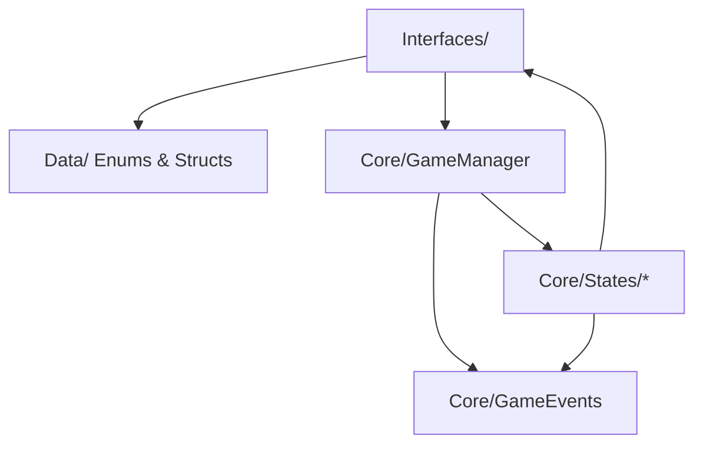

# Épica 1: Arquitectura Core y FSM

> **Prioridad:** 🔴 Crítica  
> **Dependencias:** Ninguna (épica fundacional)  
> **Entregable:** Infraestructura base funcional con FSM navegable y sistema de eventos operativo

---

## Objetivo

Establecer la **columna vertebral arquitectónica** del proyecto: el `GameManager`, la máquina de estados finitos (FSM), el sistema de eventos desacoplado y las interfaces fundamentales que todos los demás sistemas consumirán.

---

## Historias de Usuario / Tareas Técnicas

### 1.1 — Definición de Interfaces Core

**Como** desarrollador,  
**quiero** tener definidos todos los contratos fundamentales del sistema,  
**para que** cualquier implementación futura respete los principios SDD y SOLID.

**Criterios de Aceptación:**
- [ ] Interfaz `IGameState` definida con métodos `Enter()`, `Tick()`, `Exit()`
- [ ] Interfaz `IPlayer` definida con propiedades y métodos para posición, pistas e inventario
- [ ] Interfaz `ITile` definida con tipo y callback `OnPlayerLanded()`
- [ ] Interfaz `IDiceRoller` definida con evento `OnDiceResult`
- [ ] Interfaz `IItemEffect` definida con fase de activación y método `Execute()`
- [ ] Interfaz `IContentParser` definida con método `Parse()`
- [ ] Todas las interfaces ubicadas en `Assets/Scripts/Interfaces/`

**Archivos:**
- `Assets/Scripts/Interfaces/IGameState.cs`
- `Assets/Scripts/Interfaces/IPlayer.cs`
- `Assets/Scripts/Interfaces/ITile.cs`
- `Assets/Scripts/Interfaces/IDiceRoller.cs`
- `Assets/Scripts/Interfaces/IDiceValidator.cs`
- `Assets/Scripts/Interfaces/IItemEffect.cs`
- `Assets/Scripts/Interfaces/IContentParser.cs`

---

### 1.2 — Enums y Modelos de Datos Base

**Como** desarrollador,  
**quiero** tener los enums y structs compartidos del proyecto definidos,  
**para que** exista un vocabulario común entre todos los sistemas.

**Criterios de Aceptación:**
- [ ] Enum `TileType` con valores: Neutral, HintBoost, HintTrap, Event, Item
- [ ] Enum `ItemActivationPhase` con valores: BeforeAnswer, AfterFail, RivalTurn, Reaction, ReplaceTurn
- [ ] Enum `PerformanceMultiplier` con valores numéricos: Perfect(100), WithHelp(50), Fail(0)
- [ ] Enum `BoardMode` con valores: Linear, Exploration
- [ ] Struct `CardData` con campos: DifficultyLevel, QuestionText, Hint, Options, CorrectAnswer
- [ ] Struct `GameContext` que encapsule el estado global necesario para que los ítems tomen decisiones

**Archivos:**
- `Assets/Scripts/Data/Enums.cs`
- `Assets/Scripts/Data/CardData.cs`
- `Assets/Scripts/Data/GameContext.cs`

---

### 1.3 — GameManager y FSM

**Como** sistema,  
**necesito** un controlador central que gestione la máquina de estados,  
**para que** el flujo del juego sea predecible, debuggeable e interrumpible.

**Criterios de Aceptación:**
- [ ] `GameManager` es un MonoBehaviour que posee una referencia al `IGameState` actual
- [ ] Método `TransitionTo(IGameState newState)` que invoca `Exit()` del estado actual y `Enter()` del nuevo
- [ ] El `Tick()` del estado activo se llama en `Update()`
- [ ] `GameManager` no contiene lógica de juego directa — solo orquesta transiciones
- [ ] Dependencias inyectadas vía `[SerializeField]` (no `Find()` ni Singletons)

**Archivos:**
- `Assets/Scripts/Core/GameManager.cs`

---

### 1.4 — Estados Iniciales del Game Loop

**Como** sistema,  
**necesito** las implementaciones concretas de los estados del juego,  
**para que** la FSM pueda navegar entre las fases del turno.

**Criterios de Aceptación:**
- [ ] `SetupState` — Configura la partida (jugadores, tablero, contenido)
- [ ] `PlayerTurnState` — Determina el jugador activo
- [ ] `DiceRollState` — Ejecuta el lanzamiento del dado
- [ ] `CardDrawState` — Extrae carta según dificultad del dado
- [ ] `ResolutionState` — Evalúa la respuesta del jugador
- [ ] `MovementState` — Calcula y aplica el avance (fórmula: Dado × Multiplicador)
- [ ] `TileEffectState` — Aplica el efecto de la casilla de destino
- [ ] `NextPlayerState` — Determina si continuar con siguiente jugador o iniciar cierre de ronda
- [ ] `GmChallengeState` — Desafío del GM (stub en esta épica, detallado en Épica 6)
- [ ] `GameOverState` — Estado terminal
- [ ] Cada estado implementa `IGameState` y emite eventos para notificar transiciones

**Archivos:**
- `Assets/Scripts/Core/States/SetupState.cs`
- `Assets/Scripts/Core/States/PlayerTurnState.cs`
- `Assets/Scripts/Core/States/DiceRollState.cs`
- `Assets/Scripts/Core/States/CardDrawState.cs`
- `Assets/Scripts/Core/States/ResolutionState.cs`
- `Assets/Scripts/Core/States/MovementState.cs`
- `Assets/Scripts/Core/States/TileEffectState.cs`
- `Assets/Scripts/Core/States/NextPlayerState.cs`
- `Assets/Scripts/Core/States/GmChallengeState.cs`
- `Assets/Scripts/Core/States/GameOverState.cs`

---

### 1.5 — Sistema de Eventos Central

**Como** desarrollador,  
**quiero** un canal de comunicación basado en eventos entre los sistemas,  
**para que** la UI y otros módulos puedan observar cambios sin acoplamiento directo.

**Criterios de Aceptación:**
- [ ] Clase estática o inyectable `GameEvents` que expone eventos via `System.Action<T>`
- [ ] Eventos mínimos: `OnStateChanged`, `OnTurnStarted`, `OnTurnEnded`, `OnDiceRolled`, `OnCardDrawn`, `OnPlayerMoved`, `OnHintUsed`, `OnItemUsed`
- [ ] Los eventos usan tipos de payload bien definidos (no strings genéricos)
- [ ] Documentación inline de cada evento con su momento de disparo

**Archivos:**
- `Assets/Scripts/Core/GameEvents.cs`

---

## Diagrama de Dependencias

---

## Criterios de Verificación de la Épica

| Verificación | Método |
|---|---|
| Compilación sin errores | `Unity_ReadConsole` tras cada script |
| FSM navega Setup → PlayerTurn → DiceRoll → ... → NextPlayer | Unit test o log en consola |
| Eventos se disparan correctamente | Subscriber de prueba que loguea a consola |
| Ningún `Find()` o Singleton en el código | Revisión de código / grep |

---

## Notas Técnicas

- El `GameManager` debe estar preparado para **interrupciones asíncronas** (Duelos, Desafío del GM). Esto se implementará completamente en las Épicas 5 y 6, pero la FSM debe diseñarse con capacidad de "push/pop" de estados interrumpidos.
- Los estados deben ser **clases puras** (no MonoBehaviours) que reciben sus dependencias por constructor para facilitar el testing.
