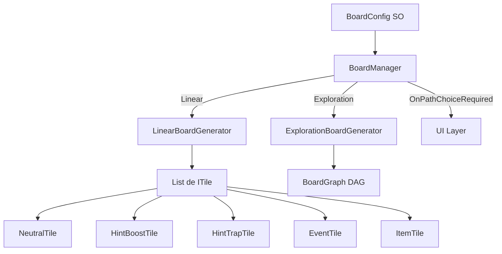

# Épica 2: Sistema de Tablero

> **Prioridad:** 🔴 Crítica  
> **Dependencias:** Épica 1 (Interfaces `ITile`, `IBoardGenerator`, enums `TileType`, `BoardMode`)  
> **Entregable:** Tablero funcional generado proceduralmente en ambos modos (Lineal y Exploración) con casillas tipadas

---

## Objetivo

Implementar el **sistema de generación y gestión del tablero**, incluyendo los dos modos de juego (Lineal tipo Oca y Exploración Multipath), los diferentes tipos de casillas con sus efectos, y la lógica de navegación/movimiento de fichas.

---

## Historias de Usuario / Tareas Técnicas

### 2.1 — BoardConfig (ScriptableObject)

**Como** GM,  
**quiero** poder configurar los parámetros del tablero antes de iniciar la partida,  
**para que** cada sesión sea personalizable según el grupo de jugadores.

**Criterios de Aceptación:**
- [ ] `BoardConfig` es un ScriptableObject con los campos:
  - `BoardMode Mode` (Linear | Exploration)
  - `int TargetQuestionCount` (longitud estimada en preguntas, ej. 16)
  - `int InitialHints` (pistas iniciales por jugador)
  - `float[] TileTypeWeights` (distribución porcentual de tipos de casilla)
  - `int MinBranches` / `int MaxBranches` (solo para modo Exploración)
- [ ] Validación en el Inspector que impida configuraciones inválidas (pesos que no sumen 1.0, etc.)
- [ ] Creación de al menos 2 presets de ejemplo (partida rápida, partida extendida)

**Archivos:**
- `Assets/Scripts/Data/BoardConfig.cs`
- `Assets/ScriptableObjects/BoardPresets/QuickGame.asset`
- `Assets/ScriptableObjects/BoardPresets/ExtendedGame.asset`

---

### 2.2 — Generador de Tablero Lineal

**Como** sistema,  
**necesito** generar un tablero de ruta directa inicio-fin,  
**para que** el modo "Tipo Oca" funcione con longitud dinámica.

**Criterios de Aceptación:**
- [ ] Clase `LinearBoardGenerator` que implementa `IBoardGenerator`
- [ ] Genera una lista secuencial de `ITile` basada en `TargetQuestionCount`
- [ ] Fórmula de escalado: `totalTiles = TargetQuestionCount * avgDiceRoll(3.5) * avgMultiplier(0.75)` (aproximado, configurable)
- [ ] Distribución de tipos de casilla según `TileTypeWeights` con seed para reproducibilidad
- [ ] Primera casilla siempre es `Neutral` (inicio), última siempre es `Neutral` (meta)

**Archivos:**
- `Assets/Scripts/Gameplay/Board/LinearBoardGenerator.cs`

---

### 2.3 — Generador de Tablero Exploración (Multipath)

**Como** sistema,  
**necesito** generar un tablero en red de nodos tipo laberinto,  
**para que** el modo Exploración permita decisiones tácticas de ruta.

**Criterios de Aceptación:**
- [ ] Clase `ExplorationBoardGenerator` que implementa `IBoardGenerator`
- [ ] Genera un grafo dirigido acíclico (DAG) de nodos `ITile`
- [ ] Cada nodo puede tener 1-3 conexiones de salida (bifurcaciones)
- [ ] Existe al menos una ruta garantizada de inicio a fin
- [ ] Los nodos se "descubren" progresivamente (visibilidad basada en adyacencia)
- [ ] Distribución de tipos de casilla respeta `TileTypeWeights`
- [ ] Estructura de datos subyacente: `Dictionary<ITile, List<ITile>>` (adjacency list)

**Archivos:**
- `Assets/Scripts/Gameplay/Board/ExplorationBoardGenerator.cs`
- `Assets/Scripts/Data/BoardGraph.cs`

---

### 2.4 — Implementaciones de Casillas (Tiles)

**Como** jugador,  
**quiero** que las casillas del tablero tengan efectos diferentes al caer en ellas,  
**para que** el recorrido sea dinámico y estratégico.

**Criterios de Aceptación:**
- [ ] Clase base abstracta `BaseTile` que implementa `ITile`
- [ ] `NeutralTile` — Flujo de turno normal, sin efecto adicional
- [ ] `HintBoostTile` — Suma +1 pista al inventario del jugador
- [ ] `HintTrapTile` — Resta -1 pista del inventario (mínimo 0)
- [ ] `EventTile` — Aplica un modificador temporal (definido por ScriptableObject `TileEventConfig`)
- [ ] `ItemTile` — El jugador roba una carta del mazo de consumibles
- [ ] Cada tipo de casilla emite un evento específico via `GameEvents` al activarse
- [ ] Los efectos se ejecutan en `TileEffectState` de la FSM

**Archivos:**
- `Assets/Scripts/Gameplay/Board/Tiles/BaseTile.cs`
- `Assets/Scripts/Gameplay/Board/Tiles/NeutralTile.cs`
- `Assets/Scripts/Gameplay/Board/Tiles/HintBoostTile.cs`
- `Assets/Scripts/Gameplay/Board/Tiles/HintTrapTile.cs`
- `Assets/Scripts/Gameplay/Board/Tiles/EventTile.cs`
- `Assets/Scripts/Gameplay/Board/Tiles/ItemTile.cs`
- `Assets/Scripts/Data/TileEventConfig.cs`

---

### 2.5 — BoardManager (Coordinador de Tablero)

**Como** sistema,  
**necesito** un componente que gestione el tablero activo, las posiciones de los jugadores y la navegación,  
**para que** el movimiento sea consistente y centralizado.

**Criterios de Aceptación:**
- [ ] `BoardManager` es un MonoBehaviour que recibe `BoardConfig` vía Inspector
- [ ] Método `Initialize()` que invoca al generador correspondiente según `BoardMode`
- [ ] Método `GetTileAt(int position)` para modo Lineal
- [ ] Método `GetAdjacentTiles(ITile current)` para modo Exploración
- [ ] Método `MovePlayer(IPlayer player, int steps)` que calcula la casilla de destino
- [ ] En modo Exploración, si hay bifurcación, emite evento `OnPathChoiceRequired` para que la UI lo gestione
- [ ] Tracking de posiciones de todos los jugadores

**Archivos:**
- `Assets/Scripts/Gameplay/Board/BoardManager.cs`

---

## Diagrama de Componentes

---

## Criterios de Verificación de la Épica

| Verificación | Método |
|---|---|
| Tablero Lineal genera N casillas correctas | Unit test con seed fijo |
| Tablero Exploración tiene ruta garantizada inicio→fin | Unit test con BFS/DFS |
| Distribución de casillas respeta los pesos | Unit test estadístico |
| Efectos de casilla modifican estado del jugador | Integration test |
| Compilación limpia | `Unity_ReadConsole` |

---

## Notas Técnicas

- La **representación visual** del tablero (posicionamiento 3D de nodos, líneas de conexión) pertenece a la Épica 7 (Presentación). Esta épica se enfoca en la **lógica y datos**.
- Para el modo Exploración, considerar un algoritmo de generación procedural basado en **capas** (layers) para garantizar la progresión: Capa 0 = Inicio, Capa N = Meta, con bifurcaciones intermedias.
- El `BoardManager` debe exponer suficiente información para que el `BoardView` (Épica 7) pueda renderizar sin conocer la lógica interna.
