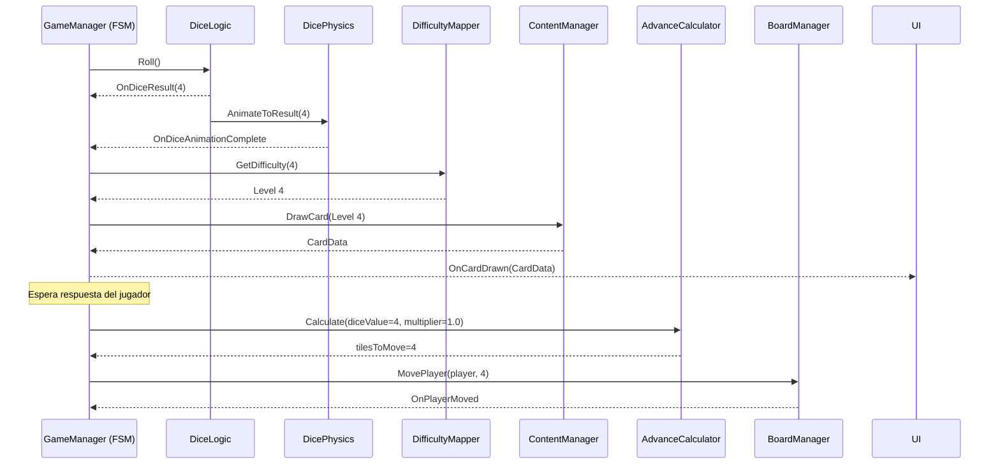

# Épica 3: Sistema de Dado y Turno

> **Prioridad:** 🔴 Crítica  
> **Dependencias:** Épica 1 (FSM, `IDiceRoller`, `IDiceValidator`), Épica 2 (`BoardManager` para movimiento)  
> **Entregable:** Dado D6 funcional con físicas, mapeo dado→dificultad, fórmula de avance operativa

---

## Objetivo

Implementar el **sistema completo de dado y turno**: el dado físico D6 con simulación visual, la lógica que mapea el resultado a un nivel de dificultad (1–6), la fórmula de avance `Casillas = Dado × Multiplicador`, y la integración con la FSM para el flujo de turno completo.

---

## Historias de Usuario / Tareas Técnicas

### 3.1 — Dado Lógico (RNG + Validación)

**Como** sistema,  
**necesito** un generador de resultados de dado confiable y validable,  
**para que** la lógica del juego no dependa de las físicas visuales.

**Criterios de Aceptación:**
- [ ] Clase `DiceLogic` que implementa `IDiceRoller` y `IDiceValidator`
- [ ] Genera resultado aleatorio 1–6 usando `UnityEngine.Random` con seed configurable
- [ ] El resultado se determina **antes** de la animación física (el dado visual se "amarra" al resultado lógico)
- [ ] Evento `OnDiceResult(int value)` disparado al determinar el resultado
- [ ] Método `IsValidResult(int)` retorna `true` solo para valores 1–6

**Archivos:**
- `Assets/Scripts/Gameplay/Dice/DiceLogic.cs`

---

### 3.2 — Dado Físico Visual (Rigidbody)

**Como** jugador,  
**quiero** ver un dado 3D que rueda con físicas realistas,  
**para que** la experiencia sea inmersiva y satisfactoria.

**Criterios de Aceptación:**
- [ ] Prefab `DicePrefab` con mesh de cubo, Rigidbody y Collider
- [ ] Script `DicePhysics` (MonoBehaviour) que aplica fuerza y torque para simular el lanzamiento
- [ ] El dado siempre "aterriza" mostrando la cara correspondiente al resultado lógico predeterminado
- [ ] Técnica: tras la simulación, se orienta suavemente (Slerp) hacia la rotación correcta en los últimos frames
- [ ] Evento `OnDiceAnimationComplete` para que la FSM avance solo cuando la animación termine
- [ ] Caras del dado claramente legibles con texturas/materiales numerados

**Archivos:**
- `Assets/Scripts/Gameplay/Dice/DicePhysics.cs`
- `Assets/Prefabs/Dice/DicePrefab.prefab`
- `Assets/Art/Dice/` (texturas de caras)

---

### 3.3 — Mapeo Dado → Dificultad

**Como** sistema,  
**necesito** que el valor del dado determine la dificultad de la carta extraída,  
**para que** el azar module la complejidad del reto.

**Criterios de Aceptación:**
- [ ] Mapeo directo: Dado 1 = Nivel 1 (muy fácil), ..., Dado 6 = Nivel 6 (muy difícil)
- [ ] Encapsulado en un componente `DifficultyMapper` con interfaz configurable
- [ ] Posibilidad de modificar el mapeo via ScriptableObject para variantes futuras
- [ ] El `CardDrawState` de la FSM consulta este mapeo para solicitar la carta al sistema de contenido

**Archivos:**
- `Assets/Scripts/Gameplay/Dice/DifficultyMapper.cs`
- `Assets/Scripts/Data/DifficultyMapConfig.cs` (SO opcional)

---

### 3.4 — Fórmula de Avance

**Como** jugador,  
**quiero** que mi avance en el tablero refleje tanto mi suerte como mi desempeño,  
**para que** responder bien sea recompensado y el azar no lo decida todo.

**Criterios de Aceptación:**
- [ ] Implementación de la fórmula: `tilesToMove = diceValue * performanceMultiplier`
- [ ] Multiplicadores:
  - `x1.0` — Respuesta perfecta (sin pistas, sin opciones múltiples reveladas)
  - `x0.5` — Respuesta con ayuda (usó pista o reveló opciones)
  - `x0.0` — Fallo (respuesta incorrecta, no avanza)
- [ ] Redondeo configurable (ceil/floor/round) para `x0.5` — por defecto `Mathf.RoundToInt`
- [ ] Clase `AdvanceCalculator` pura (no MonoBehaviour) para facilitar testing
- [ ] Caso especial: multiplicador `x0` puede generar retroceso si la casilla/evento lo indica (configurable)

**Archivos:**
- `Assets/Scripts/Gameplay/AdvanceCalculator.cs`

---

### 3.5 — Flujo de Turno Completo (Integración FSM)

**Como** sistema,  
**necesito** que la secuencia de turno sea orquestada por la FSM de forma determinista,  
**para que** cada fase ocurra en el orden correcto y sea interrumpible.

**Criterios de Aceptación:**
- [ ] Flujo: `PlayerTurnState` → `DiceRollState` → `CardDrawState` → `ResolutionState` → `MovementState` → `TileEffectState` → `NextPlayerState`
- [ ] `DiceRollState`:
  - Invoca `DiceLogic.Roll()`
  - Espera `OnDiceAnimationComplete` de `DicePhysics`
  - Transiciona a `CardDrawState` con el resultado
- [ ] `CardDrawState`:
  - Consulta `DifficultyMapper` → solicita carta al `ContentManager` (Épica 4)
  - Emite `OnCardDrawn(CardData)` y transiciona a `ResolutionState`
- [ ] `ResolutionState`:
  - Presenta la pregunta (vía evento a UI)
  - Espera respuesta del jugador
  - Evalúa: correcta/incorrecta, con/sin ayuda → determina `PerformanceMultiplier`
  - Transiciona a `MovementState`
- [ ] `MovementState`:
  - Calcula avance via `AdvanceCalculator`
  - Invoca `BoardManager.MovePlayer()`
  - Transiciona a `TileEffectState`
- [ ] Cada estado registra logs para debugging

**Archivos:**
- Modificaciones en `Assets/Scripts/Core/States/` (estados ya definidos en Épica 1)
- `Assets/Scripts/Gameplay/TurnContext.cs` (datos del turno actual)

---

## Diagrama de Secuencia — Turno Completo

---

## Criterios de Verificación de la Épica

| Verificación | Método |
|---|---|
| DiceLogic genera valores 1–6 uniformemente | Unit test con 10,000 iteraciones |
| Fórmula de avance correcta para todos los multiplicadores | Unit test parametrizado |
| Dado visual aterriza en la cara correcta | Test visual en Play Mode |
| Flujo de turno completo sin interrupciones | Integration test FSM |
| Compilación limpia | `Unity_ReadConsole` |

---

## Notas Técnicas

- **Físicas vs Lógica del dado:** El resultado se predetermina por RNG. Las físicas son puramente cosméticas. Esto evita inconsistencias por colisiones impredecibles del motor de físicas.
- **Tiempos de espera:** El `DiceRollState` debe tener un timeout configurable por si la animación del dado se atasca (safety net).
- **Testing:** `AdvanceCalculator` es una clase pura sin dependencias de Unity, lo que permite unit tests con NUnit directamente.
