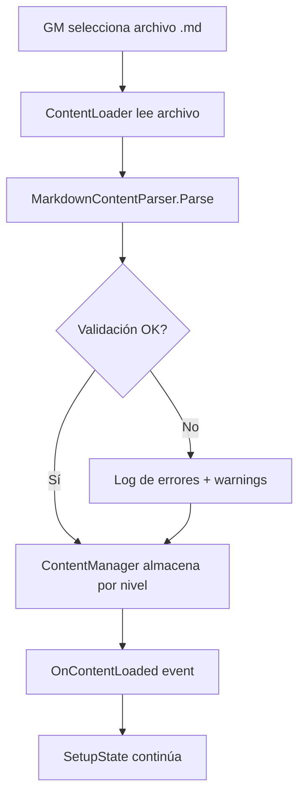

# Épica 4: Parser de Contenido y Sistema de Cartas

> **Prioridad:** 🟡 Alta  
> **Dependencias:** Épica 1 (`IContentParser`, `CardData`), Épica 3 (`DifficultyMapper`)  
> **Entregable:** Parser Markdown funcional que carga contenido dinámico del GM y sistema de cartas que sirve preguntas por dificultad

---

## Objetivo

Implementar el **sistema de contenido dinámico**: el parser Markdown que procesa archivos `.md` cargados por el GM en runtime, el modelo de datos de preguntas/cartas, el mazo organizado por dificultad, y el sistema de pistas consumibles.

---

## Historias de Usuario / Tareas Técnicas

### 4.1 — Parser Markdown de Preguntas

**Como** GM,  
**quiero** cargar un archivo `.md` con mis preguntas y que el juego lo procese automáticamente,  
**para que** pueda crear contenido personalizado sin modificar código.

**Criterios de Aceptación:**
- [ ] Clase `MarkdownContentParser` que implementa `IContentParser`
- [ ] Parsea el formato estructural definido en el GDD:
  - `# [N]` → Nivel de dificultad (1–6) + texto de pregunta
  - `>` → Pista disponible
  - `- ` o `* ` → Opciones múltiples
  - `= ` → Respuesta correcta o criterio de evaluación
- [ ] Soporta preguntas sin opciones (preguntas abiertas, niveles altos)
- [ ] Soporta preguntas sin pista (pista queda como `null`)
- [ ] Retorna `List<CardData>` ordenado por nivel de dificultad
- [ ] Manejo robusto de errores:
  - Líneas malformadas se registran como warning y se omiten
  - Preguntas sin respuesta correcta se rechazan con error
  - Niveles fuera de rango (< 1 o > 6) se rechazan
- [ ] Encoding: UTF-8 con soporte de caracteres especiales (acentos, ñ, etc.)

**Archivos:**
- `Assets/Scripts/Data/MarkdownContentParser.cs`

---

### 4.2 — Carga de Archivo en Runtime

**Como** GM,  
**quiero** seleccionar un archivo `.md` desde mi sistema de archivos al iniciar la partida,  
**para que** el contenido sea totalmente externo al build del juego.

**Criterios de Aceptación:**
- [ ] Componente `ContentLoader` que abre un diálogo de selección de archivo nativo (o ruta configurada)
- [ ] Lee el archivo como string UTF-8
- [ ] Pasa el contenido al `MarkdownContentParser`
- [ ] Almacena las `CardData` resultantes en el `ContentManager`
- [ ] Valida que haya al menos 1 pregunta por nivel de dificultad (warning si falta algún nivel)
- [ ] Evento `OnContentLoaded(int totalCards)` para notificar al `SetupState`

**Archivos:**
- `Assets/Scripts/Data/ContentLoader.cs`

---

### 4.3 — ContentManager (Mazo de Cartas)

**Como** sistema,  
**necesito** un gestor que organice las cartas por dificultad y las sirva bajo demanda,  
**para que** el flujo de turno obtenga la carta correcta según el dado.

**Criterios de Aceptación:**
- [ ] Clase `ContentManager` que almacena cartas en `Dictionary<int, Queue<CardData>>` (nivel → cola)
- [ ] Método `DrawCard(int difficultyLevel)` que extrae la siguiente carta del nivel solicitado
- [ ] Si el nivel solicitado no tiene cartas disponibles, busca en el nivel más cercano (fallback)
- [ ] Opción de barajado (shuffle) al cargar el contenido
- [ ] Método `GetRemainingCards(int level)` para consultar disponibilidad
- [ ] Evento `OnDeckEmpty(int level)` cuando un nivel se agota

**Archivos:**
- `Assets/Scripts/Data/ContentManager.cs`

---

### 4.4 — Sistema de Pistas

**Como** jugador,  
**quiero** poder consumir pistas para facilitar mi respuesta, a cambio de un menor avance,  
**para que** tenga una herramienta táctica ante preguntas difíciles.

**Criterios de Aceptación:**
- [ ] La pista se almacena en `CardData.Hint` (parseada del `>` en el Markdown)
- [ ] El jugador tiene un inventario de pistas (`IPlayer.HintCount`)
- [ ] Método `UseHint()` en el contexto de resolución:
  - Decrementa `HintCount` en 1
  - Revela el texto de la pista en la UI (evento `OnHintRevealed(string hintText)`)
  - Marca el `PerformanceMultiplier` como `WithHelp` (x0.5)
- [ ] Si `HintCount == 0`, el botón de pista está deshabilitado
- [ ] Las pistas iniciales se configuran en `BoardConfig.InitialHints`

**Archivos:**
- `Assets/Scripts/Gameplay/HintSystem.cs`
- Modificaciones en `ResolutionState` (Épica 1/3)

---

### 4.5 — Revelación de Opciones Múltiples

**Como** jugador,  
**quiero** poder elegir entre revelar las opciones o intentar una respuesta abierta,  
**para que** las preguntas de nivel medio tengan una capa extra de decisión táctica.

**Criterios de Aceptación:**
- [ ] Si la `CardData` tiene `Options` no vacías, la UI las oculta inicialmente
- [ ] El jugador puede:
  - **Responder abiertamente** (sin ver opciones) → mantiene multiplicador `x1.0`
  - **Revelar opciones** → marca multiplicador como `x0.5`
- [ ] La evaluación de respuesta abierta compara contra `CorrectAnswer` (case insensitive, trim)
- [ ] La evaluación de respuesta con opciones es selección directa
- [ ] El flag `hasRevealedOptions` se combina con `hasUsedHint` para determinar el multiplicador final (el peor aplica)

**Archivos:**
- `Assets/Scripts/Gameplay/AnswerEvaluator.cs`
- Modificaciones en `ResolutionState`

---

## Formato Markdown — Referencia Completa

```markdown
# [1] El patrón Singleton permite múltiples instancias de una clase.
- Verdadero
- Falso
= Falso

# [3] ¿Qué principio SOLID se viola al tener una clase que hace logging, acceso a BD y validación?
> Piensa en cuántas razones tendría esa clase para cambiar.
- Open/Closed
- Single Responsibility
- Liskov Substitution
- Dependency Inversion
= Single Responsibility

# [6] Explica la diferencia entre composición y herencia, y cuándo preferir cada una.
> No existe una única respuesta correcta. El GM evalúa la profundidad del argumento.
= [Criterio del GM: mencionar acoplamiento, flexibilidad, y dar al menos un ejemplo concreto]
```

---

## Diagrama de Flujo — Carga de Contenido



---

## Criterios de Verificación de la Épica

| Verificación | Método |
|---|---|
| Parser extrae correctamente todas las propiedades | Unit test con archivo .md de ejemplo |
| Manejo de errores: líneas malformadas | Unit test con input inválido |
| ContentManager sirve cartas del nivel correcto | Unit test |
| Fallback funciona cuando un nivel se agota | Unit test |
| Sistema de pistas reduce HintCount y marca multiplicador | Integration test |
| Archivo con caracteres especiales (UTF-8) | Unit test |
| Compilación limpia | `Unity_ReadConsole` |

---

## Notas Técnicas

- **El parser es la pieza más frágil del sistema.** Como el formato es definido por humanos (el GM), la robustez del parsing y los mensajes de error claros son cruciales. Considerar un modo "preview" que muestre las cartas parseadas antes de iniciar la partida.
- **Preguntas abiertas (Nivel 6):** La evaluación queda a criterio del GM. El sistema solo presenta la respuesta del jugador y el criterio `=`, y el GM decide si es correcta (input manual).
- **Performance:** Para archivos grandes (100+ preguntas), el parsing debe ser asíncrono o al menos no bloquear el hilo principal.
