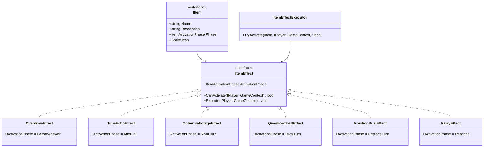

# Épica 5: Sistema de Objetos / Consumibles

> **Prioridad:** 🟡 Alta  
> **Dependencias:** Épica 1 (`IItemEffect`, `ItemActivationPhase`, `GameContext`), Épica 3 (integración con turno)  
> **Entregable:** Sistema de inventario completo con todos los consumibles del GDD implementados como módulos Strategy/Command independientes

---

## Objetivo

Implementar el **sistema de objetos consumibles**: el inventario por jugador, el mazo de objetos, y cada efecto como un módulo aislado bajo el patrón Strategy/Command. Esto incluye buffs, debuffs ofensivos, y counters defensivos, con sus respectivas fases de activación e interrupciones al flujo normal del turno.

---

## Historias de Usuario / Tareas Técnicas

### 5.1 — Inventario del Jugador

**Como** jugador,  
**quiero** almacenar los objetos que obtengo en las casillas de tipo Item,  
**para que** pueda usarlos estratégicamente en el momento adecuado.

**Criterios de Aceptación:**
- [ ] Propiedad `List<IItem> Inventory` en la implementación de `IPlayer`
- [ ] Interfaz `IItem` con propiedades: `string Name`, `string Description`, `ItemActivationPhase Phase`, `Sprite Icon`
- [ ] Métodos en `IPlayer`: `AddItem(IItem)`, `RemoveItem(IItem)`, `HasItem<T>()`
- [ ] Límite de inventario configurable (por defecto ilimitado, pero preparado para cap)
- [ ] Evento `OnInventoryChanged(IPlayer, IItem, InventoryAction)` para actualización de UI

**Archivos:**
- `Assets/Scripts/Interfaces/IItem.cs`
- `Assets/Scripts/Gameplay/Items/PlayerInventory.cs`

---

### 5.2 — Mazo de Objetos y Distribución

**Como** sistema,  
**necesito** un mazo de objetos que se baraje y se distribuya cuando un jugador cae en `ItemTile`,  
**para que** la obtención de objetos sea aleatoria y balanceada.

**Criterios de Aceptación:**
- [ ] `ItemDeck` que contiene instancias de objetos configuradas en un ScriptableObject
- [ ] `ItemDeckConfig` (SO) define: tipo de objeto, cantidad de copias, peso de aparición
- [ ] Método `DrawItem()` retorna un `IItem` aleatorio del mazo
- [ ] Cuando el mazo se agota, se re-baraja (o se notifica, configurable)
- [ ] La `ItemTile` invoca `ItemDeck.DrawItem()` y lo añade al inventario del jugador

**Archivos:**
- `Assets/Scripts/Gameplay/Items/ItemDeck.cs`
- `Assets/Scripts/Data/ItemDeckConfig.cs`

---

### 5.3 — ItemEffectExecutor (Orquestador de Efectos)

**Como** sistema,  
**necesito** un componente que gestione la activación de objetos validando fase, condiciones y resolución,  
**para que** los efectos se apliquen de forma consistente y controlada.

**Criterios de Aceptación:**
- [ ] Clase `ItemEffectExecutor` que recibe peticiones de uso de objetos
- [ ] Valida: `IItemEffect.CanActivate(owner, context)` → si `false`, notifica al jugador que no puede usar ese objeto ahora
- [ ] Ejecuta: `IItemEffect.Execute(owner, context)`
- [ ] Gestiona la fase de activación: solo permite objetos cuya `ActivationPhase` coincida con la fase actual de la FSM
- [ ] Consume el objeto del inventario tras ejecución exitosa
- [ ] Emite eventos: `OnItemActivated`, `OnItemBlocked`

**Archivos:**
- `Assets/Scripts/Gameplay/Items/ItemEffectExecutor.cs`

---

### 5.4 — Buffs (Utilidad Propia)

#### 5.4.1 — Avance sin Límites (Overdrive)

**Como** jugador,  
**quiero** usar una pista sin perder mi multiplicador de desempeño,  
**para que** pueda obtener ayuda y avanzar al máximo.

**Criterios de Aceptación:**
- [ ] `ActivationPhase`: `BeforeAnswer`
- [ ] Efecto: el flag `hasUsedHint` no reduce el multiplicador durante este turno
- [ ] Se consume al usarse
- [ ] `CanActivate`: el jugador tiene al menos 1 pista disponible

**Archivos:**
- `Assets/Scripts/Gameplay/Items/Effects/OverdriveEffect.cs`

---

#### 5.4.2 — Eco del Tiempo

**Como** jugador,  
**quiero** una segunda oportunidad tras fallar, aunque con mayor riesgo,  
**para que** un fallo no sea siempre el fin de mi turno.

**Criterios de Aceptación:**
- [ ] `ActivationPhase`: `AfterFail`
- [ ] Efecto: re-lanza el dado y extrae una nueva carta, pero el jugador **no puede usar pistas** ni revelar opciones (forzado a multiplicador `x1.0` o `x0.0`)
- [ ] Interrumpe la FSM: transiciona de `ResolutionState` (post-fallo) de vuelta a `DiceRollState`
- [ ] Se consume al usarse
- [ ] `CanActivate`: el jugador acaba de fallar en este turno

**Archivos:**
- `Assets/Scripts/Gameplay/Items/Effects/TimeEchoEffect.cs`

---

### 5.5 — Debuffs y Combate

#### 5.5.1 — Sabotaje de Opciones

**Como** jugador,  
**quiero** dificultar la pregunta de un rival ocultando sus opciones múltiples,  
**para que** pueda interferir tácticamente en su desempeño.

**Criterios de Aceptación:**
- [ ] `ActivationPhase`: `RivalTurn` (tras el dado del rival)
- [ ] Efecto: la pregunta del rival se presenta como pregunta abierta de Nivel 6 (se ocultan las opciones)
- [ ] No modifica la pregunta real ni la respuesta correcta, solo la presentación
- [ ] Se consume al usarse
- [ ] `CanActivate`: es el turno de otro jugador, ese jugador acaba de tirar el dado

**Archivos:**
- `Assets/Scripts/Gameplay/Items/Effects/OptionSabotageEffect.cs`

---

#### 5.5.2 — Robo de Pregunta

**Como** jugador,  
**quiero** intentar responder la pregunta que un rival falló para robarle el avance,  
**para que** los fallos ajenos sean mi oportunidad.

**Criterios de Aceptación:**
- [ ] `ActivationPhase`: `RivalTurn` (tras fallo del rival)
- [ ] Efecto: el jugador atacante intenta responder la misma pregunta
  - Si acierta: avanza las casillas que el rival habría ganado
  - Si falla: pierde 1 pista
- [ ] Se consume al usarse
- [ ] `CanActivate`: el rival acaba de fallar, el atacante tiene al menos 1 pista (para el riesgo)
- [ ] Interrumpe la FSM: crea un sub-turno de resolución para el atacante

**Archivos:**
- `Assets/Scripts/Gameplay/Items/Effects/QuestionTheftEffect.cs`

---

#### 5.5.3 — Duelo de Posiciones

**Como** jugador,  
**quiero** desafiar a otro jugador a una pregunta de muerte súbita para intercambiar posiciones,  
**para que** pueda dar un salto estratégico en el tablero.

**Criterios de Aceptación:**
- [ ] `ActivationPhase`: `ReplaceTurn` (sustituye el lanzamiento normal)
- [ ] Flujo del duelo:
  1. El atacante selecciona un rival objetivo
  2. Se presenta una pregunta de dificultad aleatoria a ambos simultáneamente
  3. **Si el atacante gana:** intercambian posiciones en el tablero
  4. **Si el defensor gana:** mantiene su posición y roba 1 pista o 1 objeto al atacante
  5. **Si el atacante no tiene nada que robar:** pierde su próximo turno
- [ ] Crea un `DuelState` en la FSM que gestiona la concurrencia (ambos responden)
- [ ] Se consume al usarse
- [ ] `CanActivate`: es el inicio del turno propio, hay al menos 1 rival

**Archivos:**
- `Assets/Scripts/Gameplay/Items/Effects/PositionDuelEffect.cs`
- `Assets/Scripts/Core/States/DuelState.cs`

---

### 5.6 — Counters (Defensivos)

#### 5.6.1 — Reflejo Perfecto (Parry)

**Como** jugador,  
**quiero** anular un objeto ofensivo lanzado contra mí,  
**para que** tenga una herramienta de defensa ante el sabotaje.

**Criterios de Aceptación:**
- [ ] `ActivationPhase`: `Reaction`
- [ ] Efecto: anula completamente el efecto del objeto ofensivo dirigido al jugador
- [ ] Efecto adicional: cancela el turno del atacante (el atacante pierde el resto de su turno)
- [ ] Se consume al usarse
- [ ] `CanActivate`: un objeto ofensivo fue activado apuntando a este jugador
- [ ] Ventana de reacción: el defensor tiene N segundos para activar el Parry (configurable)

**Archivos:**
- `Assets/Scripts/Gameplay/Items/Effects/ParryEffect.cs`

---

## Diagrama de Clases — Sistema de Ítems

---

## Criterios de Verificación de la Épica

| Verificación | Método |
|---|---|
| Cada efecto valida `CanActivate` correctamente | Unit test por efecto |
| Overdrive: pista no reduce multiplicador | Unit test |
| Eco del Tiempo: retorna a DiceRollState sin pistas | Integration test FSM |
| Sabotaje: opciones ocultadas para el rival | Integration test |
| Robo: avance transferido al atacante | Integration test |
| Duelo: posiciones intercambiadas / penalización correcta | Integration test |
| Parry: efecto ofensivo anulado + turno del atacante cancelado | Integration test |
| Inventario se actualiza tras cada uso | Unit test |
| Compilación limpia | `Unity_ReadConsole` |

---

## Notas Técnicas

- **Strategy pattern es obligatorio** aquí. Si alguien intenta poner lógica de ítems en el `PlayerController` o en un switch/case monolítico, se viola directamente el GDD y el Architect.md.
- **Duelo y Parry interrumpen la FSM.** Esto requiere que la FSM soporte "push" de estados (stack de estados) o transiciones especiales que puedan volver al flujo normal. Diseñar esto en coordinación con Épica 1.
- **Ventana de reacción del Parry:** Implementar con un timer configurable. Si el jugador no activa el Parry en N segundos, el efecto ofensivo se aplica normalmente.
