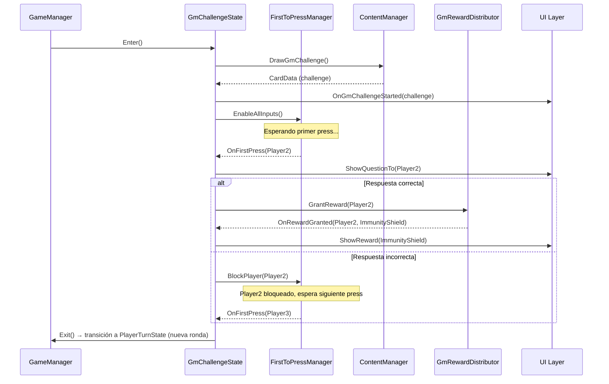

# Épica 6: Desafío del GM y Concurrencia

> **Prioridad:** 🟠 Media  
> **Dependencias:** Épica 1 (FSM, `GmChallengeState`), Épica 4 (ContentManager para preguntas especiales)  
> **Entregable:** Fase de cierre de ronda completa con First-to-Press, resolución concurrente y recompensas variables

---

## Objetivo

Implementar la **fase de cierre de ronda** (Desafío del GM): un estado de concurrencia global donde todos los jugadores compiten simultáneamente para responder un reto especial. Esto incluye el sistema First-to-Press, la gestión de inputs simultáneos, las recompensas variables, y la integración limpia con la FSM sin romper el flujo por turnos.

---

## Historias de Usuario / Tareas Técnicas

### 6.1 — GmChallengeState (Estado de la FSM)

**Como** sistema,  
**necesito** un estado dedicado en la FSM para gestionar la fase de cierre de ronda,  
**para que** la concurrencia global no interfiera con el flujo normal por turnos.

**Criterios de Aceptación:**
- [ ] `GmChallengeState` implementa `IGameState`
- [ ] `Enter()`:
  - Pausa el flujo por turnos
  - Selecciona un reto especial del pool del GM (puede ser `ContentManager` o una cola separada)
  - Habilita inputs de TODOS los jugadores simultáneamente
  - Emite `OnGmChallengeStarted(CardData challenge)`
- [ ] `Tick()`:
  - Monitorea inputs de todos los jugadores
  - Detecta el primer press (First-to-Press)
  - Gestiona timeout (si nadie presiona en N segundos, la ronda termina sin ganador)
- [ ] `Exit()`:
  - Restaura el flujo por turnos
  - Limpia el estado de inputs concurrentes
  - Emite `OnGmChallengeEnded(IPlayer winner, RewardType reward)`

**Archivos:**
- `Assets/Scripts/Core/States/GmChallengeState.cs` (completar el stub de Épica 1)

---

### 6.2 — Sistema First-to-Press

**Como** jugador,  
**quiero** que el primer jugador en pulsar su botón tenga el derecho a responder,  
**para que** la fase del GM sea una competencia de reflejos y conocimiento.

**Criterios de Aceptación:**
- [ ] Componente `FirstToPressManager` que:
  - Asigna un botón/tecla única a cada jugador (configurable)
  - Acepta el primer input y bloquea los demás
  - Registra el timestamp del press para resolver empates (< 16ms → simultáneo)
- [ ] Lock atómico: una vez detectado el primer press, se deshabilitan todos los inputs
- [ ] El jugador ganador del press tiene derecho a responder
- [ ] Si falla la respuesta, queda **bloqueado para este reto** (no puede volver a intentar)
- [ ] Si todos fallan o nadie presiona (timeout), no hay ganador → la ronda termina sin recompensa
- [ ] Evento `OnFirstPress(IPlayer presser)` para que la UI muestre el feedback visual

**Archivos:**
- `Assets/Scripts/Gameplay/GmChallenge/FirstToPressManager.cs`

---

### 6.3 — Pool de Retos del GM

**Como** GM,  
**quiero** definir preguntas especiales para el cierre de ronda,  
**para que** los desafíos del GM se sientan distintos a las preguntas normales del turno.

**Criterios de Aceptación:**
- [ ] Extensión del formato Markdown para retos del GM (o sección separada en el mismo archivo):
  - `## [GM]` marca el inicio de preguntas de desafío del GM
  - Misma estructura `# > - =` pero agrupadas bajo la sección GM
- [ ] `ContentManager` separa cartas normales de cartas GM en dos pools distintos
- [ ] Si no hay cartas GM definidas, el sistema usa cartas normales de nivel 4-6 como fallback
- [ ] Las cartas GM no se mezclan con el mazo regular

**Archivos:**
- Modificaciones en `Assets/Scripts/Data/MarkdownContentParser.cs`
- Modificaciones en `Assets/Scripts/Data/ContentManager.cs`

---

### 6.4 — Sistema de Recompensas Variables

**Como** jugador,  
**quiero** recibir una recompensa aleatoria al superar el desafío del GM,  
**para que** el cierre de ronda sea emocionante e impactante.

**Criterios de Aceptación:**
- [ ] Enum `GmRewardType` con valores:
  - `SupplyCrate` — +1 Pista y +1 Objeto del mazo
  - `GoldenHint` — Token especial que permite responder un Nivel 6 sin penalización de multiplicador (similar a Overdrive pero para nivel específico)
  - `BoardManipulation` — El ganador elige dos nodos adyacentes e intercambia sus posiciones
  - `ImmunityShield` — Invulnerabilidad a Duelos, Robos y Sabotajes durante la próxima ronda
- [ ] Clase `GmRewardDistributor` que:
  - Selecciona aleatoriamente una recompensa (con pesos configurables en SO)
  - Aplica el efecto correspondiente al jugador ganador
  - Emite `OnRewardGranted(IPlayer, GmRewardType)`
- [ ] ScriptableObject `GmRewardConfig` con pesos de probabilidad por tipo de recompensa
- [ ] Cada recompensa implementa `IGmReward` con método `Apply(IPlayer player)`

**Archivos:**
- `Assets/Scripts/Gameplay/GmChallenge/GmRewardDistributor.cs`
- `Assets/Scripts/Gameplay/GmChallenge/Rewards/IGmReward.cs`
- `Assets/Scripts/Gameplay/GmChallenge/Rewards/SupplyCrateReward.cs`
- `Assets/Scripts/Gameplay/GmChallenge/Rewards/GoldenHintReward.cs`
- `Assets/Scripts/Gameplay/GmChallenge/Rewards/BoardManipulationReward.cs`
- `Assets/Scripts/Gameplay/GmChallenge/Rewards/ImmunityShieldReward.cs`
- `Assets/Scripts/Data/GmRewardConfig.cs`

---

### 6.5 — Manipulación del Tablero (Reward Especial)

**Como** jugador ganador del desafío del GM (con recompensa "Manipulación del Tablero"),  
**quiero** poder intercambiar dos casillas adyacentes del tablero,  
**para que** pueda alterar estratégicamente el mapa a mi favor.

**Criterios de Aceptación:**
- [ ] Flujo interactivo:
  1. El jugador selecciona la primera casilla (evento a UI)
  2. La UI muestra las casillas adyacentes disponibles
  3. El jugador selecciona la segunda casilla
  4. `BoardManager.SwapTiles(ITile a, ITile b)` ejecuta el intercambio
- [ ] Solo casillas adyacentes pueden intercambiarse
- [ ] Las casillas de Inicio y Meta no pueden intercambiarse
- [ ] El intercambio es permanente para el resto de la partida
- [ ] Evento `OnBoardModified(ITile a, ITile b)` para actualizar la vista

**Archivos:**
- Modificaciones en `Assets/Scripts/Gameplay/Board/BoardManager.cs`
- `Assets/Scripts/Gameplay/GmChallenge/Rewards/BoardManipulationReward.cs`

---

### 6.6 — Escudo de Inmunidad (Estado Temporal)

**Como** jugador,  
**quiero** que el Escudo de Inmunidad me proteja de objetos ofensivos durante una ronda,  
**para que** la recompensa del GM me dé una ventaja táctica real.

**Criterios de Aceptación:**
- [ ] Sistema de modificadores temporales en `IPlayer`: `List<IStatusEffect> ActiveEffects`
- [ ] `ImmunityShield` como `IStatusEffect` con duración de 1 ronda
- [ ] `ItemEffectExecutor` consulta `ActiveEffects` antes de aplicar efectos ofensivos
- [ ] Si el jugador objetivo tiene `ImmunityShield`, el efecto ofensivo se anula automáticamente (sin consumir Parry)
- [ ] El escudo se remueve automáticamente al inicio de la siguiente ronda
- [ ] Indicador visual en la UI (ícono de escudo activo)

**Archivos:**
- `Assets/Scripts/Interfaces/IStatusEffect.cs`
- `Assets/Scripts/Gameplay/StatusEffects/ImmunityShieldEffect.cs`
- Modificaciones en `Assets/Scripts/Gameplay/Items/ItemEffectExecutor.cs`

---

## Diagrama de Secuencia — Desafío del GM

---

## Criterios de Verificación de la Épica

| Verificación | Método |
|---|---|
| First-to-Press detecta un único ganador | Unit test con inputs simulados |
| Lock atómico: inputs posteriores rechazados | Unit test |
| Timeout funciona si nadie presiona | Unit test con timer |
| Jugador bloqueado tras fallo no puede reintentar | Integration test |
| Cada tipo de recompensa se aplica correctamente | Unit test por recompensa |
| Board Manipulation: casillas intercambiadas | Integration test |
| Immunity Shield: bloquea ofensivos por 1 ronda | Integration test |
| Compilación limpia | `Unity_ReadConsole` |

---

## Notas Técnicas

- **Concurrencia de inputs:** En local (un solo dispositivo), los jugadores tendrán teclas asignadas. En red (futuro), esto requeriría un servidor autoritario. Esta épica solo cubre el caso local.
- **Timeout configurable:** Por defecto 10 segundos para el First-to-Press. Almacenar en `GmChallengeConfig` (SO).
- **La Pista Dorada** es funcionalmente similar al Overdrive pero solo para un Nivel 6 específico. Implementar como un `IStatusEffect` temporal de un turno.
