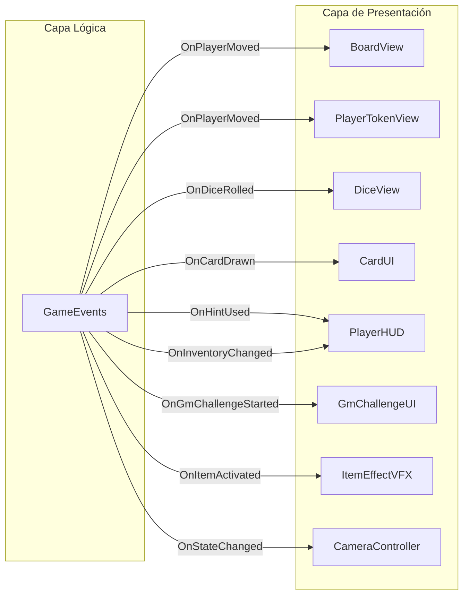

# Épica 7: Capa de Presentación y UX

> **Prioridad:** 🟠 Media  
> **Dependencias:** Épicas 1-6 (todos los sistemas lógicos deben emitir eventos para que la UI los observe)  
> **Entregable:** Interfaz visual completa, animaciones, feedback y experiencia de usuario pulida

---

## Objetivo

Implementar la **capa de presentación completa**: las vistas del tablero, el dado animado, las cartas visuales, el HUD del jugador, los efectos visuales de los ítems, y las transiciones animadas. Todo siguiendo estrictamente el patrón Observer — la UI **solo escucha eventos del Core**, nunca modifica la lógica directamente.

---

## Historias de Usuario / Tareas Técnicas

### 7.1 — BoardView (Representación Visual del Tablero)

**Como** jugador,  
**quiero** ver el tablero en pantalla con las casillas representadas visualmente,  
**para que** entienda mi progreso y el de los demás jugadores.

**Criterios de Aceptación:**
- [ ] `BoardView` (MonoBehaviour) que se suscribe a eventos del `BoardManager`
- [ ] **Modo Lineal:** Casillas dispuestas en ruta serpenteante (estilo "snaking path")
- [ ] **Modo Exploración:** Nodos dispuestos en layout de grafo con líneas de conexión
- [ ] Cada tipo de casilla tiene un color/ícono visual distinto:
  - Neutral → blanco/gris
  - HintBoost → verde/✦
  - HintTrap → rojo/✧
  - Event → amarillo/⚡
  - Item → púrpura/🎁
- [ ] Prefab `TileVisual` con estados: normal, highlighted (casilla actual), discovered/undiscovered (exploración)
- [ ] Animación de "descubrimiento" para modo Exploración (nodos se revelan al acercarse)
- [ ] Actualización visual cuando ocurre `BoardManipulation` (swap animado)

**Archivos:**
- `Assets/Scripts/UI/BoardView.cs`
- `Assets/Scripts/UI/TileVisual.cs`
- `Assets/Prefabs/Board/TileVisual.prefab`
- `Assets/Prefabs/Board/ConnectionLine.prefab`

---

### 7.2 — PlayerTokenView (Fichas de Jugadores)

**Como** jugador,  
**quiero** ver mi ficha moverse por el tablero cuando avanzo,  
**para que** el progreso sea visualmente claro y satisfactorio.

**Criterios de Aceptación:**
- [ ] Prefab `PlayerToken` con mesh/sprite personalizable por jugador (color, forma)
- [ ] `PlayerTokenView` se suscribe a `OnPlayerMoved`
- [ ] Animación de movimiento: la ficha se desplaza casilla por casilla con easing (bounce suave)
- [ ] Tiempo de animación configurable por casilla (~0.3s por defecto)
- [ ] Si múltiples jugadores están en la misma casilla, las fichas se apilan/offsetean
- [ ] Animación especial para intercambio de posiciones (Duelo) — las fichas se cruzan

**Archivos:**
- `Assets/Scripts/UI/PlayerTokenView.cs`
- `Assets/Prefabs/Players/PlayerToken.prefab`

---

### 7.3 — DiceView (Visualización del Dado)

**Como** jugador,  
**quiero** ver un dado 3D rodar con físicas cuando tiro,  
**para que** la experiencia de lanzamiento sea inmersiva.

**Criterios de Aceptación:**
- [ ] `DiceView` orquesta la cámara y el área de lanzamiento
- [ ] Se suscribe a `OnDiceRolled` para iniciar la animación
- [ ] Muestra el resultado final con énfasis visual (zoom, glow, partículas)
- [ ] Sonidos: lanzamiento, rebotes, resultado final
- [ ] Integración con `DicePhysics` (Épica 3) para la simulación visual

**Archivos:**
- `Assets/Scripts/UI/DiceView.cs`

---

### 7.4 — CardUI (Interfaz de Preguntas)

**Como** jugador,  
**quiero** ver la pregunta presentada en una carta visual atractiva,  
**para que** la experiencia de responder sea clara y agradable.

**Criterios de Aceptación:**
- [ ] `CardUI` se suscribe a `OnCardDrawn(CardData)`
- [ ] Layout de carta:
  - Header: indicador de dificultad (1–6 estrellas o color degradado)
  - Body: texto de la pregunta
  - Opciones: botones ocultos inicialmente (se revelan con acción del jugador)
  - Campo de texto: para respuestas abiertas
  - Pista: botón "Usar Pista" → revela texto con animación
- [ ] Animación de entrada: carta "aparece" con flip animation
- [ ] Timer visual (barra o reloj) si hay límite de tiempo
- [ ] Feedback de respuesta: correcta (verde, checkmark, partículas) / incorrecta (rojo, shake)
- [ ] Diferenciación visual cuando Sabotaje está activo (opciones bloqueadas, aura roja)

**Archivos:**
- `Assets/Scripts/UI/CardUI.cs`
- `Assets/Prefabs/UI/CardPanel.prefab`

---

### 7.5 — HUD del Jugador

**Como** jugador,  
**quiero** ver en todo momento mi información relevante (pistas, inventario, posición),  
**para que** pueda tomar decisiones informadas.

**Criterios de Aceptación:**
- [ ] Panel de HUD por jugador con:
  - Nombre del jugador y color de ficha
  - Posición actual en el tablero
  - Contador de pistas (con animación de +/-)
  - Iconos del inventario de objetos (tap/hover para ver descripción)
  - Indicador de turno activo (glow o highlight)
  - Iconos de estados activos (Immunity Shield, etc.)
- [ ] Se suscribe a: `OnHintUsed`, `OnInventoryChanged`, `OnPlayerMoved`, `OnStatusEffectChanged`
- [ ] Layout adaptable para 2–6 jugadores

**Archivos:**
- `Assets/Scripts/UI/PlayerHUD.cs`
- `Assets/Prefabs/UI/PlayerHUDPanel.prefab`

---

### 7.6 — GmChallengeUI (Interfaz de Desafío del GM)

**Como** jugador,  
**quiero** una interfaz dramática y emocionante para el desafío del GM,  
**para que** el cierre de ronda se sienta como un evento especial.

**Criterios de Aceptación:**
- [ ] Overlay fullscreen con animación de entrada dramática
- [ ] Countdown visual antes de habilitar el First-to-Press (3, 2, 1...)
- [ ] Indicadores de "botón" por jugador que se iluminan al ser presionados
- [ ] Feedback inmediato: quién presionó primero (highlight del ganador del press)
- [ ] Presentación de la pregunta al ganador del press
- [ ] Reveal animado de la recompensa (cofre que se abre, carta dorada, etc.)
- [ ] Se suscribe a: `OnGmChallengeStarted`, `OnFirstPress`, `OnRewardGranted`

**Archivos:**
- `Assets/Scripts/UI/GmChallengeUI.cs`
- `Assets/Prefabs/UI/GmChallengeOverlay.prefab`

---

### 7.7 — Efectos Visuales y Feedback de Ítems

**Como** jugador,  
**quiero** ver efectos visuales cuando uso un objeto o alguien usa uno contra mí,  
**para que** los momentos tácticos tengan impacto visual y emocional.

**Criterios de Aceptación:**
- [ ] Cada tipo de ítem tiene un VFX asociado:
  - Overdrive: aura dorada en el jugador
  - Eco del Tiempo: efecto de "rebobinar" (partículas de reloj)
  - Sabotaje: aura roja en la carta del rival
  - Robo de Pregunta: animación de carta "volando" del rival al atacante
  - Duelo: rayos/choque entre las dos fichas
  - Parry: escudo brillante que deflecta
- [ ] Partículas configurables via Particle System prefabs
- [ ] Sonidos asociados a cada efecto
- [ ] Se suscribe a: `OnItemActivated`, `OnItemBlocked`

**Archivos:**
- `Assets/Scripts/UI/ItemEffectVFX.cs`
- `Assets/Prefabs/VFX/` (prefabs de partículas por efecto)
- `Assets/Art/VFX/` (texturas y materiales de partículas)

---

### 7.8 — Sistema de Cámaras y Transiciones

**Como** jugador,  
**quiero** que la cámara se enfoque en la acción relevante en cada momento,  
**para que** no me pierda ningún evento importante.

**Criterios de Aceptación:**
- [ ] `CameraController` con estados/targets:
  - Vista general del tablero (idle, entre turnos)
  - Zoom al dado durante lanzamiento
  - Zoom a la carta durante resolución
  - Seguimiento de ficha durante movimiento
  - Vista dividida durante Duelo (split screen o alternancia)
  - Vista fullscreen para Desafío del GM
- [ ] Transiciones suaves con Cinemachine o interpolación manual
- [ ] Configuración de velocidades y easing por tipo de transición

**Archivos:**
- `Assets/Scripts/UI/CameraController.cs`

---

## Diagrama — Flujo de Suscripción UI ↔ Core

---

## Criterios de Verificación de la Épica

| Verificación | Método |
|---|---|
| BoardView renderiza correctamente ambos modos | Visual en Play Mode |
| Fichas se mueven suavemente entre casillas | Visual en Play Mode |
| CardUI muestra/oculta opciones correctamente | Test manual |
| HUD actualiza en tiempo real | Test manual |
| VFX se disparan con los eventos correctos | Test manual |
| Cámara transiciona entre targets | Visual en Play Mode |
| UI no modifica estado del Core (solo observa) | Code review / grep |
| Compilación limpia | `Unity_ReadConsole` |

---

## Notas Técnicas

- **Esta épica es 100% presentación.** Si algún script de UI necesita modificar el estado del juego, eso es una violación arquitectónica. La UI solo lee y reacciona.
- **Cinemachine** es recomendable para el sistema de cámaras si se busca un resultado profesional sin reinventar la rueda.
- **Responsive layout:** El HUD debe funcionar en distintas resoluciones. Usar anchors y layout groups de Unity UI.
- **Accesibilidad:** Considerar textos legibles (contraste, tamaño mínimo 14pt), y no depender solo del color para comunicar información (usar íconos adicionales).
