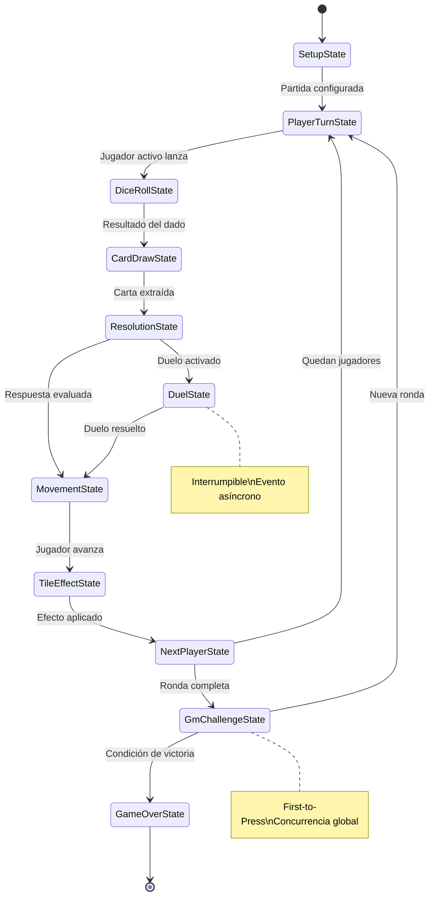

# Especificaciones Técnicas — Chronos & Cards

> **Proyecto:** Chronos & Cards  
> **Motor:** Unity (C#)  
> **Paradigma:** Specification-Driven Development (SDD)  
> **Fecha de Generación:** 2026-06-17  
> **Fuente:** [game-desing-document.txt](../docs/GDD/game-desing-document.txt) · [Architect.md](../.agents/Architect.md) · [system.md](../.agents/system.md)

---

## 1. Resumen Ejecutivo

Chronos & Cards es un **Party Game / Trivia multijugador aumentado** donde la capa visual, las físicas del dado y el progreso del tablero se gestionan digitalmente en Unity. El contenido (preguntas, pistas, respuestas) es **dinámico y orientado a datos**, inyectado por un Game Master (GM) mediante archivos Markdown externos al inicio de cada sesión.

El juego combina mecánicas de azar (D6) con decisiones tácticas (objetos consumibles, economía de pistas, rutas alternativas) y eventos concurrentes (Desafío del GM con First-to-Press).

---

## 2. Stack Tecnológico

| Capa | Tecnología | Notas |
|---|---|---|
| Motor | Unity 6+ (URP) | Rendering pipeline ligero para efectos visuales de tablero |
| Lenguaje | C# (.NET Standard 2.1) | Conforme a convenciones del Architect.md |
| Gestión de Estado | FSM custom (IGameState) | Enter/Tick/Exit pattern |
| Comunicación | System.Action / UnityEvent | Observer pattern estricto |
| Datos dinámicos | ScriptableObjects + Parser Markdown | Contenido inyectado en runtime |
| Físicas | Rigidbody (dado D6) | Simulación física del lanzamiento |
| UI | Unity UI Toolkit o Canvas (según complejidad) | Desacoplada del Core vía eventos |

---

## 3. Arquitectura de Alto Nivel

```
┌─────────────────────────────────────────────────────────┐
│                     CAPA DE PRESENTACIÓN                │
│  ┌──────────┐  ┌──────────┐  ┌──────────┐  ┌────────┐  │
│  │ BoardView │  │ DiceView │  │  CardUI  │  │ HUD/UI │  │
│  └─────┬────┘  └─────┬────┘  └─────┬────┘  └───┬────┘  │
│        │ (observa)   │              │            │       │
├────────┼─────────────┼──────────────┼────────────┼───────┤
│        ▼             ▼              ▼            ▼       │
│                  EVENT BUS (System.Action)               │
│                                                         │
├─────────────────────────────────────────────────────────┤
│                     CAPA DE LÓGICA (CORE)               │
│  ┌─────────────┐  ┌────────────┐  ┌──────────────────┐  │
│  │ GameManager  │  │ TurnSystem │  │ ItemSystem       │  │
│  │ (FSM Host)  │  │            │  │ (Strategy/Cmd)   │  │
│  └──────┬──────┘  └─────┬──────┘  └────────┬─────────┘  │
│         │               │                  │             │
│  ┌──────▼──────┐  ┌─────▼──────┐  ┌───────▼──────────┐  │
│  │ IGameState  │  │ DiceLogic  │  │ IItemEffect      │  │
│  │ (States)    │  │ Validator  │  │ (per-item logic)  │  │
│  └─────────────┘  └────────────┘  └──────────────────┘  │
│                                                         │
├─────────────────────────────────────────────────────────┤
│                     CAPA DE DATOS                       │
│  ┌──────────────┐  ┌───────────────┐  ┌──────────────┐  │
│  │ BoardConfig  │  │ MarkdownParser│  │ CardDataSO   │  │
│  │ (SO)         │  │ (Runtime)     │  │ ItemDataSO   │  │
│  └──────────────┘  └───────────────┘  └──────────────┘  │
└─────────────────────────────────────────────────────────┘
```

### 3.1 Principios Rectores

1. **Contratos primero** — Toda clase concreta implementa una interfaz definida en `Assets/Scripts/Interfaces/`.
2. **Desacoplamiento estricto** — Prohibido `GameObject.Find()`, `FindObjectOfType()`, Singletons no justificados. Inyección vía Inspector (`[SerializeField]`).
3. **Datos vs Lógica** — Configuración en ScriptableObjects, comportamiento en MonoBehaviours/clases puras.
4. **Observer pattern** — UI escucha eventos del Core; nunca al revés.
5. **Strategy/Command para ítems** — Cada consumible es un módulo independiente con `IItemEffect`.

---

## 4. Estructura de Directorios

```
Assets/
├── Scripts/
│   ├── Core/           # GameManager, TurnStateMachine, GameStates
│   ├── Data/           # ScriptableObjects, MarkdownParser, Modelos
│   ├── Gameplay/       # DiceRoller, PlayerMovement, ItemCaster
│   ├── UI/             # Controladores de UI (observers)
│   └── Interfaces/     # IGameState, IItem, IDamageable, ITile, etc.
├── Prefabs/            # Dado, Fichas, Nodos del Tablero
├── Art/                # Modelos 3D, Texturas, Materiales, Shaders
├── ScriptableObjects/  # Instancias de configuración (BoardConfig, etc.)
└── Resources/          # Assets cargados en runtime si es necesario
```

---

## 5. Convenciones de Código (C#)

| Elemento | Convención | Ejemplo |
|---|---|---|
| Interfaces | Prefijo `I` + PascalCase | `IDiceValidator` |
| Campos privados | `_camelCase` + `[SerializeField]` | `private Transform _playerTransform;` |
| Propiedades públicas | PascalCase, setter privado | `public int CurrentHealth { get; private set; }` |
| Métodos | PascalCase, verbos de acción | `RollDice()`, `ParseMarkdown()` |
| Eventos | `On` + PascalCase | `OnTurnEnded`, `OnCardDrawn` |
| ScriptableObjects | Sufijo `SO` o `Config` | `CardDataSO`, `BoardConfig` |

---

## 6. Mapa de Épicas

El desarrollo se organiza en **7 épicas** progresivas. Cada épica es autocontenida y entregable de forma incremental.

| # | Épica | Descripción | Prioridad |
|---|---|---|---|
| 1 | [Arquitectura Core y FSM](epics/epic1.md) | GameManager, máquina de estados, infraestructura de eventos | 🔴 Crítica |
| 2 | [Sistema de Tablero](epics/epic2.md) | Generación procedural de tableros (Lineal y Exploración), tipos de casillas | 🔴 Crítica |
| 3 | [Sistema de Dado y Turno](epics/epic3.md) | Dado físico D6, extracción de cartas por dificultad, fórmula de avance | 🔴 Crítica |
| 4 | [Parser de Contenido y Sistema de Cartas](epics/epic4.md) | Parser Markdown, modelo de datos de preguntas, sistema de pistas | 🟡 Alta |
| 5 | [Sistema de Objetos/Consumibles](epics/epic5.md) | Inventario, buffs, debuffs, counters con patrón Strategy/Command | 🟡 Alta |
| 6 | [Desafío del GM y Concurrencia](epics/epic6.md) | Fase de cierre de ronda, First-to-Press, recompensas variables | 🟠 Media |
| 7 | [Capa de Presentación y UX](epics/epic7.md) | UI, animaciones, feedback visual, integración de vistas con Core | 🟠 Media |

---

## 7. Interfaces Clave (Contratos del Sistema)

```csharp
// --- Core ---
public interface IGameState {
    void Enter();
    void Tick();
    void Exit();
}

// --- Tablero ---
public interface ITile {
    TileType Type { get; }
    void OnPlayerLanded(IPlayer player);
}

public interface IBoardGenerator {
    List<ITile> GenerateBoard(BoardConfig config);
}

// --- Dado ---
public interface IDiceRoller {
    event Action<int> OnDiceResult;
    void Roll();
}

public interface IDiceValidator {
    bool IsValidResult(int result);
}

// --- Jugador ---
public interface IPlayer {
    string PlayerName { get; }
    int Position { get; }
    int HintCount { get; }
    List<IItem> Inventory { get; }
    void MoveForward(int tiles);
    void AddHint(int amount);
    void AddItem(IItem item);
}

// --- Objetos ---
public interface IItemEffect {
    ItemActivationPhase ActivationPhase { get; }
    bool CanActivate(IPlayer owner, GameContext context);
    void Execute(IPlayer owner, GameContext context);
}

// --- Parser ---
public interface IContentParser {
    List<CardData> Parse(string markdownContent);
}
```

---

## 8. Modelo de Datos Principal

```csharp
// Enums
public enum TileType { Neutral, HintBoost, HintTrap, Event, Item }
public enum ItemActivationPhase { BeforeAnswer, AfterFail, RivalTurn, Reaction, ReplaceTurn }
public enum PerformanceMultiplier { Perfect = 100, WithHelp = 50, Fail = 0 }

// Structs / Data Classes
[System.Serializable]
public struct CardData {
    public int DifficultyLevel;       // 1–6
    public string QuestionText;
    public string Hint;
    public List<string> Options;      // null si es pregunta abierta
    public string CorrectAnswer;
}

// ScriptableObjects
[CreateAssetMenu(menuName = "Chronos/Board Config")]
public class BoardConfig : ScriptableObject {
    public BoardMode Mode;             // Linear | Exploration
    public int TargetQuestionCount;    // ~16 para escalar longitud
    public int InitialHints;
    public float[] TileTypeWeights;    // Distribución de tipos de casilla
}
```

---

## 9. FSM — Estados del Game Loop



---

## 10. Verificación y Testing

| Tipo | Herramienta | Cobertura |
|---|---|---|
| Compilación continua | `Unity_ReadConsole` (MCP) | Cada cambio de script |
| Unit Tests | Unity Test Framework (NUnit) | Lógica pura: Parser, fórmula de avance, validación de dado |
| Integration Tests | Play Mode Tests | FSM transitions, efectos de casilla |
| Manual / Visual | Scene View + Game View | UI, animaciones del dado, tablero |

---

## 11. Riesgos Técnicos Identificados

| Riesgo | Impacto | Mitigación |
|---|---|---|
| Concurrencia en First-to-Press | Alto — inputs simultáneos | FSM con estado `GmChallengeState` dedicado + lock en primer input |
| Parser Markdown frágil | Medio — formato libre del GM | Validación estricta con fallback + mensajes de error claros |
| Explosión de ítems/efectos | Medio — acoplamiento | Strategy pattern: cada ítem es una clase `IItemEffect` aislada |
| Escalabilidad del tablero (Exploración) | Medio — grafos grandes | Generación procedural con límites configurables en `BoardConfig` |
| Físicas del dado inconsistentes | Bajo — resultado cosmético | Resultado predeterminado por RNG; físicas solo visuales |

---

> **Siguiente paso:** Revisar las [épicas individuales](epics/) para el desglose detallado de historias de usuario, criterios de aceptación y dependencias técnicas.
